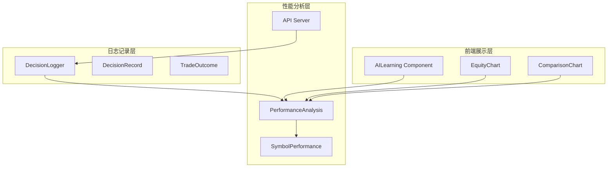
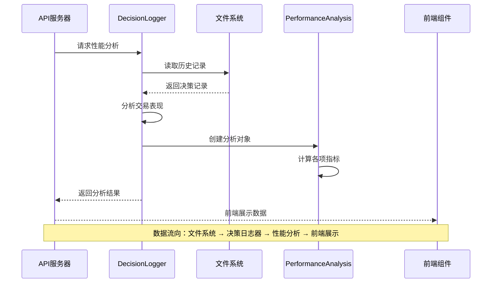
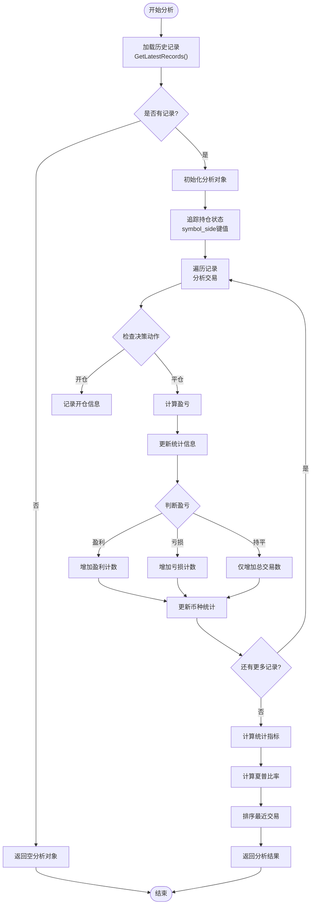
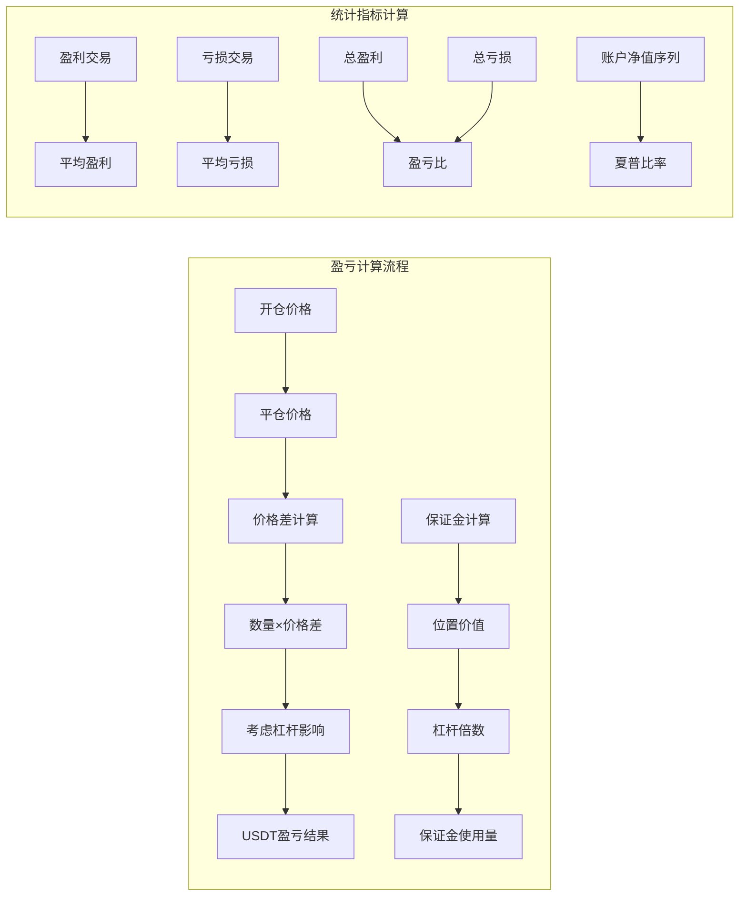
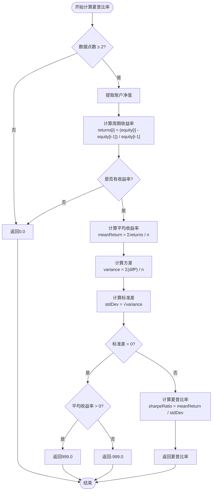
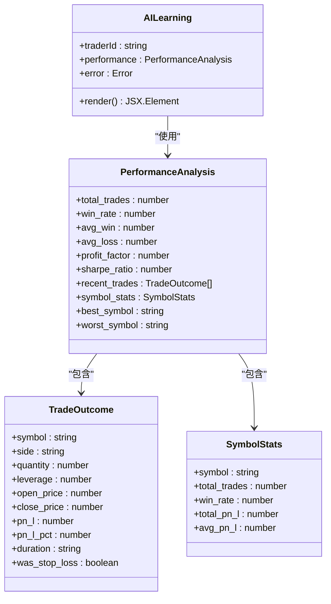
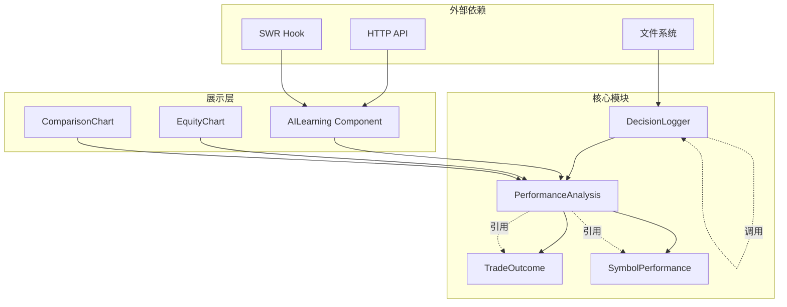

# 历史数据分析

<cite>
**本文档引用的文件**
- [decision_logger.go](file://logger/decision_logger.go)
- [AILearning.tsx](file://web/src/components/AILearning.tsx)
- [server.go](file://api/server.go)
- [auto_trader.go](file://trader/auto_trader.go)
- [README.md](file://README.md)
</cite>

## 目录
1. [简介](#简介)
2. [项目结构概览](#项目结构概览)
3. [核心组件分析](#核心组件分析)
4. [架构概览](#架构概览)
5. [详细组件分析](#详细组件分析)
6. [依赖关系分析](#依赖关系分析)
7. [性能考虑](#性能考虑)
8. [故障排除指南](#故障排除指南)
9. [结论](#结论)

## 简介

本文档详细阐述了nofx交易平台中历史数据分析系统的实现机制，重点关注`AnalyzePerformance`方法如何分析最近N个周期的交易表现，生成全面的PerformanceAnalysis对象。该系统通过追踪开仓和平仓操作，计算关键绩效指标，包括盈亏(PnL)、胜率、平均盈利/亏损、盈亏比和夏普比率等，为AI策略提供深度的学习和优化依据。

## 项目结构概览

历史数据分析系统主要分布在以下模块中：



**图表来源**
- [decision_logger.go](file://logger/decision_logger.go#L287-L301)
- [server.go](file://api/server.go#L373-L401)

**章节来源**
- [decision_logger.go](file://logger/decision_logger.go#L1-L50)
- [server.go](file://api/server.go#L1-L30)

## 核心组件分析

### PerformanceAnalysis 结构体

PerformanceAnalysis是整个分析系统的核心数据结构，包含了全面的交易表现指标：

| 字段名称 | 类型 | 描述 | 计算方式 |
|---------|------|------|----------|
| TotalTrades | int | 总交易数 | 所有开仓和平仓操作的总和 |
| WinningTrades | int | 盈利交易数 | 盈利交易的数量 |
| LosingTrades | int | 亏损交易数 | 亏损交易的数量 |
| WinRate | float64 | 胜率 | (盈利交易数 / 总交易数) × 100% |
| AvgWin | float64 | 平均盈利 | 盈利交易总金额 / 盈利交易数 |
| AvgLoss | float64 | 平均亏损 | 亏损交易总金额 / 亏损交易数 |
| ProfitFactor | float64 | 盈亏比 | 总盈利金额 / 总亏损金额 |
| SharpeRatio | float64 | 夏普比率 | 风险调整后的收益指标 |
| RecentTrades | []TradeOutcome | 最近N笔交易 | 最新的交易结果列表 |
| SymbolStats | map[string]*SymbolPerformance | 各币种表现 | 按币种分类的统计信息 |
| BestSymbol | string | 表现最好的币种 | 总盈亏最高的币种 |
| WorstSymbol | string | 表现最差的币种 | 总盈亏最低的币种 |

### SymbolPerformance 结构体

SymbolPerformance专门用于统计各币种的表现差异：

| 字段名称 | 类型 | 描述 | 计算方式 |
|---------|------|------|----------|
| Symbol | string | 币种标识符 | 交易的加密货币符号 |
| TotalTrades | int | 交易次数 | 该币种的总交易数量 |
| WinningTrades | int | 盈利次数 | 该币种盈利交易次数 |
| LosingTrades | int | 亏损次数 | 该币种亏损交易次数 |
| WinRate | float64 | 胜率 | (盈利次数 / 总交易次数) × 100% |
| TotalPnL | float64 | 总盈亏 | 该币种的总盈亏金额 |
| AvgPnL | float64 | 平均盈亏 | 总盈亏 / 总交易次数 |

**章节来源**
- [decision_logger.go](file://logger/decision_logger.go#L287-L334)

## 架构概览

历史数据分析系统采用分层架构设计，确保数据流的清晰性和可维护性：



**图表来源**
- [server.go](file://api/server.go#L373-L401)
- [decision_logger.go](file://logger/decision_logger.go#L336-L370)

## 详细组件分析

### AnalyzePerformance 方法详解

`AnalyzePerformance`方法是整个分析系统的核心，负责处理最近N个周期的交易表现分析：

#### 方法流程图



**图表来源**
- [decision_logger.go](file://logger/decision_logger.go#L336-L562)

#### 开仓和平仓追踪机制

系统通过`symbol_side`键值对来精确追踪每笔交易的开仓和平仓操作：

```mermaid
classDiagram
class OpenPositions {
+map[string]map[string]interface{} openPositions
+记录开仓信息()
+移除平仓记录()
+验证持仓状态()
}
class TradeOutcome {
+string Symbol
+string Side
+float64 Quantity
+int Leverage
+float64 OpenPrice
+float64 ClosePrice
+float64 PositionValue
+float64 MarginUsed
+float64 PnL
+float64 PnLPct
+string Duration
+time.Time OpenTime
+time.Time CloseTime
+bool WasStopLoss
}
class DecisionLogger {
+AnalyzePerformance(int) PerformanceAnalysis
+calculateSharpeRatio([]*DecisionRecord) float64
+GetLatestRecords(int) []*DecisionRecord
}
OpenPositions --> TradeOutcome : "生成"
DecisionLogger --> OpenPositions : "管理"
DecisionLogger --> TradeOutcome : "创建"
```

**图表来源**
- [decision_logger.go](file://logger/decision_logger.go#L336-L446)

#### 盈亏计算算法

系统采用精确的USDT盈亏计算方法，考虑了杠杆的影响：



**图表来源**
- [decision_logger.go](file://logger/decision_logger.go#L410-L446)

**章节来源**
- [decision_logger.go](file://logger/decision_logger.go#L336-L562)

### calculateSharpeRatio 方法分析

夏普比率计算是风险调整后收益评估的关键指标：

#### 夏普比率计算流程



**图表来源**
- [decision_logger.go](file://logger/decision_logger.go#L563-L610)

#### 夏普比率指标解读

| 夏普比率范围 | 风险调整后收益 | 策略建议 |
|-------------|---------------|----------|
| > 2.0 | 优秀 | 风险调整后收益优异，可适度扩大仓位但保持纪律 |
| 1.0 - 2.0 | 良好 | 策略表现稳健，风险收益平衡良好，继续保持当前策略 |
| 0.0 - 1.0 | 中等 | 收益为正但波动较大，AI正在优化策略，降低风险 |
| < 0.0 | 较差 | 当前策略需要调整！AI已自动进入保守模式，减少仓位和交易频率 |

**章节来源**
- [decision_logger.go](file://logger/decision_logger.go#L563-L610)

### 前端展示组件分析

前端组件通过React Hooks实时展示性能分析结果：

#### 性能指标展示架构



**图表来源**
- [AILearning.tsx](file://web/src/components/AILearning.tsx#L15-L47)

**章节来源**
- [AILearning.tsx](file://web/src/components/AILearning.tsx#L47-L96)

## 依赖关系分析

历史数据分析系统的依赖关系体现了清晰的分层架构：



**图表来源**
- [decision_logger.go](file://logger/decision_logger.go#L1-L20)
- [server.go](file://api/server.go#L1-L30)

**章节来源**
- [decision_logger.go](file://logger/decision_logger.go#L1-L612)
- [server.go](file://api/server.go#L1-L422)

## 性能考虑

### 数据处理优化

1. **内存管理**：系统采用流式处理，避免一次性加载大量历史数据
2. **缓存策略**：前端使用SWR进行智能缓存和增量更新
3. **数据压缩**：决策记录采用JSON格式，便于传输和存储
4. **并发处理**：API服务支持并发请求处理

### 计算复杂度分析

| 操作类型 | 时间复杂度 | 空间复杂度 | 说明 |
|---------|-----------|-----------|------|
| 加载历史记录 | O(n) | O(n) | n为周期数量 |
| 交易分析 | O(m) | O(m) | m为交易数量 |
| 统计指标计算 | O(k) | O(k) | k为币种数量 |
| 夏普比率计算 | O(p) | O(p) | p为净值序列长度 |

其中n、m、k、p通常满足n >> m >> k >> p的关系，确保整体性能可接受。

## 故障排除指南

### 常见问题及解决方案

#### 1. 分析结果为空
**症状**：返回的PerformanceAnalysis对象中交易数为0
**原因**：历史记录不足或文件读取失败
**解决方案**：
- 检查决策日志目录是否存在
- 验证文件权限设置
- 确认有足够的历史数据（至少2个周期）

#### 2. 夏普比率异常
**症状**：夏普比率为NaN或极端值
**原因**：账户净值序列波动过小或数据异常
**解决方案**：
- 检查账户净值数据的连续性
- 验证是否有足够的数据点（至少2个）
- 排查数据采集过程中的异常

#### 3. 性能指标计算错误
**症状**：胜率、盈亏比等指标计算错误
**原因**：交易状态追踪不准确
**解决方案**：
- 检查symbol_side键值的唯一性
- 验证开仓和平仓记录的匹配
- 确认PnL计算公式的正确性

**章节来源**
- [decision_logger.go](file://logger/decision_logger.go#L336-L562)

## 结论

nofx平台的历史数据分析系统通过`AnalyzePerformance`方法实现了全面而精确的交易表现分析。该系统具有以下优势：

1. **完整性**：涵盖所有关键绩效指标，包括传统指标和现代风险管理指标
2. **准确性**：采用精确的USDT盈亏计算，考虑杠杆影响
3. **实时性**：支持实时数据更新和动态分析
4. **可扩展性**：模块化设计便于功能扩展和维护
5. **用户友好**：直观的前端展示界面，支持多种数据可视化

该系统为AI策略提供了坚实的数据基础，使其能够基于历史表现进行深度学习和持续优化，最终实现更稳定、更高效的交易决策。