# 后端数据暴露

<cite>
**本文档引用的文件**
- [auto_trader.go](file://trader/auto_trader.go)
- [server.go](file://api/server.go)
- [trader_manager.go](file://manager/trader_manager.go)
- [interface.go](file://trader/interface.go)
- [decision_logger.go](file://logger/decision_logger.go)
- [main.go](file://main.go)
- [config.go](file://config/config.go)
</cite>

## 目录
1. [简介](#简介)
2. [AutoTrader结构体概述](#autotrader结构体概述)
3. [核心方法详解](#核心方法详解)
4. [API层集成](#api层集成)
5. [数据结构定义](#数据结构定义)
6. [方法调用流程](#方法调用流程)
7. [实时数据暴露机制](#实时数据暴露机制)
8. [性能考虑](#性能考虑)
9. [故障排除指南](#故障排除指南)
10. [总结](#总结)

## 简介

AutoTrader结构体是nofx项目的核心组件，负责管理AI驱动的自动交易系统。它通过三个关键方法（GetStatus、GetAccountInfo、GetPositions）向API层暴露系统运行状态，为前端提供实时的交易系统信息。这些方法不仅提供了系统的当前状态快照，还包含了丰富的交易指标和统计数据，支持实时监控和数据分析。

## AutoTrader结构体概述

AutoTrader结构体是一个复杂的交易系统控制器，包含了交易执行、风险管理、AI决策和状态监控等核心功能。

```mermaid
classDiagram
class AutoTrader {
+string id
+string name
+string aiModel
+string exchange
+AutoTraderConfig config
+Trader trader
+DecisionLogger decisionLogger
+float64 initialBalance
+float64 dailyPnL
+time.Time startTime
+bool isRunning
+int callCount
+map[string]int64 positionFirstSeenTime
+GetStatus() map[string]interface{}
+GetAccountInfo() map[string]interface{}
+GetPositions() []map[string]interface{}
+Run() error
+Stop() void
}
class Trader {
<<interface>>
+GetBalance() map[string]interface{}
+GetPositions() []map[string]interface{}
+OpenLong() map[string]interface{}
+CloseLong() map[string]interface{}
}
class DecisionLogger {
+LogDecision() error
+GetLatestRecords() []DecisionRecord
+AnalyzePerformance() PerformanceData
}
AutoTrader --> Trader : "使用"
AutoTrader --> DecisionLogger : "管理"
```

**图表来源**
- [auto_trader.go](file://trader/auto_trader.go#L68-L85)
- [interface.go](file://trader/interface.go#L3-L41)
- [decision_logger.go](file://logger/decision_logger.go#L60-L70)

**章节来源**
- [auto_trader.go](file://trader/auto_trader.go#L68-L85)

## 核心方法详解

### GetStatus方法

GetStatus方法提供系统的整体运行状态，是API层获取系统健康状况的主要入口。

#### 方法签名和返回值
```go
func (at *AutoTrader) GetStatus() map[string]interface{}
```

#### 返回的关键字段

| 字段名 | 类型 | 描述 | 用途 |
|--------|------|------|------|
| trader_id | string | Trader唯一标识符 | 用于区分不同的交易系统实例 |
| trader_name | string | Trader显示名称 | 用户友好的系统名称 |
| ai_model | string | AI模型名称 | 当前使用的AI模型类型（qwen/deepseek/custom） |
| exchange | string | 交易平台 | 支持的交易平台（binance/hyperliquid/aster） |
| is_running | bool | 运行状态 | 系统是否正在运行中 |
| start_time | string | ISO格式启动时间 | 系统启动的时间戳 |
| runtime_minutes | int | 运行时长（分钟） | 系统连续运行的总时间 |
| call_count | int | AI调用次数 | 自系统启动以来AI决策的总次数 |
| initial_balance | float64 | 初始资金 | 系统启动时的初始资金余额 |
| scan_interval | string | 扫描间隔 | AI决策的扫描频率 |
| stop_until | string | 停止时间 | 风控暂停结束的时间戳 |
| last_reset_time | string | 最后重置时间 | 日盈亏重置的时间点 |
| ai_provider | string | AI提供商 | 实际使用的AI服务提供商 |

#### 实现逻辑流程

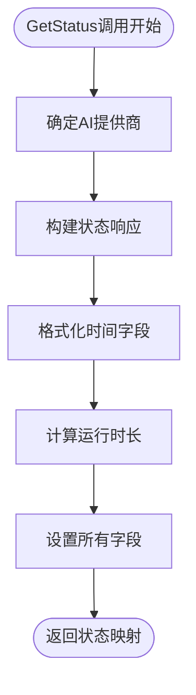

**图表来源**
- [auto_trader.go](file://trader/auto_trader.go#L743-L764)

**章节来源**
- [auto_trader.go](file://trader/auto_trader.go#L743-L764)

### GetAccountInfo方法

GetAccountInfo方法提供详细的账户财务信息，包括净资产、盈亏统计和持仓概览。

#### 方法签名和返回值
```go
func (at *AutoTrader) GetAccountInfo() (map[string]interface{}, error)
```

#### 返回的核心财务字段

| 字段名 | 类型 | 描述 | 计算方式 |
|--------|------|------|----------|
| total_equity | float64 | 账户净值 | wallet_balance + unrealized_profit |
| wallet_balance | float64 | 钱包余额 | 从交易API获取的总钱包余额 |
| unrealized_profit | float64 | 未实现盈亏 | 从交易API获取的未实现盈亏 |
| available_balance | float64 | 可用余额 | 从交易API获取的可用余额 |
| total_pnl | float64 | 总盈亏 | total_equity - initial_balance |
| total_pnl_pct | float64 | 总盈亏百分比 | (total_pnl / initial_balance) * 100 |
| total_unrealized_pnl | float64 | 总未实现盈亏 | 从持仓计算的未实现盈亏总和 |
| initial_balance | float64 | 初始资金 | 系统启动时的初始资金 |
| daily_pnl | float64 | 日盈亏 | 当天累计盈亏 |
| position_count | int | 持仓数量 | 当前持有的仓位总数 |
| margin_used | float64 | 保证金占用 | 总保证金使用量 |
| margin_used_pct | float64 | 保证金使用率 | (margin_used / total_equity) * 100 |

#### 财务计算流程

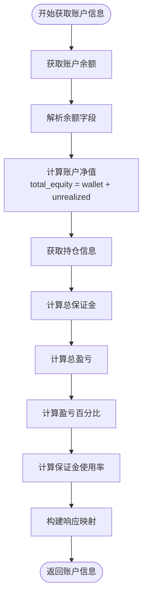

**图表来源**
- [auto_trader.go](file://trader/auto_trader.go#L767-L846)

**章节来源**
- [auto_trader.go](file://trader/auto_trader.go#L767-L846)

### GetPositions方法

GetPositions方法提供详细的持仓信息，包括每个仓位的财务指标和技术参数。

#### 方法签名和返回值
```go
func (at *AutoTrader) GetPositions() ([]map[string]interface{}, error)
```

#### 每个持仓的详细字段

| 字段名 | 类型 | 描述 | 计算方式 |
|--------|------|------|----------|
| symbol | string | 交易对符号 | 如BTCUSDT、ETHUSDT |
| side | string | 仓位方向 | long（多头）或 short（空头） |
| entry_price | float64 | 开仓价格 | 仓位的平均开仓价格 |
| mark_price | float64 | 标记价格 | 当前市场价格 |
| quantity | float64 | 持仓数量 | 仓位的实际数量（绝对值） |
| leverage | int | 杠杆倍数 | 当前仓位的杠杆水平 |
| unrealized_pnl | float64 | 未实现盈亏 | 当前仓位的未实现盈亏 |
| unrealized_pnl_pct | float64 | 未实现盈亏百分比 | 基于杠杆调整的盈亏百分比 |
| liquidation_price | float64 | 强平价格 | 导致仓位被强制平仓的价格 |
| margin_used | float64 | 保证金占用 | 该仓位占用的保证金 |

#### 持仓计算逻辑

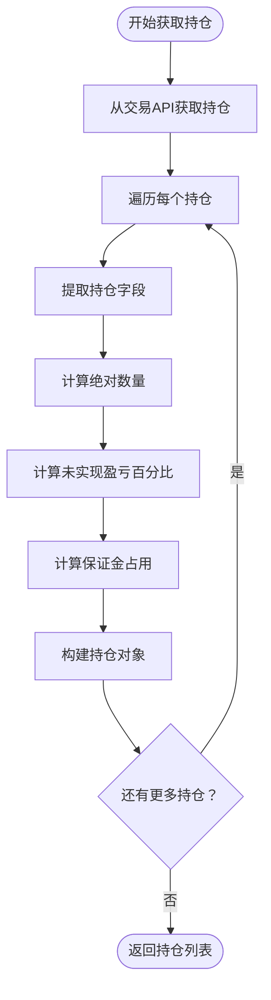

**图表来源**
- [auto_trader.go](file://trader/auto_trader.go#L849-L897)

**章节来源**
- [auto_trader.go](file://trader/auto_trader.go#L849-L897)

## API层集成

API层通过Server结构体处理来自前端的HTTP请求，并将请求转发给相应的AutoTrader实例。

### API路由配置

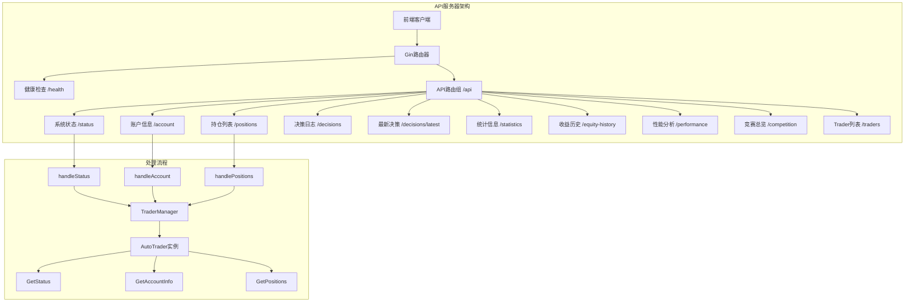

**图表来源**
- [server.go](file://api/server.go#L45-L67)
- [server.go](file://api/server.go#L130-L150)

### 请求处理流程

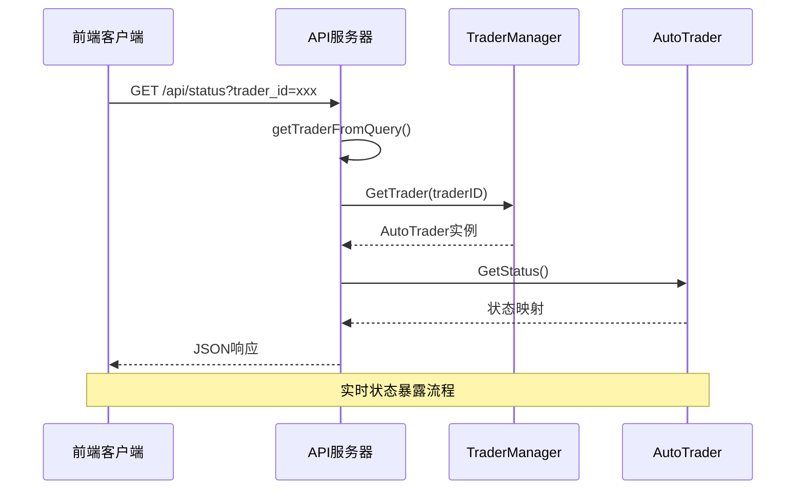

**图表来源**
- [server.go](file://api/server.go#L100-L120)
- [server.go](file://api/server.go#L158-L206)

**章节来源**
- [server.go](file://api/server.go#L45-L67)
- [server.go](file://api/server.go#L100-L120)

## 数据结构定义

### AutoTraderConfig配置结构

AutoTraderConfig定义了Trader的完整配置信息，支持多种交易平台和AI模型。

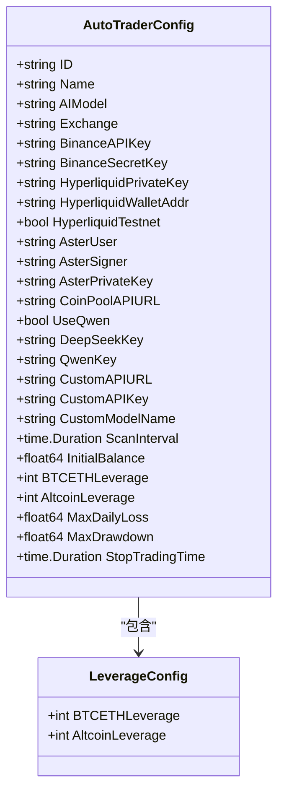

**图表来源**
- [auto_trader.go](file://trader/auto_trader.go#L15-L65)
- [config.go](file://config/config.go#L45-L55)

### 决策日志结构

决策日志系统记录每次AI决策的完整过程，支持历史数据分析和性能评估。

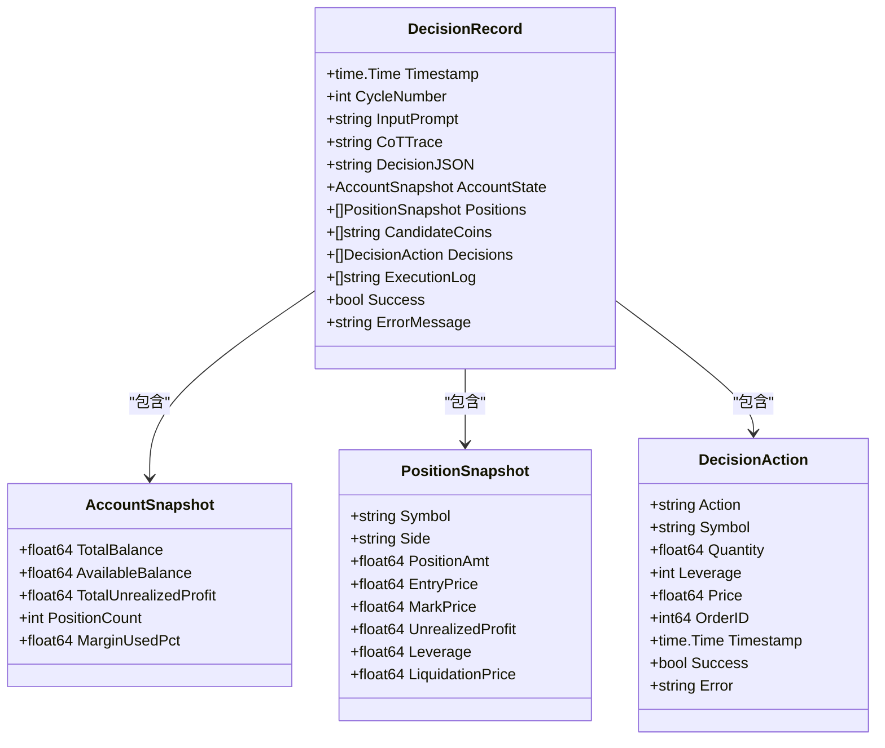

**图表来源**
- [decision_logger.go](file://logger/decision_logger.go#L10-L70)

**章节来源**
- [auto_trader.go](file://trader/auto_trader.go#L15-L65)
- [decision_logger.go](file://logger/decision_logger.go#L10-L70)

## 方法调用流程

### 完整的API响应流程

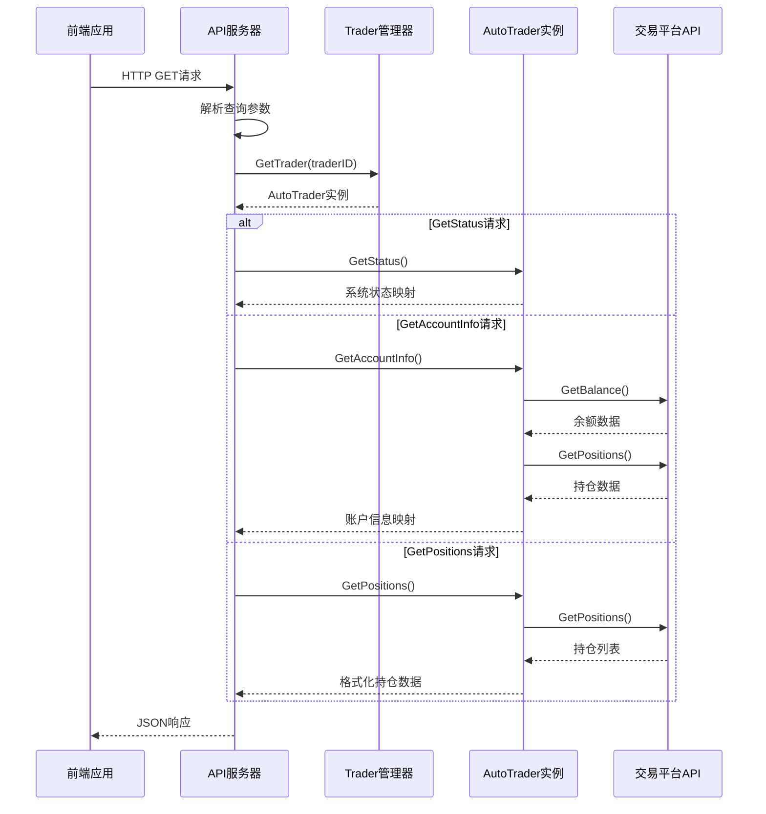

**图表来源**
- [server.go](file://api/server.go#L100-L120)
- [server.go](file://api/server.go#L158-L206)
- [server.go](file://api/server.go#L208-L230)

### 错误处理机制

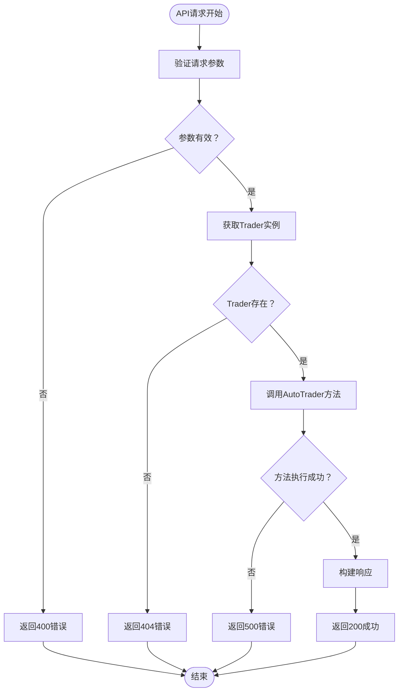

**图表来源**
- [server.go](file://api/server.go#L100-L120)

**章节来源**
- [server.go](file://api/server.go#L100-L120)
- [server.go](file://api/server.go#L158-L206)

## 实时数据暴露机制

### 数据更新频率

AutoTrader的状态数据通过以下机制实现实时更新：

1. **扫描间隔更新**：系统按照配置的扫描间隔（默认3分钟）执行AI决策
2. **状态缓存**：GetStatus方法返回即时状态，反映系统当前运行状态
3. **账户信息刷新**：GetAccountInfo方法每次调用都会重新获取最新数据
4. **持仓同步**：GetPositions方法实时从交易平台获取最新持仓信息

### 数据一致性保证

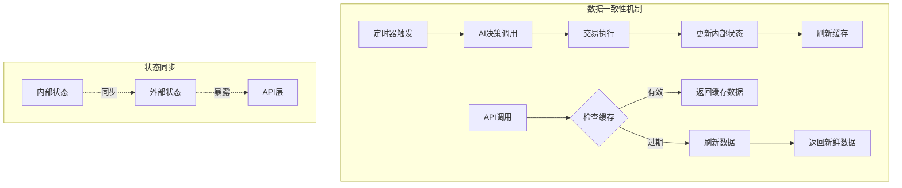

**图表来源**
- [auto_trader.go](file://trader/auto_trader.go#L180-L220)

### 并发安全设计

AutoTrader使用多种并发控制机制确保数据一致性：

- **互斥锁保护**：关键状态字段使用互斥锁保护
- **原子操作**：计数器和标志位使用原子操作
- **只读锁**：大量读取场景使用只读锁提高性能

**章节来源**
- [auto_trader.go](file://trader/auto_trader.go#L180-L220)

## 性能考虑

### 查询性能优化

1. **缓存策略**：
   - 交易平台API调用结果缓存
   - 状态数据本地缓存
   - 避免重复的网络请求

2. **批量操作**：
   - 批量获取账户和持仓信息
   - 合并相似的API调用

3. **异步处理**：
   - 非阻塞的API响应处理
   - 后台任务不影响实时查询

### 内存使用优化

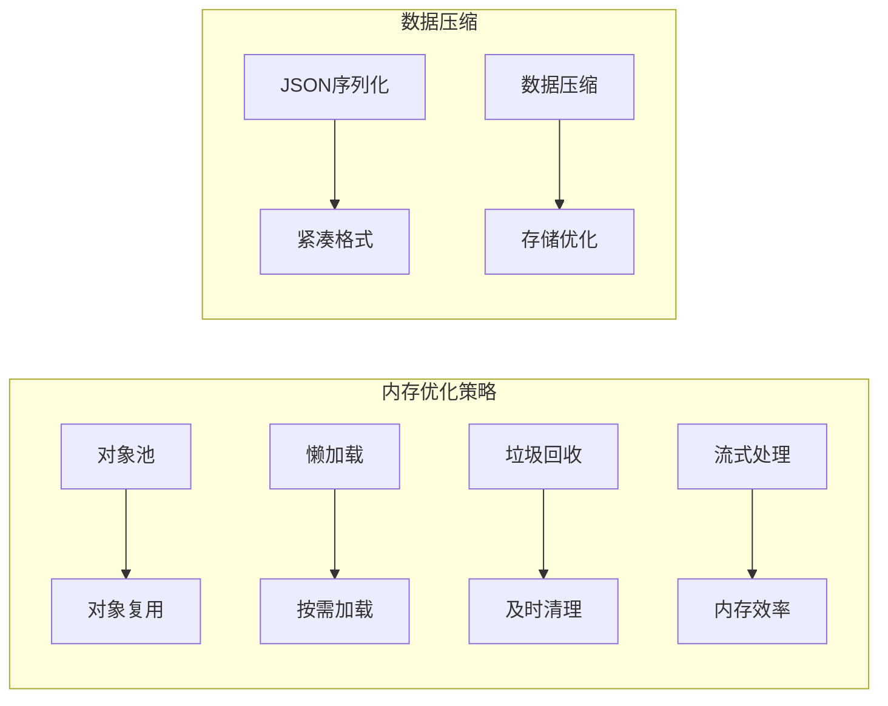

### 监控指标

AutoTrader暴露以下关键性能指标：

- **响应时间**：API调用的平均响应时间
- **错误率**：各方法的错误发生率
- **吞吐量**：每分钟处理的请求数
- **资源使用**：CPU和内存使用情况

## 故障排除指南

### 常见问题及解决方案

#### 1. API响应超时

**症状**：API请求长时间无响应
**原因**：交易平台API连接超时或网络问题
**解决方案**：
- 检查网络连接稳定性
- 增加API请求超时时间
- 实施重试机制

#### 2. 数据不一致

**症状**：不同API端点返回的数据不匹配
**原因**：并发更新导致的数据竞争
**解决方案**：
- 使用适当的锁机制
- 实施数据版本控制
- 增加数据验证步骤

#### 3. 内存泄漏

**症状**：系统运行一段时间后内存使用持续增长
**原因**：缓存未正确清理或对象未释放
**解决方案**：
- 实施缓存过期机制
- 定期清理无用数据
- 监控内存使用趋势

### 调试工具和技巧

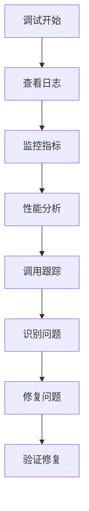

**章节来源**
- [auto_trader.go](file://trader/auto_trader.go#L180-L220)

## 总结

AutoTrader结构体通过GetStatus、GetAccountInfo和GetPositions三个核心方法，为前端提供了全面而实时的交易系统状态信息。这些方法不仅暴露了系统的基本运行状态，还包含了丰富的财务指标和持仓详情，支持实时监控、数据分析和决策支持。

### 主要优势

1. **全面性**：涵盖系统状态、账户信息和持仓详情
2. **实时性**：数据实时更新，反映系统当前状态
3. **标准化**：统一的数据格式便于前端处理
4. **可扩展性**：清晰的接口设计支持功能扩展
5. **可靠性**：完善的错误处理和数据验证机制

### 技术特点

- **模块化设计**：清晰的职责分离和接口定义
- **并发安全**：适当的锁机制和原子操作
- **性能优化**：缓存策略和批量操作
- **监控友好**：丰富的指标和日志记录

这种设计使得AutoTrader能够高效地服务于前端应用，为用户提供准确、及时的交易系统信息，同时保持系统的稳定性和可维护性。