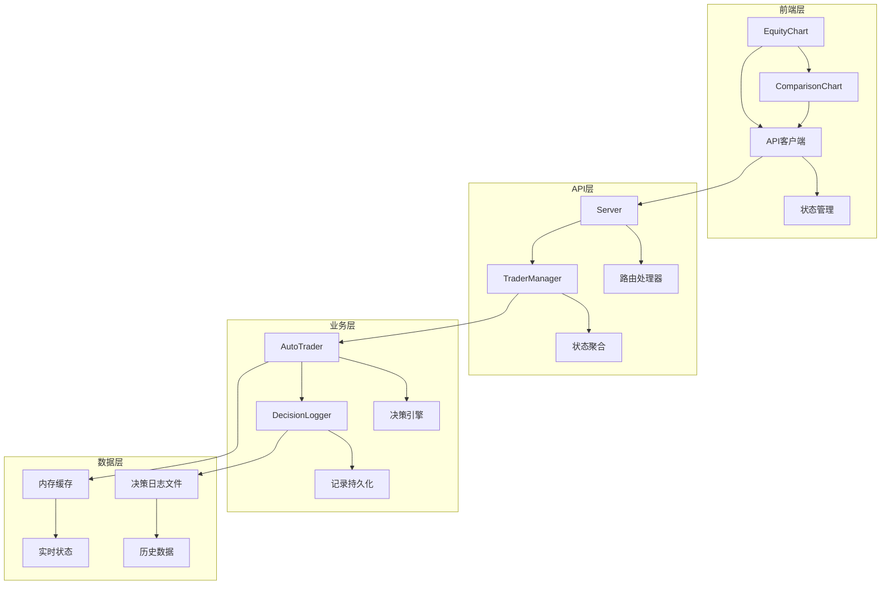
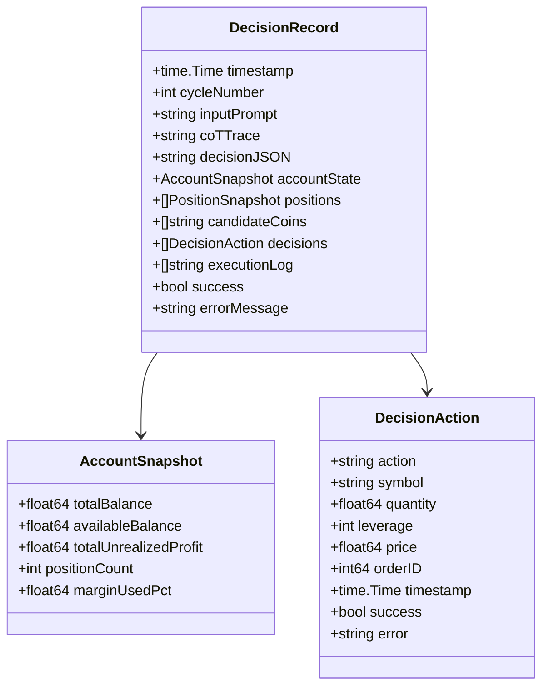
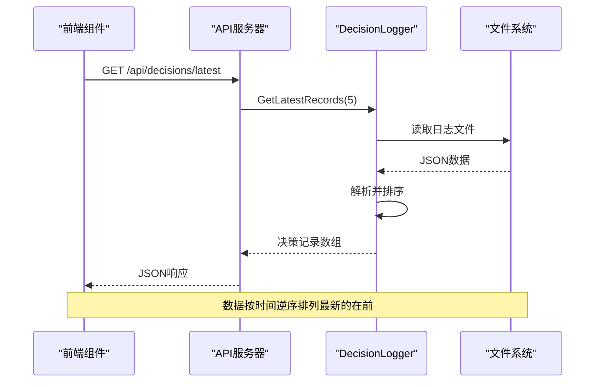
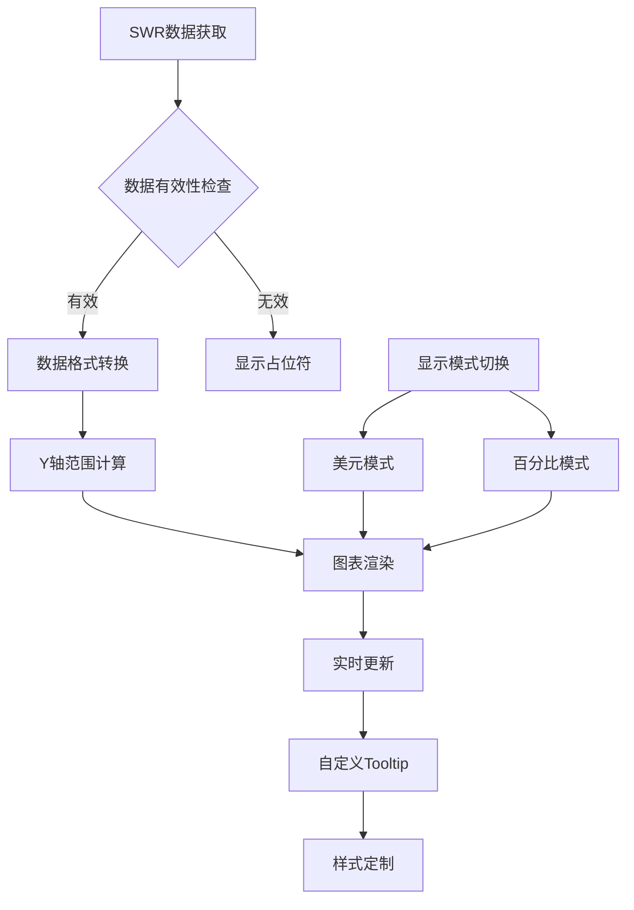
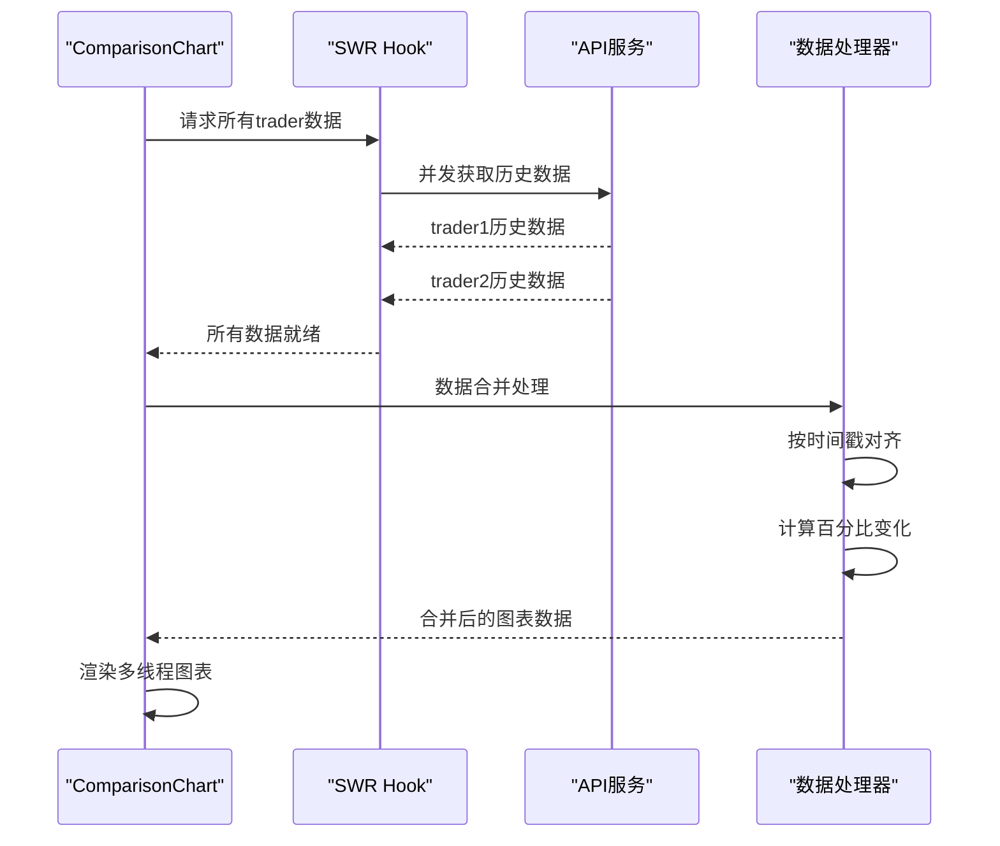
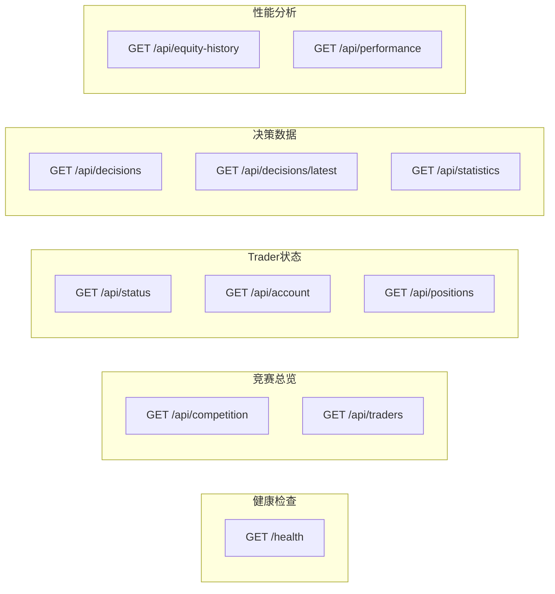
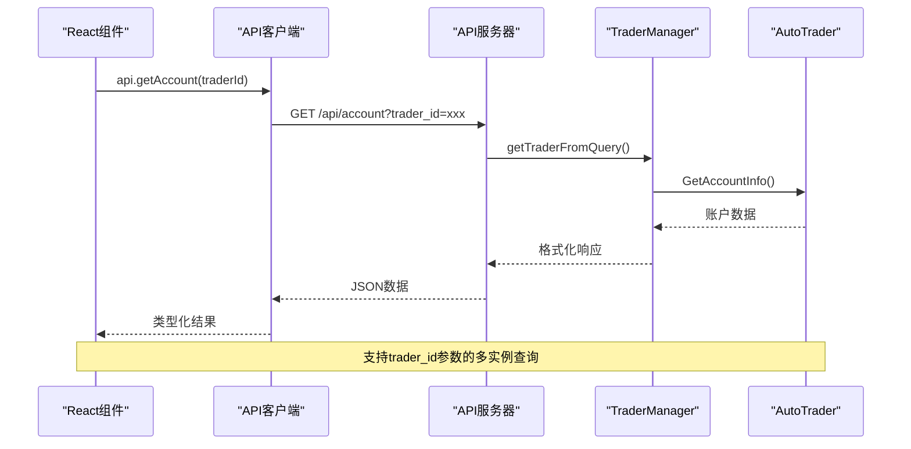
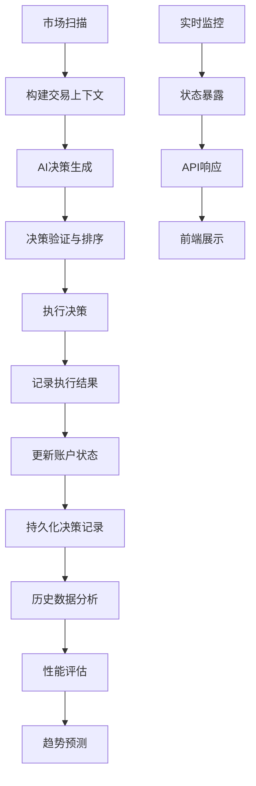
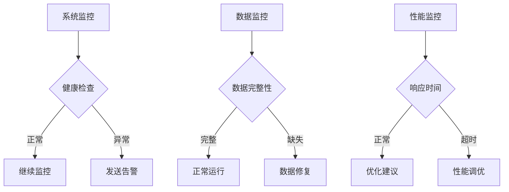

# 实时监控与可视化

<cite>
**本文档引用的文件**
- [api/server.go](file://api/server.go)
- [logger/decision_logger.go](file://logger/decision_logger.go)
- [trader/auto_trader.go](file://trader/auto_trader.go)
- [web/src/lib/api.ts](file://web/src/lib/api.ts)
- [web/src/components/EquityChart.tsx](file://web/src/components/EquityChart.tsx)
- [web/src/components/ComparisonChart.tsx](file://web/src/components/ComparisonChart.tsx)
- [web/src/types/index.ts](file://web/src/types/index.ts)
- [web/src/types.ts](file://web/src/types.ts)
- [web/src/utils/traderColors.ts](file://web/src/utils/traderColors.ts)
- [manager/trader_manager.go](file://manager/trader_manager.go)
</cite>

## 目录
1. [简介](#简介)
2. [系统架构概览](#系统架构概览)
3. [AutoTrader状态暴露机制](#autotrader状态暴露机制)
4. [DecisionLogger决策记录系统](#decisionlogger决策记录系统)
5. [前端可视化组件](#前端可视化组件)
6. [API接口设计](#api接口设计)
7. [数据流与监控](#数据流与监控)
8. [性能优化策略](#性能优化策略)
9. [故障排除指南](#故障排除指南)
10. [总结](#总结)

## 简介

nofx项目提供了一套完整的实时监控与可视化解决方案，通过AutoTrader的状态暴露机制、DecisionLogger的详细记录系统，以及前端React组件的数据可视化能力，构建了一个功能强大的交易监控仪表板。该系统支持多AI模型的实时监控、历史数据分析和多维度的性能对比。

## 系统架构概览

nofx的实时监控与可视化系统采用分层架构设计，主要包含以下核心组件：



**图表来源**
- [api/server.go](file://api/server.go#L1-L50)
- [manager/trader_manager.go](file://manager/trader_manager.go#L1-L30)
- [trader/auto_trader.go](file://trader/auto_trader.go#L1-L50)

## AutoTrader状态暴露机制

### GetStatus方法实现

AutoTrader通过GetStatus方法暴露系统核心状态信息，为API接口提供实时数据源：

```mermaid
classDiagram
class AutoTrader {
+string id
+string name
+string aiModel
+bool isRunning
+time startTime
+int callCount
+float initialBalance
+GetStatus() map[string]interface{}
+GetAccountInfo() map[string]interface{}
+GetPositions() []Position
+GetDecisionLogger() DecisionLogger
}
class SystemStatus {
+bool is_running
+string start_time
+int runtime_minutes
+int call_count
+float initial_balance
+string scan_interval
+string stop_until
+string last_reset_time
+string ai_provider
}
AutoTrader --> SystemStatus : "返回"
```

**图表来源**
- [trader/auto_trader.go](file://trader/auto_trader.go#L750-L770)
- [web/src/types/index.ts](file://web/src/types/index.ts#L1-L15)

### GetAccountInfo方法实现

账户信息获取通过GetAccountInfo方法实现，提供详细的财务数据：

| 字段名称 | 数据类型 | 描述 | 示例值 |
|---------|---------|------|--------|
| total_equity | float64 | 账户总净值 | 10500.25 |
| available_balance | float64 | 可用余额 | 8500.75 |
| total_pnl | float64 | 总盈亏 | 500.25 |
| total_pnl_pct | float64 | 总盈亏百分比 | 5.25 |
| position_count | int | 持仓数量 | 3 |
| margin_used_pct | float64 | 保证金使用率 | 25.5 |

### GetPositions方法实现

持仓信息通过GetPositions方法获取，包含详细的仓位数据：

| 字段名称 | 数据类型 | 描述 | 示例值 |
|---------|---------|------|--------|
| symbol | string | 币种符号 | BTCUSDT |
| side | string | 持仓方向 | long/short |
| entry_price | float64 | 开仓价格 | 30000.50 |
| mark_price | float64 | 标记价格 | 30500.25 |
| quantity | float64 | 持仓数量 | 0.1 |
| leverage | int | 杠杆倍数 | 10 |
| unrealized_pnl | float64 | 未实现盈亏 | 500.75 |

**章节来源**
- [trader/auto_trader.go](file://trader/auto_trader.go#L750-L850)
- [api/server.go](file://api/server.go#L100-L150)

## DecisionLogger决策记录系统

### 决策记录数据结构

DecisionLogger系统记录完整的决策周期数据，包括输入Prompt、AI思维链、决策JSON和执行日志：



**图表来源**
- [logger/decision_logger.go](file://logger/decision_logger.go#L15-L60)
- [logger/decision_logger.go](file://logger/decision_logger.go#L120-L180)

### GetLatestRecords方法

GetLatestRecords方法提供历史数据查询功能，支持按时间顺序获取决策记录：



**图表来源**
- [api/server.go](file://api/server.go#L180-L220)
- [logger/decision_logger.go](file://logger/decision_logger.go#L150-L200)

### AnalyzePerformance方法

AnalyzePerformance方法提供深度的历史数据分析，支持AI学习效果评估：

| 分析指标 | 类型 | 描述 | 计算方式 |
|---------|------|------|----------|
| 总交易数 | int | 完成的交易总数 | 总开仓 + 总平仓 |
| 盈利交易数 | int | 盈利的交易数量 | 盈利开仓 - 盈利平仓 |
| 亏损交易数 | int | 亏损的交易数量 | 亏损开仓 - 亏损平仓 |
| 胜率 | float64 | 盈利交易占比 | 盈利交易数/总交易数×100 |
| 平均盈利 | float64 | 单笔盈利平均值 | 总盈利/盈利交易数 |
| 平均亏损 | float64 | 单笔亏损平均值 | 总亏损/亏损交易数 |
| 盈亏比 | float64 | 盈利与亏损的比例 | 平均盈利/平均亏损 |

**章节来源**
- [logger/decision_logger.go](file://logger/decision_logger.go#L400-L550)
- [api/server.go](file://api/server.go#L350-L400)

## 前端可视化组件

### EquityChart权益曲线图

EquityChart组件提供实时的权益曲线可视化，支持美元和百分比两种显示模式：



**图表来源**
- [web/src/components/EquityChart.tsx](file://web/src/components/EquityChart.tsx#L20-L80)
- [web/src/components/EquityChart.tsx](file://web/src/components/EquityChart.tsx#L150-L200)

### ComparisonChart多AI性能对比

ComparisonChart组件实现多AI模型的实时性能对比，支持动态数据更新：



**图表来源**
- [web/src/components/ComparisonChart.tsx](file://web/src/components/ComparisonChart.tsx#L20-L60)
- [web/src/components/ComparisonChart.tsx](file://web/src/components/ComparisonChart.tsx#L80-L150)

### 实时数据刷新机制

前端通过SWR库实现智能的数据缓存和自动刷新：

| 组件 | 刷新间隔 | 缓存策略 | 用途 |
|------|---------|---------|------|
| EquityChart | 30秒 | 20秒去重 | 历史数据更新 |
| AccountInfo | 15秒 | 10秒去重 | 实时账户状态 |
| Positions | 30秒 | 20秒去重 | 持仓信息更新 |
| LatestDecisions | 10秒 | 5秒去重 | 最新决策追踪 |

**章节来源**
- [web/src/components/EquityChart.tsx](file://web/src/components/EquityChart.tsx#L30-L50)
- [web/src/components/ComparisonChart.tsx](file://web/src/components/ComparisonChart.tsx#L15-L35)

## API接口设计

### RESTful API架构

API服务器提供完整的RESTful接口，支持多trader实例的统一管理：



**图表来源**
- [api/server.go](file://api/server.go#L50-L80)
- [api/server.go](file://api/server.go#L120-L200)

### API调用流程

前端通过api.ts模块统一管理API调用，实现类型安全的接口访问：



**图表来源**
- [web/src/lib/api.ts](file://web/src/lib/api.ts#L20-L60)
- [api/server.go](file://api/server.go#L100-L130)

**章节来源**
- [api/server.go](file://api/server.go#L50-L150)
- [web/src/lib/api.ts](file://web/src/lib/api.ts#L1-L114)

## 数据流与监控

### 决策周期数据流

完整的决策周期包含输入、处理、执行和记录四个阶段：



**图表来源**
- [trader/auto_trader.go](file://trader/auto_trader.go#L200-L300)
- [logger/decision_logger.go](file://logger/decision_logger.go#L100-L150)

### 监控指标体系

系统提供多层次的监控指标，支持全方位的系统状态跟踪：

| 监控层级 | 指标类型 | 具体指标 | 更新频率 |
|---------|---------|---------|----------|
| 系统级 | 运行状态 | is_running, call_count, runtime_minutes | 实时 |
| 账户级 | 财务指标 | total_equity, total_pnl, margin_used_pct | 15秒 |
| 交易级 | 执行指标 | position_count, daily_pnl | 实时 |
| AI级 | 性能指标 | win_rate, profit_factor, sharpe_ratio | 30秒 |
| 历史级 | 分析指标 | recent_trades, symbol_stats | 30秒 |

**章节来源**
- [trader/auto_trader.go](file://trader/auto_trader.go#L750-L850)
- [logger/decision_logger.go](file://logger/decision_logger.go#L300-L400)

## 性能优化策略

### 前端性能优化

1. **数据缓存策略**：使用SWR实现智能缓存，减少不必要的API调用
2. **数据分页**：历史数据显示限制在2000个数据点以内
3. **实时更新**：不同组件采用不同的刷新频率，平衡性能和实时性
4. **条件渲染**：无效数据时不渲染图表，提升用户体验

### 后端性能优化

1. **并发处理**：API请求支持并发处理，提高响应速度
2. **懒加载**：大型数据集采用分批加载策略
3. **缓存机制**：关键数据采用内存缓存，减少磁盘I/O
4. **连接池**：数据库连接采用连接池管理，提高并发性能

### 存储优化

1. **日志轮转**：自动清理超过7天的历史决策记录
2. **压缩存储**：JSON日志文件采用压缩存储，节省磁盘空间
3. **索引优化**：按时间戳建立索引，加速查询速度
4. **批量写入**：决策记录采用批量写入，提高存储效率

## 故障排除指南

### 常见问题诊断

| 问题类型 | 症状描述 | 可能原因 | 解决方案 |
|---------|---------|---------|----------|
| 数据加载失败 | 图表显示空白 | API连接异常 | 检查网络连接和API服务状态 |
| 实时更新失效 | 数据长时间未更新 | SWR缓存问题 | 刷新页面或检查浏览器控制台错误 |
| 性能分析异常 | 统计数据不准确 | 历史数据缺失 | 检查决策日志文件完整性 |
| 多AI对比错误 | 颜色显示异常 | trader配置问题 | 验证trader ID和颜色映射 |

### 调试工具

1. **浏览器开发者工具**：监控API请求和响应
2. **控制台日志**：查看详细的错误信息和调试输出
3. **网络面板**：分析请求耗时和成功率
4. **性能面板**：监控前端渲染性能

### 监控告警

系统提供多层次的监控告警机制：



**章节来源**
- [api/server.go](file://api/server.go#L80-L120)
- [logger/decision_logger.go](file://logger/decision_logger.go#L250-L300)

## 总结

nofx项目的实时监控与可视化系统提供了完整的交易监控解决方案。通过AutoTrader的状态暴露机制，系统能够实时获取交易状态、账户信息和持仓数据；DecisionLogger系统记录完整的决策周期数据，支持深度的历史分析；前端React组件通过高效的数据绑定和可视化技术，为用户提供了直观的监控界面。

该系统的主要优势包括：
- **实时性**：多层级的实时数据更新机制
- **完整性**：完整的决策周期记录和历史数据分析
- **可扩展性**：支持多AI模型和多交易实例的统一管理
- **可视化**：专业的图表组件和美观的界面设计
- **性能**：优化的数据缓存和并发处理机制

通过这套完整的监控与可视化系统，用户可以全面掌握交易系统的运行状态，及时发现和解决问题，为交易决策提供有力支持。