# 核心功能

<cite>
**本文档引用的文件**
- [main.go](file://main.go)
- [README.md](file://README.md)
- [config/config.go](file://config/config.go)
- [decision/engine.go](file://decision/engine.go)
- [manager/trader_manager.go](file://manager/trader_manager.go)
- [trader/auto_trader.go](file://trader/auto_trader.go)
- [web/src/components/CompetitionPage.tsx](file://web/src/components/CompetitionPage.tsx)
- [web/src/components/EquityChart.tsx](file://web/src/components/EquityChart.tsx)
- [web/src/components/ComparisonChart.tsx](file://web/src/components/ComparisonChart.tsx)
- [pool/coin_pool.go](file://pool/coin_pool.go)
- [api/server.go](file://api/server.go)
- [logger/decision_logger.go](file://logger/decision_logger.go)
- [web/src/types/index.ts](file://web/src/types/index.ts)
- [web/src/lib/api.ts](file://web/src/lib/api.ts)
- [market/data.go](file://market/data.go)
</cite>

## 目录
1. [项目概述](#项目概述)
2. [多AI模型交易竞赛](#多ai模型交易竞赛)
3. [自动化交易执行](#自动化交易执行)
4. [实时监控与可视化](#实时监控与可视化)
5. [风险控制机制](#风险控制机制)
6. [AI自学习与优化](#ai自学习与优化)
7. [技术架构概览](#技术架构概览)
8. [总结](#总结)

## 项目概述

nofx是一个基于人工智能的多Agent交易操作系统，采用统一架构设计，实现了从多智能体决策到低延迟执行的完整闭环。该项目支持多种主流交易所（Binance、Hyperliquid、Aster DEX），提供实时AI竞赛、自动化交易、专业监控界面和完善的风控体系。

### 核心特性

- **多Agent自博弈与自进化**：策略自动竞争选择最优者，基于账户级PnL和风险约束持续迭代
- **集成执行与风险控制**：低延迟路由、滑点/风险控制沙盒、账户级限制、一键市场切换
- **跨市场统一抽象**：支持加密货币、股票、期货、期权、外汇等全金融市场

## 多AI模型交易竞赛

### 竞赛框架设计

nofx实现了创新的多智能体竞赛框架，支持Qwen与DeepSeek模型的实时对战，通过独立账户管理和实时性能比较推动AI自我进化。

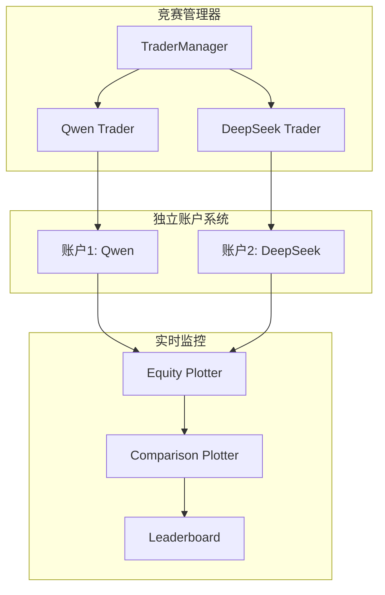

**图表来源**
- [manager/trader_manager.go](file://manager/trader_manager.go#L1-L173)
- [trader/auto_trader.go](file://trader/auto_trader.go#L1-L936)

### 独立账户管理

每个参赛AI维护独立的决策日志和性能指标，确保公平竞争和准确的性能评估：

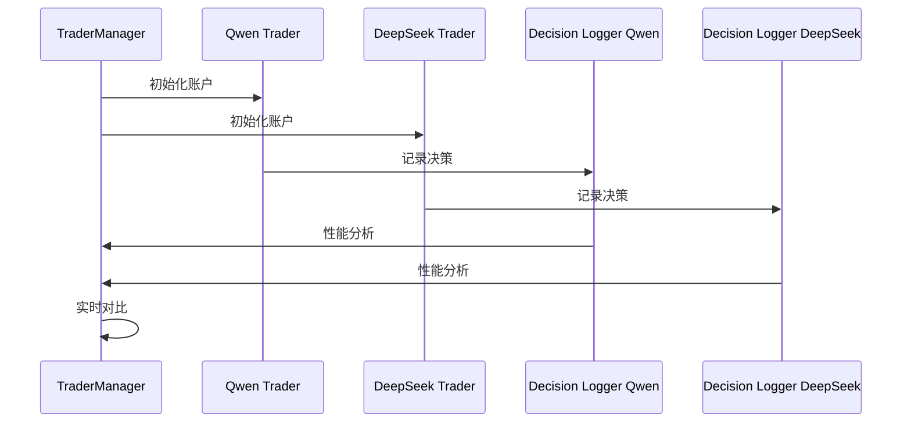

**图表来源**
- [manager/trader_manager.go](file://manager/trader_manager.go#L15-L50)
- [logger/decision_logger.go](file://logger/decision_logger.go#L1-L612)

### 实时性能比较

竞赛界面提供实时ROI跟踪、胜率统计和头对头分析：

| 功能特性 | 描述 | 实现方式 |
|---------|------|----------|
| 实时ROI追踪 | 显示每个AI的累计收益率 | 基于账户净值计算 |
| 胜率统计 | 自动统计交易胜率和盈亏比 | 基于决策日志分析 |
| 头对头分析 | 直观对比两个AI的表现 | 时间序列对比图表 |
| 自进化循环 | AI根据历史表现自我优化 | 夏普比率反馈机制 |

**章节来源**
- [web/src/components/CompetitionPage.tsx](file://web/src/components/CompetitionPage.tsx#L1-L254)
- [web/src/components/ComparisonChart.tsx](file://web/src/components/ComparisonChart.tsx#L1-L345)

### 自进化循环机制

AI通过夏普比率获得反馈，实现自我学习和策略优化：

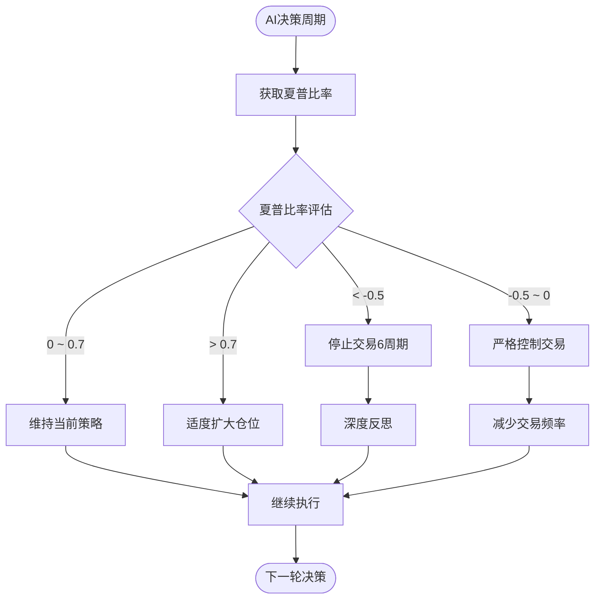

**图表来源**
- [decision/engine.go](file://decision/engine.go#L265-L283)

**章节来源**
- [decision/engine.go](file://decision/engine.go#L265-L283)

## 自动化交易执行

### 决策流程架构

nofx实现了完整的AI驱动交易决策流程，从市场数据获取到AI调用再到执行：

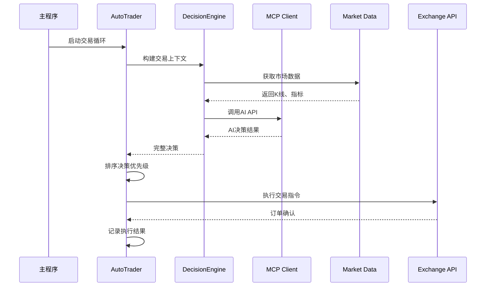

**图表来源**
- [trader/auto_trader.go](file://trader/auto_trader.go#L150-L250)
- [decision/engine.go](file://decision/engine.go#L80-L120)

### 市场数据获取

系统提供多时间框架的技术指标分析：

| 数据类型 | 时间框架 | 指标 | 用途 |
|---------|----------|------|------|
| 日内数据 | 3分钟 | EMA20、MACD、RSI7 | 短期趋势分析 |
| 长期数据 | 4小时 | EMA20/50、ATR、RSI14 | 长期趋势确认 |
| 基础数据 | 实时 | 当前价格、成交量 | 基础决策依据 |
| 特殊数据 | 实时 | 持仓量、资金费率 | 市场情绪判断 |

### AI调用与决策

AI接收完整的交易上下文，包括账户状态、持仓信息、候选币种和技术指标：

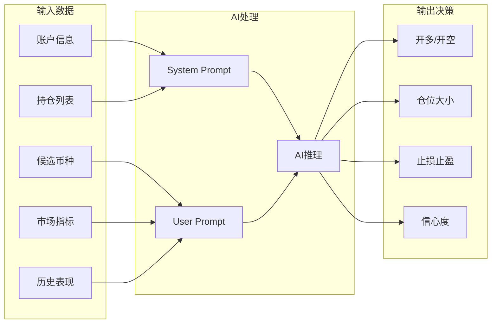

**图表来源**
- [decision/engine.go](file://decision/engine.go#L120-L180)

**章节来源**
- [decision/engine.go](file://decision/engine.go#L80-L180)
- [trader/auto_trader.go](file://trader/auto_trader.go#L150-L300)

## 实时监控与可视化

### 专业监控界面

nofx提供了专业的Binance风格仪表板，包含多种可视化组件：

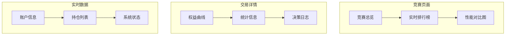

**图表来源**
- [web/src/components/CompetitionPage.tsx](file://web/src/components/CompetitionPage.tsx#L1-L254)
- [web/src/components/EquityChart.tsx](file://web/src/components/EquityChart.tsx#L1-L303)

### 权益曲线可视化

权益曲线图表提供直观的账户表现展示：

| 显示模式 | 功能 | 实现特点 |
|---------|------|----------|
| 美元模式 | 显示账户净值 | 支持初始余额对比 |
| 百分比模式 | 显示收益率 | 自动计算盈亏百分比 |
| 动态刷新 | 5秒实时更新 | WebSocket连接 |
| 历史回溯 | 最多2000点数据 | 性能优化显示 |

### 多AI性能对比图

对比图表展示多个AI的历史表现，支持时间序列分析：

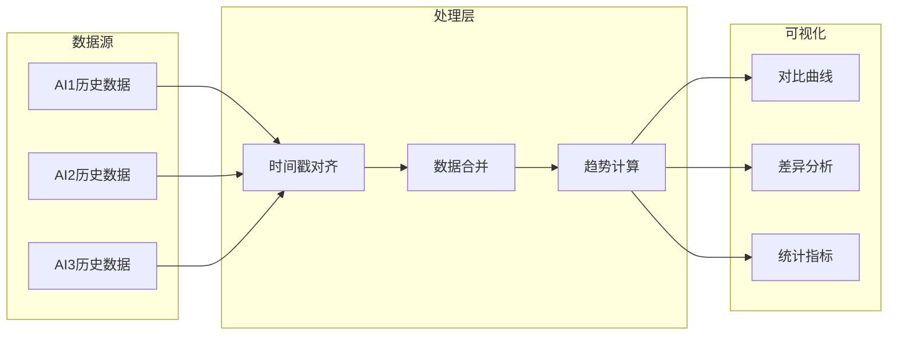

**图表来源**
- [web/src/components/ComparisonChart.tsx](file://web/src/components/ComparisonChart.tsx#L50-L150)

### 完整的Chain of Thought决策日志

系统记录完整的AI决策过程，包括思维链分析：

| 日志内容 | 存储格式 | 用途 |
|---------|----------|------|
| 输入Prompt | JSON | AI训练数据 |
| 思维链分析 | 文本 | 决策过程追溯 |
| 决策结果 | JSON数组 | 执行依据 |
| 执行日志 | 文本列表 | 结果验证 |
| 错误信息 | 字符串 | 故障排查 |

**章节来源**
- [web/src/components/EquityChart.tsx](file://web/src/components/EquityChart.tsx#L1-L303)
- [web/src/components/ComparisonChart.tsx](file://web/src/components/ComparisonChart.tsx#L1-L345)
- [logger/decision_logger.go](file://logger/decision_logger.go#L1-L612)

## 风险控制机制

### 多层次风险管理体系

nofx实现了严格的风险控制机制，确保交易安全：

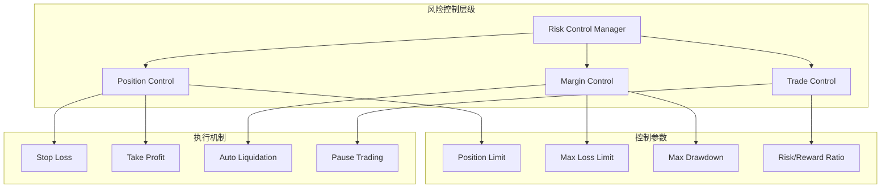

**图表来源**
- [decision/engine.go](file://decision/engine.go#L588-L622)

### 仓位限制与杠杆控制

| 资产类别 | 最大仓位 | 杠杆上限 | 风险提示 |
|---------|----------|----------|----------|
| BTC/ETH | 10x账户净值 | 50x | 主账户建议≤20x |
| 山寨币 | 1.5x账户净值 | 20x | 主账户建议≤15x |
| 单币种 | 10x账户净值 | 50x | 防止单币种过度集中 |
| 总保证金 | ≤90%账户净值 | 动态调整 | AI自主分配 |

### 止损止盈机制

系统自动设置合理的止损止盈水平：

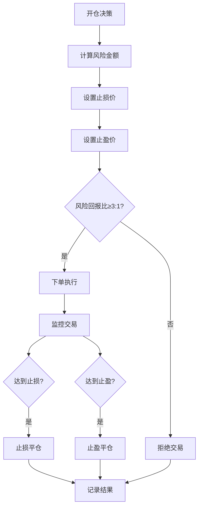

**图表来源**
- [decision/engine.go](file://decision/engine.go#L588-L622)

### 自动暂停机制

当触发风险阈值时，系统自动暂停交易：

| 触发条件 | 暂停时长 | 复位机制 | 恢复条件 |
|---------|----------|----------|----------|
| 单日亏损超限 | N分钟 | 次日重置 | 账户恢复稳定 |
| 最大回撤超限 | N分钟 | 次日重置 | 市场环境改善 |
| 夏普比率< -0.5 | 6周期 | 手动干预 | 策略修正完成 |

**章节来源**
- [decision/engine.go](file://decision/engine.go#L588-L622)
- [trader/auto_trader.go](file://trader/auto_trader.go#L458-L515)

## AI自学习与优化

### 历史反馈系统

AI通过分析最近20个周期的交易表现进行自我优化：

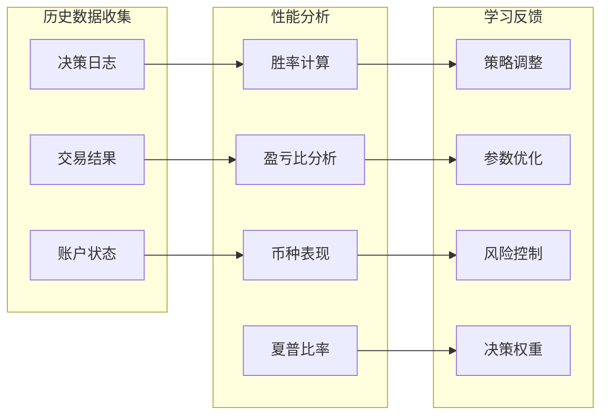

**图表来源**
- [logger/decision_logger.go](file://logger/decision_logger.go#L400-L500)

### 智能性能分析

系统提供全面的AI性能分析：

| 分析维度 | 计算方法 | 应用场景 |
|---------|----------|----------|
| 胜率 | 盈利交易/总交易×100% | 策略有效性评估 |
| 盈亏比 | 总盈利/总亏损 | 风险收益平衡 |
| 夏普比率 | 平均收益/收益波动率 | 风险调整后收益 |
| 最佳币种 | 总盈亏最大的币种 | 资产配置优化 |
| 最差币种 | 总盈亏最小的币种 | 风险资产识别 |

### 动态策略调整

AI根据历史表现动态调整交易策略：

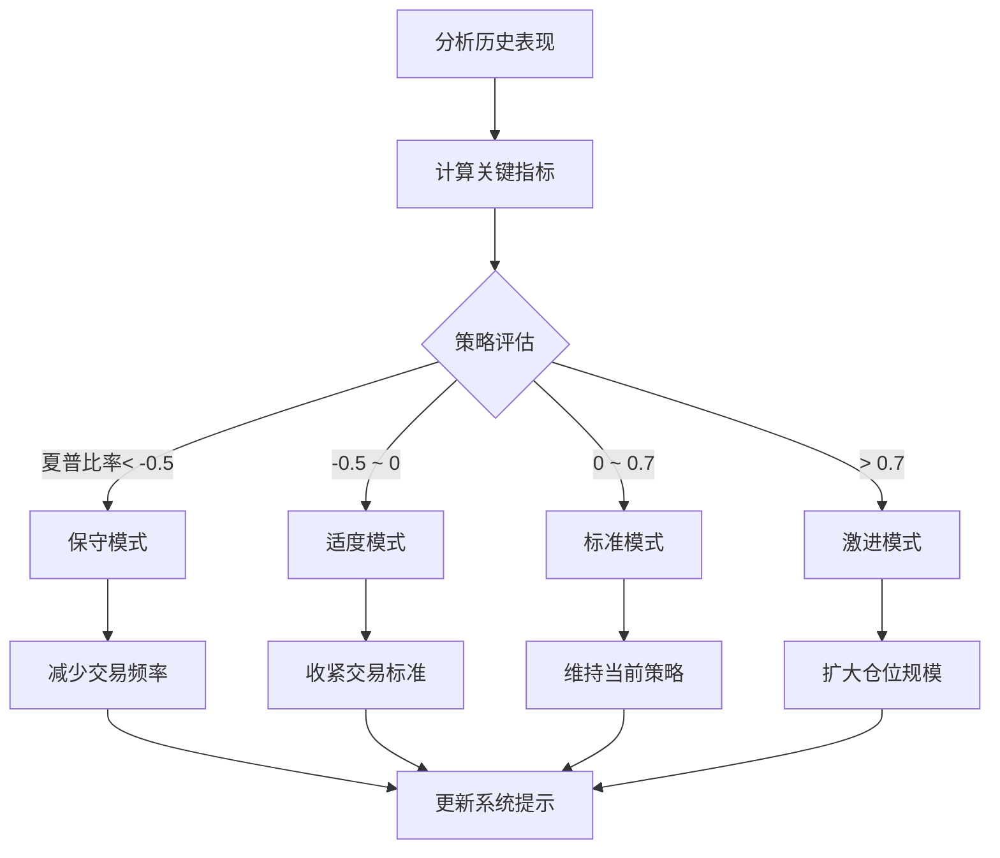

**图表来源**
- [decision/engine.go](file://decision/engine.go#L265-L283)

### 反馈循环机制

系统建立完整的AI学习反馈循环：

1. **决策执行**：AI基于当前市场状态做出交易决策
2. **结果记录**：系统记录交易结果和账户变化
3. **性能分析**：分析最近周期的交易表现
4. **指标计算**：计算胜率、盈亏比、夏普比率等关键指标
5. **策略调整**：根据分析结果调整AI的交易策略
6. **提示更新**：更新AI的系统提示，引导更好的决策

**章节来源**
- [logger/decision_logger.go](file://logger/decision_logger.go#L400-L612)
- [decision/engine.go](file://decision/engine.go#L265-L283)

## 技术架构概览

### 系统架构设计

nofx采用模块化架构设计，支持多种交易所和AI提供商：

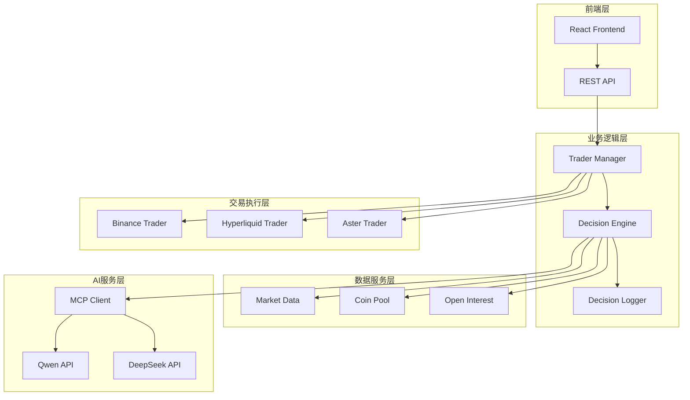

**图表来源**
- [main.go](file://main.go#L1-L140)
- [manager/trader_manager.go](file://manager/trader_manager.go#L1-L173)

### 核心组件关系

各核心组件之间的交互关系体现了nofx的完整交易生态系统：

```mermaid
classDiagram
class TraderManager {
+traders map[string]*AutoTrader
+AddTrader(config) error
+GetComparisonData() map[string]interface{}
+StartAll() void
+StopAll() void
}
class AutoTrader {
+id string
+name string
+aiModel string
+Run() error
+Stop() void
+GetStatus() map[string]interface{}
+GetAccountInfo() map[string]interface{}
}
class DecisionEngine {
+GetFullDecision(Context, Client) FullDecision
+buildSystemPrompt(float64, int, int) string
+buildUserPrompt(Context) string
}
class DecisionLogger {
+LogDecision(Record) error
+AnalyzePerformance(int) PerformanceAnalysis
+GetStatistics() Statistics
}
class MarketData {
+Get(string) Data
+calculateEMA([]Kline, int) float64
+calculateMACD([]Kline) float64
+calculateRSI([]Kline, int) float64
}
TraderManager --> AutoTrader : manages
AutoTrader --> DecisionEngine : uses
AutoTrader --> DecisionLogger : logs to
DecisionEngine --> MarketData : fetches
DecisionEngine --> MCPClient : calls
```

**图表来源**
- [manager/trader_manager.go](file://manager/trader_manager.go#L10-L50)
- [trader/auto_trader.go](file://trader/auto_trader.go#L50-L150)
- [decision/engine.go](file://decision/engine.go#L1-L100)

### 数据流架构

系统内部的数据流向展示了完整的交易生命周期：

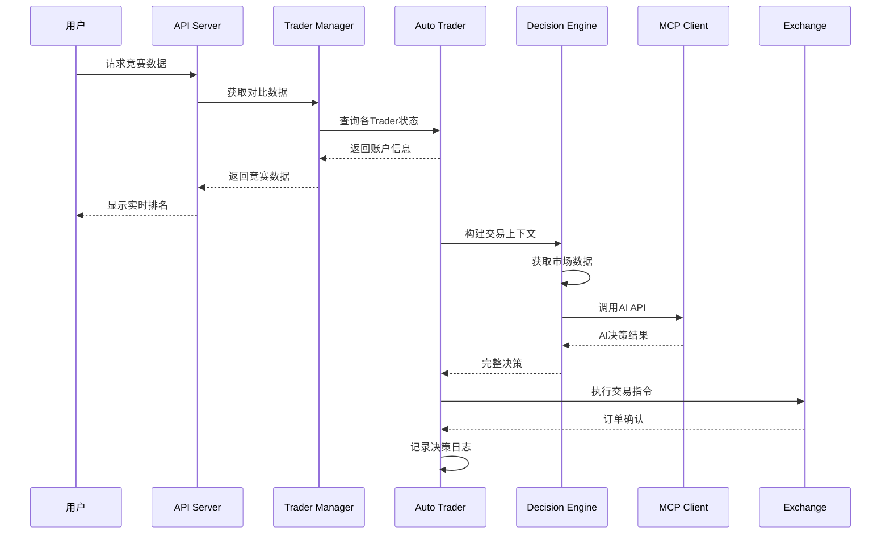

**图表来源**
- [api/server.go](file://api/server.go#L1-L424)
- [manager/trader_manager.go](file://manager/trader_manager.go#L120-L173)

**章节来源**
- [main.go](file://main.go#L1-L140)
- [api/server.go](file://api/server.go#L1-L424)
- [manager/trader_manager.go](file://manager/trader_manager.go#L1-L173)

## 总结

nofx项目通过创新的多智能体竞赛框架、完善的自动化交易执行系统、专业的实时监控界面和严格的风险控制机制，构建了一个完整的AI驱动交易生态系统。

### 核心优势

1. **技术创新**：首次实现AI间的自我博弈和进化，推动交易策略的持续优化
2. **架构先进**：采用统一架构设计，支持跨市场、跨时间框架的交易
3. **功能完善**：从AI决策到执行监控的全流程覆盖，提供专业级交易体验
4. **风险可控**：多层次风险控制体系，确保交易安全性和稳定性

### 应用价值

- **教育研究**：为AI交易算法研究提供实验平台
- **商业应用**：可直接应用于实盘交易，提升投资效率
- **技术示范**：展示AI在金融领域的应用潜力和实践路径

nofx代表了AI交易领域的重要突破，为未来的智能交易系统发展奠定了坚实基础。