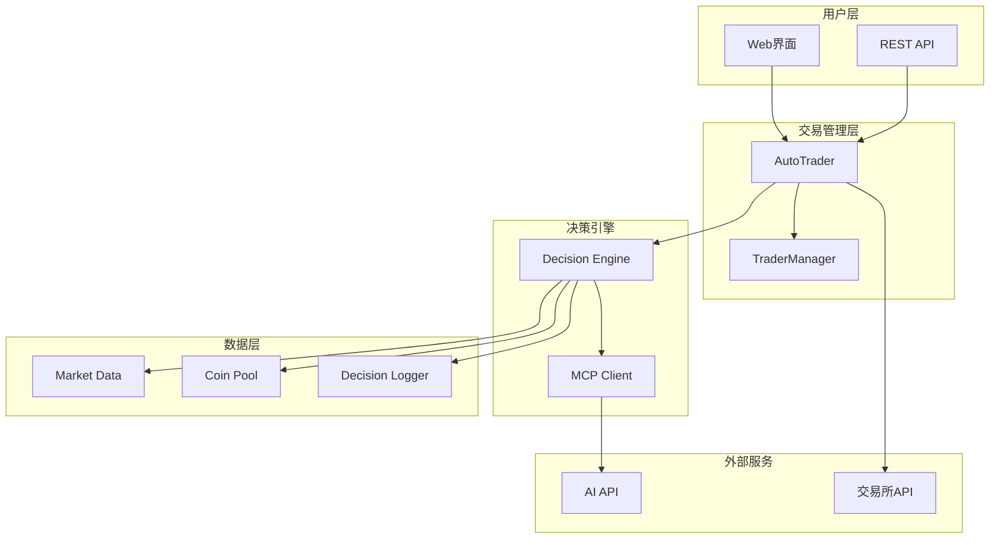
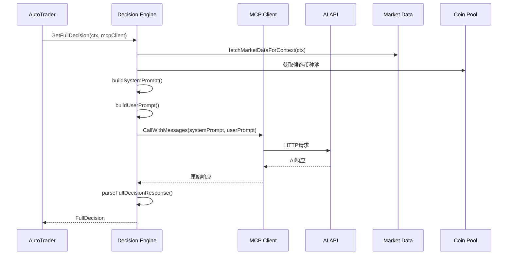
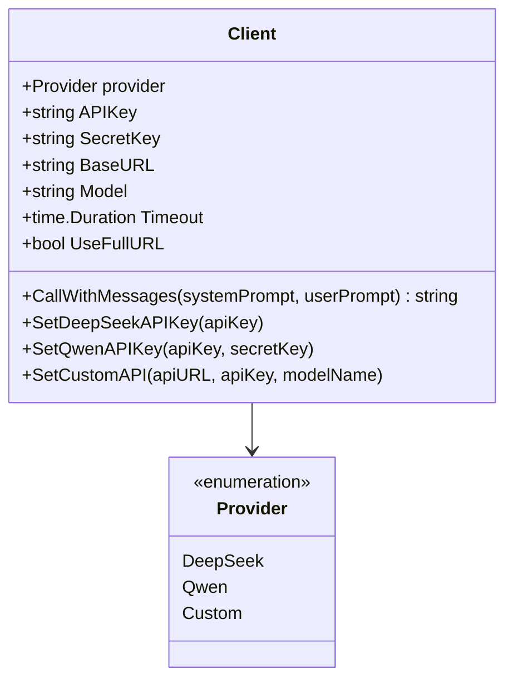
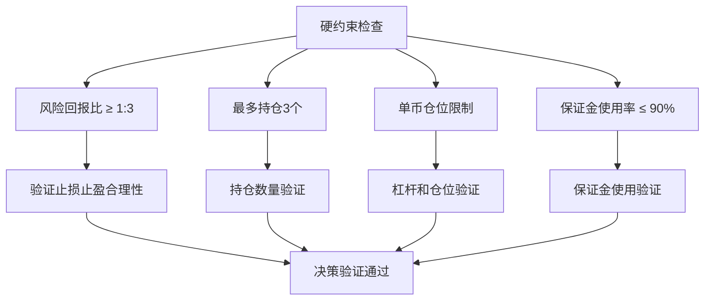
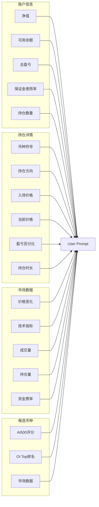
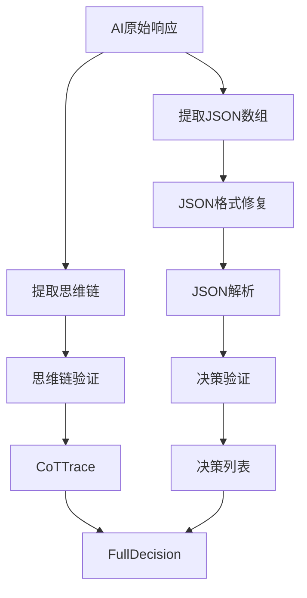
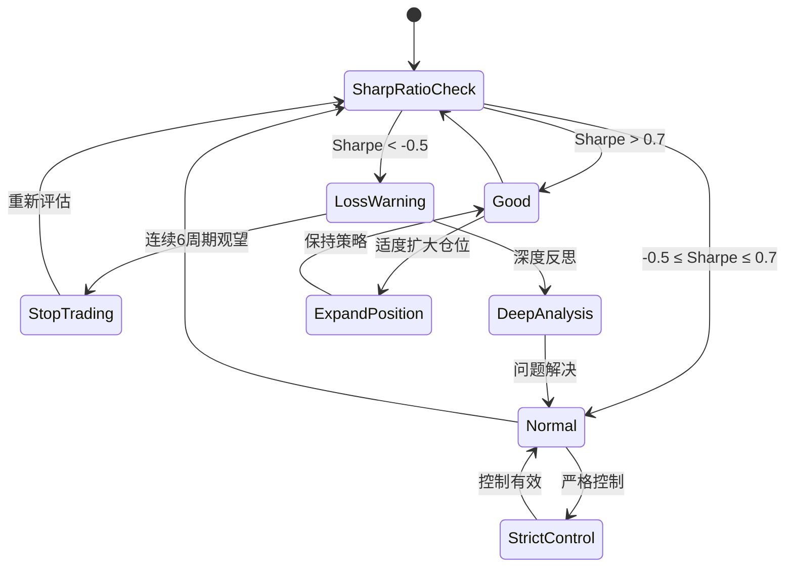
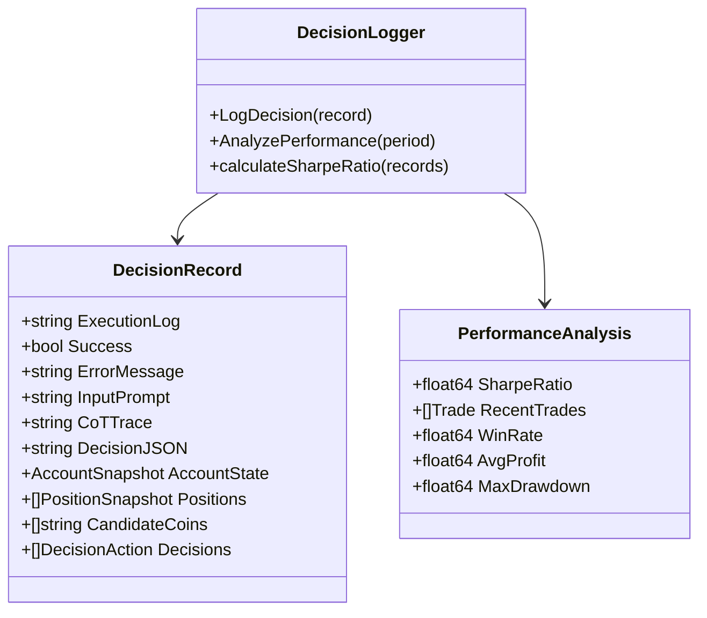

# AI调用系统详细文档

<cite>
**本文档引用的文件**
- [decision/engine.go](file://decision/engine.go)
- [mcp/client.go](file://mcp/client.go)
- [trader/auto_trader.go](file://trader/auto_trader.go)
- [market/data.go](file://market/data.go)
- [pool/coin_pool.go](file://pool/coin_pool.go)
- [config/config.go](file://config/config.go)
- [trader/interface.go](file://trader/interface.go)
</cite>

## 目录
1. [系统概述](#系统概述)
2. [核心组件架构](#核心组件架构)
3. [决策引擎详解](#决策引擎详解)
4. [AI API调用流程](#ai-api调用流程)
5. [System Prompt设计](#system-prompt设计)
6. [User Prompt构建](#user-prompt构建)
7. [AI响应解析](#ai响应解析)
8. [风险控制机制](#风险控制机制)
9. [性能监控与优化](#性能监控与优化)
10. [故障排除指南](#故障排除指南)

## 系统概述

AI调用系统是一个基于人工智能的自动化交易决策引擎，通过深度学习模型分析市场数据、账户状态和历史表现，生成最优的交易决策。系统采用"夏普比率最大化"为核心目标，确保风险调整后的收益最优。

### 核心特性

- **智能决策**：基于AI模型的全天候交易决策
- **风险控制**：严格的夏普比率自我进化机制
- **多平台支持**：支持币安、Hyperliquid、Aster等多个交易平台
- **实时监控**：完整的决策日志和性能跟踪
- **容错机制**：自动重试和错误恢复

## 核心组件架构

**图表来源**
- [trader/auto_trader.go](file://trader/auto_trader.go#L1-L50)
- [decision/engine.go](file://decision/engine.go#L1-L50)
- [mcp/client.go](file://mcp/client.go#L1-L50)

**章节来源**
- [trader/auto_trader.go](file://trader/auto_trader.go#L1-L100)
- [decision/engine.go](file://decision/engine.go#L1-L100)

## 决策引擎详解

决策引擎是系统的核心，负责协调所有组件并生成最终的交易决策。

### GetFullDecision函数流程

**图表来源**
- [decision/engine.go](file://decision/engine.go#L100-L130)
- [mcp/client.go](file://mcp/client.go#L80-L120)

### 市场数据获取机制

决策引擎首先获取所有相关的市场数据，包括：

1. **持仓币种数据**：必须获取，确保决策准确性
2. **候选币种数据**：根据账户状态动态调整分析数量
3. **OI Top数据**：可选的持仓量增长数据
4. **流动性过滤**：跳过流动性过低的币种（持仓价值<15M USD）

**章节来源**
- [decision/engine.go](file://decision/engine.go#L130-L200)

## AI API调用流程

### MCP Client设计

MCP (Model Communication Protocol) Client提供了统一的AI API调用接口，支持多种AI提供商：

**图表来源**
- [mcp/client.go](file://mcp/client.go#L15-L40)

### API调用机制

1. **重试机制**：最多3次重试，指数退避策略
2. **超时控制**：默认120秒，适应AI分析需求
3. **认证支持**：支持Bearer Token和API-Key认证
4. **错误处理**：可重试错误自动重试，不可重试错误直接返回

**章节来源**
- [mcp/client.go](file://mcp/client.go#L80-L150)

## System Prompt设计

System Prompt是AI决策的基础，包含了完整的交易规则和约束条件。

### 核心目标设定

System Prompt首先明确了AI的核心使命：

- **夏普比率最大化**：平均收益/收益波动率
- **高质量交易**：高胜率、大盈亏比
- **稳定收益**：控制回撤，耐心持仓
- **避免过度交易**：减少手续费损耗

### 硬约束规则

**图表来源**
- [decision/engine.go](file://decision/engine.go#L200-L300)

### 做空激励机制

系统特别强调做空的重要性：
- 做空是做多的等价盈利工具
- 下跌趋势做空利润等于上涨趋势做多利润
- 避免做多偏见，保持市场中性

### 交易频率认知

系统对交易频率有明确指导：
- 优秀交易员：每天2-4笔（每小时0.1-0.2笔）
- 过度交易：每小时>2笔（严重问题）
- 最佳节奏：开仓后持有至少30-60分钟

**章节来源**
- [decision/engine.go](file://decision/engine.go#L200-L400)

## User Prompt构建

User Prompt将动态的账户状态、持仓信息和市场数据结构化地呈现给AI。

### 数据结构化组织

**图表来源**
- [decision/engine.go](file://decision/engine.go#L400-L500)

### 动态数据整合

User Prompt包含以下关键信息：

1. **实时账户状态**：净值、余额、盈亏、保证金使用率
2. **持仓分析**：每个持仓的详细信息和持仓时长
3. **市场环境**：BTC/ETH市场状态和技术指标
4. **候选机会**：AI500和OI Top的优质币种
5. **历史表现**：当前夏普比率作为绩效反馈

**章节来源**
- [decision/engine.go](file://decision/engine.go#L400-L600)

## AI响应解析

### 思维链提取

AI响应包含两部分：思维链分析和JSON决策列表。

**图表来源**
- [decision/engine.go](file://decision/engine.go#L550-L620)

### JSON格式修复

系统实现了智能的JSON格式修复机制：

1. **引号修复**：自动替换中文引号为英文引号
2. **括号匹配**：确保JSON数组的正确闭合
3. **格式验证**：严格的JSON语法检查

### 决策验证机制

每个AI决策都会经过严格的验证：

1. **动作有效性**：检查action字段是否合法
2. **参数完整性**：开仓操作必须提供完整参数
3. **风险回报比**：验证止损止盈的合理性
4. **仓位限制**：检查杠杆和仓位大小是否符合约束

**章节来源**
- [decision/engine.go](file://decision/engine.go#L550-L624)

## 风险控制机制

### 夏普比率自我进化

系统实现了基于夏普比率的风险控制机制：

**图表来源**
- [decision/engine.go](file://decision/engine.go#L265-L290)

### 硬约束执行

系统严格执行以下硬约束：

1. **风险回报比**：必须≥1:3
2. **持仓数量**：最多3个币种
3. **单币仓位**：根据账户净值动态调整
4. **保证金使用**：总使用率≤90%

**章节来源**
- [decision/engine.go](file://decision/engine.go#L580-L624)

## 性能监控与优化

### 决策日志系统

系统提供了完整的决策日志记录功能：

**图表来源**
- [logger/decision_logger.go](file://logger/decision_logger.go#L524-L565)

### 性能指标计算

系统自动计算以下关键性能指标：

1. **夏普比率**：基于账户净值变化的风险调整收益
2. **胜率**：盈利交易占比
3. **平均盈亏**：单笔交易的平均收益
4. **最大回撤**：账户净值的最大跌幅

**章节来源**
- [logger/decision_logger.go](file://logger/decision_logger.go#L524-L565)

## 故障排除指南

### 常见问题及解决方案

#### AI API调用失败

**问题症状**：`调用AI API失败`错误
**可能原因**：
1. API密钥配置错误
2. 网络连接问题
3. 请求超时

**解决方案**：
1. 验证API密钥配置
2. 检查网络连接
3. 增加超时时间设置

#### 决策验证失败

**问题症状**：`决策验证失败`错误
**可能原因**：
1. 杠杆设置超出限制
2. 仓位大小不符合要求
3. 止损止盈设置不合理

**解决方案**：
1. 检查杠杆配置
2. 验证仓位计算
3. 调整止损止盈比例

#### 市场数据获取失败

**问题症状**：`获取市场数据失败`错误
**可能原因**：
1. 币安API限制
2. 网络连接不稳定
3. 币种流动性不足

**解决方案**：
1. 实施请求限流
2. 增加重试机制
3. 跳过流动性不足的币种

**章节来源**
- [mcp/client.go](file://mcp/client.go#L80-L150)
- [decision/engine.go](file://decision/engine.go#L550-L624)