# 上下文构建

<cite>
**本文档引用的文件**
- [auto_trader.go](file://trader/auto_trader.go)
- [coin_pool.go](file://pool/coin_pool.go)
- [decision_logger.go](file://logger/decision_logger.go)
- [engine.go](file://decision/engine.go)
- [market/data.go](file://market/data.go)
- [trader_manager.go](file://manager/trader_manager.go)
- [binance_futures.go](file://trader/binance_futures.go)
- [hyperliquid_trader.go](file://trader/hyperliquid_trader.go)
- [aster_trader.go](file://trader/aster_trader.go)
</cite>

## 目录
1. [简介](#简介)
2. [项目结构概览](#项目结构概览)
3. [核心组件分析](#核心组件分析)
4. [架构概览](#架构概览)
5. [详细组件分析](#详细组件分析)
6. [依赖关系分析](#依赖关系分析)
7. [性能考虑](#性能考虑)
8. [故障排除指南](#故障排除指南)
9. [结论](#结论)

## 简介

AutoTrader.buildTradingContext方法是整个交易系统的核心入口点，负责构建AI决策所需的完整交易上下文。该方法通过整合账户余额、持仓数据、候选币种池和历史表现分析等多个维度的信息，为AI提供全面的市场洞察和决策依据。

本文档深入解析了buildTradingContext方法的实现细节，详细说明了如何从不同交易接口获取账户信息和持仓数据，如何计算关键指标如总权益和保证金使用率，以及如何构建包含来源信息的候选币种列表。同时阐述了positionFirstSeenTime映射在跟踪持仓生命周期中的重要作用，以及如何清理已平仓的记录。

## 项目结构概览

AutoTrader系统采用模块化架构设计，主要包含以下核心模块：

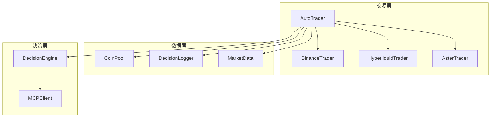

**图表来源**
- [auto_trader.go](file://trader/auto_trader.go#L1-L50)
- [coin_pool.go](file://pool/coin_pool.go#L1-L50)
- [decision_logger.go](file://logger/decision_logger.go#L1-L50)

**章节来源**
- [auto_trader.go](file://trader/auto_trader.go#L1-L100)
- [trader_manager.go](file://manager/trader_manager.go#L1-L50)

## 核心组件分析

### AutoTrader结构体

AutoTrader是整个交易系统的核心控制器，维护着交易状态和配置信息：

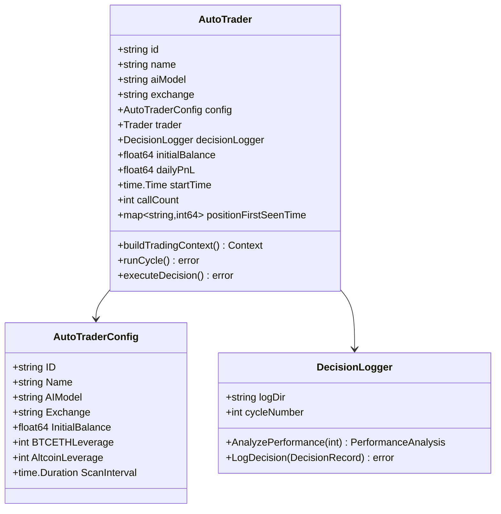

**图表来源**
- [auto_trader.go](file://trader/auto_trader.go#L40-L120)
- [decision_logger.go](file://logger/decision_logger.go#L50-L100)

**章节来源**
- [auto_trader.go](file://trader/auto_trader.go#L40-L150)

## 架构概览

buildTradingContext方法的执行流程体现了系统的分层架构设计：

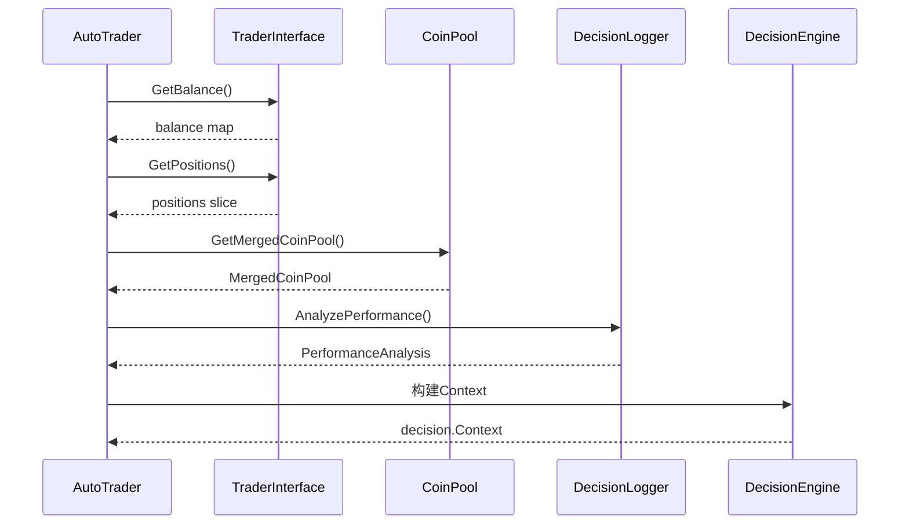

**图表来源**
- [auto_trader.go](file://trader/auto_trader.go#L380-L543)
- [engine.go](file://decision/engine.go#L100-L200)

## 详细组件分析

### 账户信息获取与处理

buildTradingContext方法首先从交易接口获取账户余额信息：

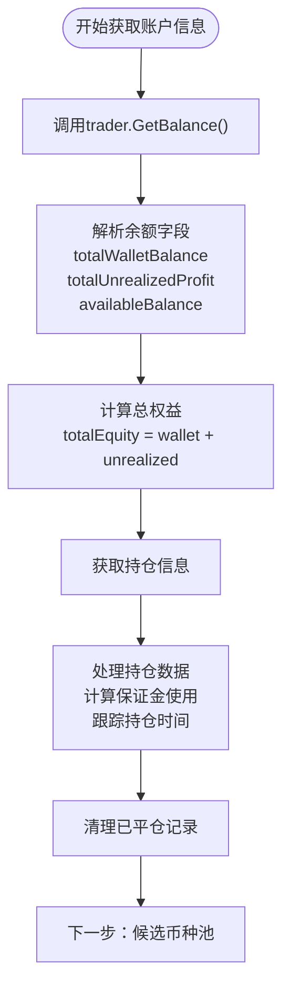

**图表来源**
- [auto_trader.go](file://trader/auto_trader.go#L380-L450)

#### 账户余额字段解析

系统从不同交易接口获取标准化的账户余额字段：

| 字段名 | 类型 | 描述 | 计算方式 |
|--------|------|------|----------|
| totalWalletBalance | float64 | 钱包总余额 | 交易所API返回的总余额 |
| totalUnrealizedProfit | float64 | 未实现盈亏 | 持仓的浮动盈亏 |
| availableBalance | float64 | 可用余额 | 可用于开仓的资金 |
| totalEquity | float64 | 总权益 | totalWalletBalance + totalUnrealizedProfit |

#### 保证金使用率计算

系统通过以下公式计算关键风险指标：

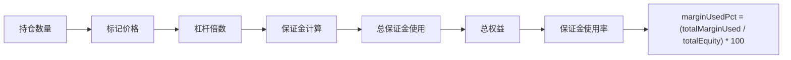

**图表来源**
- [auto_trader.go](file://trader/auto_trader.go#L420-L440)

**章节来源**
- [auto_trader.go](file://trader/auto_trader.go#L380-L450)

### 持仓数据处理与生命周期跟踪

positionFirstSeenTime映射在跟踪持仓生命周期中发挥关键作用：

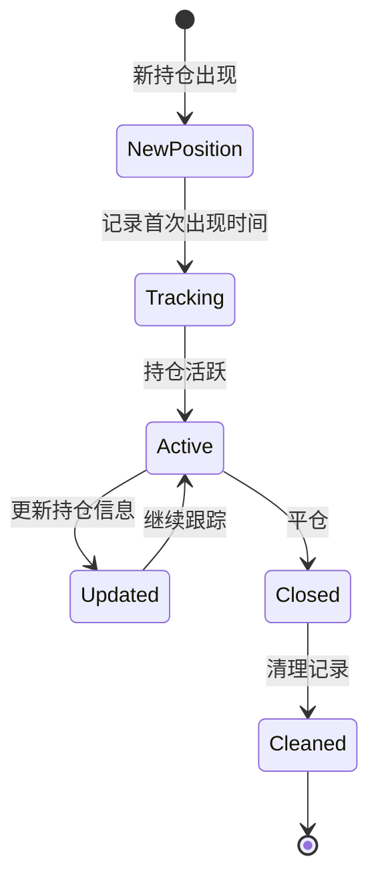

**图表来源**
- [auto_trader.go](file://trader/auto_trader.go#L450-L480)

#### 持仓映射清理机制

系统实现了智能的持仓记录清理机制：

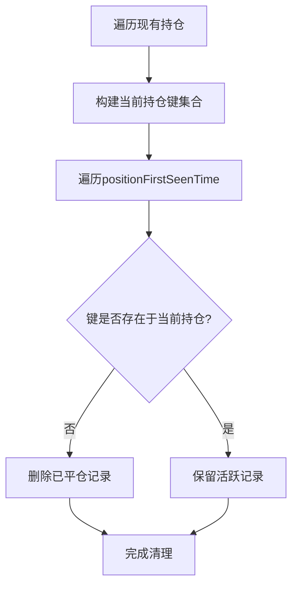

**图表来源**
- [auto_trader.go](file://trader/auto_trader.go#L470-L480)

**章节来源**
- [auto_trader.go](file://trader/auto_trader.go#L450-L480)

### 候选币种池构建

系统从pool模块获取AI500和OI Top合并的候选币种池：

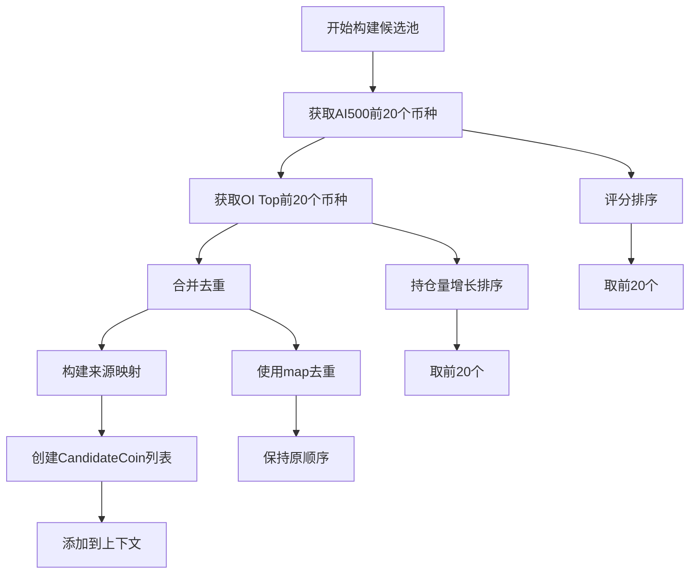

**图表来源**
- [auto_trader.go](file://trader/auto_trader.go#L480-L520)
- [coin_pool.go](file://pool/coin_pool.go#L590-L644)

#### 候选币种来源信息

每个候选币种都携带详细的来源信息：

| 来源类型 | 描述 | 数据来源 |
|----------|------|----------|
| ai500 | AI500评分系统 | pool.GetTopRatedCoins() |
| oi_top | 持仓量增长排行 | pool.GetOITopPositions() |
| 双重信号 | 同时出现在两个池中 | 合并后的SymbolSources映射 |

**章节来源**
- [auto_trader.go](file://trader/auto_trader.go#L480-L520)
- [coin_pool.go](file://pool/coin_pool.go#L590-L644)

### 历史表现分析集成

decisionLogger.AnalyzePerformance方法提供了深度的历史交易表现分析：

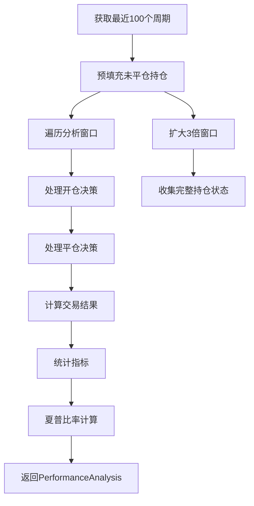

**图表来源**
- [auto_trader.go](file://trader/auto_trader.go#L520-L540)
- [decision_logger.go](file://logger/decision_logger.go#L315-L542)

#### 性能分析指标

系统计算多种关键性能指标：

| 指标类别 | 指标名称 | 计算方法 | 用途 |
|----------|----------|----------|------|
| 交易统计 | 总交易数 | analysis.TotalTrades | 评估交易频率 |
| 盈利能力 | 胜率 | WinningTrades/TotalTrades×100 | 衡量交易质量 |
| 盈利能力 | 盈亏比 | 总盈利/总亏损 | 评估风险回报 |
| 风险调整 | 夏普比率 | (平均收益-无风险利率)/收益波动率 | 综合评估表现 |
| 币种表现 | 最佳币种 | 总盈亏最大的币种 | 识别强势资产 |

**章节来源**
- [auto_trader.go](file://trader/auto_trader.go#L520-L540)
- [decision_logger.go](file://logger/decision_logger.go#L315-L542)

### 决策上下文构建

最终的决策上下文包含了AI所需的所有信息：

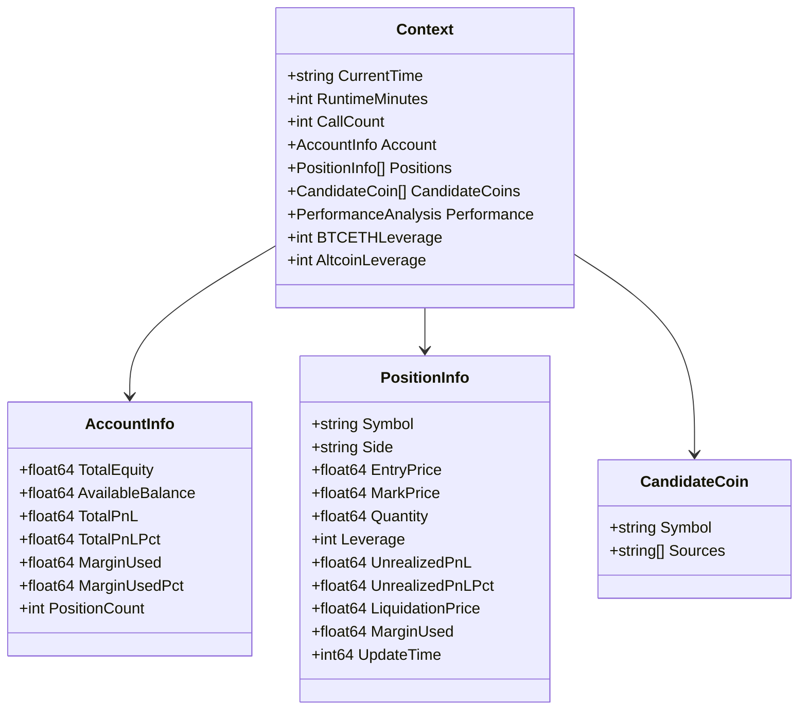

**图表来源**
- [engine.go](file://decision/engine.go#L50-L100)

**章节来源**
- [auto_trader.go](file://trader/auto_trader.go#L540-L580)
- [engine.go](file://decision/engine.go#L50-L150)

## 依赖关系分析

系统的依赖关系体现了清晰的分层架构：

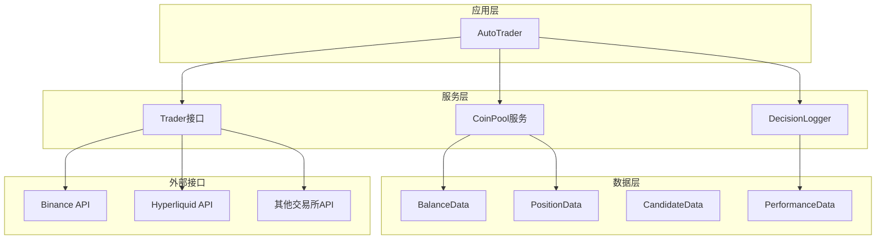

**图表来源**
- [auto_trader.go](file://trader/auto_trader.go#L1-L50)
- [coin_pool.go](file://pool/coin_pool.go#L1-L50)
- [decision_logger.go](file://logger/decision_logger.go#L1-L50)

**章节来源**
- [auto_trader.go](file://trader/auto_trader.go#L1-L100)
- [trader_manager.go](file://manager/trader_manager.go#L1-L50)

## 性能考虑

### 缓存策略

系统实现了多层缓存机制来提升性能：

- **账户余额缓存**：3秒有效期
- **持仓信息缓存**：3秒有效期  
- **币种池缓存**：24小时有效期
- **决策日志缓存**：按需加载

### 并发处理

对于市场数据获取，系统采用并发模式：

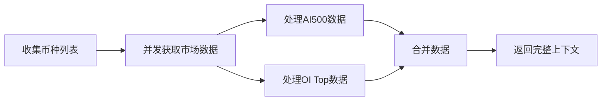

### 内存管理

positionFirstSeenTime映射的智能清理避免了内存泄漏：

- **定期清理**：移除已平仓的持仓记录
- **内存优化**：只保留活跃持仓的时间戳
- **垃圾回收**：Go语言自动管理内存释放

## 故障排除指南

### 常见问题及解决方案

#### 1. 账户信息获取失败

**症状**：buildTradingContext返回账户信息获取错误
**原因**：交易接口连接异常或认证失败
**解决方案**：
- 检查API密钥配置
- 验证网络连接
- 查看交易接口状态

#### 2. 持仓数据异常

**症状**：持仓数量显示为0或负数
**原因**：持仓数据解析错误或接口返回异常
**解决方案**：
- 检查持仓数据格式
- 验证杠杆倍数计算
- 确认持仓方向判断逻辑

#### 3. 候选币种池为空

**症状**：候选币种列表为空
**原因**：币种池API调用失败或数据为空
**解决方案**：
- 检查币种池API配置
- 验证网络连接
- 查看缓存文件状态

#### 4. 性能分析失败

**症状**：历史表现分析返回nil
**原因**：决策日志文件损坏或访问权限问题
**解决方案**：
- 检查日志目录权限
- 验证JSON文件格式
- 清理损坏的日志文件

**章节来源**
- [auto_trader.go](file://trader/auto_trader.go#L380-L580)
- [decision_logger.go](file://logger/decision_logger.go#L315-L542)

## 结论

AutoTrader.buildTradingContext方法展现了现代量化交易系统的设计精髓。通过精心设计的模块化架构，系统实现了：

1. **统一的交易接口抽象**：支持多种交易所平台
2. **全面的风险控制**：实时监控保证金使用率和总权益
3. **智能的持仓生命周期管理**：通过positionFirstSeenTime映射跟踪持仓状态
4. **丰富的决策支持信息**：整合账户、持仓、市场和历史表现数据
5. **高效的性能优化**：多层缓存和并发处理机制

该方法不仅为AI提供了高质量的决策输入，还建立了完整的交易监控和风险管理体系。通过持续的性能监控和优化，系统能够适应不断变化的市场环境，为自动化交易提供稳定可靠的技术支撑。