# 决策周期

<cite>
**本文档引用的文件**
- [auto_trader.go](file://trader/auto_trader.go)
- [config.go](file://config/config.go)
- [engine.go](file://decision/engine.go)
- [decision_logger.go](file://logger/decision_logger.go)
- [main.go](file://main.go)
</cite>

## 目录
1. [简介](#简介)
2. [主循环架构概览](#主循环架构概览)
3. [AutoTrader.Run主循环实现](#autotrader-run主循环实现)
4. [time.Ticker定时机制](#time-ticker定时机制)
5. [首次启动与立即执行策略](#首次启动与立即执行策略)
6. [isRunning标志控制机制](#isrunning标志控制机制)
7. [callCount计数器的作用](#callcount计数器的作用)
8. [runCycle方法详解](#runcycle方法详解)
9. [错误处理最佳实践](#错误处理最佳实践)
10. [日志记录策略](#日志记录策略)
11. [性能监控与上下文构建](#性能监控与上下文构建)
12. [总结](#总结)

## 简介

nofx项目的AutoTrader.Run主循环是整个AI驱动自动交易系统的核心调度机制。该循环通过time.Ticker定时触发，形成周期性的AI决策循环，实现了基于人工智能的自动化交易决策。本文档详细分析了这一核心机制的实现原理、设计思想和最佳实践。

## 主循环架构概览

AutoTrader.Run主循环采用经典的事件驱动架构，结合定时器机制，形成了一个稳定可靠的决策周期系统：

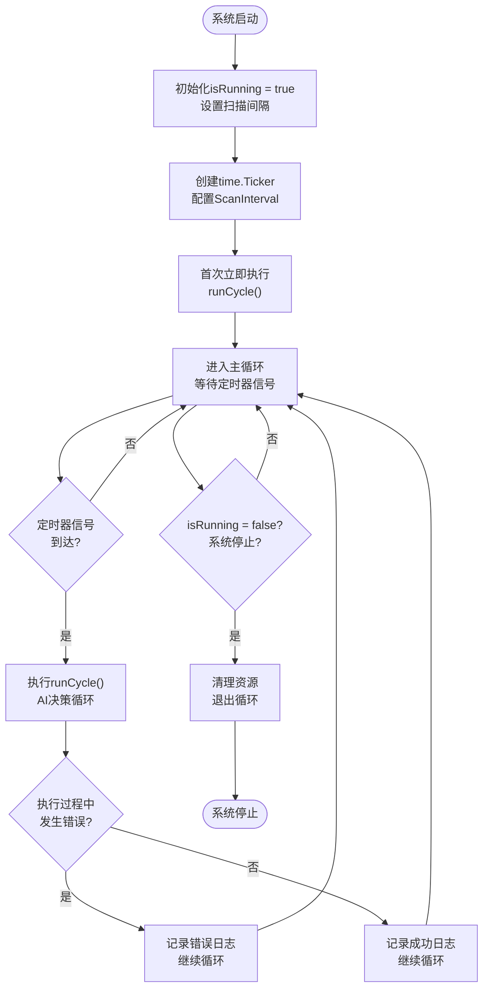
```mermaid
flowchart TD
Start([系统启动]) --> Init["初始化isRunning = true<br/>设置扫描间隔"]
Init --> Ticker["创建time.Ticker<br/>配置ScanInterval"]
Ticker --> FirstRun["首次立即执行<br/>runCycle()"]
FirstRun --> Loop["进入主循环<br/>等待定时器信号"]
Loop --> TimerSignal{"定时器信号<br/>到达?"}
TimerSignal --> |是| RunCycle["执行runCycle()<br/>AI决策循环"]
TimerSignal --> |否| Loop
RunCycle --> ErrorCheck{"执行过程中<br/>发生错误?"}
ErrorCheck --> |是| LogError["记录错误日志<br/>继续循环"]
ErrorCheck --> |否| LogSuccess["记录成功日志<br/>继续循环"]
LogError --> Loop
LogSuccess --> Loop
Loop --> StopCheck{"isRunning = false?<br/>系统停止?"}
StopCheck --> |是| Cleanup["清理资源<br/>退出循环"]
StopCheck --> |否| Loop
Cleanup --> End([系统停止])
```

**图表来源**
- [auto_trader.go](file://trader/auto_trader.go#L183-L208)

## AutoTrader.Run主循环实现

AutoTrader.Run方法是整个自动交易系统的入口点，负责启动和管理主循环：

### 核心实现逻辑

主循环的实现遵循以下核心原则：
- **初始化阶段**：设置运行状态标志，配置定时器
- **首次执行**：立即执行一次决策循环，确保系统启动时不等待
- **周期性执行**：通过time.Ticker实现定时触发
- **优雅停止**：通过isRunning标志实现可控的系统停止

### 关键组件初始化

主循环启动时完成以下关键初始化工作：

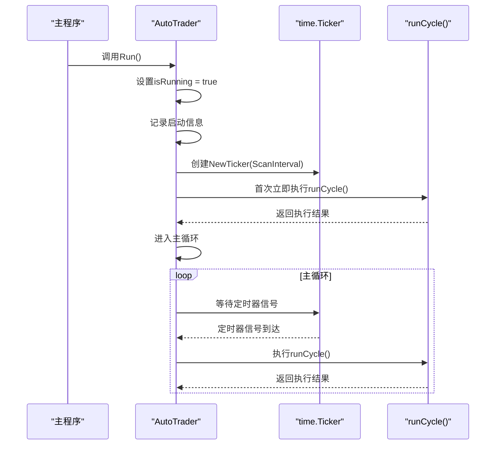
```mermaid
sequenceDiagram
participant Main as "主程序"
participant AT as "AutoTrader"
participant Ticker as "time.Ticker"
participant Cycle as "runCycle()"
Main->>AT : 调用Run()
AT->>AT : 设置isRunning = true
AT->>AT : 记录启动信息
AT->>Ticker : 创建NewTicker(ScanInterval)
AT->>Cycle : 首次立即执行runCycle()
Cycle-->>AT : 返回执行结果
AT->>AT : 进入主循环
loop 主循环
AT->>Ticker : 等待定时器信号
Ticker-->>AT : 定时器信号到达
AT->>Cycle : 执行runCycle()
Cycle-->>AT : 返回执行结果
end
```

**图表来源**
- [auto_trader.go](file://trader/auto_trader.go#L183-L208)

**章节来源**
- [auto_trader.go](file://trader/auto_trader.go#L183-L208)

## time.Ticker定时机制

time.Ticker是Go语言提供的定时器机制，用于定期产生时间信号。在nofx系统中，它被用来控制AI决策的执行频率。

### Ticker配置与使用

Ticker的配置基于用户在AutoTraderConfig中设置的ScanInterval参数：

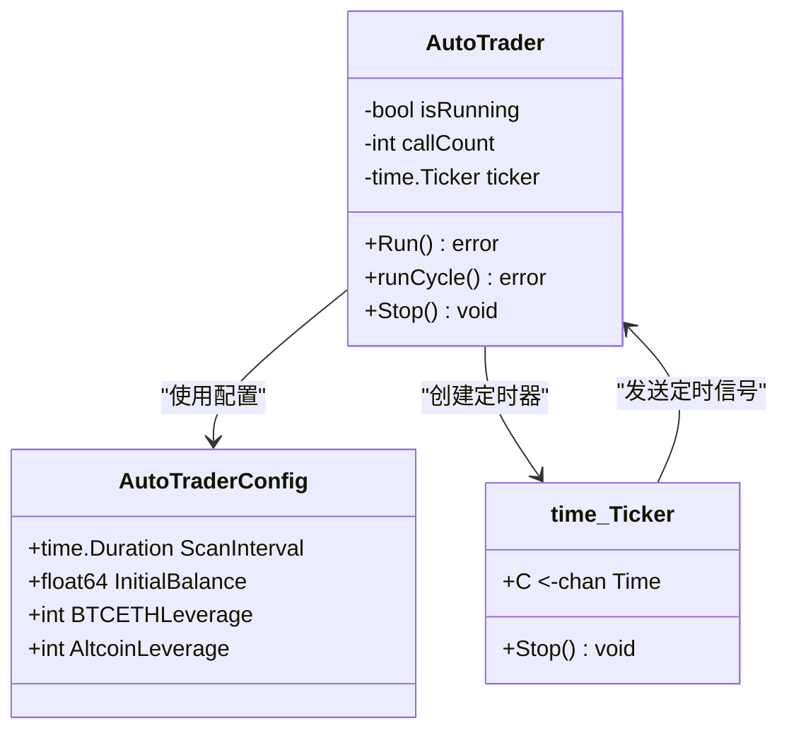
```mermaid
classDiagram
class AutoTraderConfig {
+time.Duration ScanInterval
+float64 InitialBalance
+int BTCETHLeverage
+int AltcoinLeverage
}
class AutoTrader {
-bool isRunning
-int callCount
-time.Ticker ticker
+Run() error
+runCycle() error
+Stop() void
}
class time_Ticker {
+C <-chan Time
+Stop() void
}
AutoTrader --> AutoTraderConfig : "使用配置"
AutoTrader --> time_Ticker : "创建定时器"
time_Ticker --> AutoTrader : "发送定时信号"
```

**图表来源**
- [auto_trader.go](file://trader/auto_trader.go#L183-L208)
- [config.go](file://config/config.go#L15-L40)

### 定时器生命周期管理

定时器的生命周期管理遵循以下原则：
- **创建时机**：在Run方法开始时创建
- **信号处理**：使用select语句监听定时器信号
- **资源释放**：通过defer语句确保定时器正确关闭

**章节来源**
- [auto_trader.go](file://trader/auto_trader.go#L183-L208)

## 首次启动与立即执行策略

为了确保系统启动时能够立即开始交易决策，nofx采用了特殊的首次执行策略。这种设计避免了用户需要等待完整扫描间隔才能看到系统响应的情况。

### 立即执行机制

首次执行发生在Ticker创建之后，但在主循环开始之前：

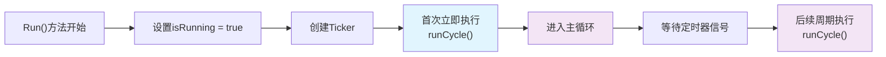
```mermaid
flowchart LR
A["Run()方法开始"] --> B["设置isRunning = true"]
B --> C["创建Ticker"]
C --> D["首次立即执行<br/>runCycle()"]
D --> E["进入主循环"]
E --> F["等待定时器信号"]
F --> G["后续周期执行<br/>runCycle()"]
style D fill:#e1f5fe
style E fill:#f3e5f5
style G fill:#f3e5f5
```

**图表来源**
- [auto_trader.go](file://trader/auto_trader.go#L195-L200)

### 策略优势

立即执行策略具有以下优势：
- **快速响应**：系统启动后立即开始决策
- **用户体验**：用户可以立即看到系统行为
- **容错处理**：首次执行失败不会影响后续周期
- **资源利用**：充分利用启动初期的空闲时间

**章节来源**
- [auto_trader.go](file://trader/auto_trader.go#L195-L200)

## isRunning标志控制机制

isRunning标志是AutoTrader.Run主循环的生命控制开关，用于实现系统的优雅停止和状态管理。

### 标志状态管理

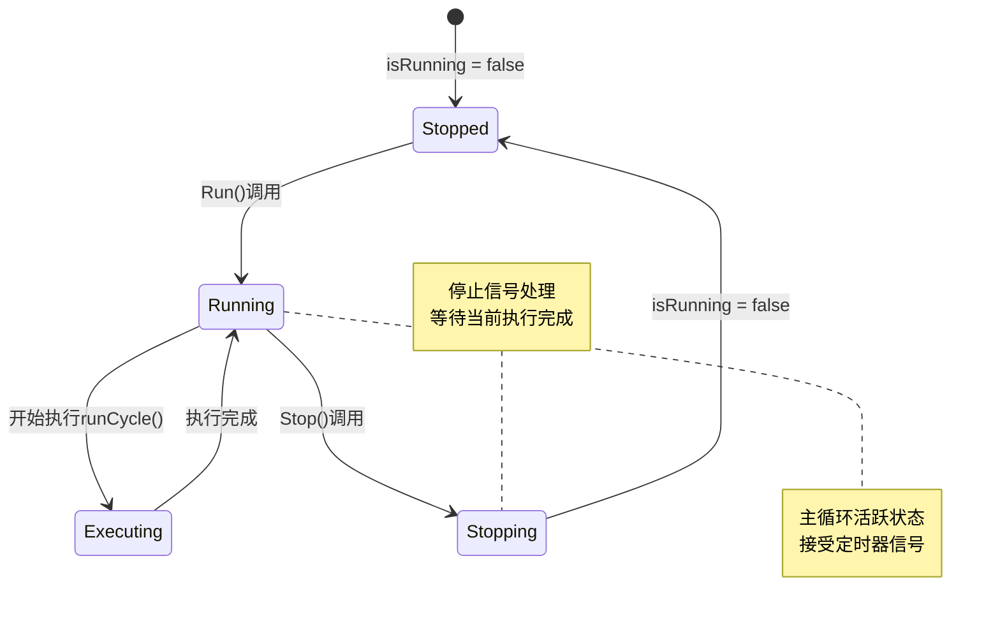
```mermaid
stateDiagram-v2
[*] --> Stopped : isRunning = false
Stopped --> Running : Run()调用
Running --> Executing : 开始执行runCycle()
Executing --> Running : 执行完成
Running --> Stopping : Stop()调用
Stopping --> Stopped : isRunning = false
note right of Running
主循环活跃状态
接受定时器信号
end note
note left of Stopping
停止信号处理
等待当前执行完成
end note
```

**图表来源**
- [auto_trader.go](file://trader/auto_trader.go#L183-L208)

### 控制流程实现

isRunning标志的控制遵循以下流程：

1. **启动阶段**：Run方法中设置为true
2. **运行阶段**：主循环持续检查该标志
3. **停止阶段**：Stop方法中设置为false
4. **清理阶段**：主循环检测到标志变化后退出

### 优雅停止机制

优雅停止确保系统在停止时不会中断正在进行的操作：

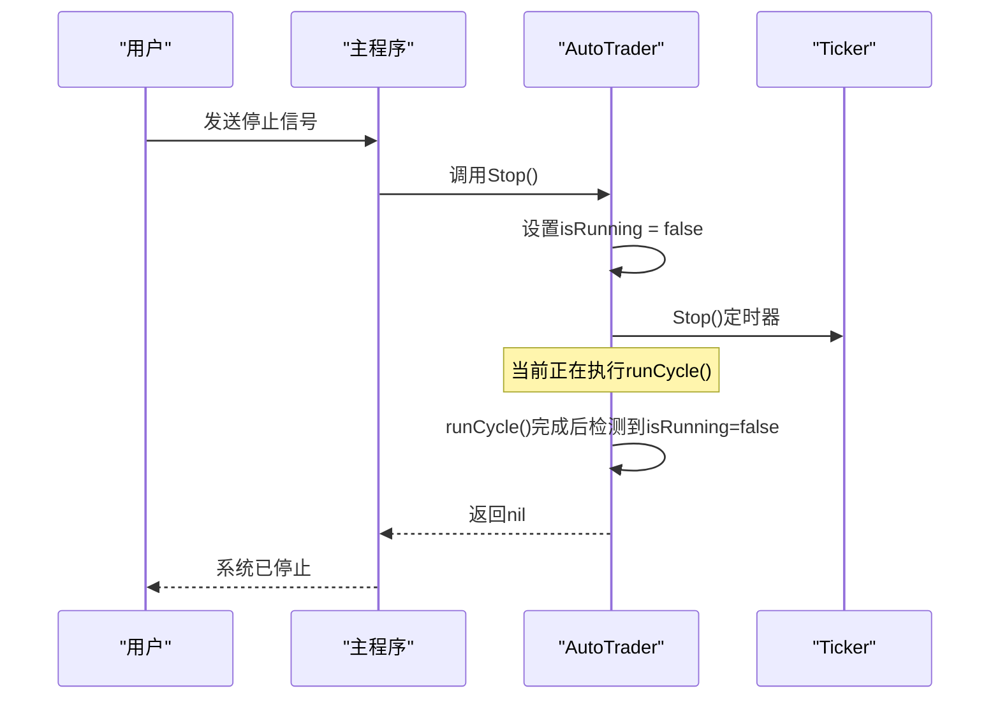
```mermaid
sequenceDiagram
participant User as "用户"
participant Main as "主程序"
participant AT as "AutoTrader"
participant Ticker as "Ticker"
User->>Main : 发送停止信号
Main->>AT : 调用Stop()
AT->>AT : 设置isRunning = false
AT->>Ticker : Stop()定时器
Note over AT : 当前正在执行runCycle()
AT->>AT : runCycle()完成后检测到isRunning=false
AT-->>Main : 返回nil
Main-->>User : 系统已停止
```

**图表来源**
- [auto_trader.go](file://trader/auto_trader.go#L202-L205)

**章节来源**
- [auto_trader.go](file://trader/auto_trader.go#L183-L208)

## callCount计数器的作用

callCount计数器是AutoTrader.Run主循环中的一个重要监控指标，用于跟踪AI决策的执行次数，并在日志记录和系统监控中发挥关键作用。

### 计数器功能定位

callCount计数器具有以下核心功能：

| 功能领域 | 具体作用 | 实现方式 |
|---------|---------|---------|
| 日志标识 | 为每个决策周期生成唯一标识 | 在runCycle()开始时递增 |
| 性能监控 | 跟踪系统运行效率 | 记录总执行次数 |
| 调试支持 | 提供决策周期的追踪线索 | 在日志中显示当前周期号 |
| 统计分析 | 支持长期运行统计 | 作为决策记录的一部分 |

### 计数器使用场景

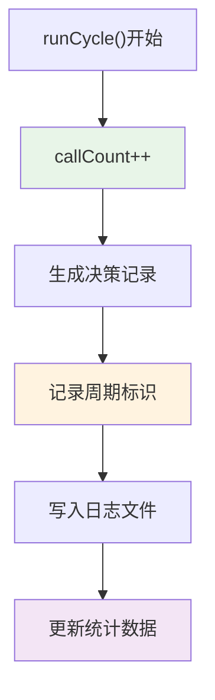
```mermaid
flowchart TD
A["runCycle()开始"] --> B["callCount++"]
B --> C["生成决策记录"]
C --> D["记录周期标识"]
D --> E["写入日志文件"]
E --> F["更新统计数据"]
style B fill:#e8f5e8
style D fill:#fff3e0
style F fill:#f3e5f5
```

**图表来源**
- [auto_trader.go](file://trader/auto_trader.go#L217-L220)

### 在决策记录中的应用

callCount计数器被嵌入到决策记录结构中，成为每个决策周期的重要标识符：

```mermaid
classDiagram
class DecisionRecord {
+int CycleNumber
+time.Time Timestamp
+string InputPrompt
+string CoTTrace
+string DecisionJSON
+AccountSnapshot AccountState
+[]PositionSnapshot Positions
+[]string CandidateCoins
+[]DecisionAction Decisions
+[]string ExecutionLog
+bool Success
+string ErrorMessage
}
class AutoTrader {
-int callCount
+runCycle() error
+GetStatus() map[string]interface{}
}
AutoTrader --> DecisionRecord : "创建记录时设置CycleNumber"
```

**图表来源**
- [decision_logger.go](file://logger/decision_logger.go#L10-L30)

**章节来源**
- [auto_trader.go](file://trader/auto_trader.go#L217-L220)

## runCycle方法详解

runCycle方法是AutoTrader.Run主循环的核心执行单元，负责完成一次完整的AI决策周期。该方法包含了从数据收集到决策执行的完整流程。

### 方法执行流程

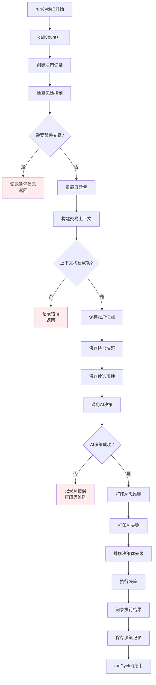
```mermaid
flowchart TD
A["runCycle()开始"] --> B["callCount++"]
B --> C["创建决策记录"]
C --> D["检查风险控制"]
D --> E{"需要暂停交易?"}
E --> |是| F["记录暂停信息<br/>返回"]
E --> |否| G["重置日盈亏"]
G --> H["构建交易上下文"]
H --> I{"上下文构建成功?"}
I --> |否| J["记录错误<br/>返回"]
I --> |是| K["保存账户快照"]
K --> L["保存持仓快照"]
L --> M["保存候选币种"]
M --> N["调用AI决策"]
N --> O{"AI决策成功?"}
O --> |否| P["记录AI错误<br/>打印思维链"]
O --> |是| Q["打印AI思维链"]
Q --> R["打印AI决策"]
R --> S["排序决策优先级"]
S --> T["执行决策"]
T --> U["记录执行结果"]
U --> V["保存决策记录"]
V --> W["runCycle()结束"]
style F fill:#ffebee
style J fill:#ffebee
style P fill:#ffebee
```

**图表来源**
- [auto_trader.go](file://trader/auto_trader.go#L217-L377)

### 关键执行步骤

#### 1. 周期标识与日志记录

每个runCycle执行都会生成唯一的周期标识，便于追踪和调试：

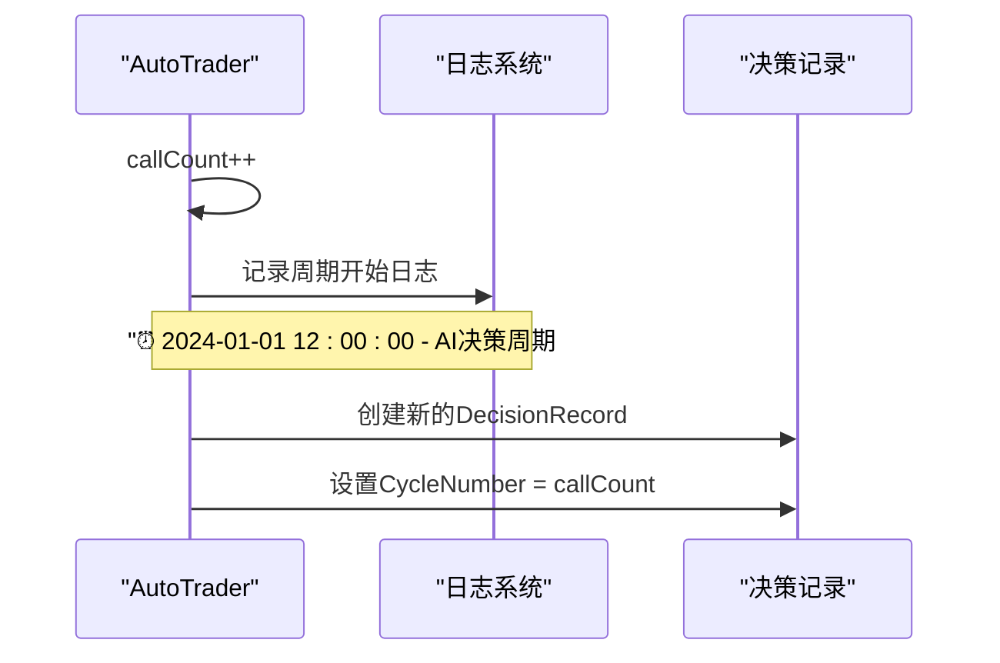
```mermaid
sequenceDiagram
participant AT as "AutoTrader"
participant Logger as "日志系统"
participant Record as "决策记录"
AT->>AT : callCount++
AT->>Logger : 记录周期开始日志
Note over AT,Logger : "⏰ 2024-01-01 12 : 00 : 00 - AI决策周期 #1"
AT->>Record : 创建新的DecisionRecord
AT->>Record : 设置CycleNumber = callCount
```

**图表来源**
- [auto_trader.go](file://trader/auto_trader.go#L217-L225)

#### 2. 风险控制检查

系统首先检查是否处于风险控制暂停状态：

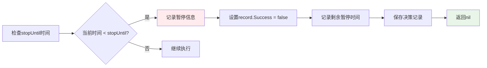
```mermaid
flowchart LR
A["检查stopUntil时间"] --> B{"当前时间 < stopUntil?"}
B --> |是| C["记录暂停信息"]
B --> |否| D["继续执行"]
C --> E["设置record.Success = false"]
E --> F["记录剩余暂停时间"]
F --> G["保存决策记录"]
G --> H["返回nil"]
style C fill:#ffebee
style H fill:#e8f5e8
```

**图表来源**
- [auto_trader.go](file://trader/auto_trader.go#L227-L235)

#### 3. 日盈亏重置机制

系统每天重置一次日盈亏统计，确保每日收益的准确性：

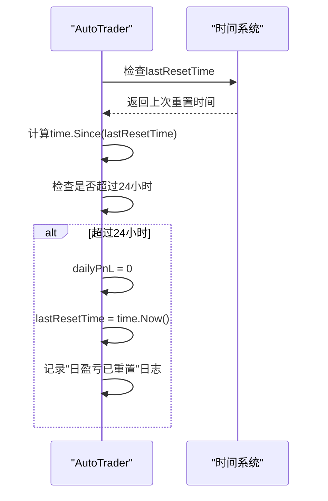
```mermaid
sequenceDiagram
participant AT as "AutoTrader"
participant Time as "时间系统"
AT->>Time : 检查lastResetTime
Time-->>AT : 返回上次重置时间
AT->>AT : 计算time.Since(lastResetTime)
AT->>AT : 检查是否超过24小时
alt 超过24小时
AT->>AT : dailyPnL = 0
AT->>AT : lastResetTime = time.Now()
AT->>AT : 记录"日盈亏已重置"日志
end
```

**图表来源**
- [auto_trader.go](file://trader/auto_trader.go#L237-L242)

#### 4. 交易上下文构建

buildTradingContext方法负责收集完整的交易环境信息：

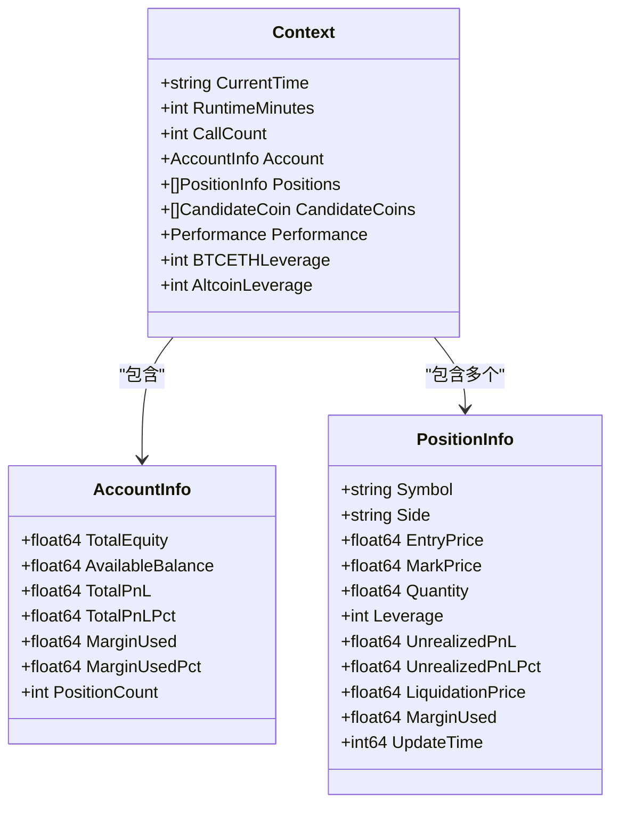
```mermaid
classDiagram
class Context {
+string CurrentTime
+int RuntimeMinutes
+int CallCount
+AccountInfo Account
+[]PositionInfo Positions
+[]CandidateCoin CandidateCoins
+Performance Performance
+int BTCETHLeverage
+int AltcoinLeverage
}
class AccountInfo {
+float64 TotalEquity
+float64 AvailableBalance
+float64 TotalPnL
+float64 TotalPnLPct
+float64 MarginUsed
+float64 MarginUsedPct
+int PositionCount
}
class PositionInfo {
+string Symbol
+string Side
+float64 EntryPrice
+float64 MarkPrice
+float64 Quantity
+int Leverage
+float64 UnrealizedPnL
+float64 UnrealizedPnLPct
+float64 LiquidationPrice
+float64 MarginUsed
+int64 UpdateTime
}
Context --> AccountInfo : "包含"
Context --> PositionInfo : "包含多个"
```

**图表来源**
- [engine.go](file://decision/engine.go#L50-L85)

**章节来源**
- [auto_trader.go](file://trader/auto_trader.go#L217-L377)

## 错误处理最佳实践

nofx项目在AutoTrader.Run主循环中实现了完善的错误处理机制，确保系统在遇到各种异常情况时能够优雅地处理并继续运行。

### 错误处理策略

系统采用分层错误处理策略：

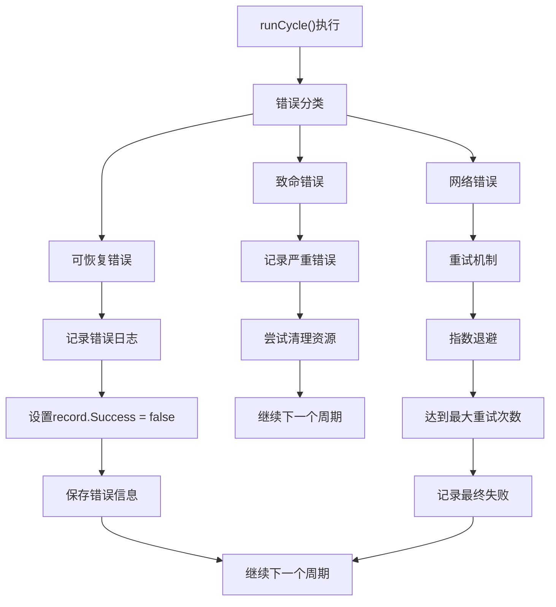
```mermaid
flowchart TD
A["runCycle()执行"] --> B["错误分类"]
B --> C["可恢复错误"]
B --> D["致命错误"]
B --> E["网络错误"]
C --> F["记录错误日志"]
F --> G["设置record.Success = false"]
G --> H["保存错误信息"]
H --> I["继续下一个周期"]
D --> J["记录严重错误"]
J --> K["尝试清理资源"]
K --> L["继续下一个周期"]
E --> M["重试机制"]
M --> N["指数退避"]
N --> O["达到最大重试次数"]
O --> P["记录最终失败"]
P --> I
```

**图表来源**
- [auto_trader.go](file://trader/auto_trader.go#L200-L205)

### 具体错误处理模式

#### 1. AI决策失败处理

当AI决策调用失败时，系统采用以下处理流程：

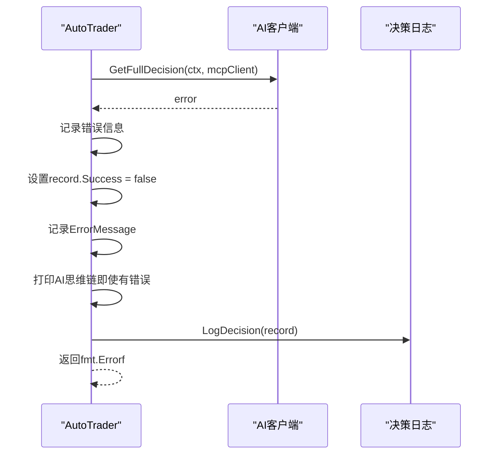
```mermaid
sequenceDiagram
participant AT as "AutoTrader"
participant AI as "AI客户端"
participant Logger as "决策日志"
AT->>AI : GetFullDecision(ctx, mcpClient)
AI-->>AT : error
AT->>AT : 记录错误信息
AT->>AT : 设置record.Success = false
AT->>AT : 记录ErrorMessage
AT->>AT : 打印AI思维链即使有错误
AT->>Logger : LogDecision(record)
AT-->>AT : 返回fmt.Errorf
```

**图表来源**
- [auto_trader.go](file://trader/auto_trader.go#L310-L330)

#### 2. 决策执行失败处理

单个决策执行失败时的处理策略：

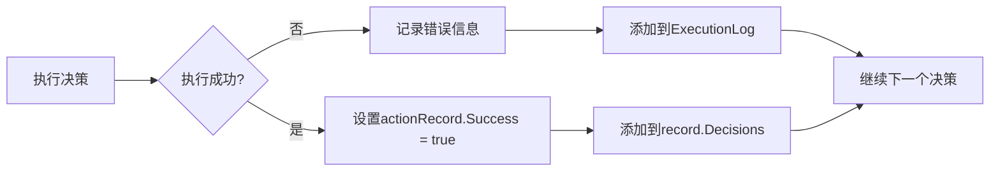
```mermaid
flowchart LR
A["执行决策"] --> B{"执行成功?"}
B --> |是| C["设置actionRecord.Success = true"]
B --> |否| D["记录错误信息"]
D --> E["添加到ExecutionLog"]
E --> F["继续下一个决策"]
C --> G["添加到record.Decisions"]
G --> F
```

**图表来源**
- [auto_trader.go](file://trader/auto_trader.go#L350-L365)

### 循环继续策略

系统设计了多种循环继续策略：

| 错误类型 | 处理策略 | 影响范围 | 恢复机制 |
|---------|---------|---------|---------|
| AI API调用失败 | 记录错误，继续下一轮 | 单个周期 | 下次周期重新尝试 |
| 决策执行失败 | 记录失败，继续其他决策 | 单个决策 | 下次周期重新评估 |
| 网络连接问题 | 重试机制，指数退避 | 整个系统 | 自动恢复 |
| 配置错误 | 系统停止，记录详细错误 | 全局 | 需要人工干预 |

**章节来源**
- [auto_trader.go](file://trader/auto_trader.go#L200-L205)
- [auto_trader.go](file://trader/auto_trader.go#L310-L330)
- [auto_trader.go](file://trader/auto_trader.go#L350-L365)

## 日志记录策略

nofx项目在AutoTrader.Run主循环中实现了多层次的日志记录策略，确保系统运行状态的完整可追溯性。

### 日志层次结构

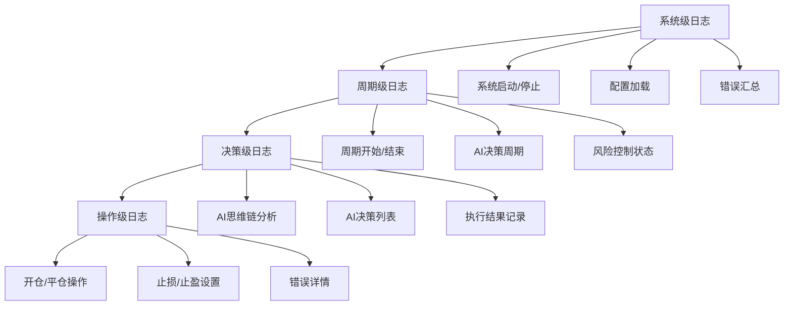
```mermaid
flowchart TD
A["系统级日志"] --> B["周期级日志"]
B --> C["决策级日志"]
C --> D["操作级日志"]
A --> A1["系统启动/停止"]
A --> A2["配置加载"]
A --> A3["错误汇总"]
B --> B1["周期开始/结束"]
B --> B2["AI决策周期"]
B --> B3["风险控制状态"]
C --> C1["AI思维链分析"]
C --> C2["AI决策列表"]
C --> C3["执行结果记录"]
D --> D1["开仓/平仓操作"]
D --> D2["止损/止盈设置"]
D --> D3["错误详情"]
```

**图表来源**
- [auto_trader.go](file://trader/auto_trader.go#L217-L225)

### 决策日志记录

每次runCycle执行都会生成完整的决策记录，包含以下信息：

#### 1. 基础信息记录

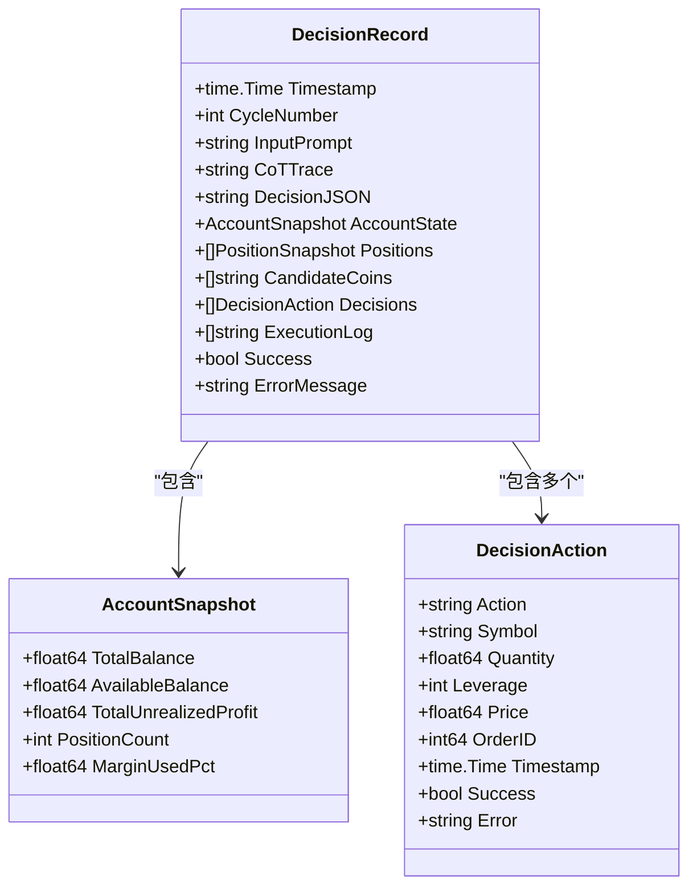
```mermaid
classDiagram
class DecisionRecord {
+time.Time Timestamp
+int CycleNumber
+string InputPrompt
+string CoTTrace
+string DecisionJSON
+AccountSnapshot AccountState
+[]PositionSnapshot Positions
+[]string CandidateCoins
+[]DecisionAction Decisions
+[]string ExecutionLog
+bool Success
+string ErrorMessage
}
class AccountSnapshot {
+float64 TotalBalance
+float64 AvailableBalance
+float64 TotalUnrealizedProfit
+int PositionCount
+float64 MarginUsedPct
}
class DecisionAction {
+string Action
+string Symbol
+float64 Quantity
+int Leverage
+float64 Price
+int64 OrderID
+time.Time Timestamp
+bool Success
+string Error
}
DecisionRecord --> AccountSnapshot : "包含"
DecisionRecord --> DecisionAction : "包含多个"
```

**图表来源**
- [decision_logger.go](file://logger/decision_logger.go#L10-L30)

#### 2. 日志文件命名策略

系统采用时间戳加周期号的命名策略：

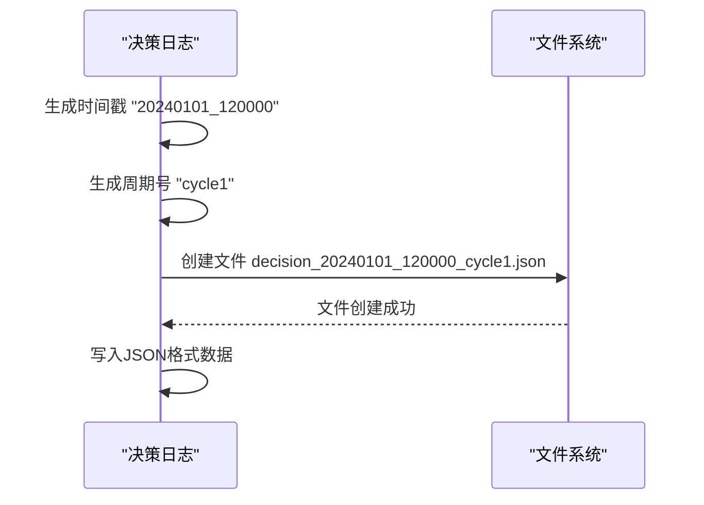
```mermaid
sequenceDiagram
participant Logger as "决策日志"
participant FS as "文件系统"
Logger->>Logger : 生成时间戳 "20240101_120000"
Logger->>Logger : 生成周期号 "cycle1"
Logger->>FS : 创建文件 decision_20240101_120000_cycle1.json
FS-->>Logger : 文件创建成功
Logger->>Logger : 写入JSON格式数据
```

**图表来源**
- [decision_logger.go](file://logger/decision_logger.go#L120-L130)

### 日志级别管理

系统采用分级日志记录策略：

| 日志级别 | 使用场景 | 示例内容 | 存储位置 |
|---------|---------|---------|---------|
| INFO | 系统状态、周期开始 | "🚀 AI驱动自动交易系统启动" | 控制台+文件 |
| DEBUG | 详细执行过程 | "📊 账户净值: 10000.00 USDT" | 文件 |
| WARN | 警告信息 | "⚠️ 保存决策记录失败" | 控制台+文件 |
| ERROR | 错误信息 | "❌ 执行决策失败: 网络超时" | 控制台+文件 |

**章节来源**
- [auto_trader.go](file://trader/auto_trader.go#L217-L225)
- [decision_logger.go](file://logger/decision_logger.go#L120-L130)

## 性能监控与上下文构建

AutoTrader.Run主循环中的性能监控和上下文构建是确保AI决策质量的关键环节。

### 上下文构建流程

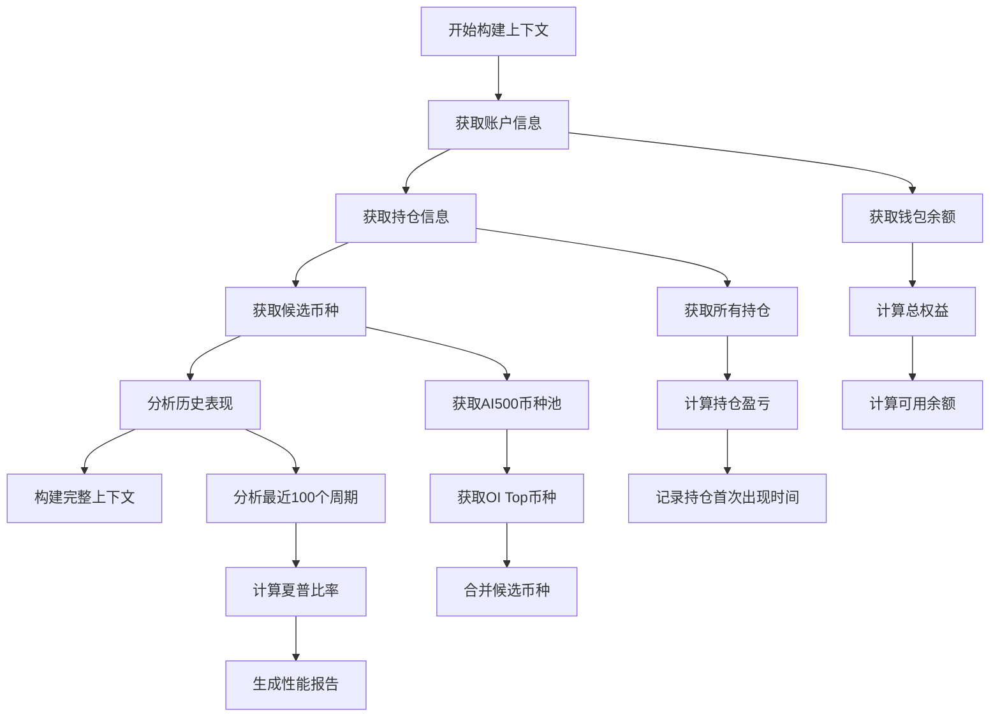
```mermaid
flowchart TD
A["开始构建上下文"] --> B["获取账户信息"]
B --> C["获取持仓信息"]
C --> D["获取候选币种"]
D --> E["分析历史表现"]
E --> F["构建完整上下文"]
B --> B1["获取钱包余额"]
B1 --> B2["计算总权益"]
B2 --> B3["计算可用余额"]
C --> C1["获取所有持仓"]
C1 --> C2["计算持仓盈亏"]
C2 --> C3["记录持仓首次出现时间"]
D --> D1["获取AI500币种池"]
D1 --> D2["获取OI Top币种"]
D2 --> D3["合并候选币种"]
E --> E1["分析最近100个周期"]
E1 --> E2["计算夏普比率"]
E2 --> E3["生成性能报告"]
```

**图表来源**
- [auto_trader.go](file://trader/auto_trader.go#L379-L500)

### 关键性能指标

系统监控以下关键性能指标：

#### 1. 账户健康指标

```mermaid
classDiagram
class AccountInfo {
+float64 TotalEquity
+float64 AvailableBalance
+float64 TotalPnL
+float64 TotalPnLPct
+float64 MarginUsed
+float64 MarginUsedPct
+int PositionCount
}
class PerformanceAnalysis {
+int TotalTrades
+int WinningTrades
+int LosingTrades
+float64 WinRate
+float64 AvgWin
+float64 AvgLoss
+float64 ProfitFactor
+float64 SharpeRatio
+[]TradeOutcome RecentTrades
+map~string,SymbolPerformance~ SymbolStats
}
AccountInfo --> PerformanceAnalysis : "用于性能分析"
```

**图表来源**
- [engine.go](file://decision/engine.go#L50-L65)

#### 2. 持仓时间跟踪

系统精确跟踪每个持仓的首次出现时间：

```mermaid
sequenceDiagram
participant AT as "AutoTrader"
participant PT as "持仓跟踪"
participant Logger as "决策日志"
AT->>PT : 检查持仓信息
PT->>PT : 生成posKey = symbol + "_" + side
PT->>PT : 检查positionFirstSeenTime[posKey]
alt 首次出现
PT->>PT : 记录当前时间戳
PT->>PT : 设置positionFirstSeenTime[posKey] = now
else 已存在
PT->>PT : 使用原有时间戳
end
PT-->>AT : 返回UpdateTime
```

**图表来源**
- [auto_trader.go](file://trader/auto_trader.go#L450-L460)

### 夏普比率计算

系统通过决策日志分析计算夏普比率，作为AI学习的重要反馈指标：

```mermaid
flowchart LR
A["读取历史记录"] --> B["提取账户净值"]
B --> C["计算周期收益率"]
C --> D["计算平均收益率"]
D --> E["计算收益率标准差"]
E --> F["计算夏普比率"]
F --> G["返回性能分析"]
style F fill:#e8f5e8
style G fill:#e8f5e8
```

**图表来源**
- [decision_logger.go](file://logger/decision_logger.go#L550-L580)

**章节来源**
- [auto_trader.go](file://trader/auto_trader.go#L379-L500)
- [decision_logger.go](file://logger/decision_logger.go#L550-L580)

## 总结

nofx项目的AutoTrader.Run主循环实现了一个高度可靠和可维护的AI驱动自动交易系统。通过以下关键技术特点，确保了系统的稳定性和有效性：

### 核心技术优势

1. **稳定的定时机制**：基于time.Ticker的定时触发，确保决策周期的准确性
2. **优雅的停止机制**：通过isRunning标志实现可控的系统停止
3. **完善的错误处理**：多层次的错误处理策略，确保系统稳定性
4. **详细的日志记录**：完整的决策记录体系，支持审计和调试
5. **智能的风险控制**：实时的风险评估和暂停机制

### 设计哲学

- **可靠性优先**：系统设计始终以可靠性为核心考虑
- **可维护性**：清晰的代码结构和完善的错误处理
- **可观测性**：完整的日志记录和性能监控
- **可扩展性**：模块化的架构设计支持功能扩展

### 最佳实践总结

1. **使用time.Ticker而非time.Sleep**：避免阻塞操作，提高系统响应性
2. **实现优雅停止**：通过标志位控制，确保资源正确释放
3. **完善的错误处理**：区分可恢复和不可恢复错误，采取不同处理策略
4. **详细的日志记录**：记录关键操作和决策过程，便于问题排查
5. **性能监控集成**：将性能指标纳入决策过程，实现自我优化

这个主循环设计不仅满足了当前的功能需求，还为未来的功能扩展和性能优化奠定了坚实的基础。