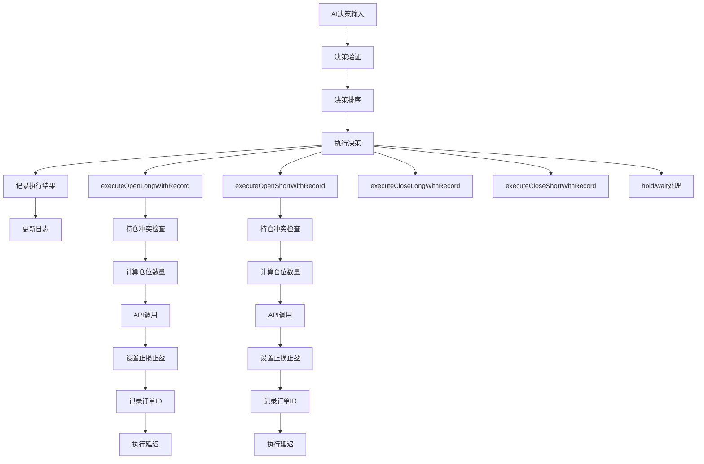
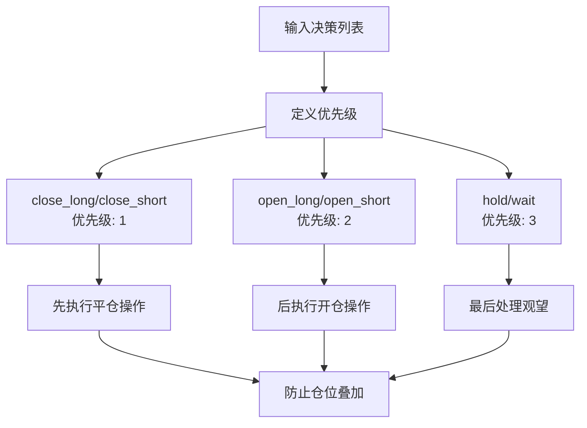
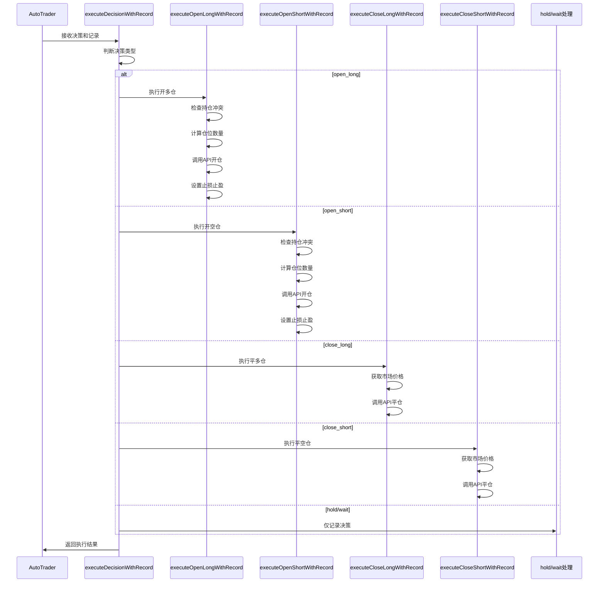
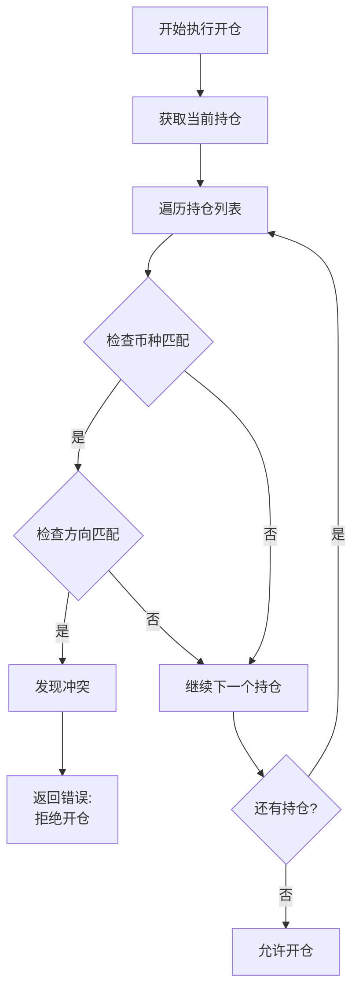
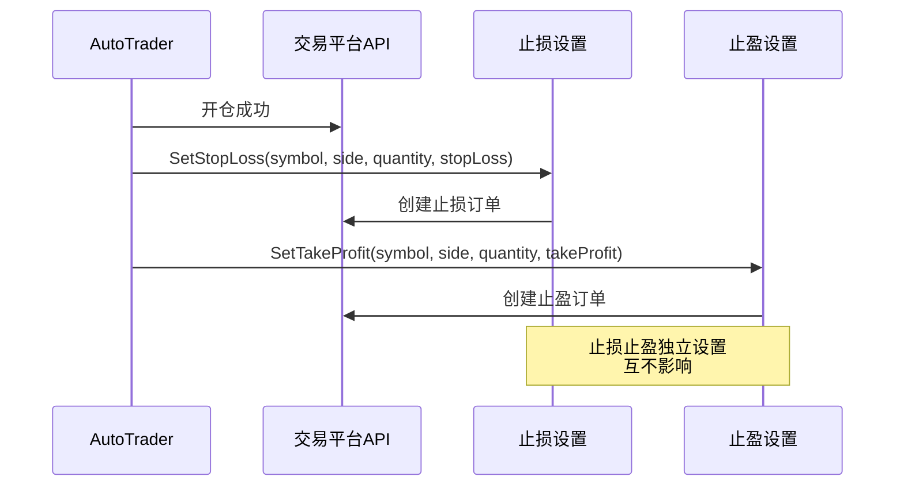
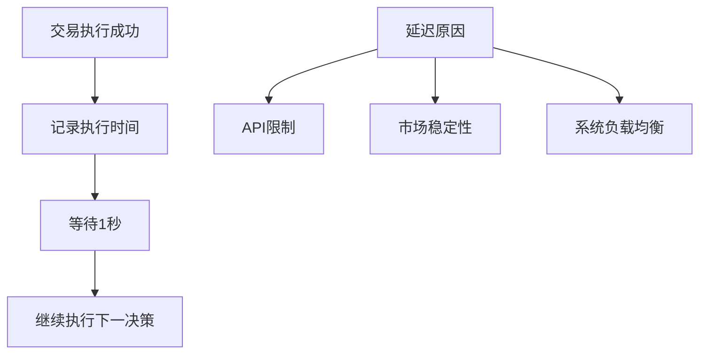
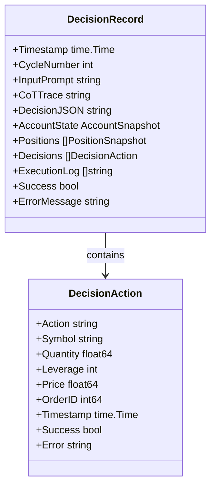

# 决策执行

<cite>
**本文档引用的文件**
- [auto_trader.go](file://trader/auto_trader.go)
- [engine.go](file://decision/engine.go)
- [interface.go](file://trader/interface.go)
- [decision_logger.go](file://logger/decision_logger.go)
- [trader_manager.go](file://manager/trader_manager.go)
</cite>

## 目录
1. [概述](#概述)
2. [决策执行架构](#决策执行架构)
3. [决策排序逻辑](#决策排序逻辑)
4. [核心执行方法](#核心执行方法)
5. [持仓冲突检查机制](#持仓冲突检查机制)
6. [止损止盈设置](#止损止盈设置)
7. [执行延迟策略](#执行延迟策略)
8. [错误处理与日志记录](#错误处理与日志记录)
9. [性能监控](#性能监控)
10. [总结](#总结)

## 概述

决策执行系统是交易自动化的核心组件，负责将AI生成的交易决策转化为实际的交易操作。该系统通过`executeDecisionWithRecord`方法协调各种交易操作，确保交易的安全性和有效性。

系统的主要功能包括：
- AI决策的解析和验证
- 决策排序以防止仓位叠加
- 多种交易操作的执行
- 持仓冲突检测和预防
- 止损止盈的自动设置
- 详细的执行日志记录

## 决策执行架构

**图表来源**
- [auto_trader.go](file://trader/auto_trader.go#L546-L562)
- [auto_trader.go](file://trader/auto_trader.go#L901-L934)

**章节来源**
- [auto_trader.go](file://trader/auto_trader.go#L325-L400)

## 决策排序逻辑

### sortDecisionsByPriority方法

决策排序是防止仓位叠加超限的关键机制。系统采用优先级排序算法，确保交易操作按照安全的顺序执行。

**图表来源**
- [auto_trader.go](file://trader/auto_trader.go#L901-L934)

排序逻辑的核心实现遵循以下原则：
- **平仓优先**：先执行平仓操作，释放保证金
- **开仓延后**：后执行开仓操作，确保有足够的保证金
- **观望最后**：保持当前持仓不变

**章节来源**
- [auto_trader.go](file://trader/auto_trader.go#L901-L934)

## 核心执行方法

### executeDecisionWithRecord方法

这是决策执行的入口点，根据决策类型调用相应的具体执行方法。

**图表来源**
- [auto_trader.go](file://trader/auto_trader.go#L546-L562)

### executeOpenLongWithRecord方法

执行开多仓操作，包含完整的持仓冲突检查和风险管理。

**核心流程**：
1. **持仓冲突检查**：验证是否存在同币种同方向的现有持仓
2. **市场数据获取**：获取当前市场价格
3. **仓位计算**：基于仓位大小和市场价格计算合约数量
4. **API调用**：执行开仓操作
5. **止损止盈设置**：配置风险控制参数
6. **订单记录**：保存订单ID和执行信息

**章节来源**
- [auto_trader.go](file://trader/auto_trader.go#L565-L615)

### executeOpenShortWithRecord方法

执行开空仓操作，与开多仓类似但针对空头仓位。

**核心流程**：
1. **持仓冲突检查**：验证是否存在同币种同方向的现有空仓
2. **市场数据获取**：获取当前市场价格
3. **仓位计算**：计算空头仓位数量
4. **API调用**：执行开空仓操作
5. **止损止盈设置**：配置空头仓位的风险参数
6. **订单记录**：保存执行详情

**章节来源**
- [auto_trader.go](file://trader/auto_trader.go#L618-L668)

### executeCloseLongWithRecord方法

执行平多仓操作，支持全仓和平仓部分仓位。

**核心特性**：
- **全仓平仓**：默认参数`quantity=0`表示平掉全部多头仓位
- **市场价格获取**：确保平仓价格的准确性
- **订单记录**：保存平仓的执行时间和价格

**章节来源**
- [auto_trader.go](file://trader/auto_trader.go#L671-L694)

### executeCloseShortWithRecord方法

执行平空仓操作，与平多仓类似但针对空头仓位。

**核心特性**：
- **全仓平仓**：同样支持全部平仓操作
- **市场价格获取**：确保平仓价格的实时性
- **订单记录**：保存平仓的详细信息

**章节来源**
- [auto_trader.go](file://trader/auto_trader.go#L697-L720)

## 持仓冲突检查机制

### 冲突检测原理

持仓冲突检查是防止仓位叠加超限的关键安全机制。系统通过比较现有持仓和即将执行的决策来识别潜在的冲突。

**图表来源**
- [auto_trader.go](file://trader/auto_trader.go#L565-L580)
- [auto_trader.go](file://trader/auto_trader.go#L618-L633)

### 冲突类型

系统检测两种主要的持仓冲突：

1. **多头冲突**：尝试对已有持仓的币种再次开多仓
2. **空头冲突**：尝试对已有空仓的币种再次开空仓

当检测到冲突时，系统会返回明确的错误信息，指导用户先执行平仓操作。

**章节来源**
- [auto_trader.go](file://trader/auto_trader.go#L565-L580)
- [auto_trader.go](file://trader/auto_trader.go#L618-L633)

## 止损止盈设置

### 设置机制

止损止盈设置是风险管理的重要组成部分，系统为每笔开仓操作自动配置相应的风险控制参数。

**图表来源**
- [auto_trader.go](file://trader/auto_trader.go#L602-L615)
- [auto_trader.go](file://trader/auto_trader.go#L655-L668)

### 风险参数配置

止损止盈设置遵循严格的风控原则：

- **止损设置**：在开仓时自动配置，防止损失扩大
- **止盈设置**：在开仓时自动配置，锁定利润
- **独立执行**：止损和止盈订单独立设置，互不影响
- **错误处理**：设置失败时记录警告而非中断交易

**章节来源**
- [auto_trader.go](file://trader/auto_trader.go#L602-L615)
- [auto_trader.go](file://trader/auto_trader.go#L655-L668)

## 执行延迟策略

### 延迟机制

成功执行交易后，系统会执行短暂的延迟（1秒），这有助于：

**图表来源**
- [auto_trader.go](file://trader/auto_trader.go#L357-L365)

### 延迟的作用

1. **API限制**：遵守交易所的API调用频率限制
2. **市场稳定**：给市场足够的时间反映最新交易
3. **系统保护**：避免过于频繁的交易操作
4. **资源管理**：合理分配系统资源

**章节来源**
- [auto_trader.go](file://trader/auto_trader.go#L357-L365)

## 错误处理与日志记录

### 日志记录结构

系统使用详细的日志记录机制，跟踪每个决策的完整执行过程。

**图表来源**
- [decision_logger.go](file://logger/decision_logger.go#L15-L60)

### 错误处理策略

系统采用多层次的错误处理策略：

1. **决策验证**：在执行前验证决策的合法性
2. **执行监控**：实时监控执行过程中的错误
3. **错误记录**：详细记录错误信息和上下文
4. **恢复机制**：部分失败时继续执行其他决策

**章节来源**
- [auto_trader.go](file://trader/auto_trader.go#L357-L365)
- [decision_logger.go](file://logger/decision_logger.go#L74-L118)

## 性能监控

### 执行统计

系统提供全面的性能监控和统计功能：

| 监控指标 | 描述 | 数据来源 |
|---------|------|----------|
| 决策成功率 | 成功执行的决策比例 | ExecutionLog |
| 平均执行时间 | 单个决策的平均执行时间 | Timestamp |
| 错误分布 | 不同类型错误的发生频率 | Error字段 |
| 仓位变化 | 开仓和平仓的数量统计 | Decisions数组 |
| 账户状态 | 账户余额和保证金使用情况 | AccountState |

### 绩效分析

系统能够分析交易绩效，包括：

- **夏普比率计算**：基于账户净值变化的风险调整收益
- **胜率统计**：盈利交易与总交易的比例
- **盈亏比分析**：平均盈利与平均亏损的比率
- **币种表现**：各币种的交易绩效统计

**章节来源**
- [decision_logger.go](file://logger/decision_logger.go#L400-L500)

## 总结

决策执行系统是一个高度集成的交易自动化框架，具有以下核心特点：

### 安全性保障
- **仓位冲突检测**：防止同币种同方向的仓位叠加
- **优先级排序**：确保平仓优先于开仓的执行顺序
- **风险控制**：自动设置止损止盈参数

### 可靠性设计
- **详细日志记录**：完整的执行轨迹追踪
- **错误处理机制**：部分失败不影响整体执行
- **执行延迟**：合理的API调用间隔

### 性能优化
- **并发处理**：支持多个决策的同时处理
- **统计分析**：提供全面的绩效监控
- **资源管理**：智能的系统资源分配

该系统通过精心设计的决策执行流程，实现了AI驱动的自动化交易，同时确保了交易的安全性和可靠性。系统的模块化设计使其易于扩展和维护，为复杂的交易策略提供了坚实的技术基础。