# 自动化交易执行流程

<cite>
**本文档引用的文件**
- [main.go](file://main.go)
- [trader/auto_trader.go](file://trader/auto_trader.go)
- [decision/engine.go](file://decision/engine.go)
- [manager/trader_manager.go](file://manager/trader_manager.go)
- [pool/coin_pool.go](file://pool/coin_pool.go)
- [logger/decision_logger.go](file://logger/decision_logger.go)
- [market/data.go](file://market/data.go)
- [mcp/client.go](file://mcp/client.go)
</cite>

## 目录
1. [系统概述](#系统概述)
2. [核心架构](#核心架构)
3. [AutoTrader.Run主循环](#autotrader-run主循环)
4. [基于ScanInterval的周期性决策机制](#基于scanscaninterval的周期性决策机制)
5. [runCycle方法详解](#runcycle方法详解)
6. [buildTradingContext构建交易上下文](#buildtradingcontext构建交易上下文)
7. [AI决策引擎](#ai决策引擎)
8. [决策优先级排序](#决策优先级排序)
9. [执行决策流程](#执行决策流程)
10. [错误处理与日志记录](#错误处理与日志记录)
11. [性能监控与分析](#性能监控与分析)

## 系统概述

nofx项目是一个基于人工智能的自动化交易系统，采用AI全权决策模式，每3分钟执行一次交易决策周期。系统的核心特点包括：

- **AI驱动**：使用Qwen或DeepSeek AI进行全权决策
- **周期性执行**：基于ScanInterval定时器的定期决策机制
- **风险管理**：内置多种风险控制机制
- **多平台支持**：支持币安、Hyperliquid、Aster等多个交易平台

## 核心架构

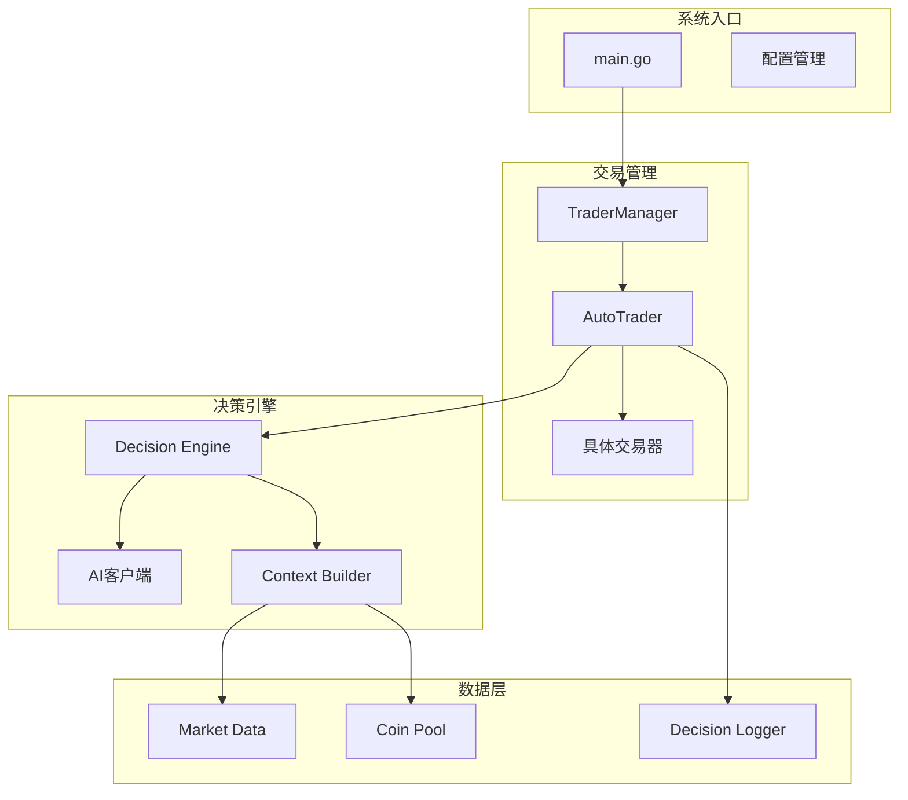

**图表来源**
- [main.go](file://main.go#L1-L140)
- [manager/trader_manager.go](file://manager/trader_manager.go#L1-L173)
- [trader/auto_trader.go](file://trader/auto_trader.go#L1-L936)

## AutoTrader.Run主循环

AutoTrader.Run方法是整个自动化交易系统的核心入口，负责启动和管理交易循环。

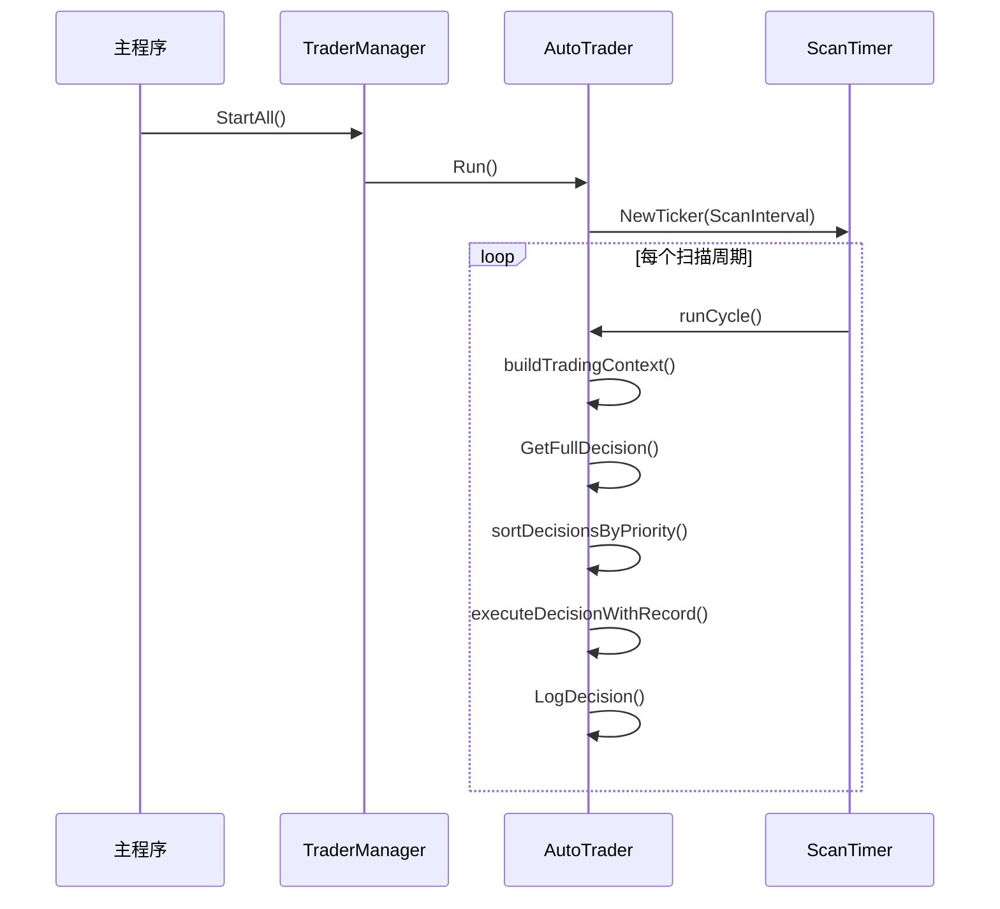

**图表来源**
- [trader/auto_trader.go](file://trader/auto_trader.go#L180-L200)
- [manager/trader_manager.go](file://manager/trader_manager.go#L90-L110)

**章节来源**
- [trader/auto_trader.go](file://trader/auto_trader.go#L180-L200)

## 基于ScanInterval的周期性决策机制

系统采用基于ScanInterval的定时器机制，确保AI能够定期进行市场分析和决策制定。

### 定时器配置

- **默认扫描间隔**：3分钟（可根据配置调整）
- **首次执行**：立即执行，无需等待第一个定时器触发
- **异常处理**：即使某个周期执行失败，也不会影响后续周期

### 扫描周期流程

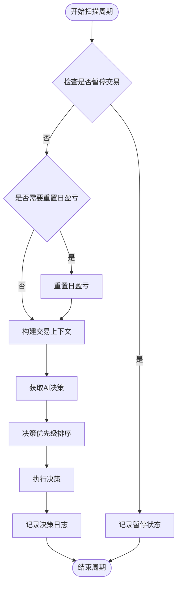

**图表来源**
- [trader/auto_trader.go](file://trader/auto_trader.go#L202-L280)

**章节来源**
- [trader/auto_trader.go](file://trader/auto_trader.go#L202-L280)

## runCycle方法详解

runCycle是AutoTrader的核心方法，负责执行单个交易周期的所有步骤。

### 方法执行流程

1. **周期计数递增**：记录当前执行的周期编号
2. **状态检查**：验证是否处于暂停交易状态
3. **日盈亏重置**：每日凌晨重置累计盈亏
4. **构建上下文**：收集账户、持仓、候选币种等信息
5. **AI决策**：调用AI获取交易决策
6. **决策排序**：按优先级重新排序决策
7. **执行决策**：逐个执行排序后的决策
8. **日志记录**：保存完整的决策执行记录

### 关键代码路径

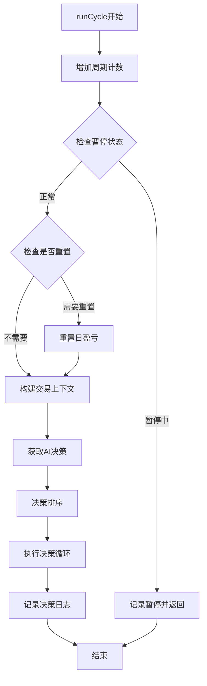

**图表来源**
- [trader/auto_trader.go](file://trader/auto_trader.go#L202-L280)

**章节来源**
- [trader/auto_trader.go](file://trader/auto_trader.go#L202-L280)

## buildTradingContext构建交易上下文

buildTradingContext方法负责收集和整理所有必要的交易信息，为AI决策提供完整的上下文环境。

### 上下文信息组成

| 组件 | 描述 | 数据来源 |
|------|------|----------|
| 账户信息 | 总资产、可用余额、盈亏等 | 交易器API |
| 持仓信息 | 当前持仓详情、盈亏、杠杆等 | 交易器API |
| 候选币种池 | AI500+OI Top合并的候选币种 | 币种池API |
| 市场数据 | 实时价格、技术指标、持仓量等 | 市场数据API |
| 历史表现 | 最近100个周期的交易表现 | 决策日志分析 |

### 上下文构建流程

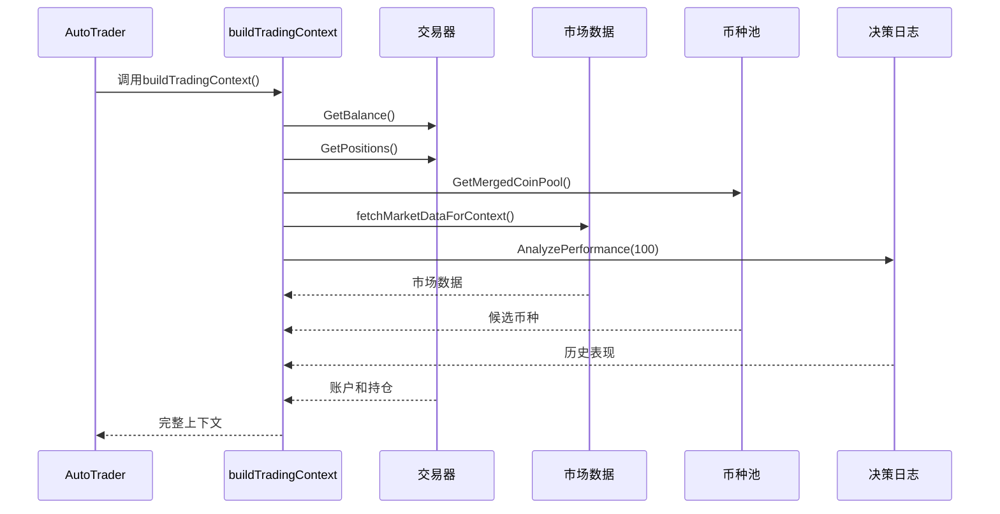

**图表来源**
- [trader/auto_trader.go](file://trader/auto_trader.go#L400-L550)

### 详细信息收集

#### 1. 账户信息收集
- **总资产计算**：钱包余额 + 未实现盈亏
- **可用余额**：可交易的现金余额
- **保证金使用率**：总保证金占总资产的比例

#### 2. 持仓信息处理
- **持仓详情**：币种、方向、数量、入场价等
- **盈亏计算**：实时盈亏和盈亏百分比
- **杠杆应用**：不同币种使用不同的杠杆倍数

#### 3. 候选币种池构建
- **AI500评分**：基于算法评分的币种池
- **OI Top持仓量增长**：持仓量增长最快的币种
- **去重合并**：合并两个币种池并去除重复项

**章节来源**
- [trader/auto_trader.go](file://trader/auto_trader.go#L400-L550)

## AI决策引擎

AI决策引擎是系统的核心，负责分析交易上下文并生成具体的交易决策。

### 决策流程架构

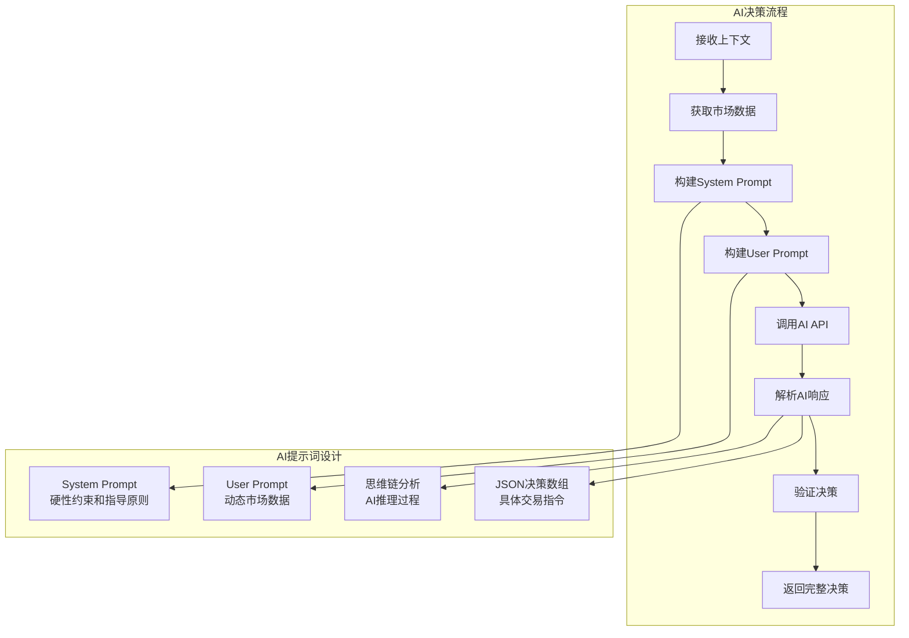

**图表来源**
- [decision/engine.go](file://decision/engine.go#L100-L150)

### System Prompt设计

System Prompt定义了AI的行为准则和硬性约束：

#### 核心目标
- **最大化夏普比率**：高质量交易，稳定收益
- **风险控制**：严格的风险回报比要求（≥1:3）
- **交易频率**：避免过度交易，保持最佳节奏

#### 硬性约束
- **仓位限制**：最多3个币种持仓
- **杠杆限制**：山寨币≤1.5倍账户净值，BTC/ETH≤10倍账户净值
- **保证金限制**：总使用率≤90%
- **风险回报比**：必须≥1:3

#### 决策指导原则
- **开仓标准**：综合价格、量能、技术指标的强信号
- **持仓管理**：耐心持有，避免频繁进出
- **做空激励**：做空是重要的盈利工具

### User Prompt构建

User Prompt包含实时的市场数据和账户信息：

#### 市场数据展示
- **BTC市场状态**：价格、涨跌幅、技术指标
- **账户状况**：净值、余额、盈亏、保证金使用率
- **当前持仓**：详细持仓信息和市场数据
- **候选币种**：完整的市场数据和技术分析

#### 数据格式化
AI接收的数据经过精心格式化，便于AI理解和分析：

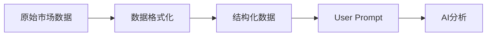

**图表来源**
- [decision/engine.go](file://decision/engine.go#L300-L400)

**章节来源**
- [decision/engine.go](file://decision/engine.go#L100-L400)

## 决策优先级排序

为了防止仓位叠加超限和优化交易效率，系统实现了智能的决策优先级排序机制。

### 排序规则

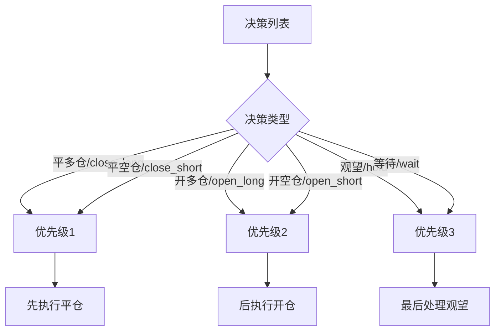

**图表来源**
- [trader/auto_trader.go](file://trader/auto_trader.go#L900-L934)

### 排序实现逻辑

排序算法确保：
1. **先平后开**：优先执行平仓决策，释放保证金
2. **仓位安全**：避免同时开仓导致仓位叠加超限
3. **执行效率**：优化决策执行顺序

### 仓位叠加防护

系统在执行开仓决策前会检查：
- **同币种同方向检查**：防止同一币种同时有多空持仓
- **保证金充足性**：确保有足够的可用保证金
- **仓位数量限制**：不超过最大持仓数量

**章节来源**
- [trader/auto_trader.go](file://trader/auto_trader.go#L900-L934)

## 执行决策流程

executeDecisionWithRecord方法负责执行AI生成的具体交易决策，并记录详细的执行过程。

### 决策类型处理

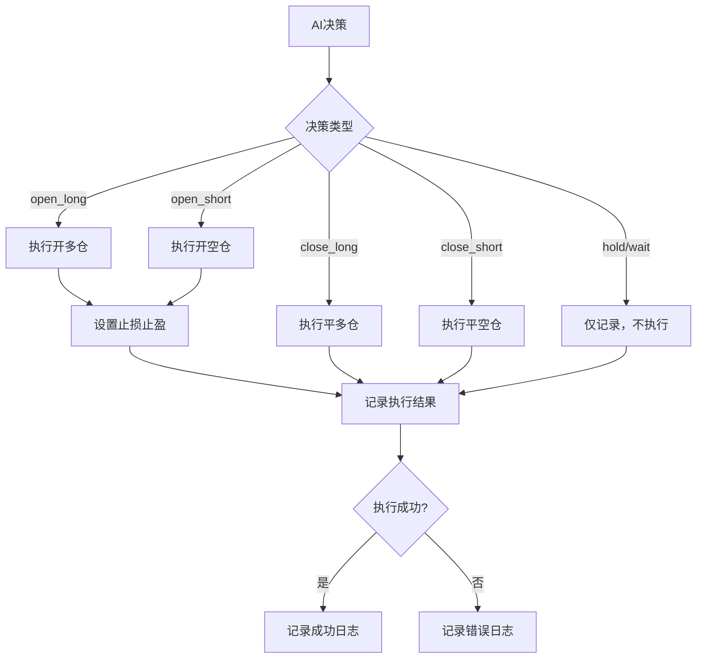

**图表来源**
- [trader/auto_trader.go](file://trader/auto_trader.go#L600-L650)

### 四种操作的具体处理

#### 1. 开多仓 (open_long)
- **仓位检查**：确认无同币种多仓
- **价格计算**：基于当前市场价格计算开仓数量
- **止损止盈**：设置合理的止损和止盈价格
- **仓位跟踪**：记录开仓时间和位置信息

#### 2. 开空仓 (open_short)
- **仓位检查**：确认无同币种空仓
- **数量计算**：基于仓位大小和当前价格
- **风险控制**：设置止损和止盈保护
- **执行记录**：详细记录执行过程

#### 3. 平多仓 (close_long)
- **全仓平仓**：目前支持全仓平仓，未来可扩展部分平仓
- **即时执行**：立即执行平仓操作
- **盈亏计算**：实时计算平仓盈亏

#### 4. 平空仓 (close_short)
- **平仓逻辑**：与平多仓类似，但方向相反
- **盈亏确认**：确认平仓后的最终盈亏
- **仓位清理**：移除已平仓的仓位记录

### 执行验证机制

每个决策执行前都会进行多重验证：

| 验证项目 | 检查内容 | 失败处理 |
|----------|----------|----------|
| 仓位检查 | 是否存在同方向持仓 | 拒绝执行，返回错误 |
| 保证金检查 | 可用保证金是否充足 | 跳过该决策 |
| 杠杆验证 | 杠杆倍数是否合规 | 使用最大允许杠杆 |
| 价格验证 | 市场价格是否合理 | 使用最新市场价格 |

**章节来源**
- [trader/auto_trader.go](file://trader/auto_trader.go#L600-L750)

## 错误处理与日志记录

系统实现了完善的错误处理和日志记录机制，确保交易过程的可追溯性和系统的稳定性。

### 错误分类与处理

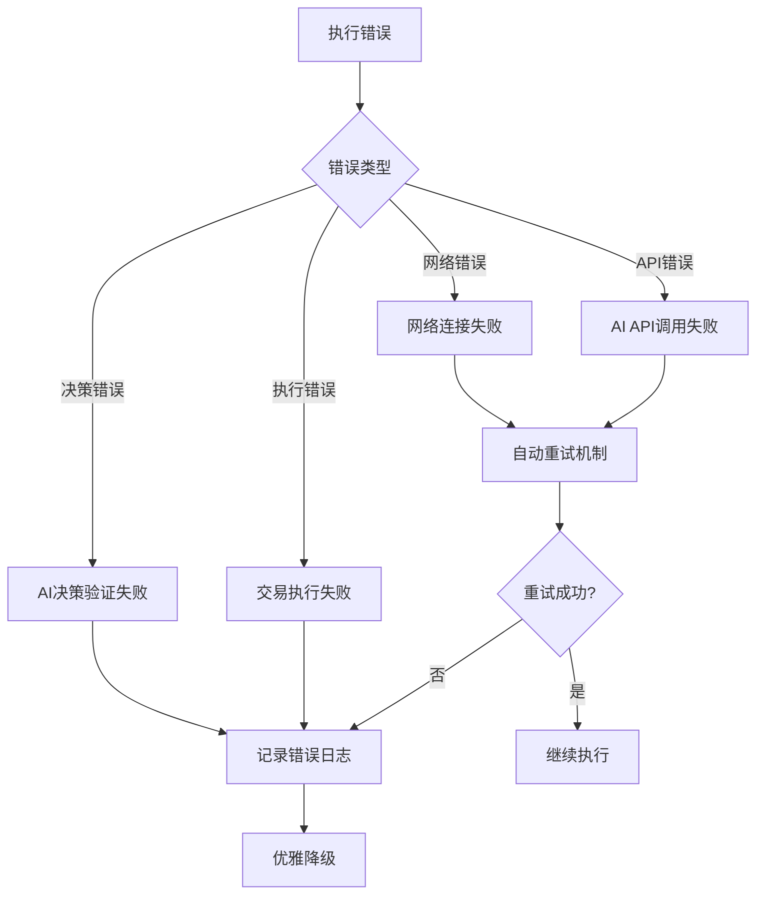

**图表来源**
- [mcp/client.go](file://mcp/client.go#L80-L120)

### 日志记录体系

#### 决策日志结构

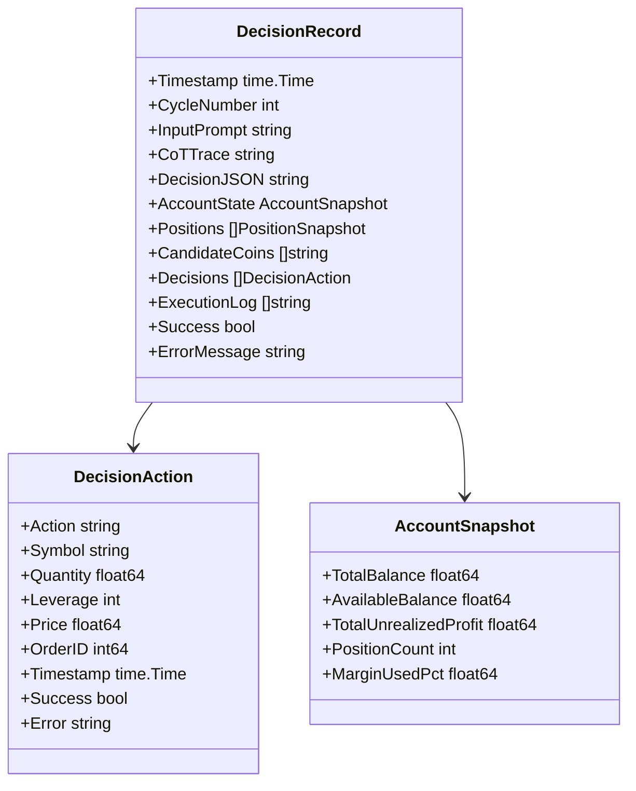

**图表来源**
- [logger/decision_logger.go](file://logger/decision_logger.go#L10-L50)

#### 日志记录层次

1. **决策级别日志**：记录完整的决策周期
2. **操作级别日志**：记录每个具体操作的执行情况
3. **错误级别日志**：记录错误详情和恢复措施
4. **性能级别日志**：记录系统性能指标

### 错误恢复策略

#### AI API错误处理
- **重试机制**：最多3次重试，指数退避
- **超时处理**：120秒超时，避免长时间阻塞
- **备用方案**：API失败时使用缓存数据

#### 交易执行错误
- **仓位检查**：防止仓位叠加超限
- **保证金验证**：确保有足够的可用资金
- **订单确认**：验证订单执行状态

#### 数据获取错误
- **市场数据**：使用缓存数据作为后备
- **币种池数据**：使用默认币种池
- **历史数据**：跳过缺失的数据点

**章节来源**
- [logger/decision_logger.go](file://logger/decision_logger.go#L50-L120)
- [mcp/client.go](file://mcp/client.go#L80-L150)

## 性能监控与分析

系统提供了全面的性能监控和分析功能，帮助用户了解交易效果和系统表现。

### 夏普比率计算

夏普比率是系统的核心绩效指标，用于评估交易策略的质量。

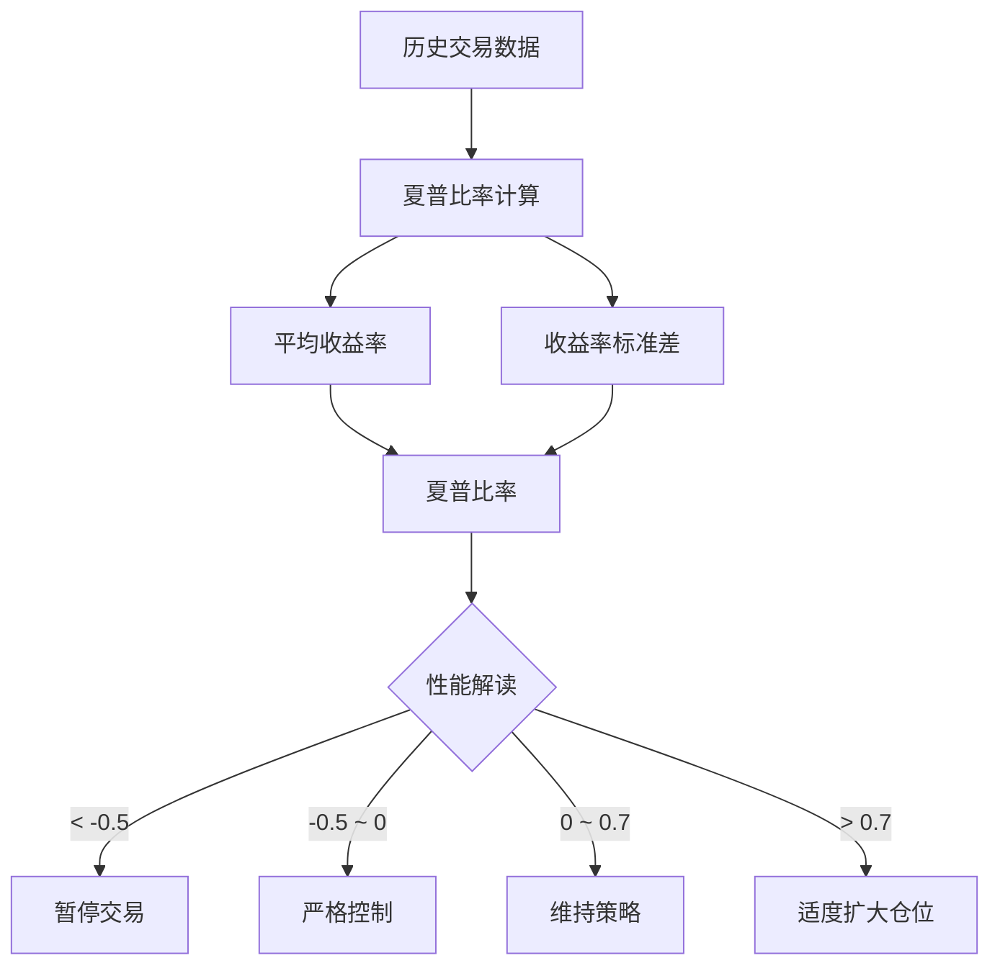

**图表来源**
- [logger/decision_logger.go](file://logger/decision_logger.go#L550-L611)

### 性能指标分析

#### 核心指标
- **总交易次数**：已完成的交易笔数
- **胜率**：盈利交易占比
- **平均盈亏**：每笔交易的平均收益
- **盈亏比**：总盈利/总亏损
- **最大回撤**：账户净值的最大跌幅

#### 币种表现分析
- **单币种胜率**：每个币种的交易胜率
- **平均盈亏**：每个币种的平均收益
- **最佳币种**：表现最好的币种
- **最差币种**：表现最差的币种

#### 风险指标
- **波动率**：收益率的标准差
- **最大回撤**：账户净值的最大跌幅
- **下行风险**：负收益的标准差

### 实时监控界面

系统提供了Web界面，实时展示以下信息：

| 监控项目 | 显示内容 | 更新频率 |
|----------|----------|----------|
| 账户状态 | 净值、余额、盈亏 | 实时 |
| 持仓信息 | 当前持仓、盈亏 | 实时 |
| 最新决策 | AI决策和理由 | 每周期 |
| 历史表现 | 夏普比率、胜率 | 实时 |
| 系统状态 | 运行时间、周期数 | 实时 |

**章节来源**
- [logger/decision_logger.go](file://logger/decision_logger.go#L400-L550)

## 总结

nofx项目的自动化交易执行流程体现了现代量化交易系统的设计精髓：

1. **模块化架构**：清晰的职责分离，便于维护和扩展
2. **AI驱动决策**：充分利用人工智能的分析能力
3. **风险管理**：多层次的风险控制机制
4. **完整日志**：全面的执行记录和审计追踪
5. **性能监控**：实时的性能分析和优化指导

这个系统为用户提供了一个强大而可靠的自动化交易解决方案，既保证了交易的安全性，又充分发挥了AI在市场分析方面的优势。通过持续的优化和改进，系统能够适应不断变化的市场环境，为用户提供稳定的交易收益。