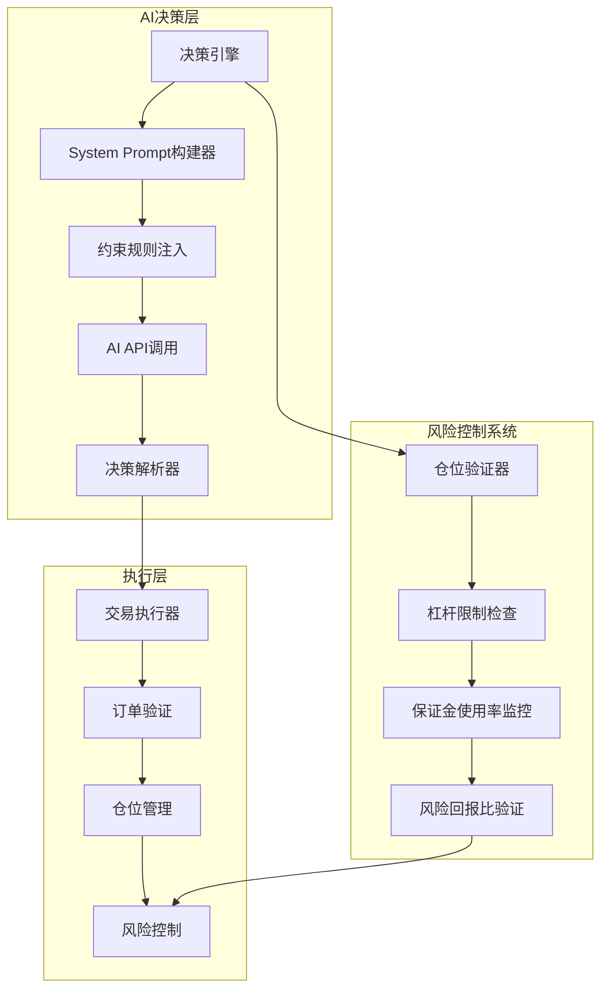
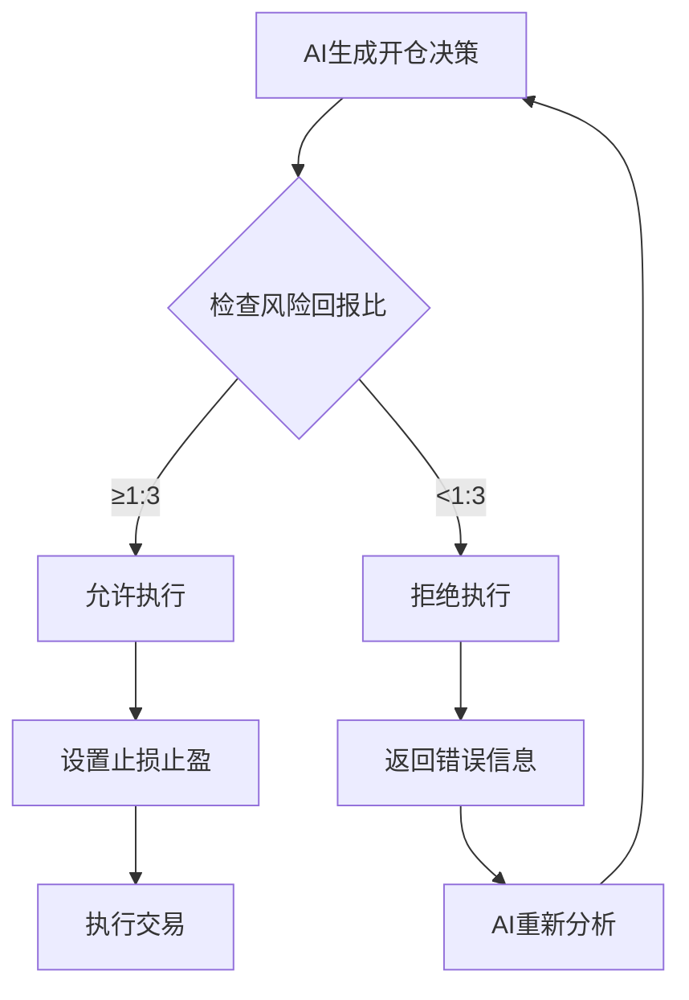
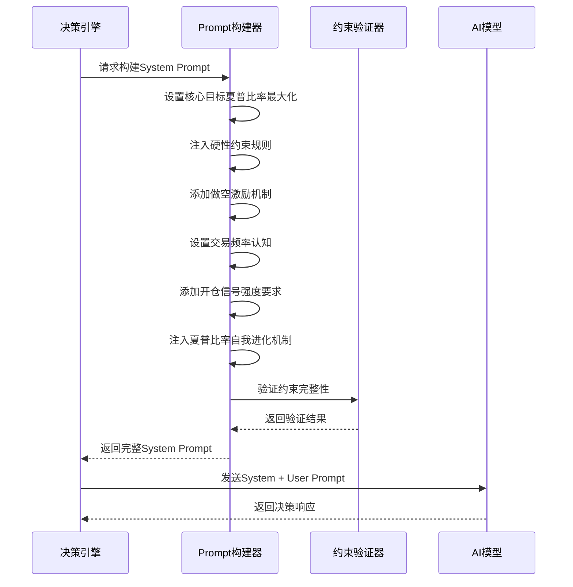
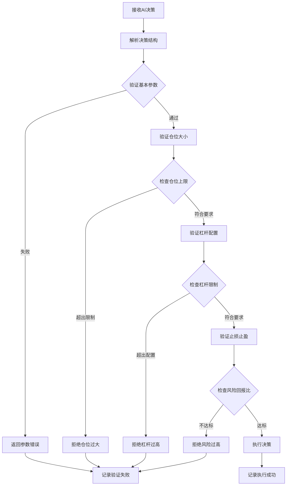
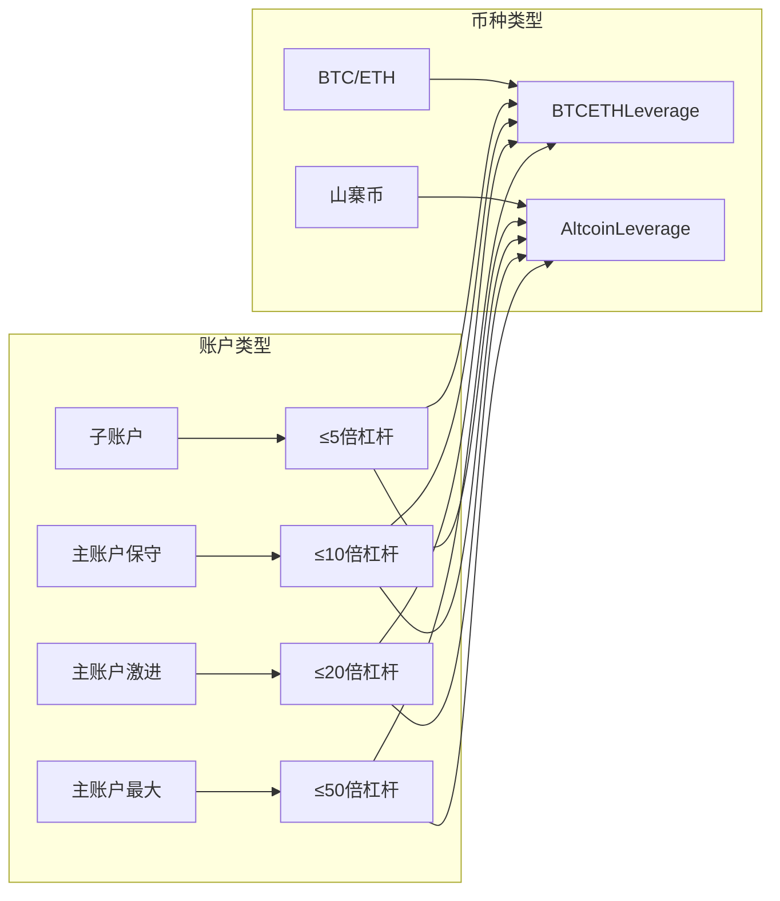
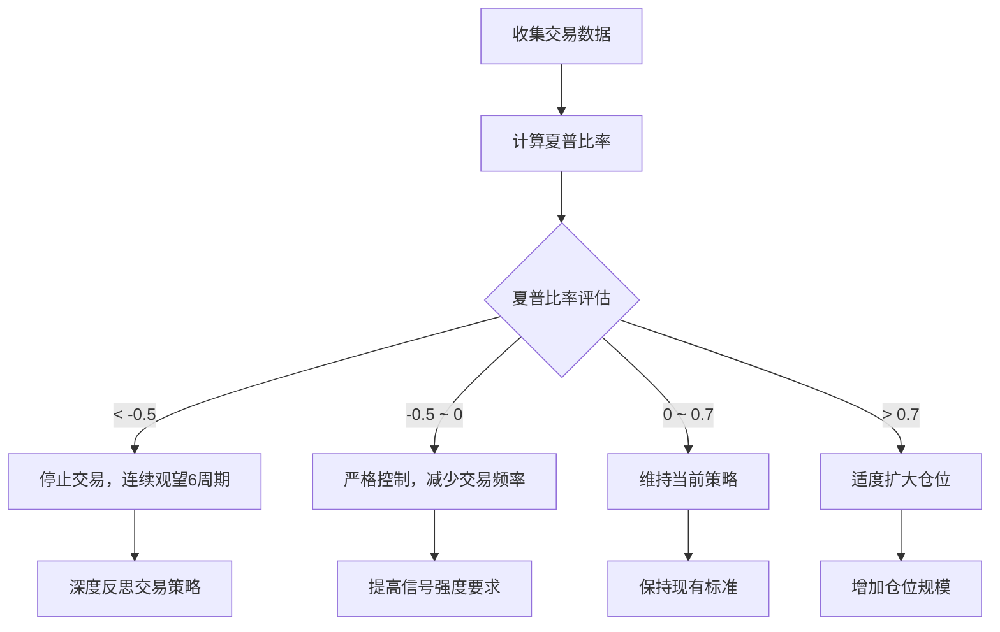

# AI决策硬约束

<cite>
**本文档引用的文件**
- [decision/engine.go](file://decision/engine.go)
- [config/config.go](file://config/config.go)
- [trader/auto_trader.go](file://trader/auto_trader.go)
- [README.md](file://README.md)
- [README.zh-CN.md](file://README.zh-CN.md)
</cite>

## 目录
1. [概述](#概述)
2. [系统架构](#系统架构)
3. [四大核心约束规则](#四大核心约束规则)
4. [System Prompt构建机制](#system-prompt构建机制)
5. [约束验证与执行](#约束验证与执行)
6. [风险控制机制](#风险控制机制)
7. [性能监控与反馈](#性能监控与反馈)
8. [故障排除指南](#故障排除指南)
9. [总结](#总结)

## 概述

nofx项目的AI决策层采用严格的硬性约束规则体系，确保所有交易决策在安全边界内进行。系统通过buildSystemPrompt函数向AI模型注入四大核心约束：风险回报比≥1:3、最多持仓3个币种、单币仓位上限（基于账户净值和杠杆配置）以及保证金使用率≤90%。这些约束作为System Prompt的一部分，强制指导AI行为，防止过度风险暴露。

## 系统架构

**图表来源**
- [decision/engine.go](file://decision/engine.go#L98-L139)
- [trader/auto_trader.go](file://trader/auto_trader.go#L325-L355)

## 四大核心约束规则

### 1. 风险回报比≥1:3

这是系统最重要的硬性约束，要求每次交易的风险回报比必须达到或超过1:3。

**图表来源**
- [decision/engine.go](file://decision/engine.go#L588-L622)

**约束特点：**
- 必须≥1:3的风险回报比
- AI必须明确设置止损和止盈水平
- 系统自动验证风险回报比计算
- 不符合要求的决策会被拒绝

### 2. 最多持仓3个币种

系统限制同时持有的币种数量不超过3个，强调质量而非数量的投资理念。

**实施机制：**
- AI决策解析时检查持仓数量
- 优先平仓较弱的持仓以腾出空间
- 支持持仓轮换和优化
- 防止过度分散投资

### 3. 单币仓位上限

根据币种类型设置不同的仓位价值上限：

| 币种类型 | 仓位价值上限 | 杠杆配置 | 保证金占用 |
|---------|-------------|----------|-----------|
| 山寨币 | 1.5倍账户净值 | altcoinLeverage | 7.5% |
| BTC/ETH | 10倍账户净值 | btcEthLeverage | 20% |

**计算公式：**
- 山寨币仓位上限 = 账户净值 × 1.5
- BTC/ETH仓位上限 = 账户净值 × 10

### 4. 保证金使用率≤90%

系统对总保证金使用率设置上限，AI可根据市场机会自主决策具体使用率。

**监控指标：**
- 实时计算保证金使用率
- 动态调整仓位规模
- 预留缓冲空间应对市场波动
- 避免接近强制平仓线

**章节来源**
- [decision/engine.go](file://decision/engine.go#L219-L235)
- [config/config.go](file://config/config.go#L40-L45)

## System Prompt构建机制

buildSystemPrompt函数负责构建包含所有硬性约束的System Prompt，确保AI在每次决策时都受到严格约束。

**图表来源**
- [decision/engine.go](file://decision/engine.go#L236-L339)

**核心组件：**

1. **核心使命声明**：明确AI的目标是最大化夏普比率
2. **硬性约束注入**：直接在System Prompt中嵌入四大约束
3. **做空激励机制**：鼓励AI平衡做多和做空策略
4. **交易频率认知**：设定合理的交易频率标准
5. **开仓信号强度**：要求高确定性的交易信号
6. **夏普比率自我进化**：根据绩效反馈调整策略

**章节来源**
- [decision/engine.go](file://decision/engine.go#L236-L339)

## 约束验证与执行

系统在多个层面实施约束验证，确保所有决策都符合硬性约束要求。

### 决策验证流程

**图表来源**
- [decision/engine.go](file://decision/engine.go#L540-L622)

### 仓位管理机制

系统实现了严格的仓位管理机制，防止仓位叠加和过度集中：

**关键特性：**
- 同币种同方向持仓检查
- 仓位数量动态调整
- 持仓时间跟踪
- 自动平仓机制

**章节来源**
- [decision/engine.go](file://decision/engine.go#L540-L622)
- [trader/auto_trader.go](file://trader/auto_trader.go#L564-L604)

## 风险控制机制

### 杠杆配置管理

系统支持灵活的杠杆配置，根据账户类型和风险偏好进行调整：

**图表来源**
- [config/config.go](file://config/config.go#L150-L170)

### 保证金使用监控

系统实时监控保证金使用情况，确保不超过90%的上限：

**监控指标：**
- 总保证金使用率
- 单币种保证金占用
- 预留缓冲空间
- 强制平仓预警

### 仓位分散控制

通过限制持仓币种数量和单币仓位上限，实现有效的风险分散：

**分散策略：**
- 高杠杆+小仓位组合
- 多币种持仓轮换
- 动态仓位调整
- 风险集中度监控

**章节来源**
- [config/config.go](file://config/config.go#L150-L170)
- [README.zh-CN.md](file://README.zh-CN.md#L1095-L1151)

## 性能监控与反馈

系统建立了完善的性能监控和反馈机制，通过夏普比率评估AI决策的质量，并根据绩效反馈调整策略。

### 夏普比率评估

**图表来源**
- [decision/engine.go](file://decision/engine.go#L265-L283)

### 绩效反馈循环

系统通过以下机制实现持续改进：

1. **历史数据分析**：分析最近20个周期的表现
2. **Win Rate计算**：统计交易成功率
3. **Profit Factor评估**：评估盈亏比
4. **Sharpe Ratio计算**：风险调整后收益
5. **策略迭代优化**：根据绩效调整约束参数

**章节来源**
- [decision/engine.go](file://decision/engine.go#L265-L283)

## 故障排除指南

### 常见约束违规问题

**问题1：风险回报比不足**
- **症状**：AI决策被拒绝，提示风险回报比过低
- **解决方案**：调整止损止盈设置，提高信号强度要求
- **预防措施**：加强技术分析训练，提高信号质量

**问题2：仓位超限**
- **症状**：提示仓位价值超过单币种上限
- **解决方案**：减少仓位规模或平仓部分持仓
- **预防措施**：合理分配资金，避免过度集中

**问题3：杠杆过高**
- **症状**：提示杠杆超过配置上限
- **解决方案**：降低杠杆倍数或减少仓位规模
- **预防措施**：根据账户类型设置合适的杠杆配置

### 系统诊断工具

**监控指标：**
- 账户净值变化
- 保证金使用率
- 持仓数量分布
- 夏普比率趋势

**调试方法：**
- 检查System Prompt内容
- 验证约束参数配置
- 分析决策执行日志
- 监控实时市场数据

## 总结

nofx项目的AI决策硬约束体系通过System Prompt注入四大核心规则，实现了全面而严格的风险控制。这一体系不仅确保了交易的安全性，还通过夏普比率自我进化机制实现了策略的持续优化。

**核心优势：**
1. **严格的风险控制**：四大硬性约束确保交易在安全边界内进行
2. **灵活的参数配置**：支持不同账户类型和风险偏好的定制
3. **智能的自我进化**：通过夏普比率反馈不断优化策略
4. **完善的监控体系**：实时跟踪和调整风险指标

**应用价值：**
- 有效防范过度风险暴露
- 提高交易质量和稳定性
- 实现长期可持续的收益
- 为AI交易提供可靠的安全保障

这套约束体系体现了现代量化交易中"安全第一"的核心理念，通过技术手段将人类交易者难以持续保持的纪律性转化为系统化的决策框架，为AI驱动的自动化交易提供了坚实的基础。