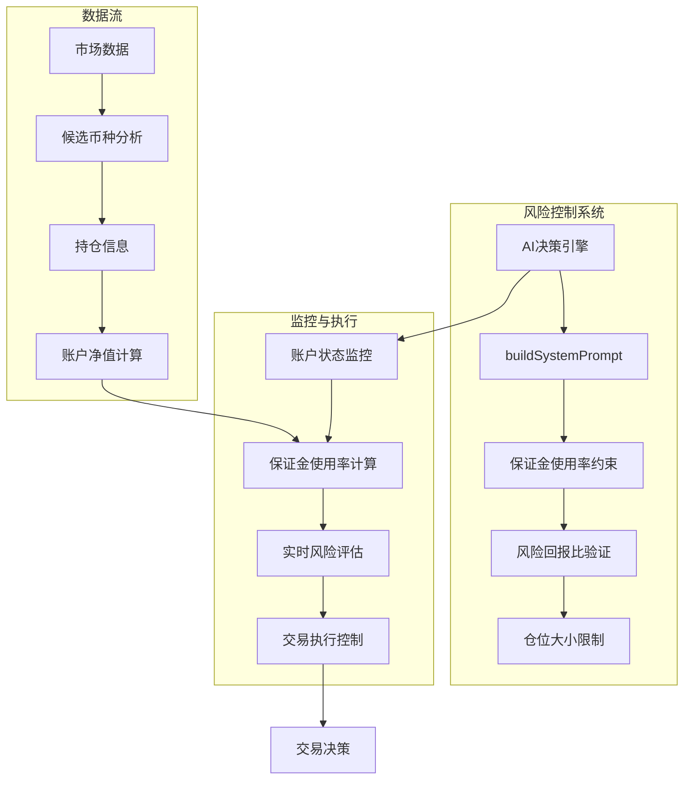
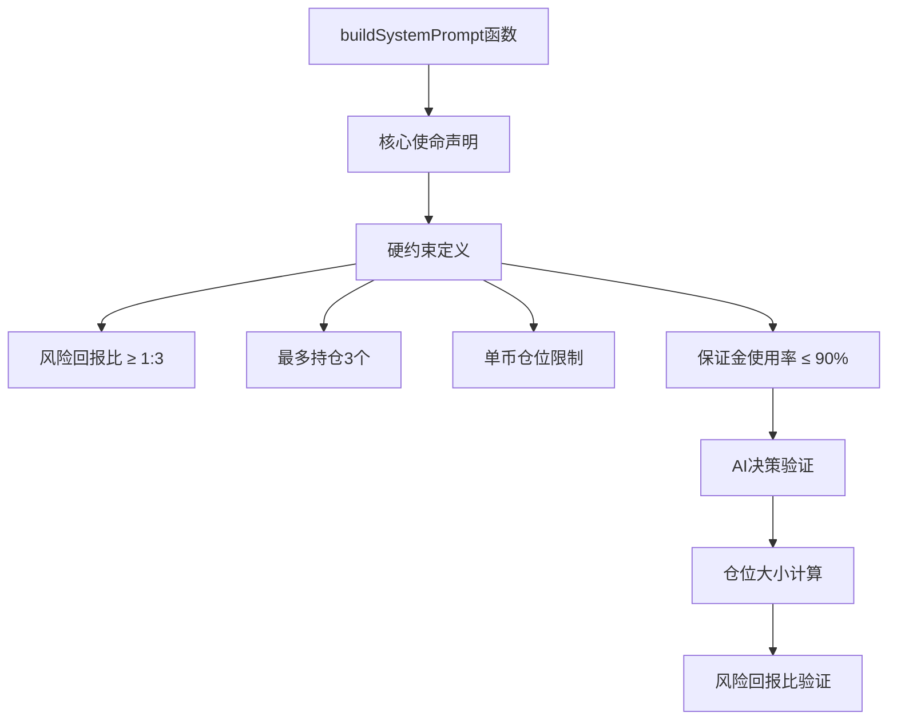
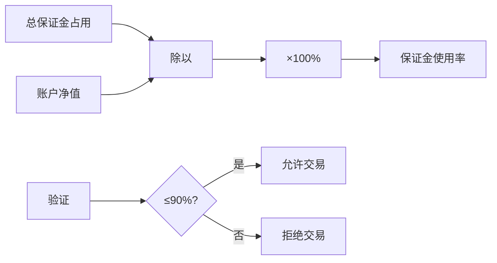
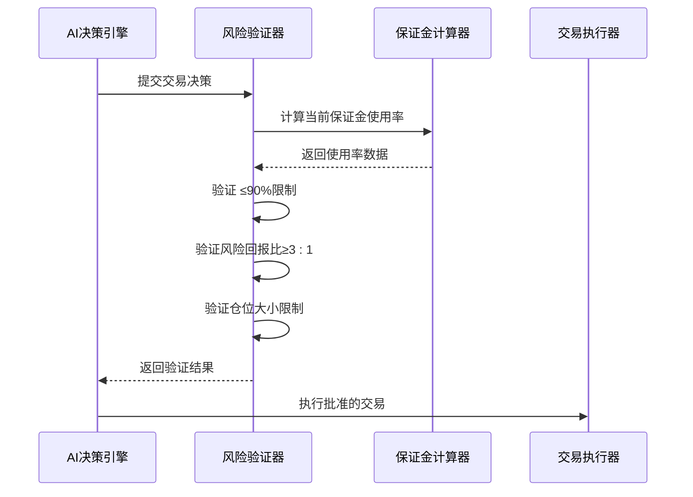
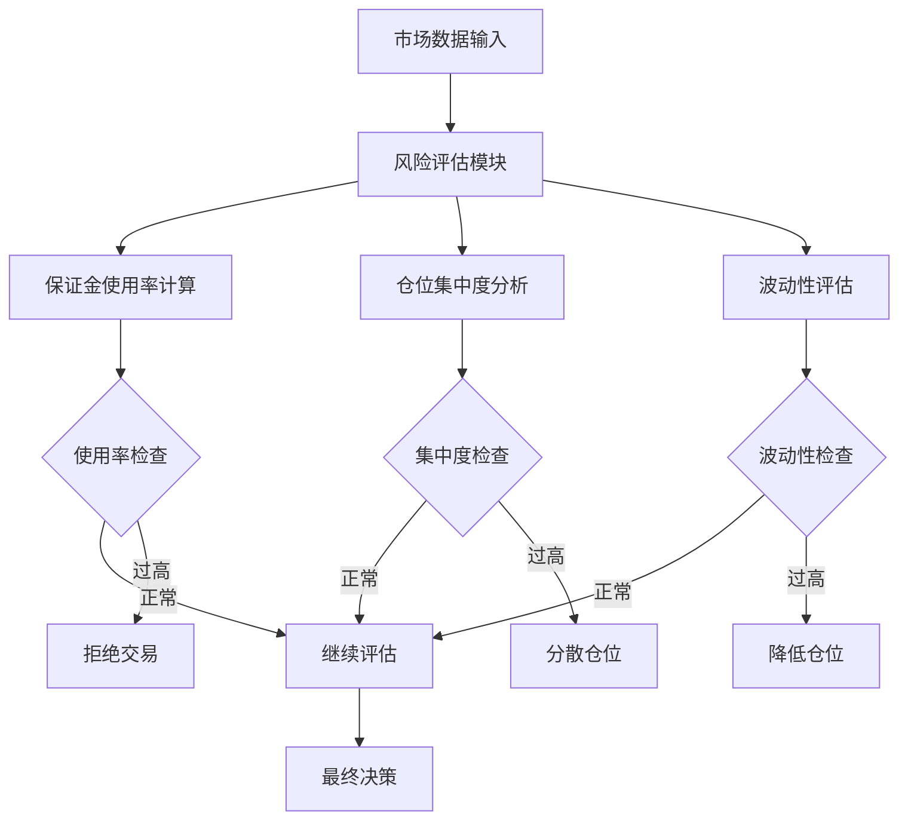
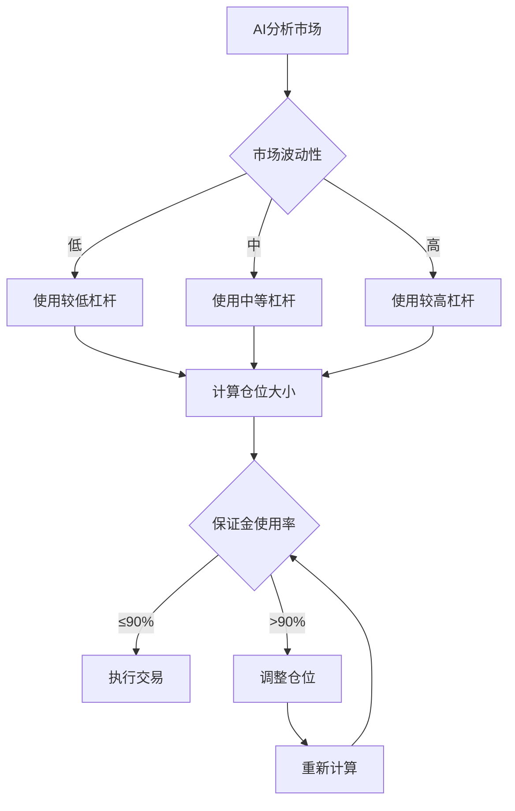
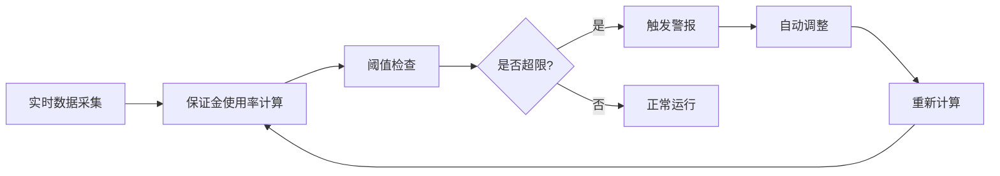
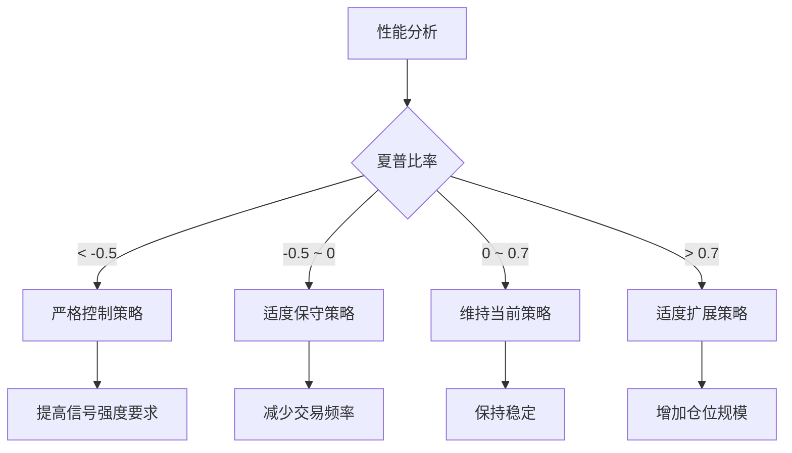
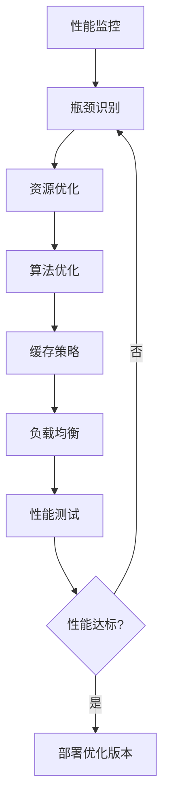

# 保证金使用率≤90%：nofx系统风险控制核心机制

<cite>
**本文档引用的文件**
- [decision/engine.go](file://decision/engine.go)
- [trader/auto_trader.go](file://trader/auto_trader.go)
- [config/config.go](file://config/config.go)
- [logger/decision_logger.go](file://logger/decision_logger.go)
- [README.zh-CN.md](file://README.zh-CN.md)
- [api/server.go](file://api/server.go)
</cite>

## 目录
1. [引言](#引言)
2. [系统架构概览](#系统架构概览)
3. [保证金使用率硬性上限定义](#保证金使用率硬性上限定义)
4. [风险控制机制详解](#风险控制机制详解)
5. [实际交易场景分析](#实际交易场景分析)
6. [监控指标与调优建议](#监控指标与调优建议)
7. [故障排除指南](#故障排除指南)
8. [总结](#总结)

## 引言

在nofx系统中，保证金使用率硬性上限（≤90%）是风险控制体系的核心防线，旨在防止爆仓风险并确保交易系统的生存能力。这一机制通过严格的AI决策框架和实时监控，为加密货币合约交易提供了坚实的风险保障。

## 系统架构概览

**图表来源**
- [decision/engine.go](file://decision/engine.go#L202-L315)
- [trader/auto_trader.go](file://trader/auto_trader.go#L788-L832)

## 保证金使用率硬性上限定义

### 核心约束规则

在nofx系统的AI决策框架中，保证金使用率硬性上限被明确定义为**总使用率 ≤ 90%**，这一规则体现在以下关键组件中：

#### 1. System Prompt中的硬约束定义

**图表来源**
- [decision/engine.go](file://decision/engine.go#L220-L226)

#### 2. 保证金使用率计算机制

系统通过精确的数学公式计算保证金使用率：

**图表来源**
- [trader/auto_trader.go](file://trader/auto_trader.go#L820-L830)

**章节来源**
- [decision/engine.go](file://decision/engine.go#L220-L226)
- [trader/auto_trader.go](file://trader/auto_trader.go#L820-L830)

### 保留10%缓冲资金的重要性

#### 1. 极端行情应对

- **市场剧烈波动**：在极端行情下，价格可能在短时间内大幅波动，预留10%缓冲可避免因价格闪崩导致的爆仓
- **流动性风险**：在市场深度不足时，可能出现滑点风险，缓冲资金提供额外的安全边际
- **强平风险缓解**：当市场价格触及强平线附近时，缓冲资金可提供足够的调整空间

#### 2. 风险缓冲机制

| 场景 | 保证金使用率 | 缓冲空间 | 风险等级 |
|------|-------------|----------|----------|
| 正常交易 | 80-90% | 10-0% | 低风险 |
| 市场波动 | 85-95% | 5-0% | 中等风险 |
| 极端行情 | 90-100% | 0% | 高风险 |

#### 3. 系统弹性设计

- **动态调整能力**：AI可根据市场状况动态调整仓位规模，在保证安全的前提下最大化收益
- **风险分散效应**：通过限制单币种仓位和总保证金使用率，实现风险的合理分散
- **自我保护机制**：当保证金使用率接近上限时，系统会自动减少仓位或暂停交易

**章节来源**
- [decision/engine.go](file://decision/engine.go#L220-L226)
- [README.zh-CN.md](file://README.zh-CN.md#L1150-L1151)

## 风险控制机制详解

### AI决策框架中的风险控制

#### 1. 多层次风险验证

**图表来源**
- [decision/engine.go](file://decision/engine.go#L588-L622)

#### 2. 实时监控与预警

系统通过多个维度监控保证金使用情况：

| 监控指标 | 阈值设定 | 预警级别 | 处理措施 |
|----------|----------|----------|----------|
| 总保证金使用率 | ≤90% | 硬约束 | 交易拒绝 |
| 单币种仓位 | ≤1.5倍净值 | 软约束 | 仓位调整 |
| 风险回报比 | ≥3:1 | 硬约束 | 交易拒绝 |
| 持仓数量 | ≤3个 | 软约束 | 仓位清理 |

#### 3. 动态风险评估

**图表来源**
- [decision/engine.go](file://decision/engine.go#L92-L117)

**章节来源**
- [decision/engine.go](file://decision/engine.go#L588-L622)
- [decision/engine.go](file://decision/engine.go#L92-L117)

### 杠杆配置与风险控制

#### 1. 杠杆使用限制

系统根据账户类型设置不同的杠杆上限：

| 账户类型 | BTC/ETH杠杆 | 山寨币杠杆 | 保证金使用率上限 |
|----------|-------------|------------|------------------|
| 子账户 | 5x | 5x | 90% |
| 主账户（保守） | 10x | 10x | 90% |
| 主账户（激进） | 20x | 15x | 90% |
| 主账户（最大） | 50x | 20x | 90% |

#### 2. 自动杠杆调整

**图表来源**
- [config/config.go](file://config/config.go#L170-L185)

**章节来源**
- [config/config.go](file://config/config.go#L170-L185)
- [README.zh-CN.md](file://README.zh-CN.md#L687-L731)

## 实际交易场景分析

### 场景一：市场剧烈波动

#### 情景描述
- 账户净值：$10,000
- 当前保证金使用率：85%
- 市场出现剧烈波动，BTC价格在1小时内上涨15%

#### 系统反应
1. **实时监控**：系统检测到市场波动加剧
2. **风险评估**：计算当前风险回报比
3. **仓位调整**：自动减少仓位以降低风险
4. **交易保护**：保持保证金使用率在90%以下

### 场景二：多币种投资组合

#### 情景描述
- 持仓：BTC、ETH、SOL三个币种
- 每个币种仓位：账户净值的30%
- 总保证金使用率：90%

#### 系统行为
1. **仓位验证**：确认每个币种仓位不超过限制
2. **风险分散**：确保投资组合的分散性
3. **动态调整**：根据市场表现调整各币种权重

### 场景三：极端行情应对

#### 情景描述
- 市场出现极端下跌
- 多个仓位面临强平风险
- 保证金使用率达到90%

#### 系统保护机制
1. **紧急平仓**：自动平仓以降低保证金使用率
2. **仓位清理**：移除高风险仓位
3. **暂停交易**：暂时停止新仓位开立

**章节来源**
- [README.zh-CN.md](file://README.zh-CN.md#L1095-L1151)

## 监控指标与调优建议

### 核心监控指标

#### 1. 保证金使用率监控

**图表来源**
- [api/server.go](file://api/server.go#L322)

#### 2. 关键性能指标

| 指标名称 | 计算公式 | 目标值 | 监控频率 |
|----------|----------|--------|----------|
| 总保证金使用率 | (总保证金/账户净值)×100% | ≤90% | 实时 |
| 单币种仓位占比 | (单币种保证金/账户净值)×100% | ≤30% | 实时 |
| 风险回报比 | (平均收益/收益波动率) | ≥3:1 | 每周期 |
| 持仓数量 | 当前持仓总数 | ≤3个 | 实时 |

#### 3. 监控仪表板配置

系统提供实时监控界面，显示以下关键信息：

- **账户状态**：净值、可用余额、盈亏百分比
- **保证金使用**：当前使用率、历史趋势
- **持仓详情**：各币种仓位、盈亏情况
- **交易统计**：夏普比率、交易频率

### 调优建议

#### 1. 参数优化策略

#### 2. 风险偏好调整

| 风险偏好 | 保证金使用率 | 杠杆配置 | 适用场景 |
|----------|--------------|----------|----------|
| 保守型 | 60-70% | 5-10x | 长期稳定投资 |
| 平衡型 | 70-80% | 10-15x | 中期稳健投资 |
| 积极型 | 80-90% | 15-20x | 短期高波动市场 |

#### 3. 系统配置建议

- **初始配置**：使用保守型设置，逐步适应系统行为
- **监控频率**：至少每3分钟检查一次保证金使用率
- **备份策略**：定期备份交易日志和配置文件
- **应急计划**：制定手动干预的操作流程

**章节来源**
- [api/server.go](file://api/server.go#L322)
- [logger/decision_logger.go](file://logger/decision_logger.go#L34-L45)

## 故障排除指南

### 常见问题与解决方案

#### 1. 保证金使用率超限

**问题现象**：系统拒绝交易，提示保证金使用率超过90%

**排查步骤**：
1. 检查当前持仓的保证金占用
2. 验证账户净值计算是否准确
3. 确认是否有未完成的订单影响保证金

**解决方案**：
- 自动平仓部分仓位
- 调整新交易的仓位规模
- 检查并修正账户状态数据

#### 2. 杠杆设置错误

**问题现象**：子账户交易失败，提示杠杆超过限制

**排查步骤**：
1. 检查配置文件中的杠杆设置
2. 验证交易所账户的杠杆权限
3. 确认AI决策中的杠杆选择

**解决方案**：
- 调整配置文件中的杠杆上限
- 使用交易所提供的杠杆设置API
- 修改AI决策逻辑以适应限制

#### 3. 实时监控异常

**问题现象**：监控数据显示不准确或延迟

**排查步骤**：
1. 检查数据采集模块的工作状态
2. 验证API接口的响应速度
3. 确认数据库连接的稳定性

**解决方案**：
- 重启数据采集服务
- 优化API调用频率
- 增加数据缓存机制

### 性能优化建议

#### 1. 系统性能调优

#### 2. 监控告警配置

- **实时告警**：保证金使用率接近90%时发送通知
- **定期报告**：每日生成风险评估报告
- **异常检测**：自动识别异常交易模式
- **趋势分析**：跟踪风险指标的变化趋势

**章节来源**
- [decision/engine.go](file://decision/engine.go#L588-L622)
- [trader/auto_trader.go](file://trader/auto_trader.go#L788-L832)

## 总结

保证金使用率≤90%是nofx系统风险控制体系的核心机制，通过严格的AI决策框架和实时监控，为加密货币合约交易提供了坚实的风险保障。这一机制不仅防止了爆仓风险，还确保了交易系统的生存能力和长期盈利能力。

### 关键要点

1. **硬性约束**：保证金使用率上限是不可逾越的硬约束
2. **缓冲设计**：预留10%缓冲空间应对极端行情
3. **动态调整**：系统能够根据市场状况自动调整仓位
4. **多重验证**：通过多层次的风险验证确保交易安全
5. **实时监控**：提供全面的监控指标和预警机制

### 最佳实践

- **谨慎配置**：根据风险承受能力合理设置杠杆和仓位
- **持续监控**：定期检查保证金使用率和风险指标
- **及时调整**：根据市场变化及时调整交易策略
- **备份策略**：建立完善的备份和恢复机制

通过遵循这些原则和建议，用户可以在享受AI交易带来的便利的同时，确保资金安全和系统稳定运行。