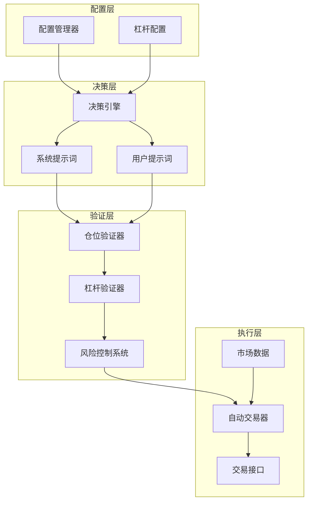
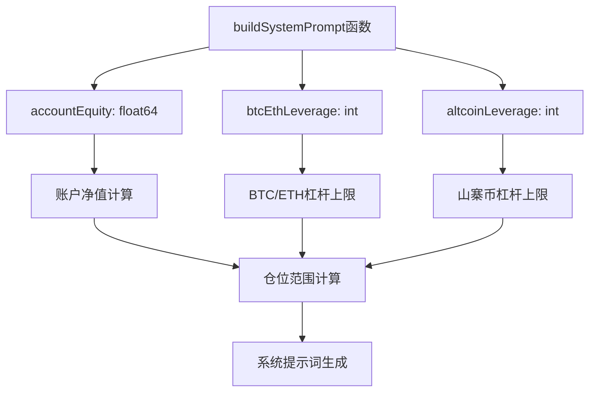
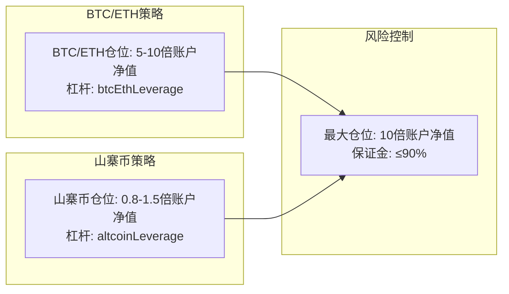
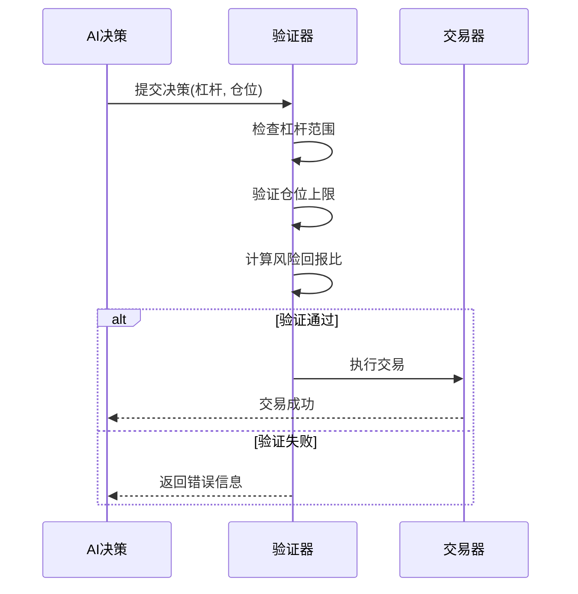
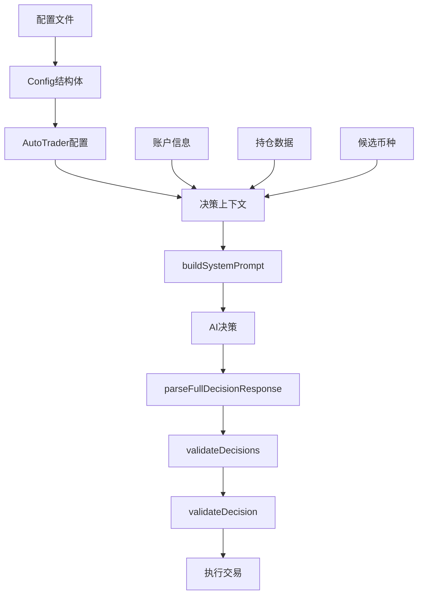
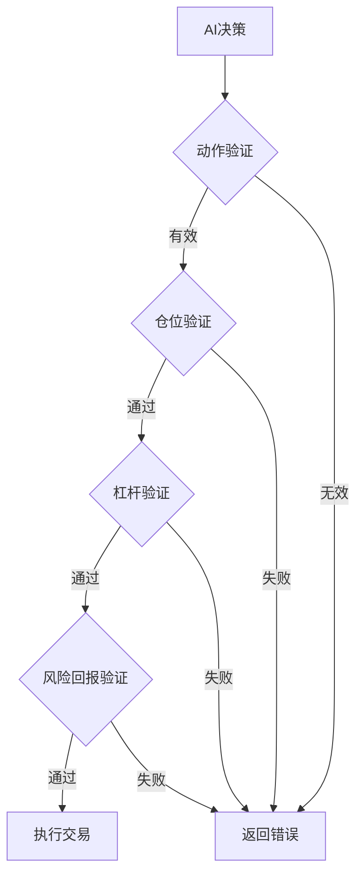

# 单币仓位上限控制机制

<cite>
**本文档引用的文件**
- [decision/engine.go](file://decision/engine.go)
- [config/config.go](file://config/config.go)
- [trader/binance_futures.go](file://trader/binance_futures.go)
- [trader/auto_trader.go](file://trader/auto_trader.go)
- [pool/coin_pool.go](file://pool/coin_pool.go)
- [market/data.go](file://market/data.go)
- [README.md](file://README.md)
- [README.zh-CN.md](file://README.zh-CN.md)
</cite>

## 目录
1. [系统概述](#系统概述)
2. [核心架构](#核心架构)
3. [buildSystemPrompt函数详解](#buildsystemprompt函数详解)
4. [仓位上限计算机制](#仓位上限计算机制)
5. [杠杆配置与风险控制](#杠杆配置与风险控制)
6. [参数传递与验证流程](#参数传递与验证流程)
7. [异常处理与配置建议](#异常处理与配置建议)
8. [最佳实践指南](#最佳实践指南)

## 系统概述

nofx系统采用基于AI驱动的自动化交易策略，通过严格的仓位上限控制机制来管理风险。该系统的核心设计理念是在最大化夏普比率的同时，通过硬约束条件防止过度集中风险，确保账户稳定性。

### 核心设计原则

- **夏普比率优化**：以夏普比率为唯一绩效指标，鼓励高质量交易而非高频交易
- **硬约束保护**：通过明确的仓位上限和杠杆限制防止过度风险暴露
- **动态适应**：根据账户净值动态调整仓位范围，适配不同规模的资金
- **分层风险控制**：BTC/ETH与山寨币采用不同的仓位上限策略

## 核心架构



**图表来源**
- [decision/engine.go](file://decision/engine.go#L92-L117)
- [config/config.go](file://config/config.go#L40-L50)
- [trader/auto_trader.go](file://trader/auto_trader.go#L100-L150)

## buildSystemPrompt函数详解

`buildSystemPrompt`函数是仓位上限控制机制的核心入口，负责构建AI决策所需的系统提示词，其中包含了动态计算的仓位范围约束。

### 函数签名与参数



**图表来源**
- [decision/engine.go](file://decision/engine.go#L202-L315)

### 动态仓位范围计算

系统根据以下公式动态计算单币种仓位范围：

#### 山寨币仓位范围
- **最小仓位**：`accountEquity * 0.8`
- **最大仓位**：`accountEquity * 1.5`
- **对应杠杆**：`altcoinLeverage`

#### BTC/ETH仓位范围  
- **最小仓位**：`accountEquity * 5`
- **最大仓位**：`accountEquity * 10`
- **对应杠杆**：`btcEthLeverage`

### 硬约束规则

系统在提示词中明确规定了以下硬约束：

1. **风险回报比**：必须 ≥ 1:3（冒1%风险，赚3%+收益）
2. **最多持仓**：3个币种（质量>数量）
3. **单币仓位**：根据币种类型采用不同的净值倍数
4. **保证金使用**：总使用率 ≤ 90%

**章节来源**
- [decision/engine.go](file://decision/engine.go#L202-L315)

## 仓位上限计算机制

### 账户净值为基础的动态计算

仓位上限的计算完全基于账户净值（TotalEquity），实现了以下优势：

#### 自适应调整特性
- **账户增长**：随着账户净值增加，仓位上限相应扩大
- **风险分散**：避免因账户规模过大导致的风险集中
- **流动性匹配**：确保仓位与账户流动性相匹配

#### 分币种差异化策略



**图表来源**
- [decision/engine.go](file://decision/engine.go#L230-L235)

### 仓位验证流程

系统在AI生成决策后，通过严格的验证流程确保仓位合规：

#### 验证步骤
1. **杠杆验证**：检查杠杆是否在配置范围内
2. **仓位大小验证**：确认仓位价值不超过上限
3. **风险回报比验证**：确保风险回报比≥3:1
4. **止损止盈合理性验证**：保证止损止盈设置合理

#### 容差机制
系统引入1%的容差机制，避免浮点数精度问题导致的误判。

**章节来源**
- [decision/engine.go](file://decision/engine.go#L529-L622)

## 杠杆配置与风险控制

### 杠杆配置体系

系统采用双杠杆配置体系，针对不同币种采用差异化的杠杆策略：

#### 配置参数表

| 币种类型 | BTC/ETH杠杆 | 山寨币杠杆 | 推荐场景 |
|---------|------------|-----------|----------|
| **子账户** | 5x | 5x | 安全保守 |
| **主账户（保守）** | 10x | 10x | 稳健投资 |
| **主账户（激进）** | 20x | 15x | 积极交易 |
| **主账户（最大）** | 50x | 20x | 高风险偏好 |

### 杠杆验证机制



**图表来源**
- [decision/engine.go](file://decision/engine.go#L558-L586)
- [trader/binance_futures.go](file://trader/binance_futures.go#L130-L177)

### 风险控制层级

#### 第一层：AI决策前控制
- 系统提示词中明确仓位上限
- AI在决策时自动考虑约束条件

#### 第二层：AI决策后验证
- 严格验证仓位大小和杠杆设置
- 确保风险回报比符合要求

#### 第三层：执行时保护
- 防止同一币种同时存在多头或空头仓位
- 实施仓位叠加防护机制

**章节来源**
- [config/config.go](file://config/config.go#L150-L180)
- [trader/auto_trader.go](file://trader/auto_trader.go#L700-L750)

## 参数传递与验证流程

### 完整的参数传递链路



**图表来源**
- [decision/engine.go](file://decision/engine.go#L92-L117)
- [trader/auto_trader.go](file://trader/auto_trader.go#L400-L500)

### 上下文构建过程

系统通过`buildTradingContext`函数构建完整的交易上下文：

#### 数据收集阶段
1. **账户信息**：获取总权益、可用余额、未实现盈亏
2. **持仓信息**：收集所有持仓的详细数据
3. **市场数据**：获取候选币种的实时市场信息
4. **性能分析**：分析历史交易表现

#### 上下文结构
```go
type Context struct {
    CurrentTime     string
    RuntimeMinutes  int
    CallCount       int
    Account         AccountInfo
    Positions       []PositionInfo
    CandidateCoins  []CandidateCoin
    MarketDataMap   map[string]*market.Data
    OITopDataMap    map[string]*OITopData
    Performance     interface{}
    BTCETHLeverage  int
    AltcoinLeverage int
}
```

### 决策验证流程

#### 多层次验证机制



**图表来源**
- [decision/engine.go](file://decision/engine.go#L529-L622)

**章节来源**
- [decision/engine.go](file://decision/engine.go#L400-L500)
- [trader/auto_trader.go](file://trader/auto_trader.go#L450-L550)

## 异常处理与配置建议

### 常见异常情况

#### 杠杆超限异常
**错误信息**：`杠杆必须在1-5之间（BTCUSDT，当前配置上限5倍）: 6`

**解决方案**：
1. 检查配置文件中的杠杆设置
2. 确认交易所账户权限
3. 调整AI决策参数

#### 仓位超限异常
**错误信息**：`BTC/ETH单币种仓位价值不能超过50000 USDT（10倍账户净值），实际: 60000`

**解决方案**：
1. 降低仓位大小
2. 增加账户净值
3. 调整杠杆配置

#### 风险回报比异常
**错误信息**：`风险回报比过低(2.50:1)，必须≥3.0:1`

**解决方案**：
1. 调整止损止盈设置
2. 提高信号强度阈值
3. 优化交易策略

### 配置调整建议

#### 安全配置（子账户）
```json
{
  "leverage": {
    "btc_eth_leverage": 5,
    "altcoin_leverage": 5
  }
}
```

#### 保守配置（主账户）
```json
{
  "leverage": {
    "btc_eth_leverage": 10,
    "altcoin_leverage": 10
  }
}
```

#### 激进配置（主账户）
```json
{
  "leverage": {
    "btc_eth_leverage": 20,
    "altcoin_leverage": 15
  }
}
```

### 监控与调试

#### 关键监控指标
- **仓位分布**：各币种仓位占比
- **杠杆使用率**：实际使用杠杆与配置上限的比例
- **风险回报比**：平均风险回报比
- **夏普比率**：交易绩效指标

#### 日志记录
系统提供详细的决策日志，包括：
- AI思维链分析
- 决策输入参数
- 执行结果记录
- 异常错误信息

**章节来源**
- [decision/engine.go](file://decision/engine.go#L558-L622)
- [README.md](file://README.md#L678-L719)

## 最佳实践指南

### 配置优化建议

#### 1. 杠杆配置策略
- **新手用户**：从保守配置开始，逐步提高风险承受能力
- **经验用户**：根据交易风格和市场情况调整杠杆比例
- **不同市场环境**：在波动较大时期降低杠杆配置

#### 2. 仓位管理原则
- **分散投资**：避免单一币种仓位过高
- **动态调整**：根据市场情况和账户表现调整仓位
- **风险对冲**：适当配置反向仓位以降低整体风险

#### 3. 监控与维护
- **定期检查**：每日检查仓位分布和风险指标
- **性能分析**：定期分析夏普比率和交易绩效
- **配置优化**：根据历史表现调整配置参数

### 故障排除指南

#### 常见问题诊断
1. **交易失败**：检查杠杆配置和账户余额
2. **仓位异常**：验证仓位上限计算和验证逻辑
3. **性能下降**：分析夏普比率变化原因

#### 性能优化
- **参数调优**：根据历史表现优化AI参数
- **策略调整**：根据市场变化调整交易策略
- **风险管理**：加强风险控制措施

### 风险管理最佳实践

#### 1. 分层风险管理
- **账户层面**：控制总仓位和杠杆使用
- **币种层面**：实施单币种仓位限制
- **交易层面**：确保每个交易的风险可控

#### 2. 动态风险调整
- **市场监控**：实时监控市场波动性
- **仓位调整**：根据市场情况动态调整仓位
- **止损设置**：严格执行止损纪律

#### 3. 绩效跟踪
- **夏普比率监控**：持续跟踪夏普比率变化
- **回撤控制**：及时识别和应对回撤风险
- **策略评估**：定期评估交易策略的有效性

通过这套完善的仓位上限控制机制，nofx系统能够在保证交易效率的同时，有效控制风险，实现长期稳定的收益增长。系统的设计充分考虑了不同用户的需求和风险承受能力，提供了灵活而安全的交易环境。