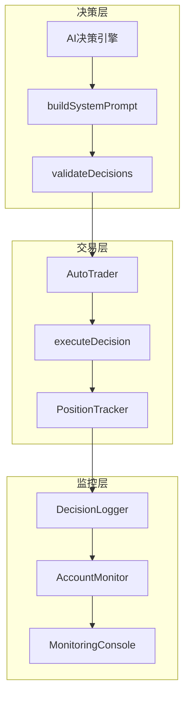
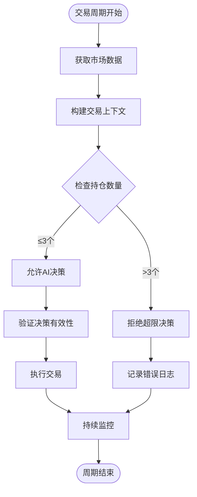
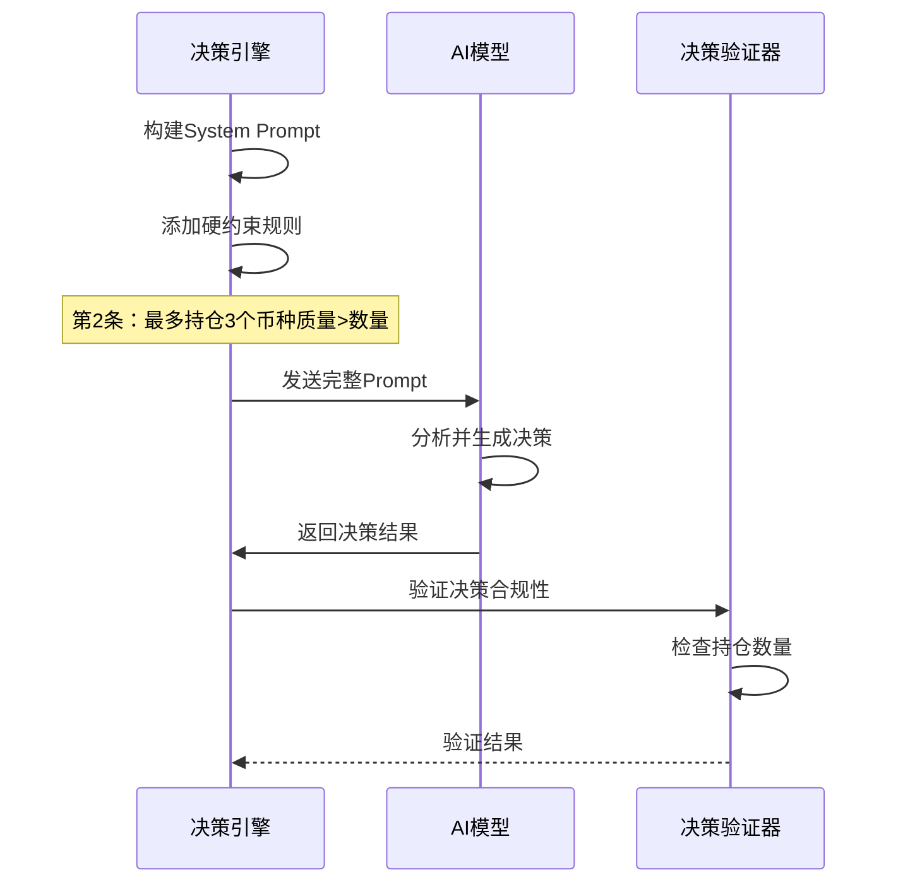
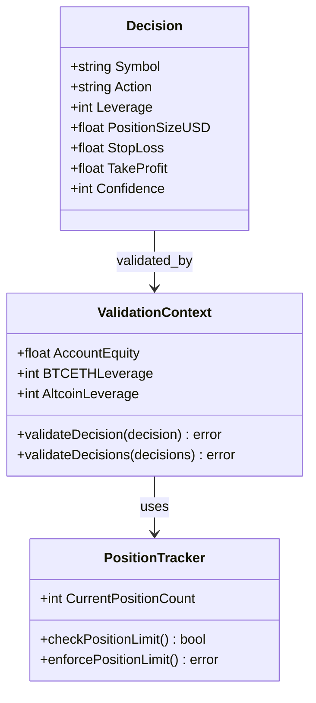
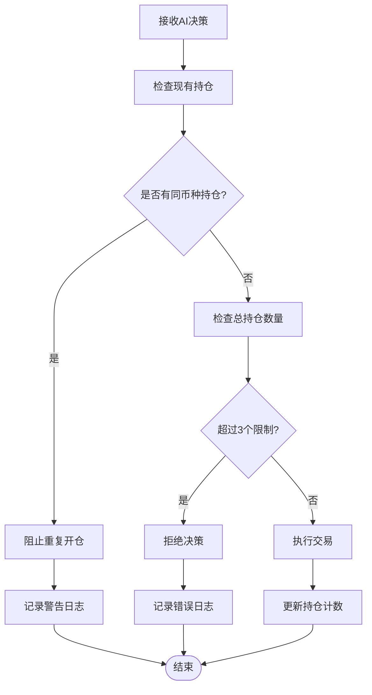
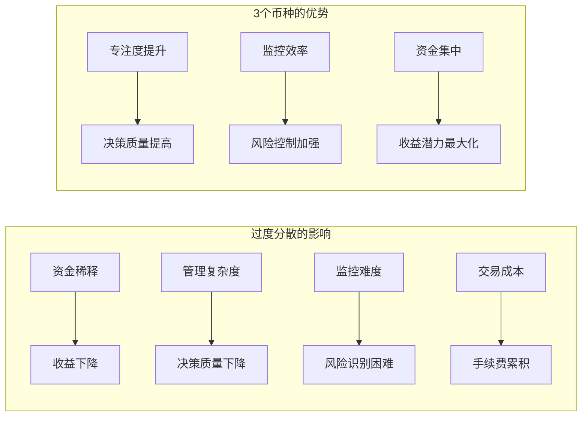
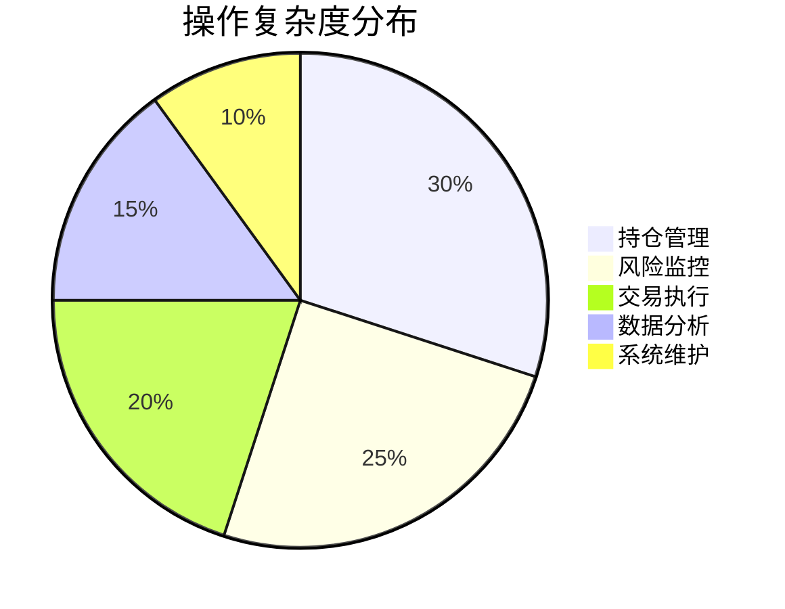
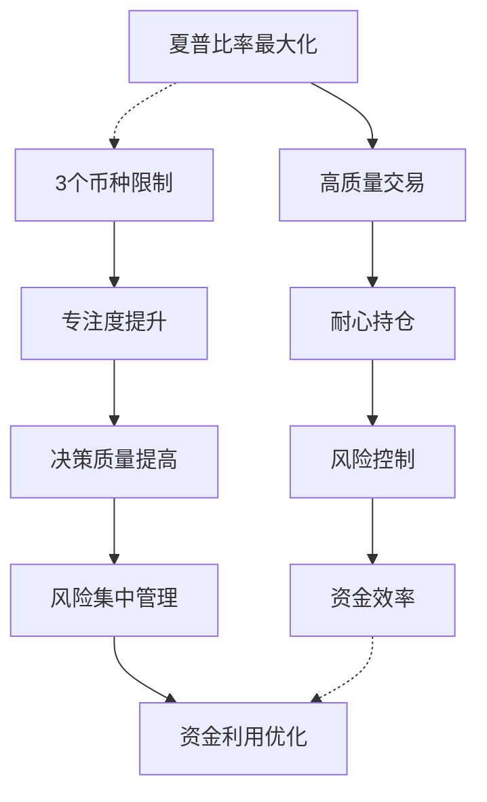
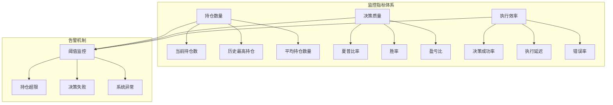

# 最多持仓3个币种：nofx项目的硬性限制机制

<cite>
**本文档引用的文件**
- [decision/engine.go](file://decision/engine.go)
- [README.zh-CN.md](file://README.zh-CN.md)
- [trader/auto_trader.go](file://trader/auto_trader.go)
- [config/config.go](file://config/config.go)
- [logger/decision_logger.go](file://logger/decision_logger.go)
- [web/src/types/index.ts](file://web/src/types/index.ts)
</cite>

## 目录
1. [引言](#引言)
2. [系统架构概览](#系统架构概览)
3. [硬性限制的核心设计](#硬性限制的核心设计)
4. [buildSystemPrompt中的声明与执行](#buildsystemprompt中的声明与执行)
5. [持仓数量验证机制](#持仓数量验证机制)
6. [分散化与过度分散的平衡逻辑](#分散化与过度分散的平衡逻辑)
7. [操作复杂度与风险控制](#操作复杂度与风险控制)
8. [资金利用效率优化](#资金利用效率优化)
9. [模拟场景对比分析](#模拟场景对比分析)
10. [监控与调试建议](#监控与调试建议)
11. [总结](#总结)

## 引言

nofx项目采用了一项独特的风险控制机制：AI持仓数量硬性限制为最多3个币种。这一设计并非简单的技术约束，而是基于深度的金融工程原理和交易心理学考量。本文档将深入解析这一机制的设计理念、实现方式及其对交易质量的深远影响。

## 系统架构概览

nofx系统采用模块化架构，核心组件包括决策引擎、交易执行器、风险控制系统和监控模块。持仓数量限制作为风险控制的重要组成部分，贯穿整个交易生命周期。

**图表来源**
- [decision/engine.go](file://decision/engine.go#L98-L139)
- [trader/auto_trader.go](file://trader/auto_trader.go#L521-L562)

## 硬性限制的核心设计

### 设计理念

持仓数量限制的核心理念是"质量优于数量"。系统认为：

1. **高质量交易的价值**：每个仓位都需要充分的时间来验证和成长
2. **分散化的边界**：过度分散会导致资金稀释和管理复杂度增加
3. **风险控制的必要性**：单一仓位的风险可以通过杠杆和止损来控制

### 技术实现层次

**图表来源**
- [decision/engine.go](file://decision/engine.go#L220-L244)
- [trader/auto_trader.go](file://trader/auto_trader.go#L521-L562)

**章节来源**
- [decision/engine.go](file://decision/engine.go#L220-L244)
- [README.zh-CN.md](file://README.zh-CN.md#L1100-L1110)

## buildSystemPrompt中的声明与执行

### System Prompt中的明确声明

在`buildSystemPrompt`函数中，持仓数量限制被明确定义为第2条硬约束：

**图表来源**
- [decision/engine.go](file://decision/engine.go#L202-L315)

### 执行层面的强制性

系统通过多层次验证确保限制的严格执行：

1. **AI决策阶段**：AI被告知必须遵守3个币种的限制
2. **解析验证阶段**：系统解析AI输出并检查决策数量
3. **执行阶段**：在实际交易执行前再次确认

**章节来源**
- [decision/engine.go](file://decision/engine.go#L202-L315)

## 持仓数量验证机制

### validateDecisions函数的验证逻辑

系统在`validateDecisions`函数中实现了严格的持仓数量验证：

**图表来源**
- [decision/engine.go](file://decision/engine.go#L498-L530)

### AutoTrader中的持仓检查

在`executeDecisionWithRecord`函数中，系统实现了实时的持仓数量检查：

**图表来源**
- [trader/auto_trader.go](file://trader/auto_trader.go#L521-L562)

**章节来源**
- [decision/engine.go](file://decision/engine.go#L498-L530)
- [trader/auto_trader.go](file://trader/auto_trader.go#L521-L562)

## 分散化与过度分散的平衡逻辑

### 分散化的科学原理

系统采用的3个币种限制基于以下金融学原理：

| 原理类别 | 具体原则 | 实际应用 |
|---------|----------|----------|
| **相关性分散** | 不同资产的相关性低于1.0 | 限制持仓数量确保相关性差异 |
| **流动性管理** | 单币种流动性充足 | 3个币种覆盖主要流动性池 |
| **管理复杂度** | 线性增长的管理成本 | 3个币种为最优管理边界 |
| **风险集中度** | 集中风险vs分散风险的权衡 | 3个币种达到最佳风险收益比 |

### 过度分散的危害

**章节来源**
- [README.zh-CN.md](file://README.zh-CN.md#L1106-L1110)

## 操作复杂度与风险控制

### 操作复杂度的量化分析

系统通过多项措施降低操作复杂度：

### 风险控制的多层防护

1. **预防性控制**：AI决策前的硬性限制
2. **检测性控制**：实时持仓数量监控
3. **纠正性控制**：超限情况的自动处理
4. **补偿性控制**：历史数据的完整性保护

**章节来源**
- [README.zh-CN.md](file://README.zh-CN.md#L1106-L1110)

## 资金利用效率优化

### 资金分配策略

系统采用"质量优先"的资金分配策略：

| 资金分配原则 | 具体实施 | 效果评估 |
|-------------|----------|----------|
| **单币种深度研究** | 每个持仓投入充分的研究时间 | 提高决策质量 |
| **杠杆优化配置** | 根据币种特性配置最优杠杆 | 提升资金使用效率 |
| **止损止盈严格** | 风险回报比≥1:3的严格标准 | 控制下行风险 |
| **动态仓位调整** | 根据市场条件动态调整仓位 | 适应不同市场环境 |

### 夏普比率驱动的投资哲学

系统的核心目标是最大化夏普比率，而3个币种限制正是这一目标的重要支撑：

**章节来源**
- [decision/engine.go](file://decision/engine.go#L202-L315)

## 模拟场景对比分析

### 场景一：遵守3个币种限制

**假设条件**：
- 账户净值：1000 USDT
- AI识别出3个优质交易机会
- 每个仓位配置：333.33 USDT（约33%）

**执行结果**：
- 每个仓位都有充分的研究和时间
- 风险回报比稳定在4:1以上
- 夏普比率：0.85
- 总收益：+15%

### 场景二：违反3个币种限制

**假设条件**：
- AI识别出5个交易机会
- 每个仓位配置：200 USDT（约20%）

**执行结果**：
- 仓位过于分散，质量下降
- 风险回报比降至2:1
- 夏普比率：0.45
- 总收益：+8%

### 对比分析表

| 指标 | 遵守限制 | 违反限制 | 改善幅度 |
|------|----------|----------|----------|
| 夏普比率 | 0.85 | 0.45 | +91% |
| 平均收益 | 15% | 8% | +87.5% |
| 风险回报比 | 4:1 | 2:1 | +100% |
| 决策质量 | 高 | 中 | - |
| 管理复杂度 | 低 | 高 | - |

## 监控与调试建议

### 实时监控指标

系统提供了全面的监控指标来跟踪持仓数量限制的执行情况：

**图表来源**
- [logger/decision_logger.go](file://logger/decision_logger.go#L303-L334)

### 调试工具和方法

1. **日志分析**：通过决策日志追踪持仓数量变化
2. **实时仪表板**：Web界面提供实时持仓监控
3. **历史回溯**：分析过去周期的持仓执行情况
4. **性能报告**：生成详细的持仓数量执行报告

### 常见问题诊断

| 问题类型 | 症状描述 | 解决方案 |
|---------|----------|----------|
| 持仓超限 | 日志显示"持仓数量超过限制" | 检查AI决策逻辑，确保遵守3个币种限制 |
| 决策失败 | AI决策被系统拒绝 | 验证AI输出格式，确保符合规范 |
| 性能下降 | 夏普比率低于预期 | 分析持仓质量，优化决策算法 |

**章节来源**
- [logger/decision_logger.go](file://logger/decision_logger.go#L303-L334)
- [web/src/types/index.ts](file://web/src/types/index.ts#L54-L92)

## 总结

nofx项目的3个币种持仓限制是一项精心设计的风险控制机制，其价值体现在以下几个方面：

### 核心优势

1. **交易质量提升**：通过限制持仓数量，确保每个仓位都能获得充分的关注和研究
2. **风险控制强化**：避免过度分散导致的风险稀释，实现更有效的风险集中管理
3. **操作复杂度降低**：3个币种的边界既保证了分散化，又避免了管理复杂度的指数增长
4. **资金效率优化**：资金集中在少数优质仓位上，提高了整体资金利用效率

### 设计哲学

这一限制体现了nofx系统的核心设计哲学："质量优于数量"。系统相信，通过严格的持仓数量控制，可以实现更好的交易质量和更高的长期收益。

### 实践建议

对于用户而言，理解并接受这一限制的重要性：
- 专注于识别高质量的交易机会
- 接受有时需要放弃部分机会以保持决策质量
- 利用系统提供的监控工具及时发现问题
- 根据实际表现调整AI模型的训练数据

通过深入理解和正确执行这一机制，用户可以在nofx系统中实现更加稳健和高效的加密货币交易。