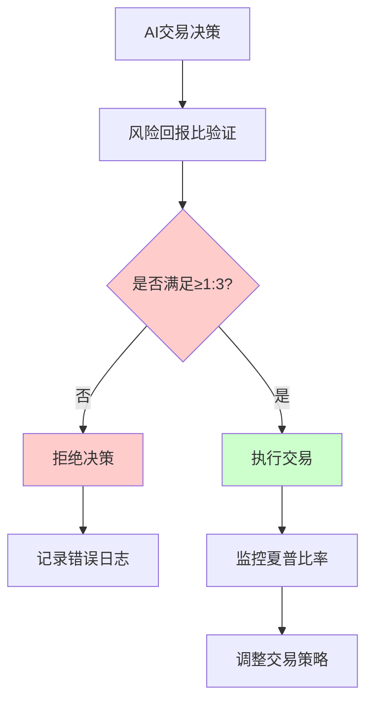
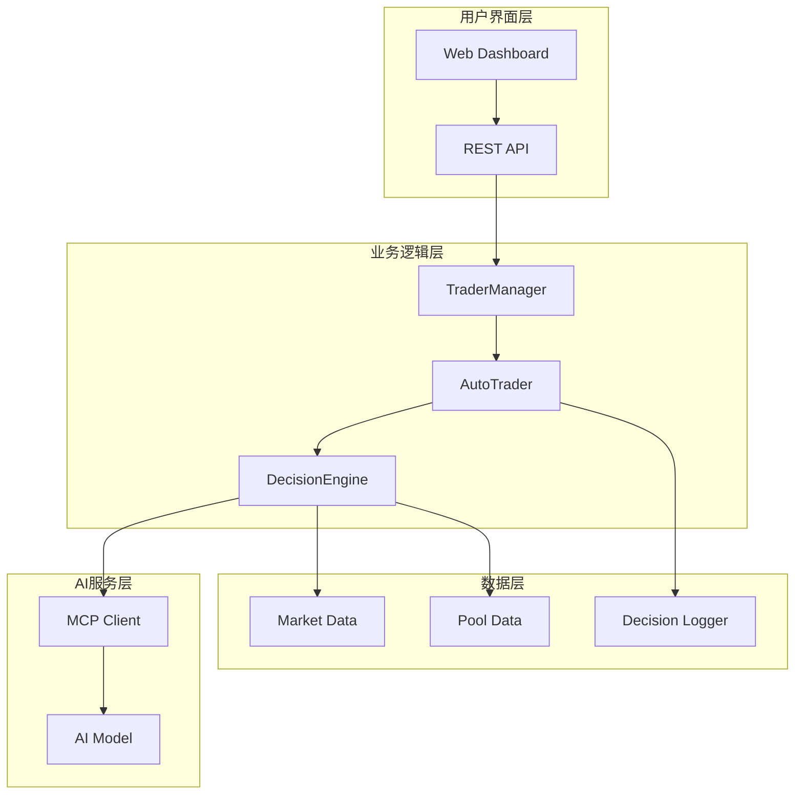
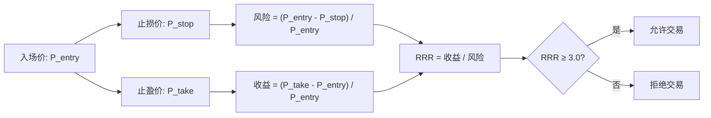
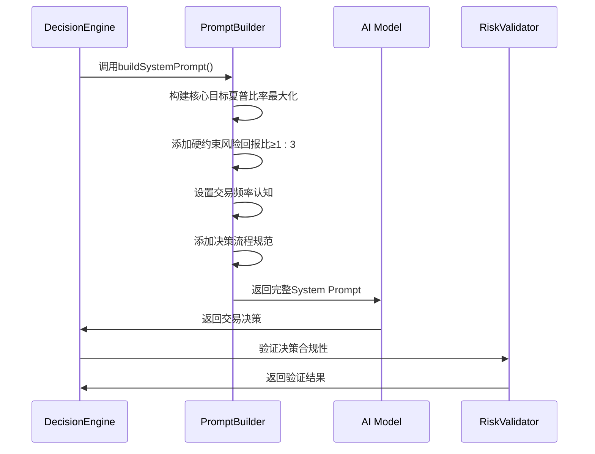
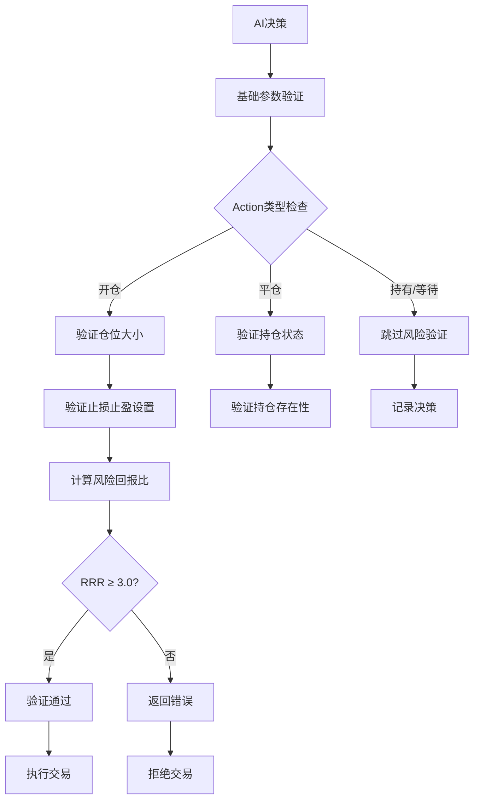
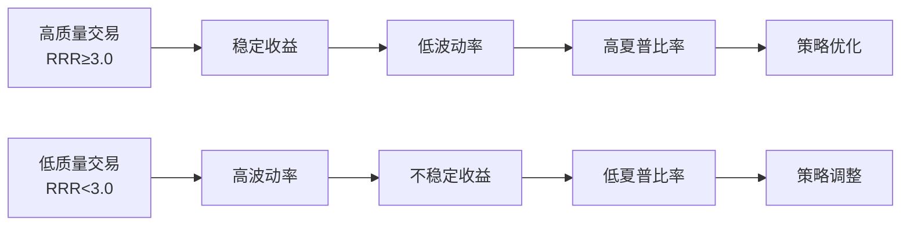
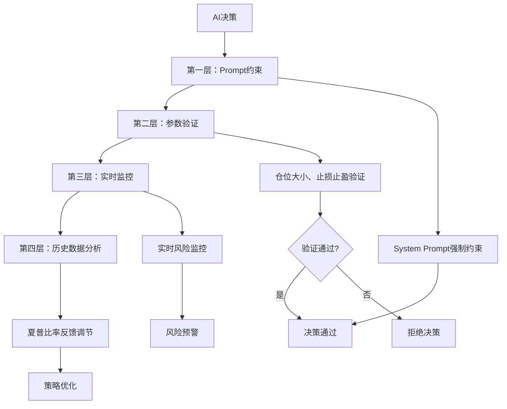
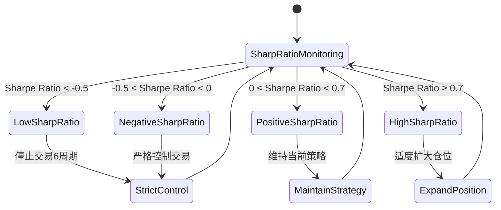
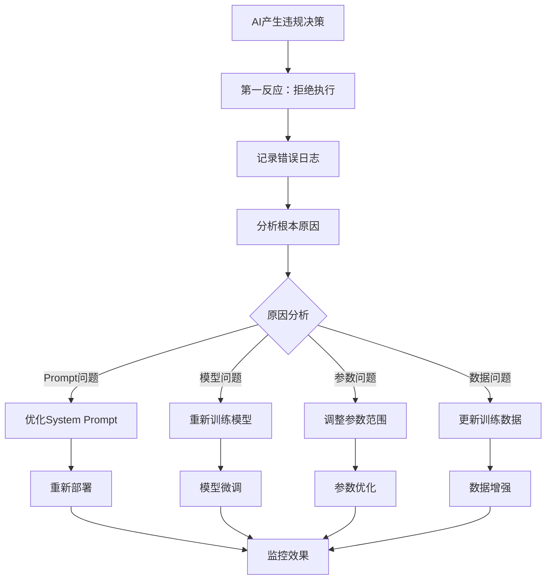
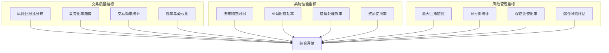

# 风险回报比≥1:3硬性约束机制详解

<cite>
**本文档引用的文件**
- [main.go](file://main.go)
- [decision/engine.go](file://decision/engine.go)
- [manager/trader_manager.go](file://manager/trader_manager.go)
- [trader/auto_trader.go](file://trader/auto_trader.go)
- [config/config.go](file://config/config.go)
- [常见问题.md](file://常见问题.md)
</cite>

## 目录
1. [概述](#概述)
2. [系统架构](#系统架构)
3. [风险回报比约束原理](#风险回报比约束原理)
4. [System Prompt构建机制](#system-prompt构建机制)
5. [AI决策验证流程](#ai决策验证流程)
6. [实际交易场景分析](#实际交易场景分析)
7. [系统级保障措施](#系统级保障措施)
8. [常见问题解答](#常见问题解答)
9. [性能优化与监控](#性能优化与监控)
10. [总结](#总结)

## 概述

nofx系统采用严格的AI驱动交易决策机制，其中风险回报比≥1:3的硬性约束是确保交易质量的核心原则。该约束要求每次开仓的潜在收益至少是风险的3倍，这一设计从根本上防止了低质量交易的发生，显著提升了整体夏普比率。

### 核心设计理念



**图表来源**
- [decision/engine.go](file://decision/engine.go#L615-L622)

## 系统架构

nofx系统采用分层架构设计，风险回报比约束贯穿整个决策流程：



**图表来源**
- [main.go](file://main.go#L1-L140)
- [manager/trader_manager.go](file://manager/trader_manager.go#L1-L173)

**章节来源**
- [main.go](file://main.go#L1-L140)
- [manager/trader_manager.go](file://manager/trader_manager.go#L1-L173)

## 风险回报比约束原理

### 数学定义与计算

风险回报比（Risk Reward Ratio）是衡量交易质量的关键指标，其计算公式为：

**风险回报比 = 潜在收益 / 潜在风险**

在nofx系统中，该比率必须满足：
**RRR ≥ 3.0**

### 约束的具体含义

1. **最小风险回报比**：每次交易的风险必须小于收益的1/3
2. **止损位置**：止损点设置在入场价的特定百分比范围内
3. **止盈目标**：止盈点设置在能够获得至少3倍风险收益的位置

### 约束的数学推导



**图表来源**
- [decision/engine.go](file://decision/engine.go#L588-L622)

**章节来源**
- [decision/engine.go](file://decision/engine.go#L588-L622)

## System Prompt构建机制

### buildSystemPrompt函数的核心作用

`buildSystemPrompt`函数负责构建AI模型的System Prompt，其中风险回报比约束作为核心规则被明确注入：



**图表来源**
- [decision/engine.go](file://decision/engine.go#L284-L339)

### System Prompt中的约束声明

在System Prompt中，风险回报比约束被明确表述为：

```
1. **风险回报比**: 必须 ≥ 1:3（冒1%风险，赚3%+收益）
```

这一约束贯穿整个Prompt的多个部分：

1. **核心目标部分**：强调夏普比率最大化的重要性
2. **硬约束部分**：明确列出风险回报比要求
3. **决策流程部分**：指导AI在决策时考虑风险回报比
4. **输出格式部分**：要求AI在决策中体现风险回报比考量

**章节来源**
- [decision/engine.go](file://decision/engine.go#L284-L339)

## AI决策验证流程

### validateDecision函数的验证逻辑

系统在AI生成决策后，会通过`validateDecision`函数进行全面验证：



**图表来源**
- [decision/engine.go](file://decision/engine.go#L565-L622)

### 风险回报比计算的具体实现

验证过程中，系统采用以下步骤计算风险回报比：

1. **入场价估算**：根据止损和止盈位置估算入场价
2. **风险计算**：计算相对于入场价的风险百分比
3. **收益计算**：计算相对于入场价的预期收益百分比
4. **比率计算**：计算风险回报比并验证是否满足≥3.0的要求

### 错误处理机制

当AI决策违反风险回报比约束时，系统会返回详细的错误信息：

```
风险回报比过低(%.2f:1)，必须≥3.0:1 [风险:%.2f%% 收益:%.2f%%] [止损:%.2f 止盈:%.2f]
```

**章节来源**
- [decision/engine.go](file://decision/engine.go#L565-L622)

## 实际交易场景分析

### 符合约束的交易示例

#### 场景1：理想的风险回报比交易

**参数设置**：
- 入场价：$100
- 止损价：$95（5%风险）
- 止盈价：$115（15%收益）

**计算结果**：
- 风险回报比 = 15% / 5% = 3.0
- 符合系统要求

#### 场景2：保守型交易策略

**参数设置**：
- 入场价：$200
- 止损价：$190（5%风险）
- 止盈价：$230（15%收益）

**计算结果**：
- 风险回报比 = 15% / 5% = 3.0
- 达到最低要求

### 不符合约束的交易示例

#### 场景1：风险过高的交易

**参数设置**：
- 入场价：$100
- 止损价：$90（10%风险）
- 止盈价：$110（10%收益）

**计算结果**：
- 风险回报比 = 10% / 10% = 1.0
- 违反系统约束

#### 场景2：收益过低的交易

**参数设置**：
- 入场价：$100
- 止损价：$95（5%风险）
- 止盈价：$102（2%收益）

**计算结果**：
- 风险回报比 = 2% / 5% = 0.4
- 违反系统约束

### 夏普比率的影响机制



**图表来源**
- [decision/engine.go](file://decision/engine.go#L265-L283)

**章节来源**
- [decision/engine.go](file://decision/engine.go#L588-L622)

## 系统级保障措施

### 多层次验证机制

nofx系统实现了多层次的风险控制保障：



**图表来源**
- [decision/engine.go](file://decision/engine.go#L284-L339)

### 风险控制参数配置

系统提供了灵活的风险控制参数配置：

| 参数类别 | 配置项 | 默认值 | 说明 |
|---------|--------|--------|------|
| 杠杆限制 | BTC/ETH杠杆 | 5x | 主账户建议5-50，子账户≤5 |
| 杠杆限制 | 山寨币杠杆 | 5x | 主账户建议5-20，子账户≤5 |
| 仓位限制 | 单币仓位 | 1.5-10倍账户净值 | 根据币种不同而异 |
| 仓位限制 | 最大持仓 | 3个币种 | 质量优于数量 |
| 保证金限制 | 总使用率 | ≤90% | 防止爆仓风险 |

**章节来源**
- [config/config.go](file://config/config.go#L1-L202)

### 夏普比率自我进化机制

系统实现了基于夏普比率的自我进化机制：



**图表来源**
- [decision/engine.go](file://decision/engine.go#L265-L283)

**章节来源**
- [decision/engine.go](file://decision/engine.go#L265-L283)

## 常见问题解答

### Q1: AI为什么会忽略风险回报比约束？

**A1**: AI可能因为以下原因忽略约束：

1. **Prompt设计问题**：System Prompt中约束不够明确
2. **模型理解偏差**：AI对约束的理解不准确
3. **参数设置错误**：止损止盈设置不合理
4. **训练数据偏差**：AI学习到了不符合约束的行为模式

**解决方案**：
- 检查System Prompt的约束声明
- 验证AI模型的训练质量
- 监控AI决策的合理性
- 实施更严格的验证机制

### Q2: 如何处理AI频繁产生不符合约束的决策？

**A2**: 系统提供了多层次的应对策略：



### Q3: 系统如何保证约束的严格执行？

**A3**: 系统采用以下保障措施：

1. **编译时验证**：在代码层面强制执行约束
2. **运行时监控**：实时检查决策合规性
3. **事后审计**：定期审查交易记录
4. **自动纠偏**：发现异常时自动调整策略

### Q4: 风险回报比约束与其他风险控制的关系？

**A4**: 约束与其他风险控制措施协同工作：

| 控制层级 | 措施 | 作用范围 | 执行时机 |
|---------|------|----------|----------|
| 系统级 | 杠杆限制 | 全局 | 实时 |
| 策略级 | 仓位限制 | 单币种 | 决策前 |
| 交易级 | 止损止盈 | 单笔交易 | 开仓时 |
| 监控级 | 夏普比率 | 整体策略 | 周期后 |

**章节来源**
- [常见问题.md](file://常见问题.md#L1-L26)

## 性能优化与监控

### 决策效率优化

系统通过以下方式优化决策效率：

1. **并发处理**：并行获取市场数据
2. **缓存机制**：缓存常用数据
3. **智能调度**：根据市场状况调整扫描频率
4. **资源管理**：合理分配计算资源

### 监控指标体系



**章节来源**
- [decision/engine.go](file://decision/engine.go#L205-L218)

## 总结

nofx系统通过风险回报比≥1:3的硬性约束，建立了一个严格而有效的AI交易决策框架。这一约束不仅确保了每次交易的质量，还通过夏普比率的自我进化机制，实现了策略的持续优化。

### 核心优势

1. **质量优先**：通过硬性约束确保交易质量
2. **自我进化**：基于夏普比率的策略优化
3. **多重保障**：多层次的风险控制机制
4. **透明可追溯**：完整的决策记录和监控

### 应用价值

- **提升交易质量**：显著降低低质量交易的发生
- **优化夏普比率**：通过高质量交易提升整体收益
- **降低风险**：严格的约束减少潜在损失
- **系统化管理**：标准化的决策流程和监控

这一机制体现了nofx系统在AI交易领域的创新性和专业性，为量化交易提供了一个可靠、高效的解决方案。