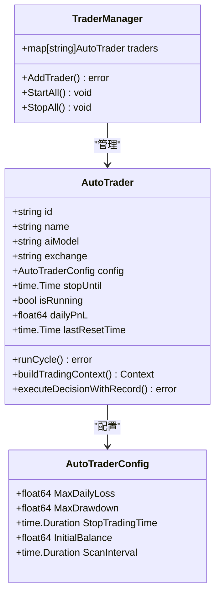
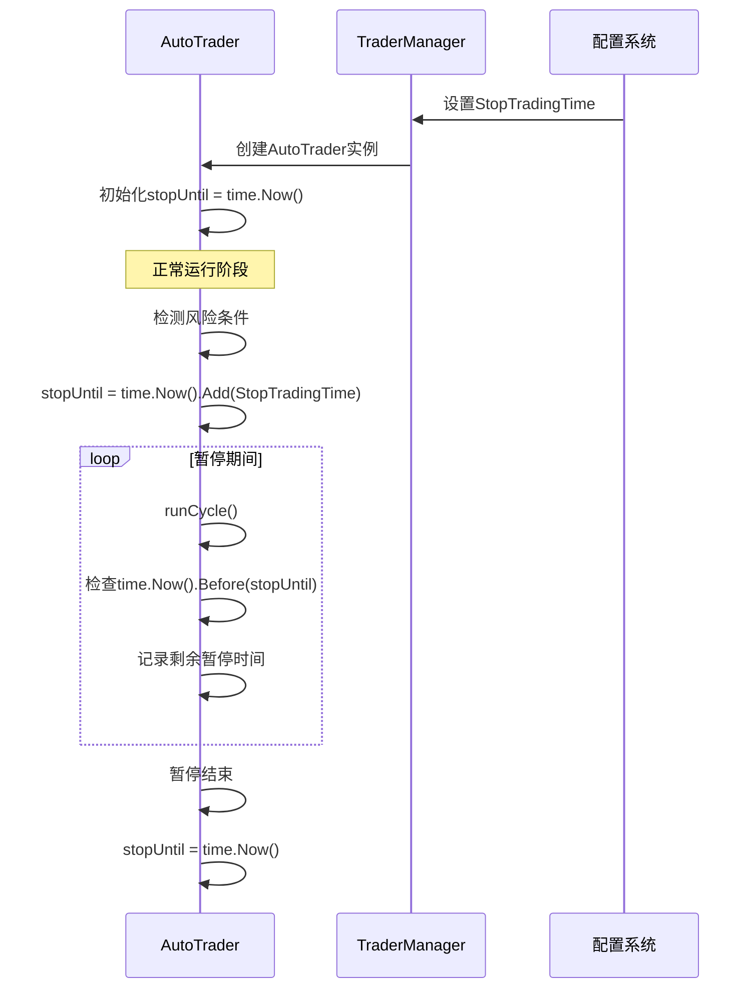
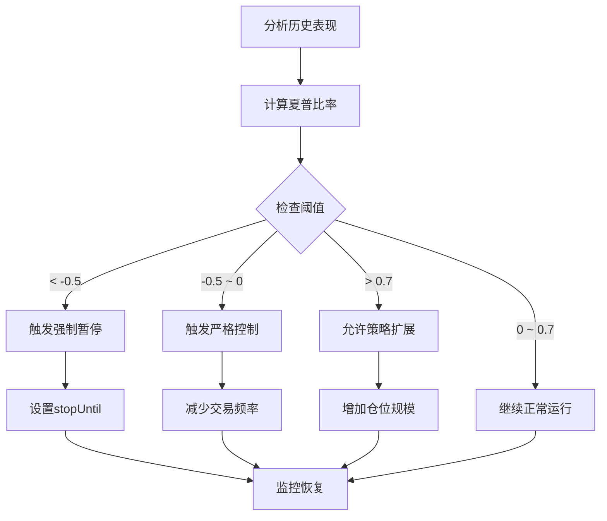
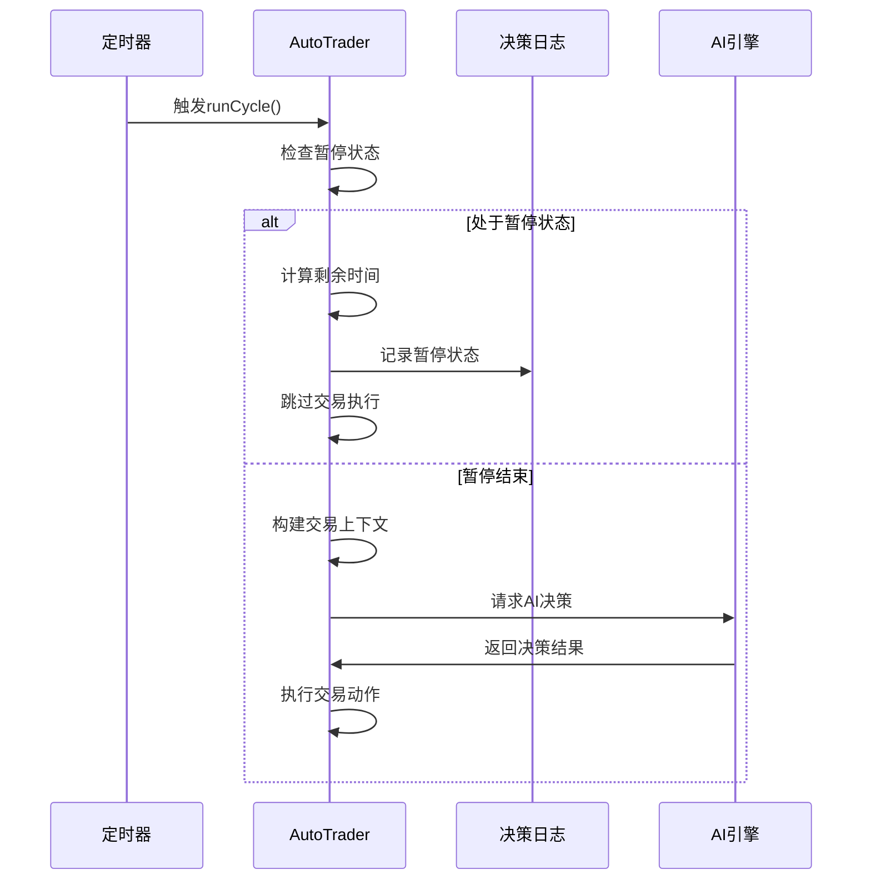
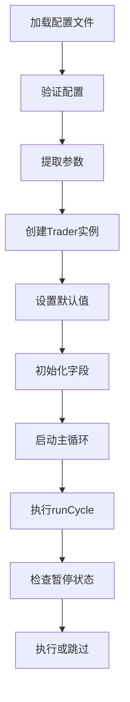
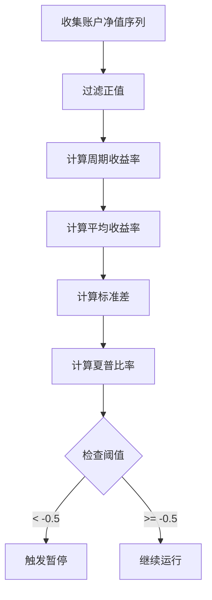

# 交易暂停机制

<cite>
**本文档引用的文件**
- [auto_trader.go](file://trader/auto_trader.go)
- [config.go](file://config/config.go)
- [trader_manager.go](file://manager/trader_manager.go)
- [main.go](file://main.go)
- [decision_logger.go](file://logger/decision_logger.go)
- [engine.go](file://decision/engine.go)
</cite>

## 目录
1. [简介](#简介)
2. [核心组件架构](#核心组件架构)
3. [stopUntil字段设计原理](#stopuntil字段设计原理)
4. [暂停检测机制](#暂停检测机制)
5. [风险触发条件](#风险触发条件)
6. [暂停期间的AI决策循环](#暂停期间的ai决策循环)
7. [配置参数详解](#配置参数详解)
8. [性能监控与分析](#性能监控与分析)
9. [故障排除指南](#故障排除指南)
10. [总结](#总结)

## 简介

nofx项目的交易暂停机制是一个精密的风险控制系统，通过`stopUntil`字段实现智能暂停交易的功能。该机制能够在检测到特定风险条件时，自动暂停交易活动，同时保持AI决策循环的运行，从而防止连续亏损扩大，保护账户资金安全。

## 核心组件架构

### AutoTrader结构体设计



**图表来源**
- [auto_trader.go](file://trader/auto_trader.go#L57-L85)
- [trader_manager.go](file://manager/trader_manager.go#L15-L25)

### 关键字段说明

| 字段名 | 类型 | 描述 | 默认值 |
|--------|------|------|--------|
| `stopUntil` | `time.Time` | 暂停结束时间戳 | `time.Now()` |
| `isRunning` | `bool` | 运行状态标志 | `false` |
| `dailyPnL` | `float64` | 当日盈亏 | `0.0` |
| `lastResetTime` | `time.Time` | 最后重置时间 | `time.Now()` |

**节来源**
- [auto_trader.go](file://trader/auto_trader.go#L57-L85)

## stopUntil字段设计原理

### 时间戳管理机制

`stopUntil`字段是暂停机制的核心，它采用时间戳而非持续时间的设计理念：



**图表来源**
- [auto_trader.go](file://trader/auto_trader.go#L207-L254)
- [trader_manager.go](file://manager/trader_manager.go#L60-L65)

### 设计优势

1. **精确控制**：基于绝对时间戳，避免累计误差
2. **灵活调整**：支持动态延长或缩短暂停时间
3. **状态清晰**：通过比较当前时间和目标时间判断状态
4. **资源友好**：暂停期间只进行状态检查，不消耗计算资源

**节来源**
- [auto_trader.go](file://trader/auto_trader.go#L220-L230)

## 暂停检测机制

### runCycle方法中的暂停检查

在`runCycle`方法中，系统首先检查是否处于暂停状态：

```mermaid
flowchart TD
Start([开始runCycle]) --> CheckPause{检查暂停状态}
CheckPause --> |time.Now().Before(stopUntil)| PauseActive[暂停激活]
CheckPause --> |!time.Now().Before(stopUntil)| NormalRun[正常运行]
PauseActive --> CalcRemaining[计算剩余暂停时间]
CalcRemaining --> LogPause[记录暂停信息]
LogPause --> SkipExecution[跳过交易执行]
SkipExecution --> End([结束])
NormalRun --> BuildContext[构建交易上下文]
BuildContext --> GetAI[获取AI决策]
GetAI --> ExecuteDecisions[执行交易决策]
ExecuteDecisions --> End
```

**图表来源**
- [auto_trader.go](file://trader/auto_trader.go#L220-L235)

### 暂停状态判断逻辑

暂停状态的判断基于以下核心逻辑：
- `time.Now().Before(at.stopUntil)`：当前时间是否在暂停结束时间之前
- 如果为真，表示处于暂停状态
- 如果为假，表示暂停结束，可以正常执行交易

**节来源**
- [auto_trader.go](file://trader/auto_trader.go#L220-L235)

## 风险触发条件

### 夏普比率阈值系统

系统通过夏普比率指标自动触发暂停：

| 夏普比率范围 | 风险等级 | 暂停行为 | 恢复条件 |
|-------------|----------|----------|----------|
| `< -0.5` | 严重亏损 | 强制暂停6周期（18分钟） | 夏普比率回升 |
| `-0.5 ~ 0` | 轻微亏损 | 严格控制交易 | 胜率改善 |
| `0 ~ 0.7` | 正常收益 | 维持当前策略 | 保持稳定 |
| `> 0.7` | 优异表现 | 适度扩大仓位 | 持续优异 |

### 触发机制实现



**图表来源**
- [engine.go](file://decision/engine.go#L265-L283)
- [decision_logger.go](file://logger/decision_logger.go#L563-L610)

**节来源**
- [engine.go](file://decision/engine.go#L265-L283)

## 暂停期间的AI决策循环

### 循环设计原理

暂停期间的AI决策循环遵循"观察而不行动"的原则：



**图表来源**
- [auto_trader.go](file://trader/auto_trader.go#L207-L254)

### 暂停期间的功能保留

尽管暂停期间不执行交易，但以下功能仍然运行：

1. **AI思维链分析**：继续分析市场状况和潜在机会
2. **账户状态监控**：实时跟踪账户净值和持仓情况
3. **决策日志记录**：记录暂停状态和剩余时间
4. **性能指标更新**：维持夏普比率等关键指标的计算

**节来源**
- [auto_trader.go](file://trader/auto_trader.go#L220-L235)

## 配置参数详解

### 核心配置项

| 配置参数 | 类型 | 默认值 | 描述 |
|----------|------|--------|------|
| `MaxDailyLoss` | `float64` | 无默认值 | 最大日亏损百分比（触发风险警告） |
| `MaxDrawdown` | `float64` | 无默认值 | 最大回撤百分比（触发风险警告） |
| `StopTradingTime` | `time.Duration` | 无默认值 | 触发风控后的暂停时长 |
| `ScanInterval` | `time.Duration` | 3分钟 | AI决策扫描间隔 |

### 配置加载流程



**图表来源**
- [config.go](file://config/config.go#L40-L80)
- [trader_manager.go](file://manager/trader_manager.go#L30-L70)

**节来源**
- [config.go](file://config/config.go#L40-L80)
- [trader_manager.go](file://manager/trader_manager.go#L30-L70)

## 性能监控与分析

### 夏普比率计算

系统通过`DecisionLogger`类计算夏普比率，作为暂停触发的重要指标：



**图表来源**
- [decision_logger.go](file://logger/decision_logger.go#L563-L610)

### 性能分析指标

| 指标名称 | 计算方式 | 风险意义 |
|----------|----------|----------|
| 夏普比率 | `(平均收益 - 无风险利率) / 收益率标准差` | 风险调整后收益，负值触发暂停 |
| 胜率 | `盈利交易数 / 总交易数` | 交易质量指标 |
| 盈亏比 | `平均盈利 / 绝对值平均亏损` | 风险回报平衡 |
| 最大回撤 | `从峰值到谷底的最大跌幅` | 最大潜在损失 |

**节来源**
- [decision_logger.go](file://logger/decision_logger.go#L563-L610)

## 故障排除指南

### 常见问题及解决方案

#### 1. 暂停状态无法解除

**症状**：`stopUntil`设置后长时间无法恢复正常交易

**排查步骤**：
- 检查系统时间是否正确
- 验证配置文件中的`StopTradingTime`设置
- 确认`time.Now()`调用是否正常工作

**解决方案**：
```go
// 强制重置暂停状态
at.stopUntil = time.Now()
log.Println("强制重置暂停状态")
```

#### 2. 暂停时间计算错误

**症状**：暂停时间显示异常或计算错误

**排查步骤**：
- 验证`StopTradingTime`配置格式
- 检查时间单位转换是否正确
- 确认`time.Now().Add()`调用参数

**解决方案**：
```go
// 正确的时间计算示例
pauseDuration := time.Duration(stopTradingMinutes) * time.Minute
at.stopUntil = time.Now().Add(pauseDuration)
```

#### 3. AI决策循环异常

**症状**：暂停期间AI决策循环报错

**排查步骤**：
- 检查`buildTradingContext()`函数执行状态
- 验证AI API连接状态
- 确认网络连接稳定性

**解决方案**：
```go
// 添加错误处理和重试机制
ctx, err := at.buildTradingContext()
if err != nil {
    log.Printf("构建交易上下文失败: %v", err)
    // 记录错误状态但不中断循环
    continue
}
```

**节来源**
- [auto_trader.go](file://trader/auto_trader.go#L220-L235)

## 总结

nofx项目的交易暂停机制通过`stopUntil`字段实现了智能化的风险控制：

### 核心优势

1. **智能暂停**：基于夏普比率等关键指标自动触发
2. **资源效率**：暂停期间只进行状态检查，不消耗计算资源
3. **状态透明**：清晰的暂停状态和剩余时间显示
4. **灵活配置**：支持多种暂停时长和触发条件

### 设计亮点

- **时间戳驱动**：基于绝对时间戳的精确控制
- **循环兼容**：暂停机制与主循环无缝集成
- **监控完整**：暂停期间保持完整的状态监控
- **恢复机制**：自动恢复正常的交易循环

### 应用价值

该机制有效防止了连续亏损扩大，保护了账户资金安全，同时保持了AI学习和适应能力，是现代量化交易系统中风险控制的重要创新。