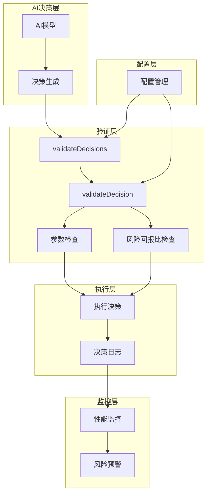
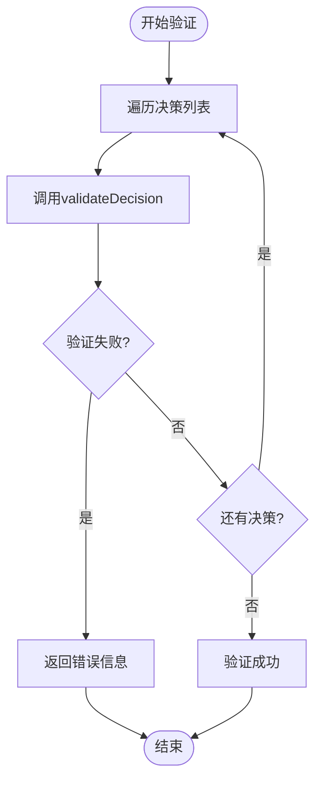
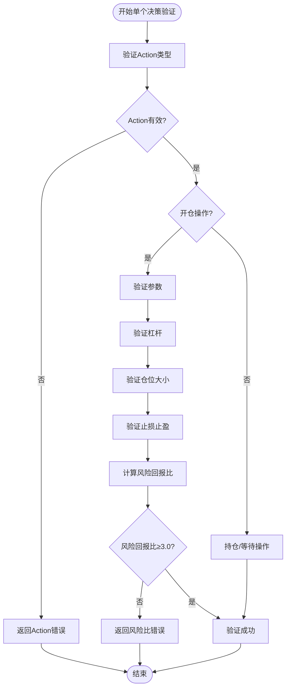
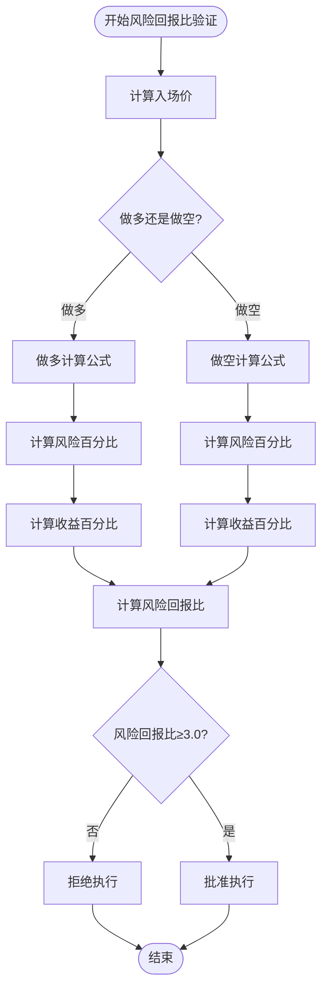
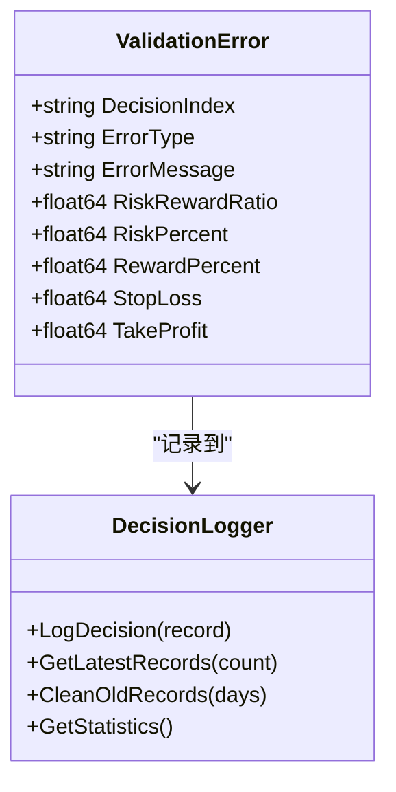
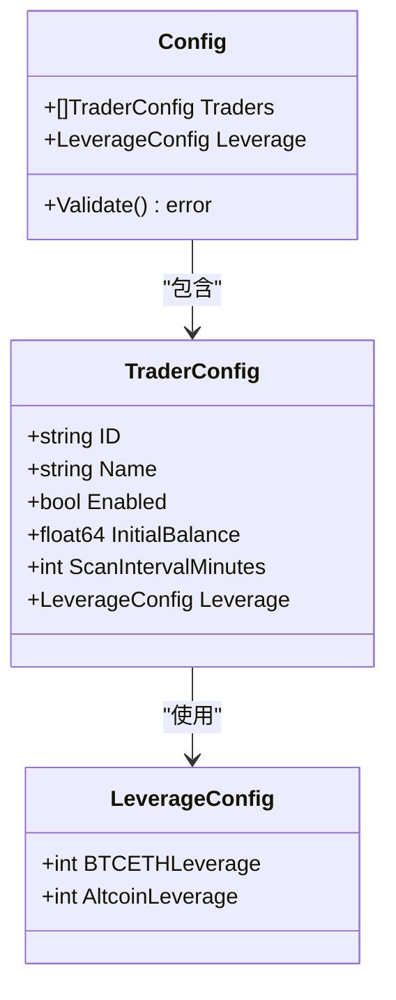
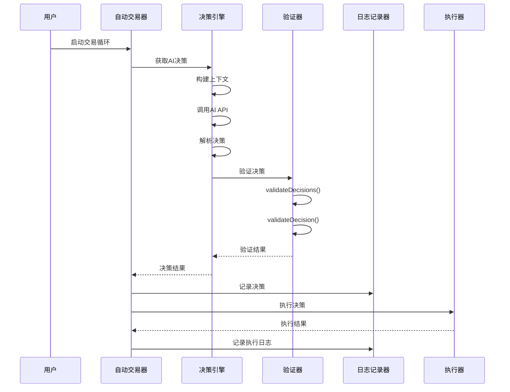

# 决策验证层

<cite>
**本文档引用的文件**
- [decision/engine.go](file://decision/engine.go)
- [config/config.go](file://config/config.go)
- [logger/decision_logger.go](file://logger/decision_logger.go)
- [trader/auto_trader.go](file://trader/auto_trader.go)
- [README.md](file://README.md)
</cite>

## 目录
1. [简介](#简介)
2. [系统架构概览](#系统架构概览)
3. [核心验证函数](#核心验证函数)
4. [安全参数验证](#安全参数验证)
5. [风险回报比验证](#风险回报比验证)
6. [错误处理与日志记录](#错误处理与日志记录)
7. [配置管理](#配置管理)
8. [执行流程分析](#执行流程分析)
9. [故障排除指南](#故障排除指南)
10. [总结](#总结)

## 简介

nofx项目的决策验证层是一个多层次的安全保障机制，旨在确保AI生成的交易决策在执行前经过严格的二次校验。该系统通过validateDecisions和validateDecision两个核心函数，对杠杆倍数、仓位大小、止损止盈价格等关键参数进行全面检查，并强制执行风险回报比≥1:3的硬性约束。

验证层的设计哲学是"宁可错过机会，不可承担风险"，即使面对AI输出的异常决策，系统也会坚决拒绝执行，确保用户资金安全。

## 系统架构概览

决策验证层采用分层架构设计，包含以下核心组件：

**图表来源**
- [decision/engine.go](file://decision/engine.go#L500-L622)
- [trader/auto_trader.go](file://trader/auto_trader.go#L287-L323)

## 核心验证函数

### validateDecisions函数

validateDecisions函数负责验证一组决策的整体有效性，是验证层的第一道防线。

**图表来源**
- [decision/engine.go](file://decision/engine.go#L500-L508)

### validateDecision函数

validateDecision函数对单个决策进行深度验证，涵盖多个维度的安全检查。

**图表来源**
- [decision/engine.go](file://decision/engine.go#L532-L622)

**章节来源**
- [decision/engine.go](file://decision/engine.go#L500-L622)

## 安全参数验证

### 杠杆倍数验证

系统根据币种类型设置不同的杠杆上限，确保风险可控：

| 币种类型 | BTC/ETH杠杆上限 | 山寨币杠杆上限 | 风险等级 |
|---------|----------------|---------------|----------|
| BTCUSDT/ETHUSDT | 配置值（最高50x） | 5x | 中等风险 |
| 其他山寨币 | 5x | 配置值（最高20x） | 较低风险 |

### 仓位大小验证

仓位大小验证包括绝对值检查和相对账户净值的百分比限制：

- **绝对值检查**：仓位必须大于0
- **相对限制**：
  - BTC/ETH：最多账户净值的10倍
  - 山寨币：最多账户净值的1.5倍
- **容差机制**：允许1%的浮点数精度误差

### 止损止盈验证

止损和止盈价格验证确保交易指令的合理性：

- **止损止盈必须大于0**
- **做多时**：止损价 < 止盈价
- **做空时**：止损价 > 止盈价

**章节来源**
- [decision/engine.go](file://decision/engine.go#L540-L586)

## 风险回报比验证

### 数学验证逻辑

风险回报比验证是系统的核心安全机制，强制要求风险回报比≥1:3。

**图表来源**
- [decision/engine.go](file://decision/engine.go#L588-L622)

### 入场价假设

系统假设入场价位于止损和止盈价格之间的特定位置：

- **做多**：入场价 = 止损价 + (止盈价 - 止损价) × 0.2（20%位置）
- **做空**：入场价 = 止损价 - (止损价 - 止盈价) × 0.2（20%位置）

### 风险回报比计算

对于每种交易方向，系统分别计算：

1. **风险百分比** = (入场价 - 止损价) / 入场价 × 100%
2. **收益百分比** = (止盈价 - 入场价) / 入场价 × 100%
3. **风险回报比** = 收益百分比 / 风险百分比

**章节来源**
- [decision/engine.go](file://decision/engine.go#L588-L622)

## 错误处理与日志记录

### 错误信息结构

验证失败时，系统返回详细的错误信息，帮助开发者快速定位问题：

**图表来源**
- [logger/decision_logger.go](file://logger/decision_logger.go#L15-L60)

### 日志记录机制

系统采用分级日志记录策略：

1. **决策记录**：保存完整的AI思维链和决策过程
2. **执行日志**：记录每个决策的执行状态
3. **错误日志**：详细记录验证失败原因
4. **性能日志**：跟踪系统性能指标

**章节来源**
- [logger/decision_logger.go](file://logger/decision_logger.go#L74-L118)
- [trader/auto_trader.go](file://trader/auto_trader.go#L287-L323)

## 配置管理

### 杠杆配置

系统通过配置文件管理杠杆参数，支持不同币种和账户类型的差异化设置：

**图表来源**
- [config/config.go](file://config/config.go#L25-L35)

### 默认配置

系统提供安全的默认配置：

- **BTC/ETH杠杆**：5倍（适配子账户限制）
- **山寨币杠杆**：5倍（适配子账户限制）
- **扫描间隔**：3分钟（平衡响应性和稳定性）

**章节来源**
- [config/config.go](file://config/config.go#L170-L190)

## 执行流程分析

### 完整决策流程

**图表来源**
- [trader/auto_trader.go](file://trader/auto_trader.go#L287-L350)
- [decision/engine.go](file://decision/engine.go#L430-L458)

### 错误恢复机制

当验证失败时，系统采用以下恢复策略：

1. **记录详细错误**：保存完整的错误信息和上下文
2. **阻止执行**：拒绝执行任何失败的决策
3. **通知用户**：通过日志和界面显示错误信息
4. **保持系统稳定**：继续运行其他功能

**章节来源**
- [trader/auto_trader.go](file://trader/auto_trader.go#L320-L340)

## 故障排除指南

### 常见验证错误

| 错误类型 | 错误信息 | 解决方案 |
|---------|----------|----------|
| 杠杆超限 | "杠杆必须在1-5之间" | 检查配置文件中的杠杆设置 |
| 仓位过大 | "仓位价值不能超过账户净值" | 减少仓位大小或增加账户余额 |
| 风险回报比不足 | "风险回报比过低(2.5:1)" | 调整止损止盈设置 |
| 参数缺失 | "止损和止盈必须大于0" | 确保所有必要参数都已提供 |

### 调试技巧

1. **启用详细日志**：查看决策记录中的思维链分析
2. **检查配置**：确认杠杆和仓位设置合理
3. **验证市场数据**：确保获取的市场价格准确
4. **测试边界条件**：验证极端情况下的系统行为

### 性能优化

- **并发验证**：对多个决策并行验证
- **缓存机制**：缓存常用的配置和计算结果
- **增量更新**：只验证发生变化的部分

## 总结

nofx项目的决策验证层通过多层次的安全保障机制，确保了AI交易系统的安全性。主要特点包括：

1. **严格的参数验证**：对杠杆、仓位、止损止盈等关键参数进行全面检查
2. **硬性风险约束**：强制执行风险回报比≥1:3的硬性要求
3. **完善的错误处理**：提供详细的错误信息和恢复机制
4. **全面的日志记录**：记录完整的决策过程和执行状态
5. **灵活的配置管理**：支持不同场景下的差异化配置

这套验证机制不仅保护了用户的资金安全，也为AI交易系统的可靠运行提供了坚实保障。通过持续的监控和优化，系统能够适应不断变化的市场环境，为用户提供稳定可靠的自动化交易服务。