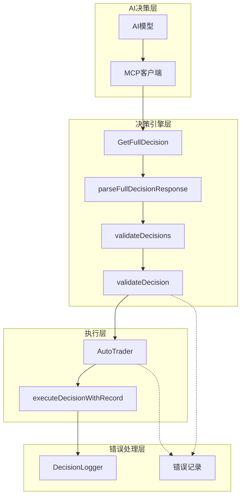
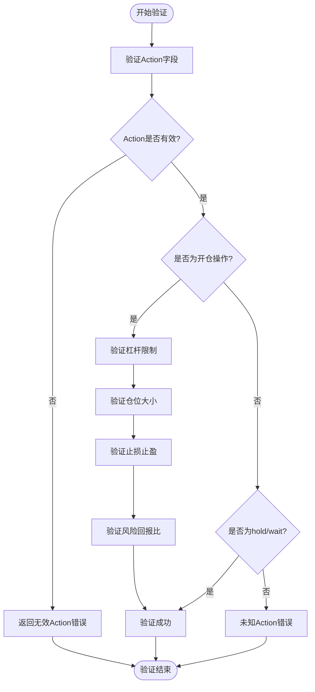
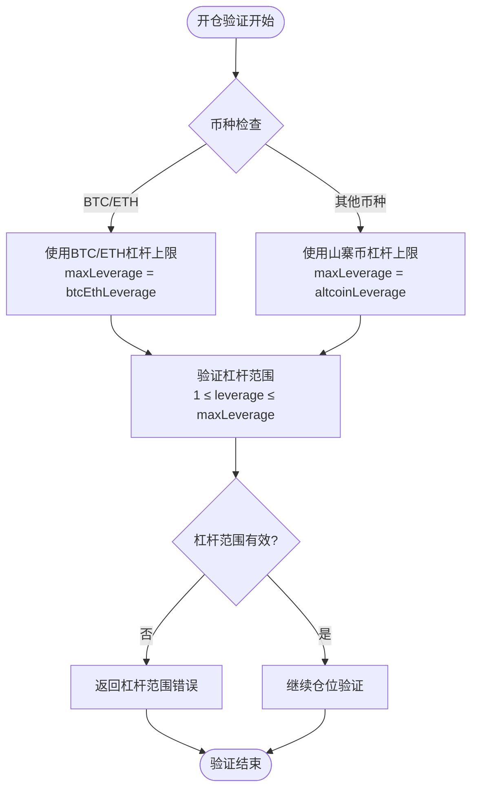
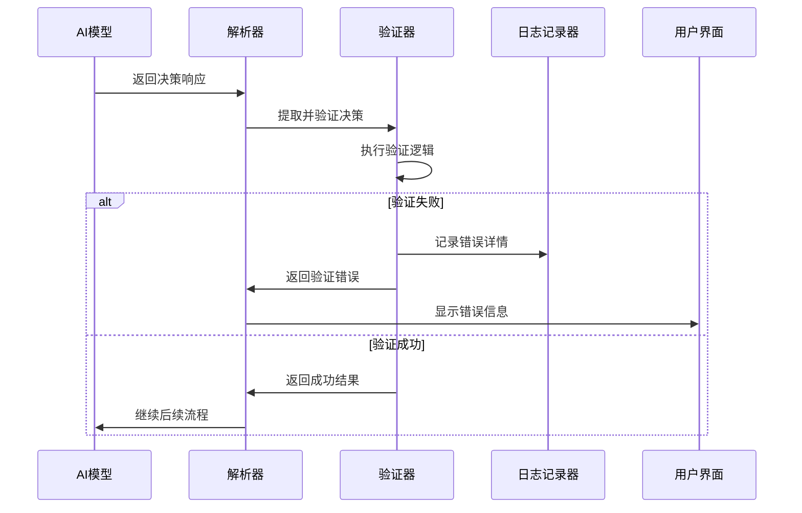
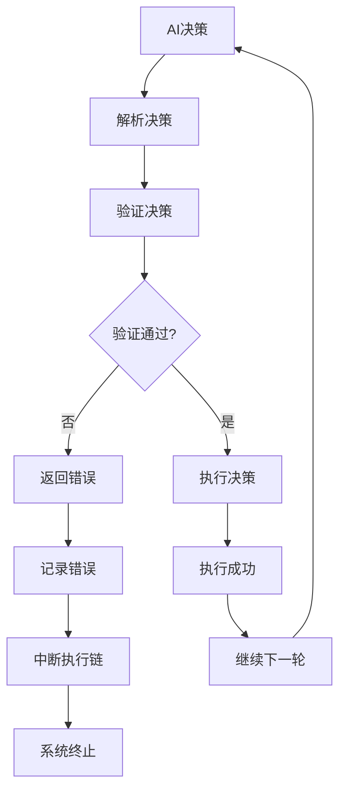
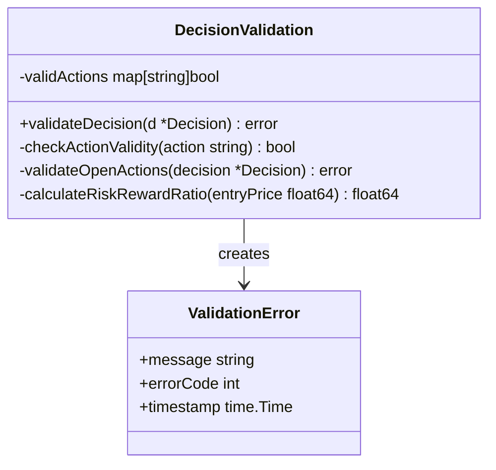
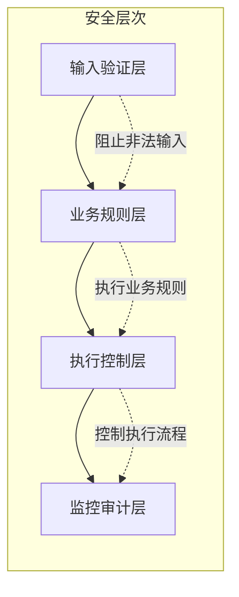

# 动作校验

<cite>
**本文档引用的文件**
- [decision/engine.go](file://decision/engine.go)
- [trader/auto_trader.go](file://trader/auto_trader.go)
- [logger/decision_logger.go](file://logger/decision_logger.go)
- [web/src/App.tsx](file://web/src/App.tsx)
- [main.go](file://main.go)
</cite>

## 目录
1. [简介](#简介)
2. [系统架构概览](#系统架构概览)
3. [validateDecision函数详解](#validatedecision函数详解)
4. [动作验证机制](#动作验证机制)
5. [错误处理流程](#错误处理流程)
6. [执行链中断机制](#执行链中断机制)
7. [代码示例与判断逻辑](#代码示例与判断逻辑)
8. [系统行为保障](#系统行为保障)
9. [总结](#总结)

## 简介

nofx项目中的决策验证层是确保AI交易系统安全性和确定性的关键组件。该系统通过严格的动作校验机制，防止非法交易指令的执行，保障系统的稳定运行。validateDecision函数作为核心验证器，负责验证AI返回的交易动作是否符合预定义的安全规范。

## 系统架构概览

决策验证系统采用分层架构设计，包含以下核心组件：

**图表来源**
- [decision/engine.go](file://decision/engine.go#L71-L81)
- [trader/auto_trader.go](file://trader/auto_trader.go#L287-L323)

## validateDecision函数详解

validateDecision函数是动作校验的核心实现，位于决策引擎模块中。该函数对单个交易决策进行全面验证，确保其符合系统安全规范。

### 函数签名与结构

validateDecision函数接收四个参数：
- `d *Decision`：待验证的交易决策对象
- `accountEquity float64`：账户净值
- `btcEthLeverage int`：BTC/ETH最大杠杆倍数
- `altcoinLeverage int`：山寨币最大杠杆倍数

### 验证流程图

**图表来源**
- [decision/engine.go](file://decision/engine.go#L533-L622)

**章节来源**
- [decision/engine.go](file://decision/engine.go#L533-L622)

## 动作验证机制

### 有效动作集合验证

系统定义了六种合法的交易动作类型：

| 动作类型 | 描述 | 用途 |
|---------|------|------|
| `open_long` | 开多头仓位 | 建立买入持仓 |
| `open_short` | 开空头仓位 | 建立卖出持仓 |
| `close_long` | 平多头仓位 | 平掉买入持仓 |
| `close_short` | 平空头仓位 | 平掉卖出持仓 |
| `hold` | 持仓不动 | 保持现有仓位不变 |
| `wait` | 观望等待 | 暂时不进行任何操作 |

### 开仓操作的完整验证

对于开仓操作（open_long和open_short），系统实施多层次验证：

#### 1. 杠杆倍数验证

**图表来源**
- [decision/engine.go](file://decision/engine.go#L545-L550)

#### 2. 仓位价值验证
系统根据币种不同设置不同的仓位价值上限：

| 币种类型 | 最大仓位价值 | 杠杆上限 |
|---------|-------------|----------|
| BTC/ETH | 账户净值的10倍 | 配置的BTC/ETH杠杆 |
| 山寨币 | 账户净值的1.5倍 | 配置的山寨币杠杆 |

#### 3. 止损止盈合理性验证
- **做多时**：止损价必须小于止盈价
- **做空时**：止损价必须大于止盈价

#### 4. 风险回报比验证
系统要求风险回报比必须≥3.0:1，确保交易的经济合理性。

**章节来源**
- [decision/engine.go](file://decision/engine.go#L533-L622)

## 错误处理流程

### 错误信息格式化

系统采用统一的错误信息格式，便于调试和监控：

**图表来源**
- [decision/engine.go](file://decision/engine.go#L433-L458)
- [trader/auto_trader.go](file://trader/auto_trader.go#L287-L323)

### 错误分类与处理

#### 1. 语法错误
- JSON格式错误
- 缺少必需字段
- 数据类型不匹配

#### 2. 语义错误
- 无效的动作类型
- 杠杆超出限制
- 仓位价值超限
- 止损止盈不合理

#### 3. 业务逻辑错误
- 风险回报比过低
- 仓位叠加超限
- 保证金使用率过高

**章节来源**
- [decision/engine.go](file://decision/engine.go#L433-L458)
- [trader/auto_trader.go](file://trader/auto_trader.go#L287-L323)

## 执行链中断机制

### 验证失败的处理策略

当validateDecision函数检测到无效动作时，会立即返回错误，阻止后续执行链的继续：

**图表来源**
- [decision/engine.go](file://decision/engine.go#L501-L508)
- [trader/auto_trader.go](file://trader/auto_trader.go#L357-L400)

### 错误传播机制

系统实现了完整的错误传播链：

1. **AI层错误**：AI模型返回无效决策
2. **解析层错误**：JSON解析失败
3. **验证层错误**：动作验证失败
4. **执行层错误**：具体交易执行失败

每个层级都会捕获并处理相应类型的错误，确保错误不会在系统中传播。

**章节来源**
- [decision/engine.go](file://decision/engine.go#L433-L458)
- [trader/auto_trader.go](file://trader/auto_trader.go#L357-L400)

## 代码示例与判断逻辑

### 有效动作判断示例

以下展示了validateDecision函数中动作验证的核心逻辑：

**图表来源**
- [decision/engine.go](file://decision/engine.go#L533-L556)

### 无效动作处理示例

当系统检测到非法动作时，会执行以下处理流程：

1. **立即终止**：停止执行链
2. **错误记录**：保存详细的错误信息
3. **用户通知**：通过Web界面显示错误
4. **日志审计**：记录到决策日志文件

**章节来源**
- [decision/engine.go](file://decision/engine.go#L533-L556)
- [trader/auto_trader.go](file://trader/auto_trader.go#L357-L400)

## 系统行为保障

### 确定性保证

动作校验机制确保系统行为的确定性：

1. **输入验证**：所有外部输入都经过严格验证
2. **边界检查**：防止数值溢出和异常值
3. **状态一致性**：维护系统状态的一致性
4. **错误隔离**：错误不会影响其他组件

### 安全性保障

系统实施多重安全保障措施：

**图表来源**
- [decision/engine.go](file://decision/engine.go#L533-L622)
- [logger/decision_logger.go](file://logger/decision_logger.go#L74-L118)

### 监控与告警

系统提供了完善的监控机制：

- **实时监控**：Web界面显示执行状态
- **错误统计**：统计各类错误的发生频率
- **性能指标**：跟踪验证和执行的性能
- **历史记录**：保存完整的决策和执行记录

**章节来源**
- [web/src/App.tsx](file://web/src/App.tsx#L660-L686)
- [logger/decision_logger.go](file://logger/decision_logger.go#L74-L118)

## 总结

nofx项目的动作校验机制通过validateDecision函数实现了全面而严格的交易决策验证。该机制具有以下特点：

1. **全面覆盖**：验证所有可能的交易动作类型
2. **多层次防护**：从语法到业务逻辑的全方位验证
3. **快速响应**：验证失败时立即中断执行链
4. **详细记录**：完整的错误信息和执行日志
5. **用户友好**：清晰的错误提示和状态显示

这种设计确保了AI交易系统的安全性、可靠性和可维护性，为自动化交易提供了坚实的技术保障。通过严格的动作校验，系统能够有效防止非法指令的执行，保障用户的资金安全和系统的稳定运行。