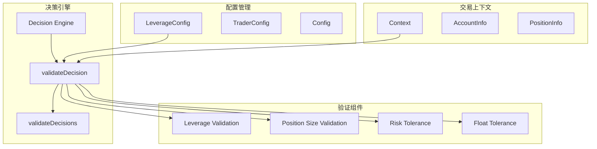
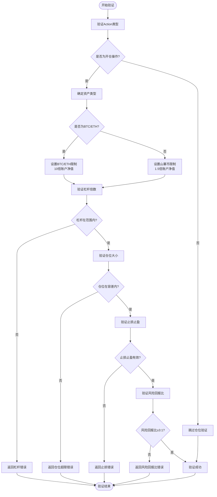
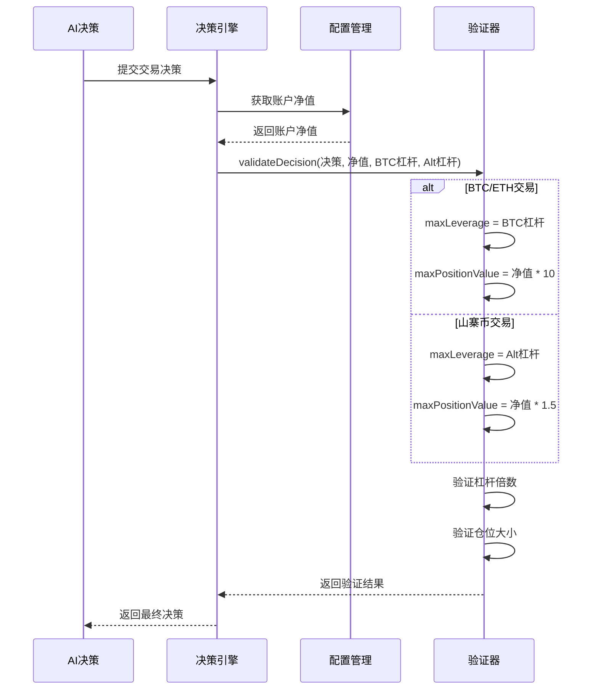
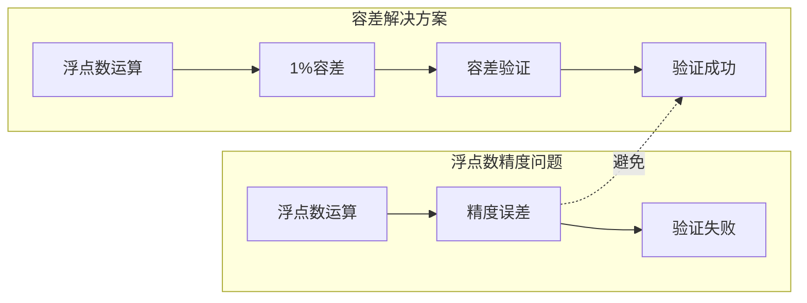
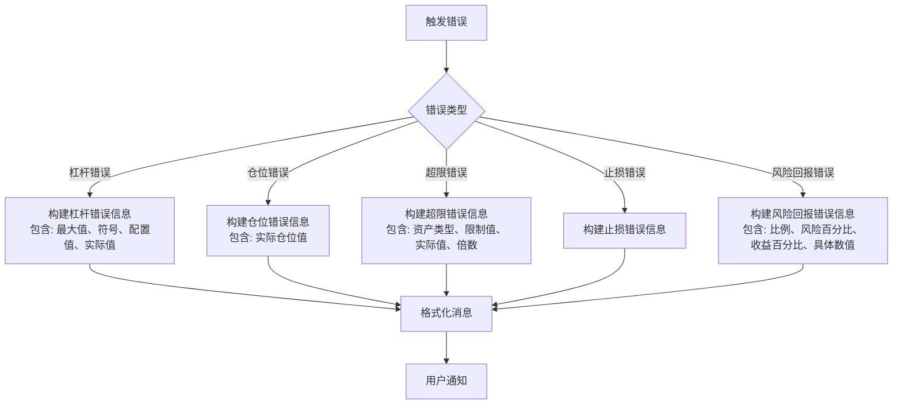
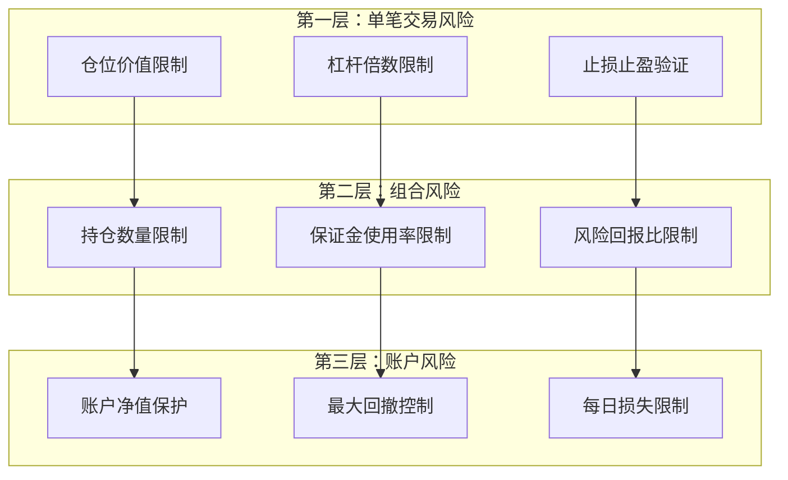
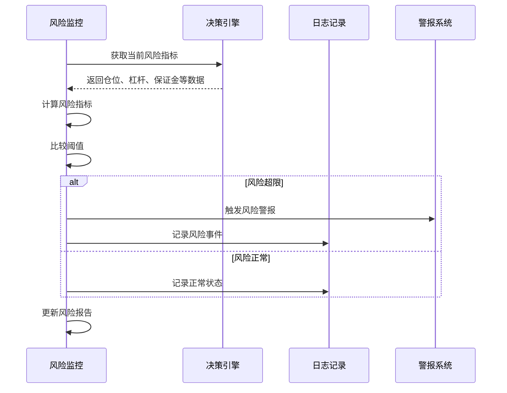
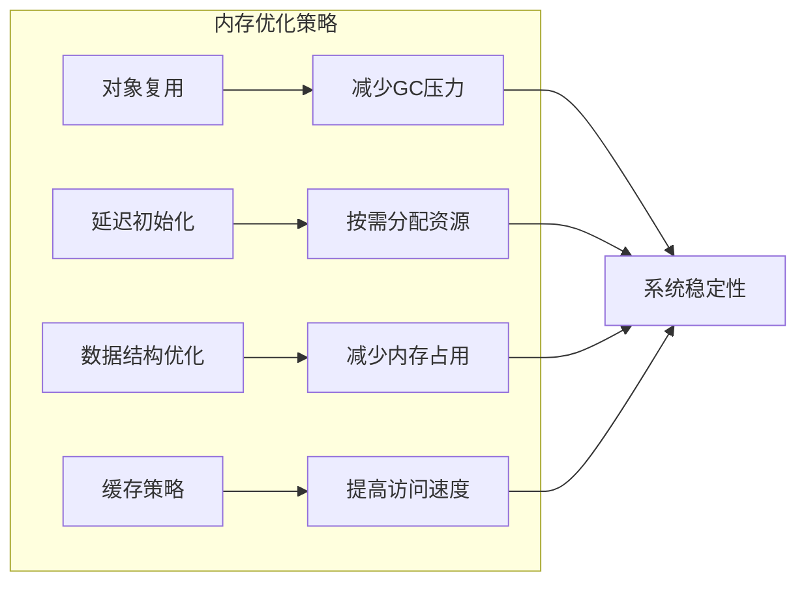

# 杠杆与仓位校验

<cite>
**本文档引用的文件**
- [decision/engine.go](file://decision/engine.go)
- [config/config.go](file://config/config.go)
- [trader/auto_trader.go](file://trader/auto_trader.go)
- [README.zh-CN.md](file://README.zh-CN.md)
- [README.md](file://README.md)
</cite>

## 目录
1. [简介](#简介)
2. [系统架构概览](#系统架构概览)
3. [核心校验逻辑](#核心校验逻辑)
4. [杠杆倍数动态配置](#杠杆倍数动态配置)
5. [仓位规模验证机制](#仓位规模验证机制)
6. [浮点数容差机制](#浮点数容差机制)
7. [错误处理与提示](#错误处理与提示)
8. [风险控制策略](#风险控制策略)
9. [性能优化考虑](#性能优化考虑)
10. [总结](#总结)

## 简介

nofx项目实现了一套精密的风险控制系统，专门针对加密货币期货交易中的杠杆倍数和仓位规模进行严格校验。该系统通过动态配置不同交易标的的杠杆上限和仓位限制，结合浮点数容差机制，确保交易决策的安全性和准确性。

系统的核心设计理念是"高杠杆+小仓位"的风险分散策略，通过严格的验证机制防止因精度问题导致的误判，同时为AI交易提供灵活的杠杆配置选项。

## 系统架构概览



**图表来源**
- [decision/engine.go](file://decision/engine.go#L529-L622)
- [config/config.go](file://config/config.go#L30-L40)

## 核心校验逻辑

### 决策验证流程

系统采用多层次的验证机制，确保每个交易决策都符合预设的风险控制标准：



**图表来源**
- [decision/engine.go](file://decision/engine.go#L529-L622)

**章节来源**
- [decision/engine.go](file://decision/engine.go#L529-L622)

## 杠杆倍数动态配置

### 配置结构设计

系统通过分层配置实现了灵活的杠杆管理：

| 配置层级 | 字段名 | 默认值 | 说明 |
|---------|--------|--------|------|
| 主配置 | `Leverage.BTCETHLeverage` | 5 | BTC/ETH最大杠杆倍数 |
| 主配置 | `Leverage.AltcoinLeverage` | 5 | 山寨币最大杠杆倍数 |
| 交易上下文 | `BTCETHLeverage` | 动态注入 | 当前BTC/ETH杠杆配置 |
| 交易上下文 | `AltcoinLeverage` | 动态注入 | 当前山寨币杠杆配置 |

### 动态杠杆应用机制

系统根据交易标的自动选择相应的杠杆上限：



**图表来源**
- [decision/engine.go](file://decision/engine.go#L540-L550)
- [config/config.go](file://config/config.go#L180-L195)

**章节来源**
- [decision/engine.go](file://decision/engine.go#L540-L550)
- [config/config.go](file://config/config.go#L180-L195)

## 仓位规模验证机制

### 仓位价值计算

系统采用账户净值乘数的方式来确定单笔交易的仓位上限：

| 交易标的 | 杠杆上限 | 仓位价值系数 | 最大仓位价值 | 保证金占用 |
|---------|---------|-------------|-------------|-----------|
| BTC/ETH | `BTCETHLeverage` | 10x | `accountEquity * 10` | 10% |
| 山寨币 | `AltcoinLeverage` | 1.5x | `accountEquity * 1.5` | 15% |

### 验证算法实现

仓位验证的核心算法包含以下步骤：

1. **基础验证**：确保仓位大小大于0
2. **杠杆验证**：检查杠杆倍数在允许范围内
3. **仓位验证**：比较仓位价值与账户净值乘数
4. **容差处理**：引入1%容差避免浮点数精度问题

**章节来源**
- [decision/engine.go](file://decision/engine.go#L558-L586)

## 浮点数容差机制

### 容差设计原理

系统引入1%的浮点数容差是为了应对现代计算机浮点数运算中的精度误差问题。这种设计具有以下优势：



### 容差计算实现

容差机制的具体实现方式：

```go
// 计算容差值
tolerance := maxPositionValue * 0.01 // 1%容差

// 验证仓位大小
if d.PositionSizeUSD > maxPositionValue+tolerance {
    // 返回错误信息
}
```

### 容差效果对比

| 场景 | 无容差验证 | 有容差验证 | 结果差异 |
|------|-----------|-----------|----------|
| 实际仓位: 1000U | 超限 | 通过 | 避免误判 |
| 计算误差: 0.0001U | 超限 | 通过 | 精度容忍 |
| 边界情况: 1500U vs 1501.5U | 超限 | 通过 | 容忍微小差异 |

**章节来源**
- [decision/engine.go](file://decision/engine.go#L562-L565)

## 错误处理与提示

### 错误分类体系

系统实现了详细的错误分类和用户友好的错误提示：

| 错误类型 | 错误代码 | 错误信息模板 | 触发条件 |
|---------|---------|-------------|----------|
| 杠杆错误 | LeverageOutOfRange | "杠杆必须在1-{max}之间（{symbol}，当前配置上限{max}倍）: {value}" | 杠杆超出范围 |
| 仓位错误 | PositionSizeInvalid | "仓位大小必须大于0: {value}" | 仓位<=0 |
| 超限错误 | PositionValueExceeded | "{asset}单币种仓位价值不能超过{limit} USDT（{multiplier}倍账户净值），实际: {actual}" | 仓位超限 |
| 止损错误 | InvalidStopLoss | "止损和止盈必须大于0" | 止损<=0或止盈<=0 |
| 风险回报错误 | RiskRewardRatioLow | "风险回报比过低({ratio}:1)，必须≥3.0:1 [风险:{risk}% 收益:{reward}%] [止损:{stopLoss} 止盈:{takeProfit}]" | 风险回报比<3:1 |

### 错误信息构造

系统采用参数化的错误信息构造方式，提供详细的诊断信息：



**图表来源**
- [decision/engine.go](file://decision/engine.go#L558-L586)

**章节来源**
- [decision/engine.go](file://decision/engine.go#L558-L586)

## 风险控制策略

### 多层次风险防护

系统实现了多层次的风险控制策略：



### 风险参数配置

| 风险参数 | BTC/ETH | 山寨币 | 配置说明 |
|---------|---------|--------|----------|
| 单币仓位上限 | 10倍账户净值 | 1.5倍账户净值 | 防止单币种过度暴露 |
| 最大杠杆 | 50x | 20x | 根据资产特性设定 |
| 保证金使用率 | ≤90% | ≤90% | 预留缓冲空间 |
| 风险回报比 | ≥3:1 | ≥3:1 | 硬性要求 |
| 最大持仓数量 | 3个 | 3个 | 分散投资 |

### 风险监控机制

系统实时监控各项风险指标：



**章节来源**
- [README.zh-CN.md](file://README.zh-CN.md#L1095-L1151)
- [README.md](file://README.md#L147-L182)

## 性能优化考虑

### 验证性能优化

系统在保证准确性的同时，采用了多种性能优化策略：

1. **早期退出机制**：一旦发现错误立即返回，避免不必要的计算
2. **缓存常用计算**：缓存账户净值等静态数据
3. **批量验证**：支持批量验证多个决策
4. **条件分支优化**：根据常见场景优化执行路径

### 内存使用优化



### 并发处理能力

系统支持并发验证多个交易决策，提高整体处理效率：

- **goroutine池**：限制并发数量避免资源耗尽
- **通道通信**：安全地在协程间传递验证结果
- **原子操作**：保护共享状态的一致性

## 总结

nofx项目的杠杆与仓位校验系统体现了现代量化交易系统的设计精髓：

### 核心优势

1. **精确的风险控制**：通过动态配置和浮点数容差机制，确保风险控制的精确性
2. **灵活的配置管理**：支持不同交易标的和账户类型的差异化配置
3. **完善的错误处理**：提供详细的错误信息帮助用户快速定位问题
4. **高效的性能表现**：优化的算法和并发处理确保系统响应速度

### 设计亮点

- **1%容差机制**：巧妙解决了浮点数精度问题，避免误判
- **资产分类验证**：根据BTC/ETH和山寨币的不同特性设置差异化限制
- **多层次验证**：从单笔交易到组合风险的全方位控制
- **用户友好提示**：清晰的错误信息帮助用户理解和修正问题

### 应用价值

这套校验系统不仅保证了交易的安全性，还为AI交易提供了可靠的基础设施。通过严格的验证机制，系统能够有效控制单笔交易的风险敞口，防止因精度问题或配置错误导致的重大损失，为量化交易的安全运行提供了坚实保障。