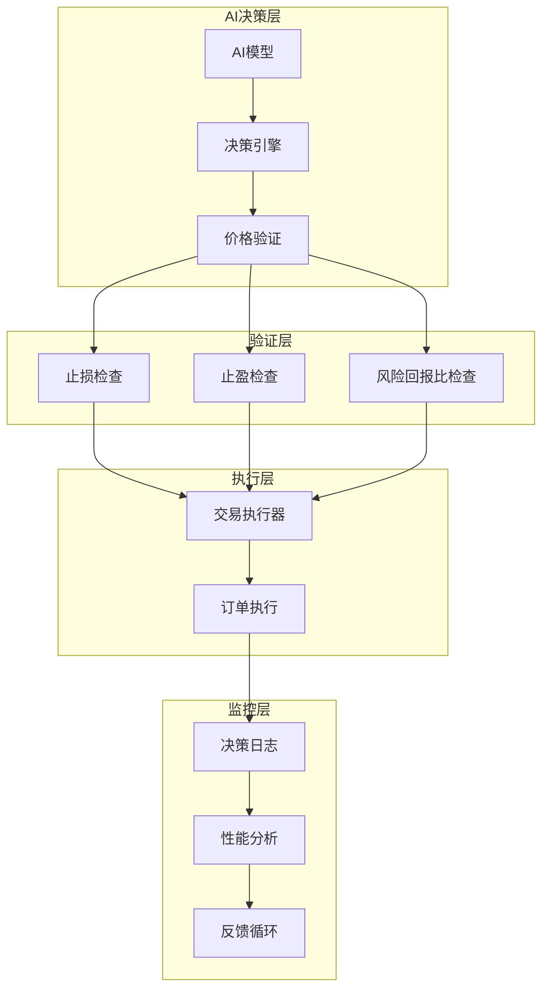
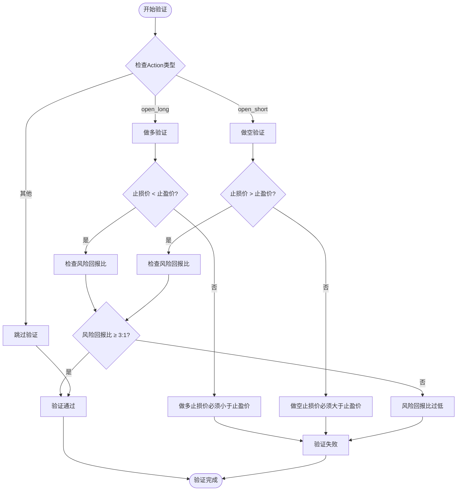
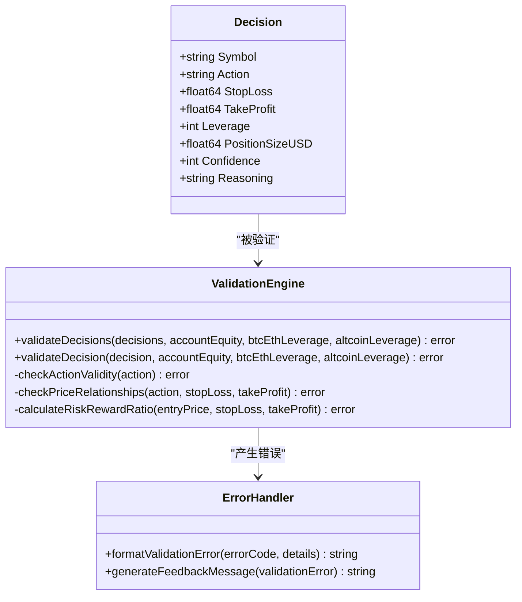
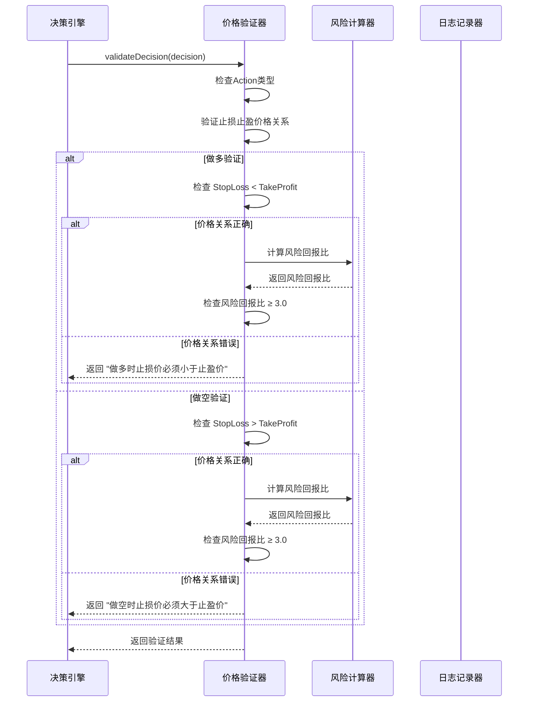
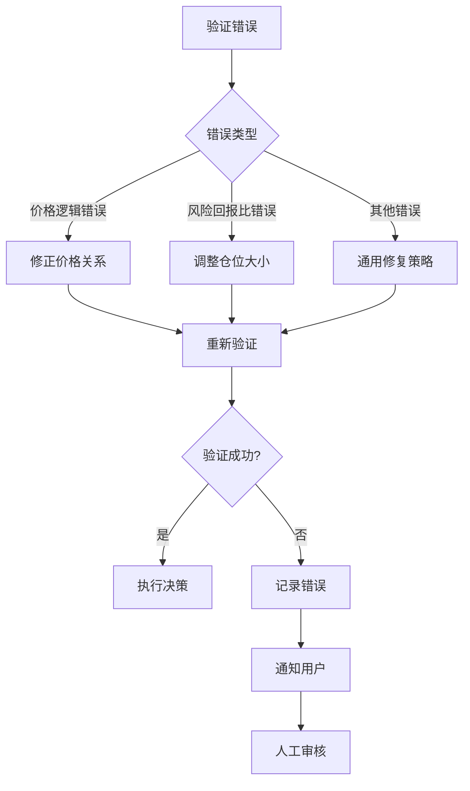
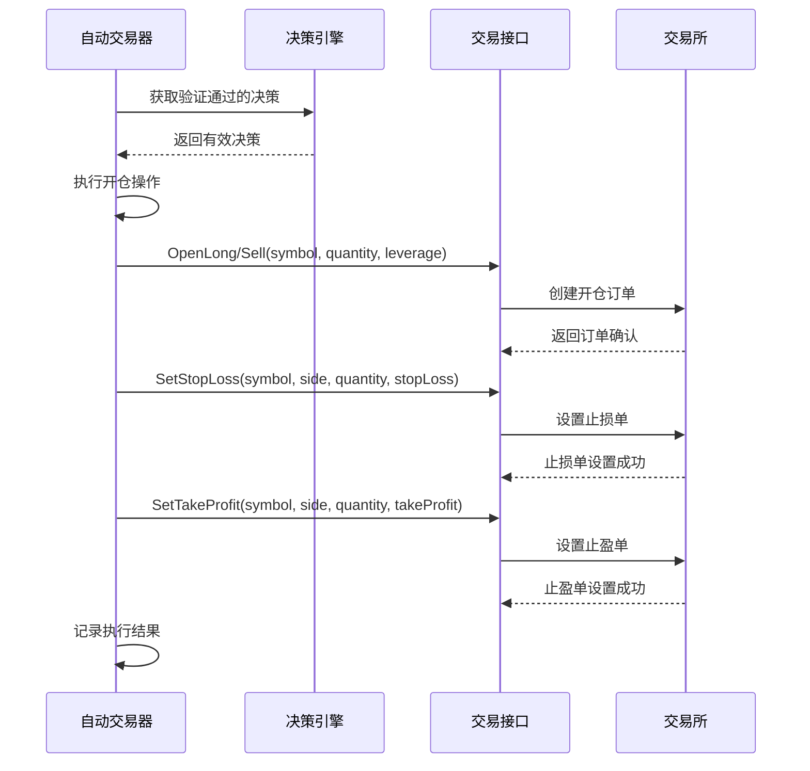
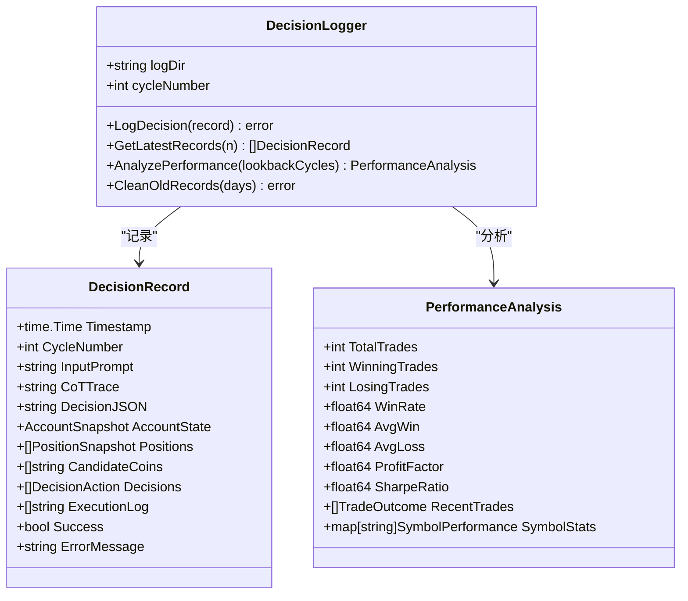

# 止损止盈逻辑校验

<cite>
**本文档引用的文件**
- [decision/engine.go](file://decision/engine.go)
- [logger/decision_logger.go](file://logger/decision_logger.go)
- [trader/auto_trader.go](file://trader/auto_trader.go)
- [trader/interface.go](file://trader/interface.go)
- [manager/trader_manager.go](file://manager/trader_manager.go)
</cite>

## 目录
1. [简介](#简介)
2. [系统架构概览](#系统架构概览)
3. [止损止盈校验核心逻辑](#止损止盈校验核心逻辑)
4. [决策验证流程](#决策验证流程)
5. [错误反馈机制](#错误反馈机制)
6. [交易执行中的止损止盈设置](#交易执行中的止损止盈设置)
7. [性能监控与分析](#性能监控与分析)
8. [故障排除指南](#故障排除指南)
9. [总结](#总结)

## 简介

nofx项目是一个基于人工智能的加密货币交易系统，其中止损（StopLoss）和止盈（TakeProfit）价格逻辑的校验是确保交易策略有效性的关键环节。该系统通过严格的验证规则防止AI输出颠倒价格导致的反向开仓或无效订单，从而保护交易安全性和系统稳定性。

## 系统架构概览



**图表来源**
- [decision/engine.go](file://decision/engine.go#L529-L622)
- [trader/auto_trader.go](file://trader/auto_trader.go#L521-L694)

## 止损止盈校验核心逻辑

### 基本校验规则

系统在决策验证阶段实施严格的止损止盈价格校验，确保做多和做空时的价格逻辑正确性：



**图表来源**
- [decision/engine.go](file://decision/engine.go#L529-L622)

### 校验规则详解

#### 1. 做多时的价格逻辑校验

对于做多操作（`open_long`），系统确保：
- 止损价（StopLoss）必须低于止盈价（TakeProfit）
- 防止AI输出颠倒价格导致反向开仓
- 保证风险回报比满足硬性约束

#### 2. 做空时的价格逻辑校验

对于做空操作（`open_short`），系统确保：
- 止损价（StopLoss）必须高于止盈价（TakeProfit）
- 防止做空时出现错误的价格关系
- 维护正确的风险控制逻辑

#### 3. 风险回报比验证

系统不仅检查价格关系，还计算实际的风险回报比：

| 参数 | 计算公式 | 硬性要求 |
|------|----------|----------|
| 风险百分比 | `(入场价 - 止损价) / 入场价 × 100%` | 无限制 |
| 收益百分比 | `(止盈价 - 入场价) / 入场价 × 100%` | 无限制 |
| 风险回报比 | 收益百分比 / 风险百分比 | 必须 ≥ 3.0 |

**节来源**
- [decision/engine.go](file://decision/engine.go#L529-L622)

## 决策验证流程

### 验证函数架构



**图表来源**
- [decision/engine.go](file://decision/engine.go#L529-L622)

### 验证步骤详解

#### 1. 动作有效性检查

系统首先验证决策的动作类型是否有效：

| 有效动作 | 描述 |
|----------|------|
| `open_long` | 开多仓 |
| `open_short` | 开空仓 |
| `close_long` | 平多仓 |
| `close_short` | 平空仓 |
| `hold` | 持仓 |
| `wait` | 观望 |

#### 2. 价格关系验证

对于开仓操作，系统执行严格的价格关系验证：



**图表来源**
- [decision/engine.go](file://decision/engine.go#L529-L622)

**节来源**
- [decision/engine.go](file://decision/engine.go#L529-L622)

## 错误反馈机制

### 错误分类与处理

系统实现了完善的错误反馈机制，帮助快速定位和解决AI决策中的逻辑错误：

#### 1. 价格逻辑错误

当AI输出的价格关系错误时，系统返回明确的错误信息：

```json
{
  "error": "决策 #1 验证失败: 做多时止损价必须小于止盈价",
  "details": {
    "symbol": "BTCUSDT",
    "action": "open_long",
    "stop_loss": 95000.0,
    "take_profit": 96000.0,
    "reason": "止损价高于止盈价，违反做多逻辑"
  }
}
```

#### 2. 风险回报比错误

当风险回报比不满足要求时，系统提供详细的分析：

```json
{
  "error": "决策 #1 验证失败: 风险回报比过低(2.50:1)，必须≥3.0:1",
  "details": {
    "symbol": "ETHUSDT",
    "action": "open_short",
    "stop_loss": 3000.0,
    "take_profit": 2800.0,
    "risk_percent": 2.50,
    "reward_percent": 7.50,
    "risk_reward_ratio": 2.50
  }
}
```

### 错误恢复策略



**图表来源**
- [decision/engine.go](file://decision/engine.go#L429-L437)

**节来源**
- [decision/engine.go](file://decision/engine.go#L429-L437)

## 交易执行中的止损止盈设置

### 执行流程

在成功通过验证后，系统将止损止盈设置应用到实际交易中：



**图表来源**
- [trader/auto_trader.go](file://trader/auto_trader.go#L602-L694)

### 实际执行代码示例

系统在执行开仓操作时，会按照以下顺序设置止损止盈：

1. **开仓执行**：先创建基础仓位
2. **止损设置**：设置止损单保护潜在损失
3. **止盈设置**：设置止盈单锁定预期收益

这种顺序确保了即使止损触发，也不会影响止盈单的有效性。

**节来源**
- [trader/auto_trader.go](file://trader/auto_trader.go#L602-L694)

## 性能监控与分析

### 决策日志记录

系统通过决策日志记录器跟踪每次决策的执行情况：



**图表来源**
- [logger/decision_logger.go](file://logger/decision_logger.go#L10-L118)

### 夏普比率计算

系统通过夏普比率评估交易策略的有效性：

| 组件 | 计算方法 | 正面含义 |
|------|----------|----------|
| 平均收益 | 周期收益率的平均值 | 收益越高越好 |
| 收益波动率 | 周期收益率的标准差 | 波动越小越好 |
| 夏普比率 | 平均收益 / 收益波动率 | 越高越好 |

**节来源**
- [logger/decision_logger.go](file://logger/decision_logger.go#L567-L611)

## 故障排除指南

### 常见问题及解决方案

#### 1. 止损止盈验证失败

**症状**：决策验证返回"止损价必须小于止盈价"错误

**原因分析**：
- AI输出的价格顺序颠倒
- 输入数据格式错误
- 浮点数精度问题

**解决方案**：
1. 检查AI输出的JSON格式
2. 验证价格字段的数据类型
3. 确保价格字段的数值范围合理

#### 2. 风险回报比不达标

**症状**：决策验证返回"风险回报比过低"错误

**原因分析**：
- 止损距离设置过大
- 止盈目标设置过小
- 市场波动性过高

**解决方案**：
1. 调整止损距离至合理范围
2. 提高止盈目标的吸引力
3. 结合市场分析调整仓位大小

#### 3. 交易执行失败

**症状**：止损止盈设置后交易仍然失败

**原因分析**：
- 交易所API连接问题
- 权限配置错误
- 网络延迟导致的超时

**解决方案**：
1. 检查API密钥配置
2. 验证网络连接稳定性
3. 增加重试机制

### 调试工具和技巧

#### 1. 决策日志分析

通过分析决策日志可以快速定位问题：

```bash
# 查看最近的决策记录
./nofx logs latest 10

# 分析特定日期的交易表现
./nofx logs analyze 2024-01-15

# 清理旧的日志文件
./nofx logs cleanup 30
```

#### 2. 实时监控

系统提供了实时监控功能：

```bash
# 查看系统状态
./nofx status

# 查看账户信息
./nofx account

# 查看持仓情况
./nofx positions
```

## 总结

nofx项目的止损止盈逻辑校验系统通过多层次的验证机制确保交易的安全性和有效性：

### 核心优势

1. **严格的验证规则**：确保做多时止损价低于止盈价，做空时止损价高于止盈价
2. **智能的风险控制**：强制要求风险回报比≥3:1的硬性约束
3. **完善的错误反馈**：提供详细的错误信息帮助快速定位问题
4. **全面的监控体系**：通过决策日志和性能分析跟踪交易效果

### 关键作用

- **防止AI逻辑错误**：避免因AI输出颠倒价格导致的反向开仓
- **保护交易资金**：通过严格的风险控制防止重大损失
- **提高交易质量**：确保只有高质量的交易决策被执行
- **支持系统学习**：通过错误反馈机制帮助AI不断改进

该系统的设计体现了现代量化交易系统中风险管理的重要性，为AI驱动的自动化交易提供了坚实的技术保障。