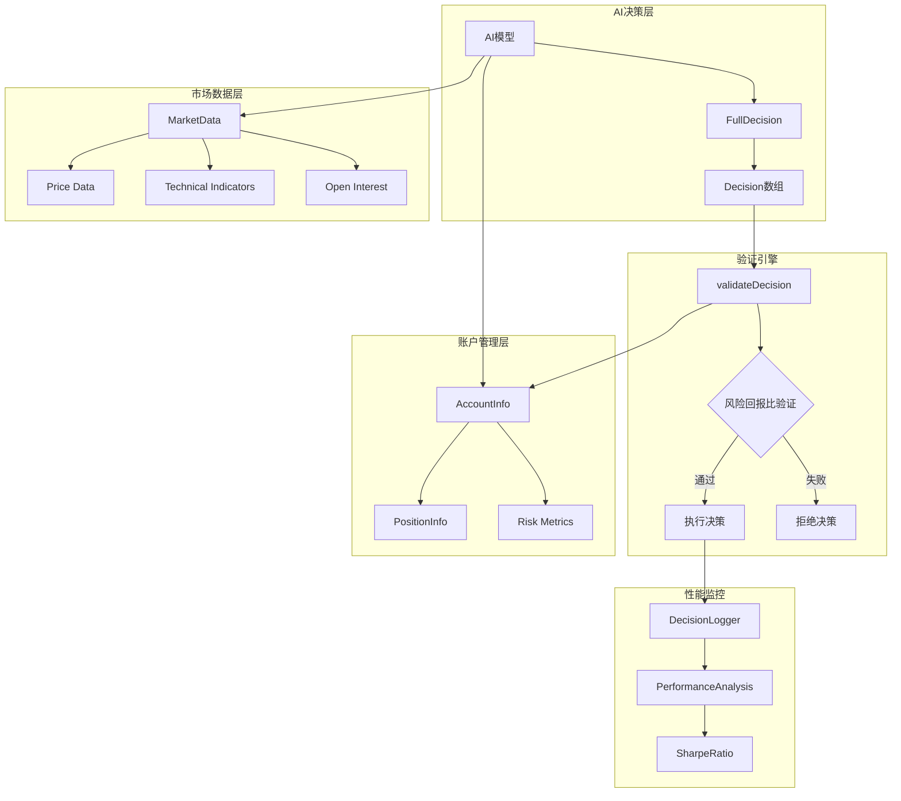
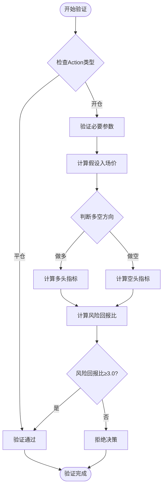
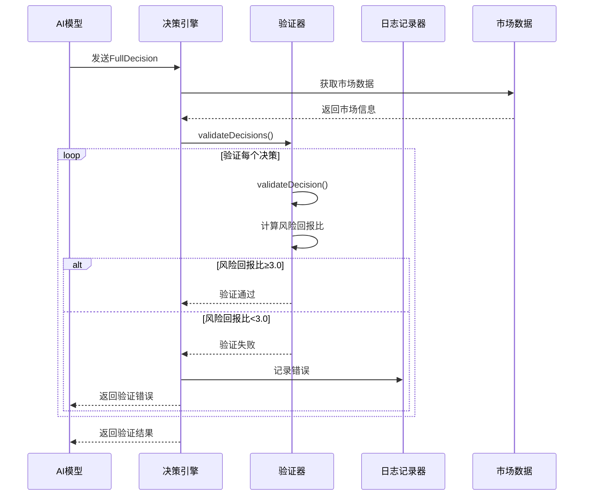
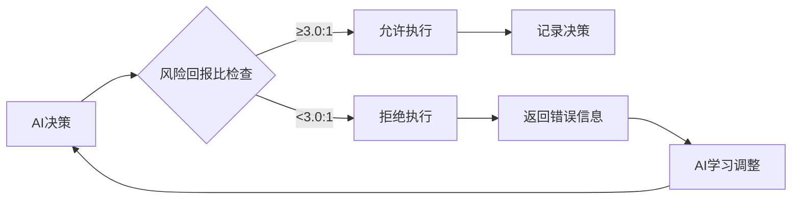
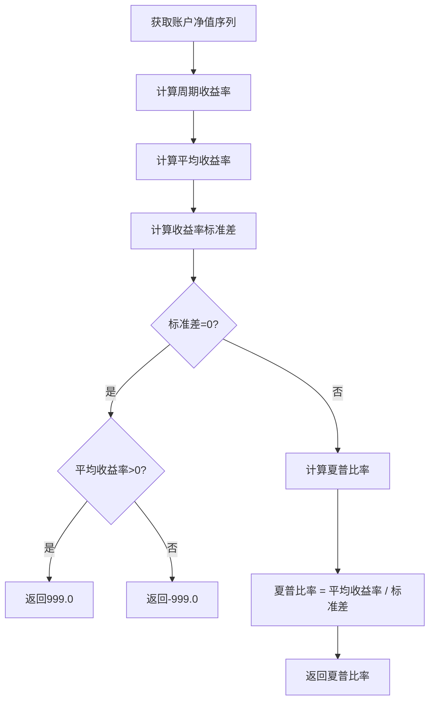

# 风险回报比验证机制深度解析

<cite>
**本文档引用的文件**
- [decision/engine.go](file://decision/engine.go)
- [config/config.go](file://config/config.go)
- [market/data.go](file://market/data.go)
- [logger/decision_logger.go](file://logger/decision_logger.go)
- [manager/trader_manager.go](file://manager/trader_manager.go)
- [trader/interface.go](file://trader/interface.go)
</cite>

## 目录
1. [引言](#引言)
2. [系统架构概览](#系统架构概览)
3. [风险回报比验证核心机制](#风险回报比验证核心机制)
4. [数学计算原理](#数学计算原理)
5. [决策验证流程](#决策验证流程)
6. [硬约束设计](#硬约束设计)
7. [性能监控与反馈](#性能监控与反馈)
8. [实际应用示例](#实际应用示例)
9. [故障排除指南](#故障排除指南)
10. [总结](#总结)

## 引言

nofx项目实现了一套严格的决策验证层，专门针对风险回报比（Risk Reward Ratio）进行数学验证。该系统通过硬约束确保每笔交易都具备足够的盈利潜力以覆盖潜在亏损，这是量化交易中风险管理的核心原则。

本系统的核心理念是：**只有当潜在收益至少是潜在风险的三倍时，才允许执行交易决策**。这种3:1的风险回报比阈值不仅是一个数学约束，更是系统自我进化的重要驱动力。

## 系统架构概览



**图表来源**
- [decision/engine.go](file://decision/engine.go#L1-L624)
- [market/data.go](file://market/data.go#L1-L553)
- [logger/decision_logger.go](file://logger/decision_logger.go#L1-L612)

## 风险回报比验证核心机制

### 验证函数架构

系统的核心验证逻辑集中在`validateDecision`函数中，该函数负责：

1. **参数完整性验证**：确保所有必要的交易参数都已提供
2. **风险回报比计算**：基于假设入场价计算实际风险和收益百分比
3. **硬约束检查**：强制要求风险回报比不低于3.0:1



**图表来源**
- [decision/engine.go](file://decision/engine.go#L529-L622)

**章节来源**
- [decision/engine.go](file://decision/engine.go#L529-L622)

## 数学计算原理

### 假设入场价计算

系统采用特定的假设入场价计算方法，这是风险回报比验证的基础：

#### 做多时的假设入场价
对于做多交易，系统假设在止损价和止盈价之间的20%位置入场：
```
entryPrice_long = stopLoss + (takeProfit - stopLoss) × 0.2
```

#### 做空时的假设入场价  
对于做空交易，系统同样假设在止损价和止盈价之间的20%位置入场：
```
entryPrice_short = stopLoss - (stopLoss - takeProfit) × 0.2
```

### 风险百分比计算

#### 做多时的风险百分比
```
riskPercent_long = (entryPrice - stopLoss) / entryPrice × 100%
```

#### 做空时的风险百分比
```
riskPercent_short = (stopLoss - entryPrice) / entryPrice × 100%
```

### 收益百分比计算

#### 做多时的收益百分比
```
rewardPercent_long = (takeProfit - entryPrice) / entryPrice × 100%
```

#### 做空时的收益百分比
```
rewardPercent_short = (entryPrice - takeProfit) / entryPrice × 100%
```

### 风险回报比计算

最终的风险回报比通过以下公式计算：
```
riskRewardRatio = rewardPercent / riskPercent
```

**章节来源**
- [decision/engine.go](file://decision/engine.go#L588-L622)

## 决策验证流程

### 完整验证管道



**图表来源**
- [decision/engine.go](file://decision/engine.go#L450-L488)
- [decision/engine.go](file://decision/engine.go#L529-L556)

### 参数验证规则

系统对每个决策参数都有严格的验证规则：

| 参数类别 | 验证规则 | 错误处理 |
|---------|---------|---------|
| Action类型 | 必须为open_long、open_short、close_long、close_short、hold、wait之一 | 返回无效action错误 |
| 杠杆倍数 | 必须在有效范围内（BTC/ETH: 1-50, 山寨币: 1-20） | 返回杠杆范围错误 |
| 仓位大小 | 必须大于0且不超过账户净值的限制 | 返回仓位超限错误 |
| 止损止盈 | 必须大于0且符合多空方向的逻辑关系 | 返回止损止盈错误 |
| 风险回报比 | 必须≥3.0:1 | 返回风险回报比不足错误 |

**章节来源**
- [decision/engine.go](file://decision/engine.go#L529-L556)

## 硬约束设计

### 风险回报比硬约束

系统实施的硬约束是整个验证机制的核心：



**图表来源**
- [decision/engine.go](file://decision/engine.go#L610-L622)

### 约束的具体实现

当风险回报比低于3.0时，系统会返回详细的错误信息：

```
风险回报比过低(%.2f:1)，必须≥3.0:1 [风险:%.2f%% 收益:%.2f%%] [止损:%.2f 止盈:%.2f]
```

这个错误信息包含了：
- 实际的风险回报比数值
- 计算出的风险百分比
- 计算出的收益百分比
- 具体的止损和止盈价格

### 系统自我进化机制

基于夏普比率的自我进化机制：

| 夏普比率范围 | 系统行为 | AI策略调整 |
|-------------|---------|-----------|
| < -0.5 | 停止交易，连续观望6个周期 | 深度反思交易频率、持仓时间、信号强度 |
| -0.5 ~ 0 | 严格控制：只做信心度>80的交易 | 减少交易频率，提高持仓时间 |
| 0 ~ 0.7 | 维持当前策略 | 保持现有行为模式 |
| > 0.7 | 可适度扩大仓位 | 在保持纪律的前提下扩大仓位 |

**章节来源**
- [decision/engine.go](file://decision/engine.go#L265-L283)
- [logger/decision_logger.go](file://logger/decision_logger.go#L563-L610)

## 性能监控与反馈

### 夏普比率计算

系统通过`calculateSharpeRatio`函数计算夏普比率，这是衡量投资组合风险调整后收益的关键指标：



**图表来源**
- [logger/decision_logger.go](file://logger/decision_logger.go#L563-L610)

### 性能分析指标

系统提供全面的性能分析指标：

| 指标名称 | 计算方法 | 意义 |
|---------|---------|------|
| 总交易数 | 所有开仓和平仓的数量 | 反映交易活跃度 |
| 盈利交易数 | 盈利平仓的数量 | 衡量策略盈利能力 |
| 亏损交易数 | 亏损平仓的数量 | 衡量策略风险性 |
| 胜率 | 盈利交易数 / 总交易数 × 100% | 反映策略稳定性 |
| 平均盈利 | 总盈利 / 盈利交易数 | 衡量单笔盈利水平 |
| 平均亏损 | 总亏损 / 亏损交易数 | 衡量单笔亏损水平 |
| 盈亏比 | 总盈利 / 总亏损绝对值 | 衡量风险收益关系 |
| 夏普比率 | (平均收益率 - 无风险利率) / 收益率标准差 | 风险调整后收益 |

**章节来源**
- [logger/decision_logger.go](file://logger/decision_logger.go#L287-L301)
- [logger/decision_logger.go](file://logger/decision_logger.go#L563-L610)

## 实际应用示例

### 示例1：验证通过的决策

假设一个做多决策：
- 符号：BTCUSDT
- 止损价：29000
- 止盈价：32000
- 账户净值：10000 USDT

**计算过程：**
1. 假设入场价：29000 + (32000 - 29000) × 0.2 = 29600
2. 风险百分比：(29600 - 29000) / 29600 × 100% ≈ 2.03%
3. 收益百分比：(32000 - 29600) / 29600 × 100% ≈ 8.11%
4. 风险回报比：8.11% / 2.03% ≈ 3.99

**结果：** 风险回报比为3.99:1，满足≥3.0:1的要求，验证通过。

### 示例2：验证失败的决策

假设另一个做多决策：
- 符号：ETHUSDT
- 止损价：1800
- 止盈价：2000
- 账户净值：5000 USDT

**计算过程：**
1. 假设入场价：1800 + (2000 - 1800) × 0.2 = 1840
2. 风险百分比：(1840 - 1800) / 1840 × 100% ≈ 2.17%
3. 收益百分比：(2000 - 1840) / 1840 × 100% ≈ 8.70%
4. 风险回报比：8.70% / 2.17% ≈ 4.01

**结果：** 尽管风险回报比为4.01:1，仍然可能因为其他约束（如仓位大小、杠杆等）而被拒绝。

### 边界条件示例

**临界点验证：**
- 止损价：10000
- 止盈价：13000
- 入场价：10000 + (13000 - 10000) × 0.2 = 10600
- 风险百分比：(10600 - 10000) / 10600 × 100% ≈ 5.66%
- 收益百分比：(13000 - 10600) / 10600 × 100% ≈ 22.64%
- 风险回报比：22.64% / 5.66% ≈ 4.00

**失败边界：**
- 止损价：10000
- 止盈价：11500
- 入场价：10000 + (11500 - 10000) × 0.2 = 10300
- 风险百分比：(10300 - 10000) / 10300 × 100% ≈ 2.91%
- 收益百分比：(11500 - 10300) / 10300 × 100% ≈ 11.65%
- 风险回报比：11.65% / 2.91% ≈ 3.99（刚好满足）

**章节来源**
- [decision/engine.go](file://decision/engine.go#L588-L622)

## 故障排除指南

### 常见验证错误及解决方案

#### 1. 风险回报比不足错误
**错误信息：** "风险回报比过低(%.2f:1)，必须≥3.0:1"

**可能原因：**
- 止损和止盈设置过于接近
- 市场波动性较低，难以达到3:1的回报比要求
- 入场价假设不合理

**解决方案：**
- 调整止损和止盈价格，增加收益空间
- 结合市场波动性指标（如ATR）设置更合理的止损止盈
- 考虑使用技术分析确认更好的入场时机

#### 2. 参数验证失败
**错误信息：** "杠杆必须在1-%d之间" 或 "仓位大小必须大于0"

**可能原因：**
- 杠杆设置超出系统限制
- 仓位大小计算错误
- 止损止盈价格设置不合理

**解决方案：**
- 检查配置文件中的杠杆设置
- 确保仓位大小计算基于账户净值的合理比例
- 验证止损止盈价格的逻辑关系

#### 3. 夏普比率异常
**错误信息：** 夏普比率计算结果异常

**可能原因：**
- 账户净值数据异常
- 收益率计算错误
- 数据样本过少

**解决方案：**
- 检查账户数据的完整性和准确性
- 确保有足够的历史数据进行分析
- 验证收益率计算公式的正确性

### 性能优化建议

#### 1. 风险回报比优化
- **动态止损止盈**：根据市场波动性调整止损止盈距离
- **分批入场**：避免一次性全仓入场，降低风险
- **技术确认**：结合技术指标确认入场时机

#### 2. 系统配置优化
- **杠杆设置**：根据账户规模和风险承受能力合理设置杠杆
- **仓位管理**：严格控制单笔交易的仓位大小
- **监控频率**：合理设置监控频率，避免过度交易

**章节来源**
- [decision/engine.go](file://decision/engine.go#L610-L622)
- [logger/decision_logger.go](file://logger/decision_logger.go#L563-L610)

## 总结

nofx项目的风险回报比验证机制体现了量化交易中风险管理的核心原则。通过严格的数学验证和硬约束，系统确保了每笔交易都具备足够的盈利潜力以覆盖潜在亏损。

### 关键特点

1. **数学严谨性**：基于精确的数学公式计算风险回报比
2. **硬约束设计**：强制要求风险回报比不低于3.0:1
3. **自我进化机制**：通过夏普比率反馈驱动AI策略优化
4. **全面监控**：提供丰富的性能指标和分析工具

### 设计优势

- **风险控制**：通过硬约束有效控制交易风险
- **策略优化**：基于性能指标的自我进化机制
- **透明度**：详细的错误信息帮助AI学习改进
- **可扩展性**：模块化设计便于功能扩展

这套风险回报比验证机制不仅保证了交易的安全性，更为AI策略的持续优化提供了重要的反馈机制，是构建稳定、可持续量化交易系统的重要基石。