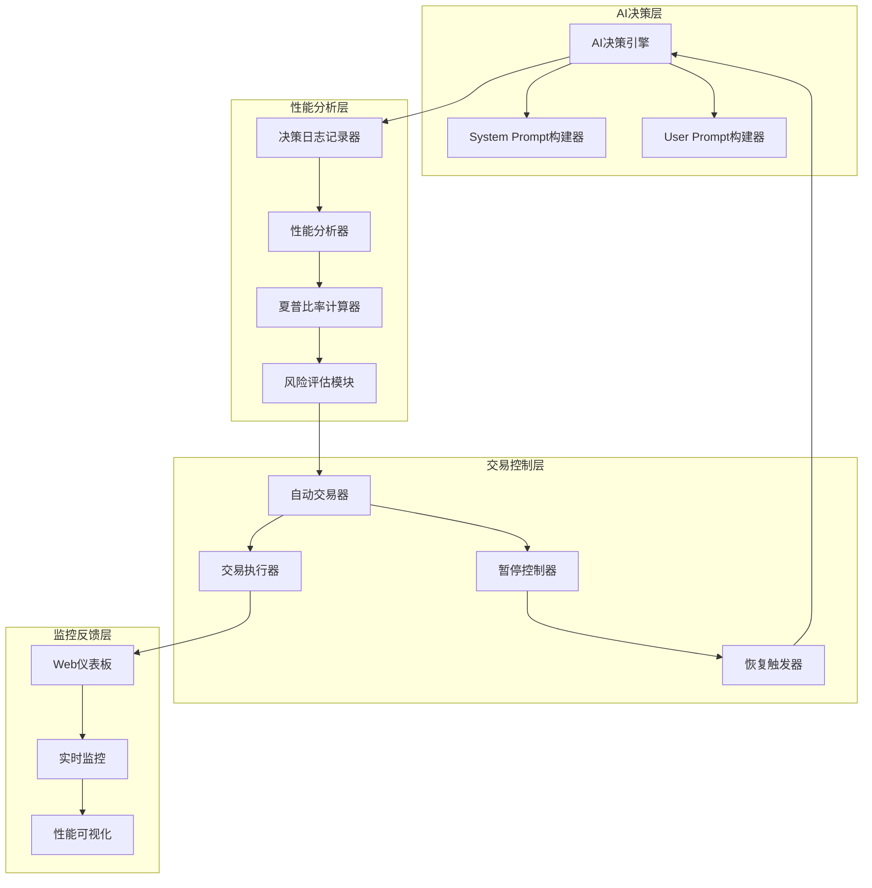
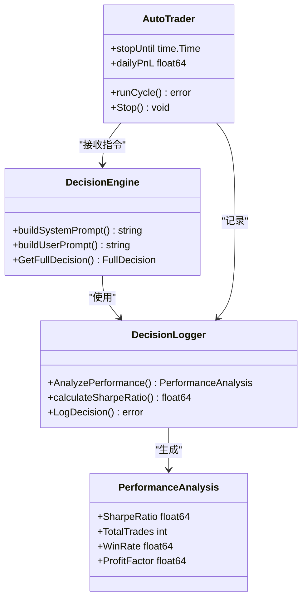
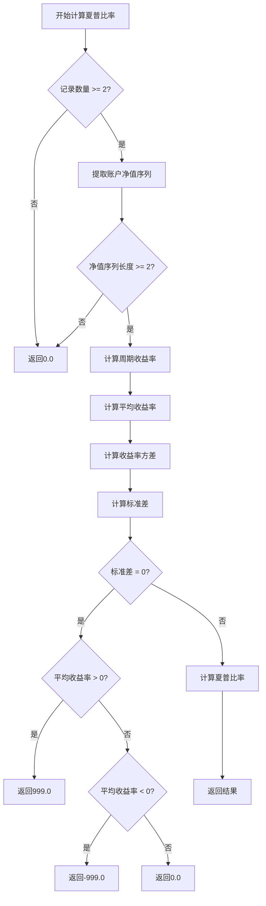
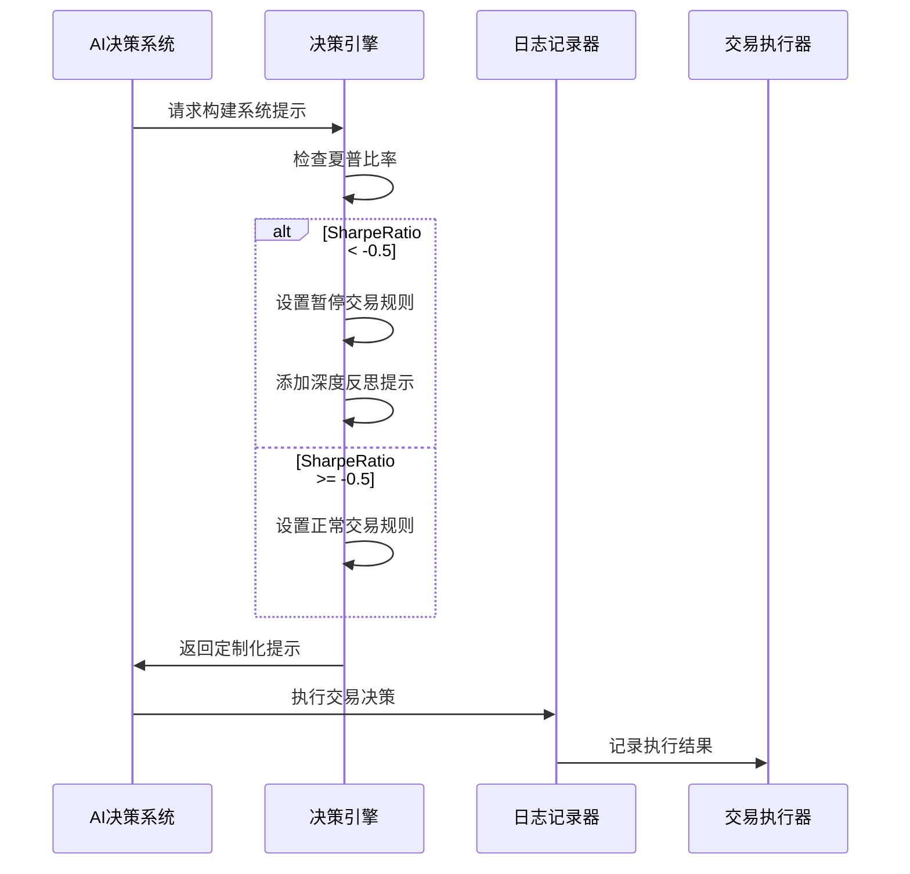
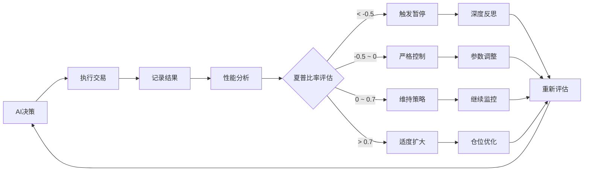
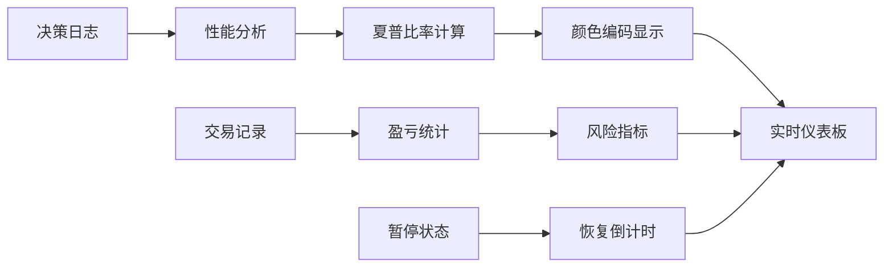

# 夏普比率风险控制机制详细解析

<cite>
**本文档引用的文件**
- [decision/engine.go](file://decision/engine.go)
- [logger/decision_logger.go](file://logger/decision_logger.go)
- [trader/auto_trader.go](file://trader/auto_trader.go)
- [manager/trader_manager.go](file://manager/trader_manager.go)
- [web/src/components/AILearning.tsx](file://web/src/components/AILearning.tsx)
- [web/src/types.ts](file://web/src/types.ts)
</cite>

## 目录
1. [引言](#引言)
2. [系统架构概览](#系统架构概览)
3. [夏普比率计算机制](#夏普比率计算机制)
4. [风险控制策略](#风险控制策略)
5. [动态反馈循环](#动态反馈循环)
6. [系统集成与监控](#系统集成与监控)
7. [性能分析与优化](#性能分析与优化)
8. [故障排除指南](#故障排除指南)
9. [总结](#总结)

## 引言

本文档详细解析了基于夏普比率的风险控制系统，该系统通过智能算法实现动态风险控制和自我修正能力。系统采用周期性的夏普比率评估机制，当检测到表现不佳时，能够自动暂停交易并促使AI进行深度反思，从而实现可持续的交易策略优化。

## 系统架构概览

### 整体架构设计

**图表来源**
- [decision/engine.go](file://decision/engine.go#L80-L120)
- [logger/decision_logger.go](file://logger/decision_logger.go#L315-L350)
- [trader/auto_trader.go](file://trader/auto_trader.go#L220-L260)

### 核心组件关系

**图表来源**
- [decision/engine.go](file://decision/engine.go#L170-L200)
- [logger/decision_logger.go](file://logger/decision_logger.go#L288-L300)
- [trader/auto_trader.go](file://trader/auto_trader.go#L70-L90)

**章节来源**
- [decision/engine.go](file://decision/engine.go#L1-L624)
- [logger/decision_logger.go](file://logger/decision_logger.go#L1-L612)
- [trader/auto_trader.go](file://trader/auto_trader.go#L1-L200)

## 夏普比率计算机制

### 计算原理与算法

夏普比率是衡量风险调整后收益的核心指标，其计算公式为：

**夏普比率 = (平均收益率 - 无风险利率) / 收益率标准差**

在本系统中，由于采用加密货币交易且无风险利率接近于零，简化为：

**夏普比率 = 平均收益率 / 收益率标准差**

### PerformanceAnalysis数据结构

系统通过`PerformanceAnalysis`结构体全面跟踪交易表现：

| 字段名 | 类型 | 描述 | 用途 |
|--------|------|------|------|
| TotalTrades | int | 总交易数 | 评估交易活跃度 |
| WinningTrades | int | 盈利交易数 | 计算胜率 |
| LosingTrades | int | 亏损交易数 | 计算胜率 |
| WinRate | float64 | 胜率 | 0-100百分比 |
| AvgWin | float64 | 平均盈利 | 单笔平均收益 |
| AvgLoss | float64 | 平均亏损 | 单笔平均亏损 |
| ProfitFactor | float64 | 盈亏比 | 总盈利/总亏损 |
| SharpeRatio | float64 | 夏普比率 | 风险调整后收益 |
| RecentTrades | []TradeOutcome | 最近交易 | 详细交易记录 |
| SymbolStats | map[string]*SymbolPerformance | 币种统计 | 分项表现分析 |

### calculateSharpeRatio方法详解

**图表来源**
- [logger/decision_logger.go](file://logger/decision_logger.go#L546-L610)

### 收益率计算逻辑

系统采用周期收益率计算方法，具体步骤如下：

1. **净值提取**：从决策记录中提取每个周期的账户总净值
2. **收益率计算**：使用公式 `(当前净值 - 上一期净值) / 上一期净值`
3. **异常处理**：过滤无效数据，确保计算准确性
4. **统计分析**：计算平均值和标准差

**章节来源**
- [logger/decision_logger.go](file://logger/decision_logger.go#L546-L610)

## 风险控制策略

### 夏普比率阈值体系

系统建立了基于夏普比率的四层风险控制体系：

| 夏普比率范围 | 风险等级 | 控制措施 | 持续时间 | AI反思要点 |
|-------------|----------|----------|----------|------------|
| < -0.5 | 严重亏损 | 停止交易 | 6个周期(18分钟) | 交易频率、持仓时间、信号强度、做空倾向 |
| -0.5 ~ 0 | 轻微亏损 | 严格控制 | 动态调整 | 信心度>80、频率限制、耐心持仓 |
| 0 ~ 0.7 | 正常收益 | 维持策略 | 保持现状 | 无需调整 |
| > 0.7 | 优异表现 | 适度扩大 | 动态调整 | 权衡风险与收益 |

### buildSystemPrompt中的风险控制规则

**图表来源**
- [decision/engine.go](file://decision/engine.go#L265-L283)
- [decision/engine.go](file://decision/engine.go#L306-L339)

### 交易暂停机制

当夏普比率低于-0.5时，系统会触发以下暂停机制：

1. **暂停时间计算**：至少6个周期（18分钟）
2. **暂停检查**：每次周期开始时检查暂停状态
3. **状态记录**：记录暂停原因和剩余时间
4. **恢复条件**：暂停期结束后自动恢复交易

**章节来源**
- [decision/engine.go](file://decision/engine.go#L265-L283)
- [trader/auto_trader.go](file://trader/auto_trader.go#L220-L250)

## 动态反馈循环

### 自我修正机制

系统实现了完整的自我修正闭环，通过以下流程实现：

**图表来源**
- [decision/engine.go](file://decision/engine.go#L265-L283)
- [logger/decision_logger.go](file://logger/decision_logger.go#L315-L350)

### AI反思指导

当触发暂停机制时，AI需要进行深度反思，系统提供以下指导框架：

#### 交易频率反思
- **问题识别**：每小时交易次数是否超过2次？
- **解决方案**：减少交易频率，提高信号质量要求
- **标准**：每日2-4笔交易（每小时0.1-0.2笔）

#### 持仓时间反思
- **问题识别**：持仓时间是否少于30分钟？
- **解决方案**：延长持仓时间，让利润充分发展
- **标准**：最佳持仓时间：30-60分钟

#### 信号强度反思
- **问题识别**：交易信号信心度是否低于75？
- **解决方案**：提高信号筛选标准，增加验证步骤
- **标准**：综合信心度≥75才开仓

#### 做空倾向反思
- **问题识别**：是否过度偏向做多？
- **解决方案**：平衡多空策略，避免单一方向
- **原则**：做空=做多，都是赚钱工具

### 动态参数调整

系统根据夏普比率表现动态调整以下参数：

| 夏普比率范围 | 仓位规模 | 交易频率 | 信号标准 | 止损策略 |
|-------------|----------|----------|----------|----------|
| < -0.5 | 保守 | 禁止 | 严格 | 严格执行 |
| -0.5 ~ 0 | 谨慎 | 限制 | 更严格 | 更保守 |
| 0 ~ 0.7 | 正常 | 标准 | 标准 | 标准 |
| > 0.7 | 适度扩大 | 灵活 | 标准 | 灵活 |

**章节来源**
- [decision/engine.go](file://decision/engine.go#L265-L283)

## 系统集成与监控

### Web仪表板集成

系统通过Web界面提供实时监控和可视化：

**图表来源**
- [web/src/components/AILearning.tsx](file://web/src/components/AILearning.tsx#L253-L279)
- [web/src/types.ts](file://web/src/types.ts#L63-L109)

### 实时监控指标

Web仪表板提供以下关键监控指标：

| 指标名称 | 颜色编码 | 含义 | 阈值 |
|----------|----------|------|------|
| 夏普比率 | 绿色(>0.7) | 优异表现 | >0.7 |
| 夏普比率 | 黄色(0~0.7) | 正常收益 | 0~0.7 |
| 夏普比率 | 红色(<0) | 需要调整 | <0 |
| 暂停状态 | 灰色 | 风控暂停 | 显示剩余时间 |

### 日志记录与审计

系统通过详细的日志记录确保可追溯性和审计能力：

1. **决策日志**：记录每次AI决策的完整过程
2. **执行日志**：记录交易执行的详细结果
3. **性能日志**：记录夏普比率和其他性能指标
4. **错误日志**：记录系统异常和错误信息

**章节来源**
- [web/src/components/AILearning.tsx](file://web/src/components/AILearning.tsx#L253-L279)
- [logger/decision_logger.go](file://logger/decision_logger.go#L100-L150)

## 性能分析与优化

### 绩效评估周期

系统采用周期性评估机制，评估周期为3分钟，评估窗口为最近20个周期：

```mermaid
gantt
title 性能评估周期图
dateFormat HH:mm
axisFormat %H:%M
section 当前周期
AI决策 :active, ai1, 09:00, 3m
交易执行 :active, exec1, after ai1, 2m
结果记录 :active, log1, after exec1, 1m
section 评估周期
性能分析 :crit, active, eval1, after log1, 5m
夏普计算 :crit, active, sharpe1, after eval1, 2m
决策调整 :active, adjust1, after sharpe1, 3m
section 循环
循环等待 :done, wait1, after adjust1, 3m
```

### 优化策略

系统通过以下策略持续优化性能：

1. **自适应学习**：根据历史表现调整参数
2. **动态权重**：不同指标赋予不同权重
3. **趋势预测**：利用历史数据预测未来表现
4. **风险平衡**：在收益和风险间寻找最佳平衡点

### 效果评估

通过以下指标评估系统效果：

- **夏普比率稳定性**：评估系统的稳定性
- **交易频率控制**：监控交易过于频繁的问题
- **胜率提升**：跟踪胜率改善情况
- **最大回撤控制**：监控风险控制效果

**章节来源**
- [logger/decision_logger.go](file://logger/decision_logger.go#L315-L350)

## 故障排除指南

### 常见问题诊断

#### 夏普比率计算异常

**问题症状**：夏普比率显示为NaN或异常值

**可能原因**：
1. 数据采集失败，净值序列为空
2. 收益率计算过程中出现除零错误
3. 市场数据异常，导致收益率计算错误

**解决方法**：
1. 检查数据源连接状态
2. 验证账户净值数据完整性
3. 检查市场数据获取状态

#### 交易暂停机制失效

**问题症状**：夏普比率低于阈值但未触发暂停

**可能原因**：
1. 暂停时间计算错误
2. 时间检查逻辑异常
3. 状态变量未正确更新

**解决方法**：
1. 检查时间计算逻辑
2. 验证状态变量更新
3. 确认暂停条件判断

#### AI反思深度不足

**问题症状**：暂停期间AI未进行充分反思

**可能原因**：
1. 系统提示模板不够详细
2. AI理解能力有限
3. 反思要点缺失

**解决方法**：
1. 优化系统提示模板
2. 增加反思指导示例
3. 扩展反思维度

### 监控与告警

系统提供多层次的监控和告警机制：

1. **实时监控**：Web仪表板实时显示关键指标
2. **异常告警**：夏普比率异常时发送告警
3. **日志审计**：详细记录所有操作和决策
4. **性能报告**：定期生成性能分析报告

**章节来源**
- [trader/auto_trader.go](file://trader/auto_trader.go#L220-L250)
- [logger/decision_logger.go](file://logger/decision_logger.go#L546-L610)

## 总结

基于夏普比率的风险控制系统通过以下核心机制实现智能风险管理：

1. **精确计算**：采用科学的夏普比率计算方法，准确评估风险调整后收益
2. **动态控制**：建立四层风险控制体系，根据表现动态调整策略
3. **自我修正**：实现完整的反馈闭环，促使AI不断优化交易策略
4. **实时监控**：提供全面的监控和可视化功能，确保系统透明可控

该系统不仅能够有效控制风险，还能通过自我学习和优化实现长期稳定的交易表现。通过持续的性能评估和策略调整，系统能够在复杂的市场环境中保持竞争力，为用户提供可靠的投资决策支持。