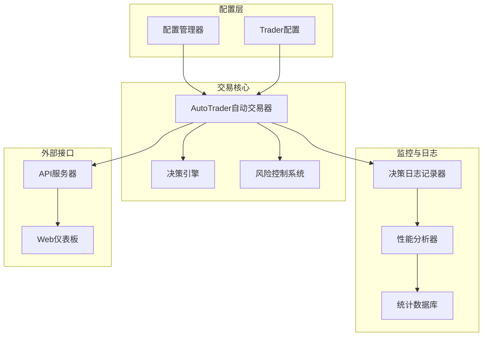
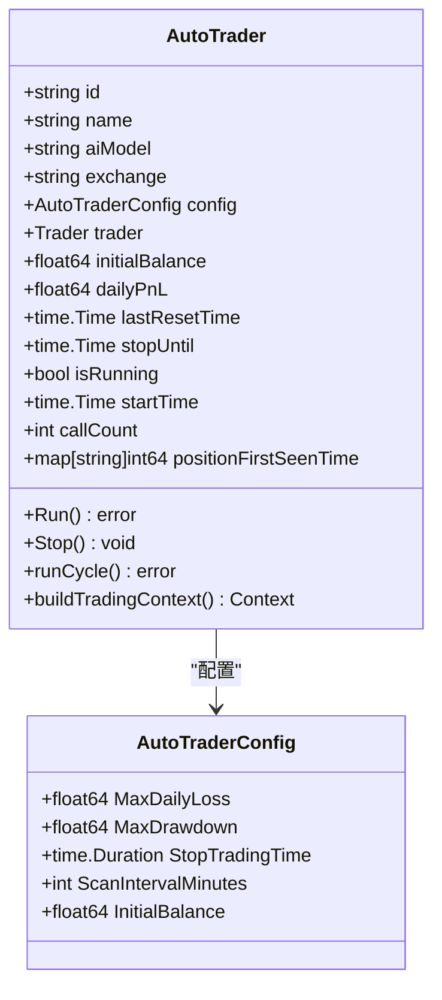
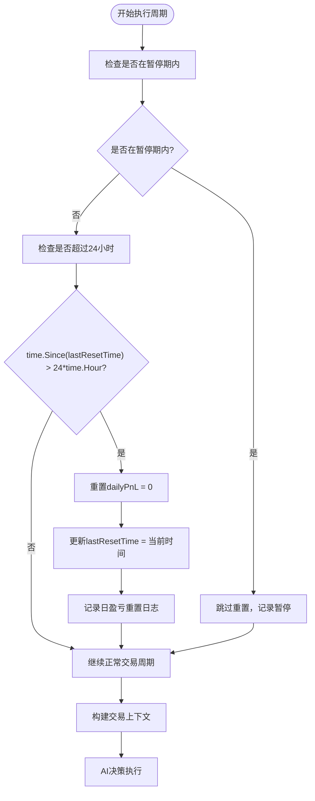
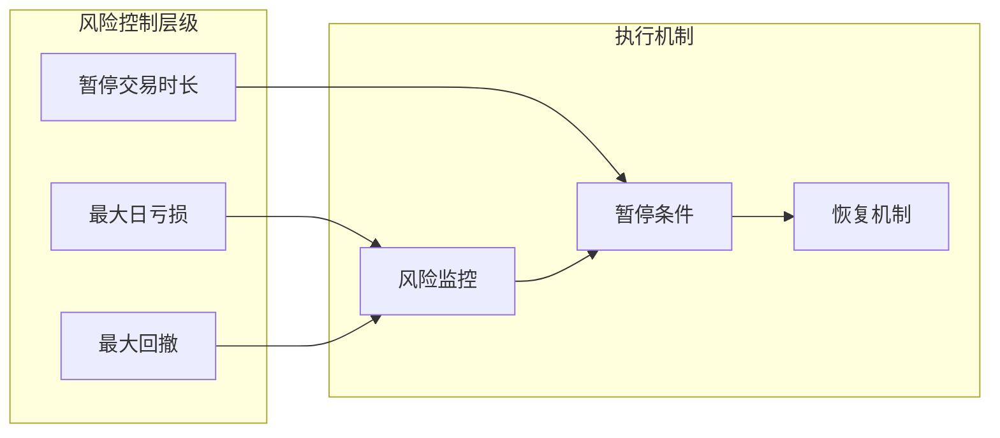
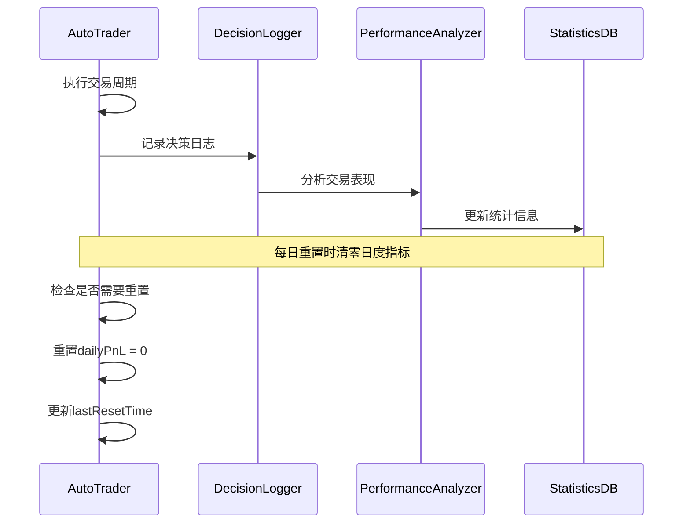
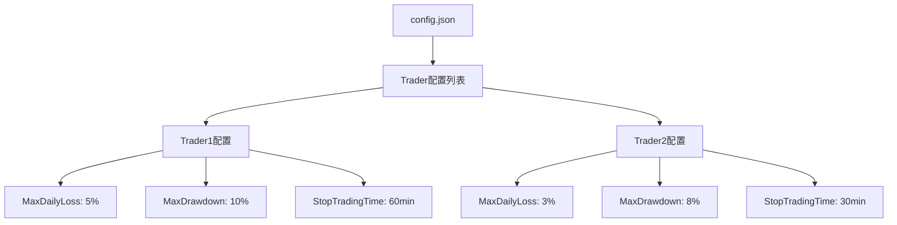
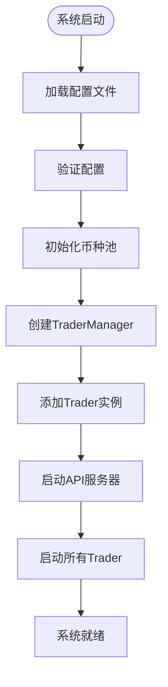

# 日盈亏重置机制详解

<cite>
**本文档引用的文件**
- [auto_trader.go](file://trader/auto_trader.go)
- [config.go](file://config/config.go)
- [decision_logger.go](file://logger/decision_logger.go)
- [main.go](file://main.go)
- [manager/trader_manager.go](file://manager/trader_manager.go)
</cite>

## 目录
1. [简介](#简介)
2. [核心组件架构](#核心组件架构)
3. [AutoTrader结构体设计](#autotrader结构体设计)
4. [每日盈亏重置机制](#每日盈亏重置机制)
5. [风险控制系统](#风险控制系统)
6. [性能监控与分析](#性能监控与分析)
7. [系统集成与配置](#系统集成与配置)
8. [总结](#总结)

## 简介

nofx项目是一个基于AI驱动的自动化加密货币交易系统，其中每日盈亏重置机制是其核心风险管理功能之一。该机制通过精确的时间控制和状态管理，确保交易系统能够按照日度维度进行独立的风险评估和绩效跟踪。

## 核心组件架构

### 系统整体架构

**图表来源**
- [auto_trader.go](file://trader/auto_trader.go#L57-L85)
- [config.go](file://config/config.go#L15-L50)

### AutoTrader核心职责

AutoTrader作为系统的核心组件，负责：
- **交易决策执行**：基于AI分析执行买卖操作
- **风险管理**：实施日度盈亏重置和风险控制
- **状态监控**：跟踪交易状态和绩效指标
- **日志记录**：保存完整的交易决策和执行过程

**章节来源**
- [auto_trader.go](file://trader/auto_trader.go#L57-L85)

## AutoTrader结构体设计

### 关键字段说明

AutoTrader结构体中与每日盈亏重置直接相关的两个核心字段：

**图表来源**
- [auto_trader.go](file://trader/auto_trader.go#L57-L85)
- [config.go](file://config/config.go#L15-L50)

### 字段详细说明

| 字段名 | 类型 | 描述 | 用途 |
|--------|------|------|------|
| `dailyPnL` | `float64` | 当前日度累计盈亏 | 存储当日交易产生的盈亏总额 |
| `lastResetTime` | `time.Time` | 上次重置时间 | 记录上次日盈亏重置的具体时间点 |

**章节来源**
- [auto_trader.go](file://trader/auto_trader.go#L57-L85)

## 每日盈亏重置机制

### 重置触发条件

每日盈亏重置的核心逻辑位于`runCycle`方法中，通过以下条件判断是否需要重置：

**图表来源**
- [auto_trader.go](file://trader/auto_trader.go#L230-L245)

### 重置逻辑实现

重置机制的关键代码片段展示了精确的时间判断和状态更新：

1. **时间判断**：`time.Since(at.lastResetTime) > 24*time.Hour`
   - 计算从上次重置到现在经过的时间
   - 使用Go语言的标准库函数进行时间比较

2. **状态重置**：`at.dailyPnL = 0`
   - 将当日累计盈亏清零
   - 重新开始新的日度盈亏计算

3. **时间更新**：`at.lastResetTime = time.Now()`
   - 更新重置时间戳
   - 确保下次判断基于正确的基准时间

**章节来源**
- [auto_trader.go](file://trader/auto_trader.go#L230-L245)

### 重置时机的重要性

每日盈亏重置的设计考虑了以下几个关键因素：

1. **时间窗口的准确性**：使用24小时而非自然日，确保不受时区影响
2. **状态一致性**：重置后的新一天从零开始，避免累积效应
3. **性能隔离**：每个交易日的绩效独立计算，便于风险评估

## 风险控制系统

### 风险控制配置

系统通过配置文件定义了多层次的风险控制参数：

**图表来源**
- [config.go](file://config/config.go#L15-L50)

### 风险控制与日盈亏的关系

每日盈亏重置与风险控制系统紧密配合：

1. **日度限制**：`MaxDailyLoss`参数定义了每日允许的最大亏损
2. **实时监控**：系统实时计算当前日度盈亏
3. **自动暂停**：当达到风险阈值时，系统自动暂停交易
4. **重置重启**：次日重置后恢复正常交易

**章节来源**
- [config.go](file://config/config.go#L15-L50)

## 性能监控与分析

### 决策日志记录

每日盈亏重置机制与决策日志系统深度集成：

**图表来源**
- [auto_trader.go](file://trader/auto_trader.go#L230-L245)
- [decision_logger.go](file://logger/decision_logger.go#L100-L150)

### 绩效分析功能

系统提供全面的绩效分析功能，支持：

1. **历史数据分析**：分析最近N个周期的交易表现
2. **符号级统计**：按币种统计胜率、平均盈亏
3. **夏普比率计算**：基于账户净值变化的风险调整收益
4. **趋势识别**：识别最佳和最差表现的币种

**章节来源**
- [decision_logger.go](file://logger/decision_logger.go#L303-L334)

## 系统集成与配置

### 配置文件结构

系统通过配置文件统一管理所有Trader的风险控制参数：

**图表来源**
- [config.go](file://config/config.go#L15-L50)

### TraderManager集成

TraderManager负责管理多个Trader实例，确保每个Trader都能正确应用其配置的风险控制参数：

1. **配置验证**：确保每个Trader的配置有效
2. **资源分配**：为每个Trader分配独立的资源
3. **状态同步**：维护Trader的全局状态
4. **优雅关闭**：支持系统的平滑停止

**章节来源**
- [manager/trader_manager.go](file://manager/trader_manager.go#L0-L31)

### 启动流程

系统启动时的完整流程确保了风险控制机制的正确初始化：

**图表来源**
- [main.go](file://main.go#L20-L100)

## 总结

nofx项目的每日盈亏重置机制是一个精心设计的风险管理系统的重要组成部分。通过AutoTrader结构体中的`dailyPnL`和`lastResetTime`字段协同工作，系统实现了以下关键功能：

### 核心优势

1. **精确的时间控制**：基于标准库的`time.Since`函数，确保重置时机的准确性
2. **状态隔离**：每日重置保证了不同交易日之间的绩效独立性
3. **风险控制**：与最大日亏损等风险参数无缝集成
4. **性能追踪**：为后续的绩效分析和优化提供准确的数据基础

### 技术特点

- **简洁高效**：仅需两条语句即可完成重置逻辑
- **时间无关**：不受时区和夏令时影响
- **状态一致**：重置后的新一天从零开始
- **监控友好**：与日志记录和性能分析系统深度集成

### 应用价值

该机制为基于AI的自动化交易系统提供了可靠的风险控制基础，确保交易行为符合预设的风险偏好，同时为系统优化和策略调整提供了重要的数据支撑。通过每日重置，系统能够在保持交易连续性的同时，有效管理累积风险，实现可持续的交易绩效。