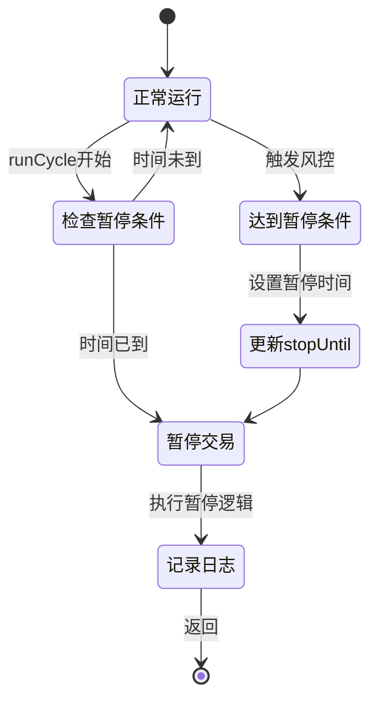
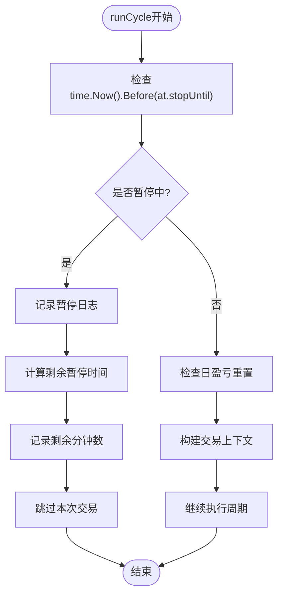
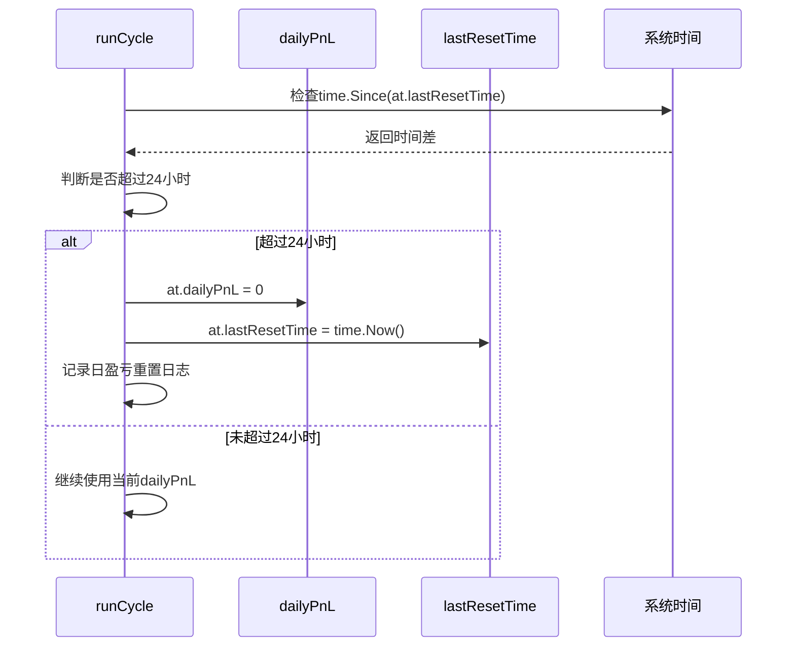
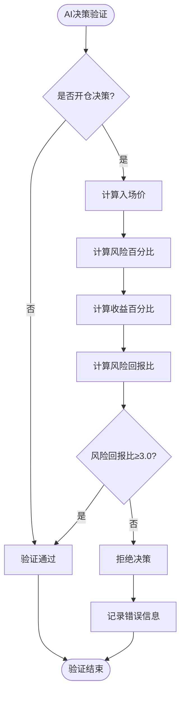
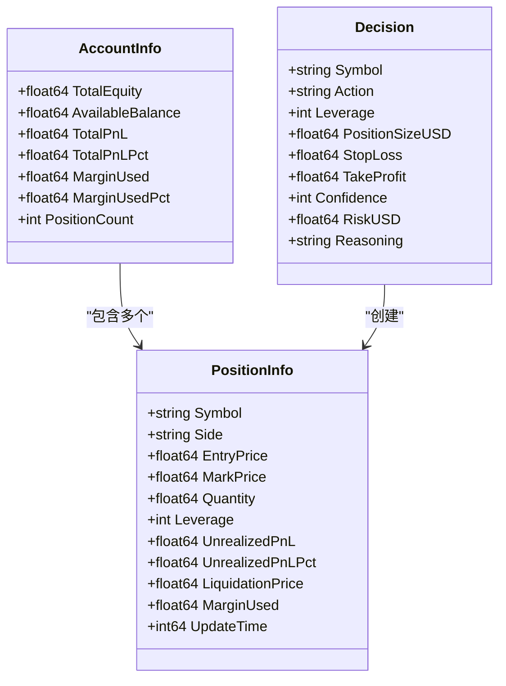
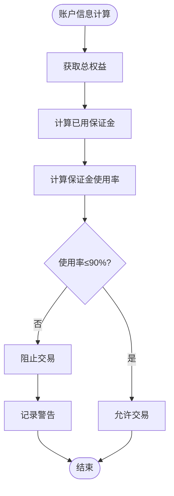
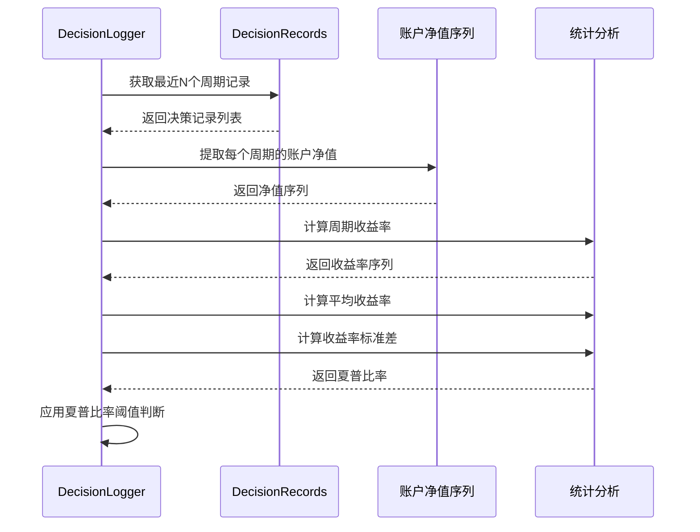
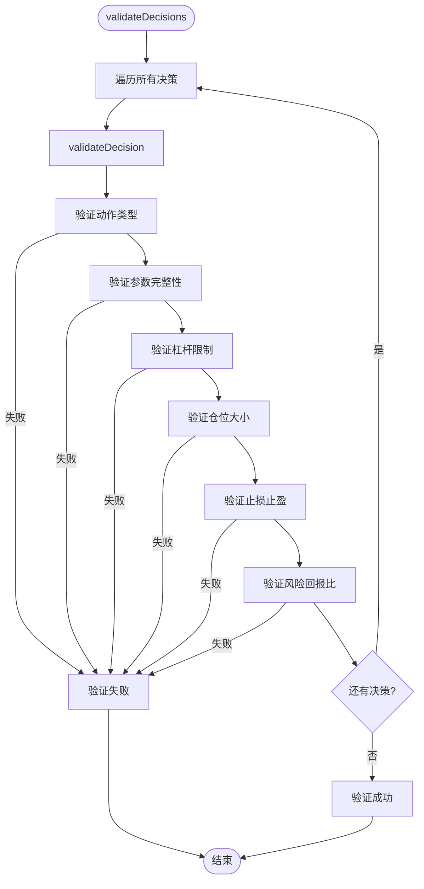
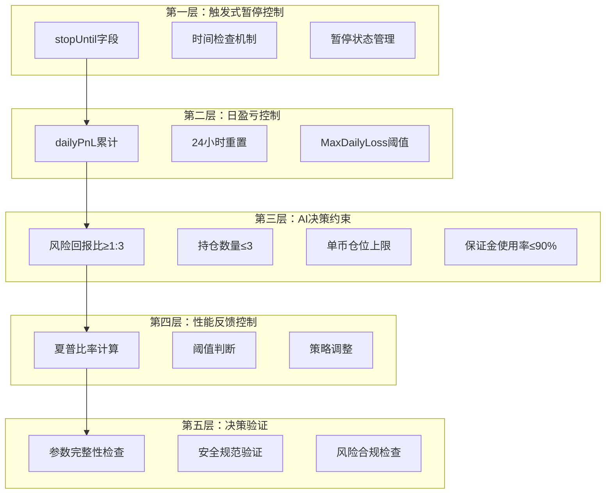
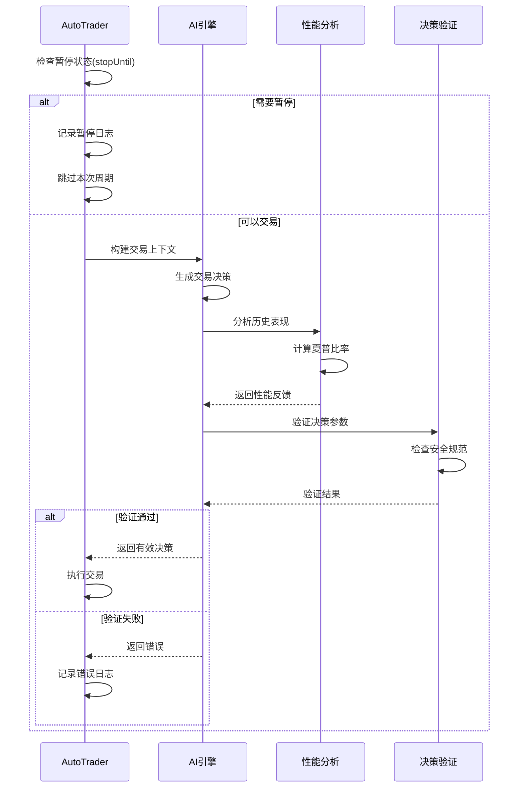

# 风险控制机制

<cite>
**本文档引用的文件**
- [auto_trader.go](file://trader/auto_trader.go)
- [engine.go](file://decision/engine.go)
- [decision_logger.go](file://logger/decision_logger.go)
- [config.go](file://config/config.go)
- [aster_trader.go](file://trader/aster_trader.go)
</cite>

## 目录
1. [概述](#概述)
2. [AutoTrader暂停机制](#autotrader暂停机制)
3. [日盈亏控制系统](#日盈亏控制系统)
4. [AI决策层硬约束规则](#ai决策层硬约束规则)
5. [性能分析与夏普比率控制](#性能分析与夏普比率控制)
6. [决策验证层](#决策验证层)
7. [综合风险控制架构](#综合风险控制架构)
8. [总结](#总结)

## 概述

nofx项目采用多层次风险控制机制，通过AutoTrader的触发式暂停系统、AI决策层的硬约束规则、性能分析的动态调整以及严格的决策验证，构建了一个完整的自动化交易风险管理体系。该系统能够在保证交易效率的同时，有效控制各类金融风险。

## AutoTrader暂停机制

### stopUntil字段实现触发式暂停

AutoTrader通过`stopUntil`字段实现触发式暂停交易机制，这是系统最重要的风险控制特性之一。

**图表来源**
- [auto_trader.go](file://trader/auto_trader.go#L225-L235)

### 暂停状态检查流程

系统在每个交易周期开始时都会检查暂停状态：

**图表来源**
- [auto_trader.go](file://trader/auto_trader.go#L225-L240)

**章节来源**
- [auto_trader.go](file://trader/auto_trader.go#L225-L240)

## 日盈亏控制系统

### dailyPnL重置机制

系统实现了每日盈亏重置机制，确保风险控制的时效性和准确性。

**图表来源**
- [auto_trader.go](file://trader/auto_trader.go#L242-L248)

### 日盈亏监控与控制

系统通过以下机制实现日盈亏控制：

| 控制维度 | 实现方式 | 阈值设置 | 触发条件 |
|---------|---------|---------|---------|
| 日亏损监控 | dailyPnL累计 | MaxDailyLoss配置 | 达到预设日亏损阈值 |
| 时间窗口 | lastResetTime | 24小时周期 | 自然日重置 |
| 状态跟踪 | stopUntil | 暂停时长 | 触发风控后暂停 |
| 动态调整 | 性能分析反馈 | Sharpe Ratio | 夏普比率异常时 |

**章节来源**
- [auto_trader.go](file://trader/auto_trader.go#L242-L248)

## AI决策层硬约束规则

### 风险回报比约束（≥1:3）

AI决策引擎实现了严格的风险回报比约束，确保每次交易的风险收益比例不低于1:3。

**图表来源**
- [engine.go](file://decision/engine.go#L588-L622)

### 最多持仓3个币种约束

系统通过AI自主决策实现持仓数量控制：

**图表来源**
- [engine.go](file://decision/engine.go#L15-L43)

### 单币仓位上限约束

系统根据币种类型和账户净值设置不同的仓位上限：

| 币种类型 | 杠杆上限 | 仓位价值上限 | 保证金占用率 |
|---------|---------|-------------|-------------|
| BTC/ETH | 配置的BTCETHLeverage | 账户净值×10 | 20% |
| 山寨币 | 配置的AltcoinLeverage | 账户净值×1.5 | 7.5% |

**章节来源**
- [engine.go](file://decision/engine.go#L545-L586)

### 保证金使用率约束（≤90%）

系统通过`MarginUsedPct`字段实时监控保证金使用率：

**图表来源**
- [auto_trader.go](file://trader/auto_trader.go#L505-L510)

**章节来源**
- [engine.go](file://decision/engine.go#L545-L586)

## 性能分析与夏普比率控制

### 夏普比率计算机制

系统通过`DecisionLogger`实现夏普比率的精确计算：

**图表来源**
- [decision_logger.go](file://logger/decision_logger.go#L565-L611)

### 夏普比率阈值控制策略

系统根据夏普比率值实施不同的交易控制策略：

| 夏普比率范围 | 控制策略 | 执行动作 | 恢复条件 |
|-------------|---------|---------|---------|
| < -0.5 | 严格暂停 | 停止交易，连续观望6周期 | 夏普比率回升至-0.5以上 |
| -0.5 ~ 0 | 严格控制 | 限制交易频率，提高信号要求 | 夏普比率>0 |
| 0 ~ 0.7 | 正常维持 | 维持当前策略 | 无特殊要求 |
| > 0.7 | 适度放宽 | 可考虑扩大仓位 | 持续优异表现 |

**章节来源**
- [engine.go](file://decision/engine.go#L265-L283)
- [decision_logger.go](file://logger/decision_logger.go#L565-L611)

## 决策验证层

### validateDecisions函数验证体系

系统实现了完整的决策验证机制，确保所有交易决策符合安全规范：

**图表来源**
- [engine.go](file://decision/engine.go#L515-L525)

### 参数安全规范验证

系统对关键参数实施严格的安全验证：

| 参数类型 | 验证规则 | 错误处理 | 示例 |
|---------|---------|---------|------|
| 杠杆倍数 | 1 ≤ 杠杆 ≤ 配置上限 | 返回错误信息 | BTC/ETH: 1-50x |
| 仓位大小 | 0 < 仓位 ≤ 仓位上限 | 返回错误信息 | 山寨币: ≤1.5倍净值 |
| 止损止盈 | 0 < 止损 < 止盈 | 返回错误信息 | 做多: 止损<止盈 |
| 风险回报比 | 风险回报比 ≥ 3.0 | 返回错误信息 | 最低1:3比例 |

**章节来源**
- [engine.go](file://decision/engine.go#L529-L622)

## 综合风险控制架构

### 风险控制层次结构

**图表来源**
- [auto_trader.go](file://trader/auto_trader.go#L57-L85)
- [engine.go](file://decision/engine.go#L515-L622)

### 风险控制协同机制

各层级风险控制措施相互配合，形成完整的风险管理体系：

**图表来源**
- [auto_trader.go](file://trader/auto_trader.go#L225-L280)
- [engine.go](file://decision/engine.go#L515-L622)

## 总结

nofx项目的风险控制机制体现了多层次、全方位的风险管理理念。通过AutoTrader的触发式暂停系统、AI决策层的硬约束规则、性能分析的动态调整以及严格的决策验证，构建了一个既高效又安全的自动化交易系统。

### 核心优势

1. **触发式暂停机制**：能够及时响应市场风险，避免连锁反应
2. **日盈亏控制**：确保风险敞口在可控范围内
3. **AI硬约束**：从源头杜绝高风险交易决策
4. **动态性能反馈**：根据历史表现自动调整交易策略
5. **完整验证体系**：确保每个交易决策都符合安全规范

### 设计特点

- **分层防护**：多层级风险控制措施相互补充
- **动态调整**：根据市场表现和系统状态自动调节
- **实时监控**：全方位监控账户状态和交易行为
- **智能决策**：AI在严格约束下自主做出最优决策

这种风险控制机制不仅保证了交易系统的稳定性，也为用户提供了可靠的投资保障，是现代量化交易系统的重要组成部分。