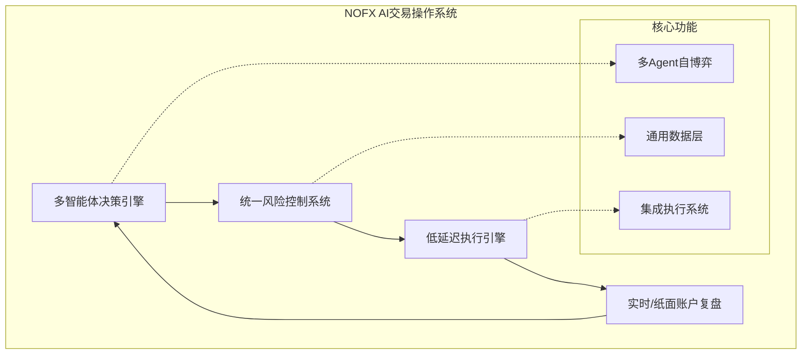
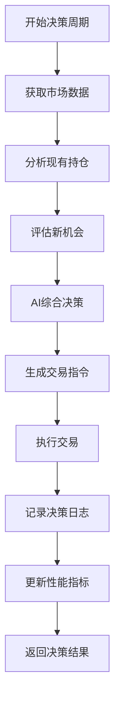
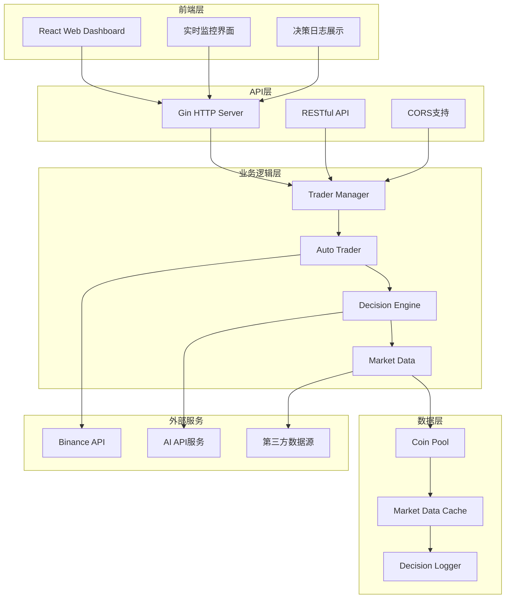
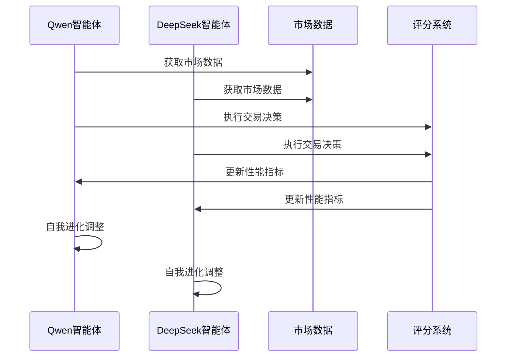
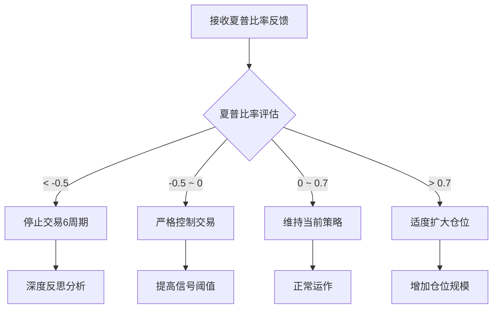

# 系统概述

<cite>
**本文档引用的文件**
- [README.md](file://README.md)
- [main.go](file://main.go)
- [go.mod](file://go.mod)
- [config/config.go](file://config/config.go)
- [decision/engine.go](file://decision/engine.go)
- [manager/trader_manager.go](file://manager/trader_manager.go)
- [trader/auto_trader.go](file://trader/auto_trader.go)
- [pool/coin_pool.go](file://pool/coin_pool.go)
- [market/data.go](file://market/data.go)
- [api/server.go](file://api/server.go)
- [web/README.md](file://web/README.md)
</cite>

## 目录
1. [项目简介](#项目简介)
2. [核心定位与愿景](#核心定位与愿景)
3. [完整闭环系统](#完整闭环系统)
4. [技术架构概览](#技术架构概览)
5. [核心功能模块](#核心功能模块)
6. [多智能体竞争框架](#多智能体竞争框架)
7. [通用数据与回测层](#通用数据与回测层)
8. [集成执行与风险控制](#集成执行与风险控制)
9. [项目背书与团队](#项目背书与团队)
10. [官方资源与社区](#官方资源与社区)
11. [风险提示](#风险提示)

## 项目简介

**NOFX** 是一个**通用AI交易操作系统（Agentic Trading OS）**，基于统一架构构建。该项目已在加密货币市场成功实现闭环："**多智能体决策 → 统一风险控制 → 低延迟执行 → 实盘/纸面账户复盘**"，目前正在扩展到股票、期货、期权、外汇等所有金融市场。

**图表来源**
- [main.go](file://main.go#L1-L140)
- [decision/engine.go](file://decision/engine.go#L1-L624)

**章节来源**
- [README.md](file://README.md#L1-L50)
- [main.go](file://main.go#L1-L50)

## 核心定位与愿景

### 通用AI交易操作系统

NOFX定位为**通用AI交易操作系统**，具有以下核心特征：

- **统一架构**：一套完整的AI交易基础设施
- **跨市场支持**：从加密货币扩展到传统金融市场
- **智能化程度**：AI全权决策，无需人工干预
- **自动化闭环**：完整的交易生命周期管理

### 扩展愿景

项目愿景是从加密货币市场扩展到：
- **股票市场**：美国股市、A股、港股
- **期货市场**：商品期货、指数期货
- **期权交易**：权益期权、加密货币期权
- **外汇市场**：主要货币对、交叉汇率

**章节来源**
- [README.md](file://README.md#L15-L35)

## 完整闭环系统

### 多智能体决策阶段

AI决策引擎负责：
- **市场数据分析**：实时获取3分钟和4小时K线数据
- **技术指标计算**：EMA20/50、MACD、RSI(7/14)、ATR
- **持仓评估**：现有仓位的技术分析和盈亏评估
- **新机会识别**：候选币种筛选和强信号检测

**图表来源**
- [decision/engine.go](file://decision/engine.go#L80-L150)
- [market/data.go](file://market/data.go#L1-L100)

### 统一风险控制系统

风险控制采用多层次防护机制：

| 风险控制层级 | 控制措施 | 具体规则 |
|-------------|----------|----------|
| **仓位限制** | 单币种仓位上限 | Altcoins ≤1.5x equity, BTC/ETH ≤10x equity |
| **杠杆控制** | 动态杠杆配置 | 1x-50x，根据资产类别和账户类型 |
| **保证金管理** | 总使用率控制 | ≤90%，AI智能分配 |
| **风险回报** | 强制止损止盈 | ≥1:2风险回报比 |
| **防重复开仓** | 仓位去重保护 | 同币种同方向禁止重复开仓 |

### 低延迟执行引擎

执行系统特点：
- **多交易所支持**：Binance Futures、Hyperliquid DEX、Aster DEX
- **自动精度处理**：智能订单大小和价格格式化
- **优先级执行**：先平仓后开仓，确保保证金释放
- **滑点控制**：预执行验证和实时精度检查

### 实盘/纸面账户复盘

系统提供完整的交易复盘功能：
- **决策日志**：完整的Chain of Thought（CoT）分析
- **性能追踪**：夏普比率、胜率、盈亏比等指标
- **历史回放**：支持历史数据回测和策略验证
- **实时监控**：Web界面实时展示交易状态

**章节来源**
- [decision/engine.go](file://decision/engine.go#L200-L300)
- [README.md](file://README.md#L147-L182)

## 技术架构概览

### 整体架构设计

**图表来源**
- [main.go](file://main.go#L1-L140)
- [api/server.go](file://api/server.go#L1-L200)
- [manager/trader_manager.go](file://manager/trader_manager.go#L1-L173)

### 核心依赖关系

项目采用模块化设计，各组件职责清晰：

- **Go后端**：核心交易逻辑和API服务
- **React前端**：用户交互界面和数据可视化
- **TypeScript**：类型安全的前端开发
- **Gin框架**：高性能HTTP API框架

**章节来源**
- [go.mod](file://go.mod#L1-L78)
- [web/README.md](file://web/README.md#L1-L50)

## 核心功能模块

### 多智能体自博弈与自进化

#### 自博弈机制

系统支持多个AI智能体在同一市场环境中竞争：

**图表来源**
- [manager/trader_manager.go](file://manager/trader_manager.go#L100-L150)
- [trader/auto_trader.go](file://trader/auto_trader.go#L1-L200)

#### 自进化算法

AI智能体通过以下机制实现自我进化：

1. **历史反馈分析**：分析最近20个交易周期的表现
2. **智能性能评估**：识别最佳/最差表现资产
3. **动态策略调整**：根据回测结果自主调整交易风格
4. **夏普比率优化**：持续优化风险调整后收益

### 通用数据与回测层

#### 市场数据获取

系统提供统一的市场数据接口：

| 数据类型 | 时间框架 | 指标内容 |
|----------|----------|----------|
| **实时数据** | 3分钟 | K线、价格、成交量 |
| **趋势数据** | 4小时 | EMA20/50、MACD、RSI |
| **持仓数据** | 实时 | 开仓量、持仓量变化 |
| **资金数据** | 实时 | 资金费率、流动资金 |

#### 回测功能

- **历史数据回放**：支持历史数据的策略回测
- **性能指标计算**：夏普比率、最大回撤、胜率等
- **策略对比**：不同策略间的性能对比分析
- **参数优化**：自动优化交易参数

**章节来源**
- [market/data.go](file://market/data.go#L1-L200)
- [pool/coin_pool.go](file://pool/coin_pool.go#L1-L300)

## 集成执行与风险控制

### 多交易所支持

系统支持三个主要交易所：

#### Binance Futures
- **API支持**：完整的期货交易API
- **精度处理**：自动处理订单精度
- **风险管理**：内置风险控制机制

#### Hyperliquid DEX
- **去中心化**：非托管交易体验
- **高性能**：链上结算，快速执行
- **零知识认证**：无需API密钥

#### Aster DEX
- **Binance兼容**：API完全兼容Binance
- **Web3钱包**：支持多种钱包接入
- **多链支持**：以太坊、BSC、Polygon等

### 风险控制机制

#### 夏普比率自我进化

系统通过夏普比率实现智能风险控制：

**图表来源**
- [decision/engine.go](file://decision/engine.go#L265-L283)

#### 具体风险控制规则

1. **仓位限制**：单币种仓位不超过账户净值的特定倍数
2. **杠杆控制**：根据资产类型动态调整杠杆倍数
3. **保证金管理**：总使用率不超过90%
4. **风险回报比**：强制执行≥1:2的风险回报比
5. **防重复开仓**：防止同一币种同方向重复开仓

**章节来源**
- [config/config.go](file://config/config.go#L1-L202)
- [decision/engine.go](file://decision/engine.go#L588-L622)

## 项目背书与团队

### Amber.ac背书

NOFX项目获得**Amber.ac**的官方背书，体现了项目在AI交易领域的专业性和可靠性。

### 核心团队

项目核心团队成员：

- **Tinkle** - [@Web3Tinkle](https://x.com/Web3Tinkle)
- **Zack** - [@0x_ZackH](https://x.com/0x_ZackH)

两位创始人在区块链和AI交易领域拥有丰富的经验，致力于推动AI在金融交易中的应用。

**章节来源**
- [README.md](file://README.md#L35-L45)

## 官方资源与社区

### 官方社交媒体

- **Twitter**：[@nofx_ai](https://x.com/nofx_ai) - 项目官方动态和技术分享
- **Telegram社区**：[NOFX Developer Community](https://t.me/nofx_dev_community) - 开发者交流和技术讨论

### 社区资源

- **技术讨论**：开发者社区提供技术支持和问题解答
- **功能贡献**：欢迎社区贡献新功能和改进建议
- **问题反馈**：及时响应用户反馈和bug报告

**章节来源**
- [README.md](file://README.md#L50-L60)

## 风险提示

### 重要风险声明

**⚠️ 本系统为实验性质，AI自动交易存在重大风险**

#### 交易风险

1. **市场波动性**：加密货币市场极度波动，AI决策不保证盈利
2. **杠杆风险**：合约交易使用杠杆，亏损可能超过本金
3. **爆仓风险**：极端市场行情下可能出现爆仓
4. **资金费率**：可能影响持仓成本
5. **流动性风险**：某些币种可能出现滑点

#### 技术风险

1. **网络延迟**：可能导致价格滑点
2. **API限流**：可能影响交易执行
3. **AI API超时**：可能导致决策失败
4. **系统Bug**：可能引发意外行为

#### 使用建议

✅ **建议做法**：
- 仅使用可承受损失的资金测试
- 从小额资金开始（建议100-500 USDT）
- 定期检查系统运行状态
- 监控账户余额变化
- 分析AI决策日志，理解策略

❌ **不建议做法**：
- 投入全部资金或借贷资金
- 长时间无人监控运行
- 盲目信任AI决策
- 在不理解系统的情况下使用
- 在市场极端波动时运行

### 特别提醒

AI自动交易系统仍在发展阶段，用户应当充分了解相关风险，并做好相应的风险管理和资金控制。

**章节来源**
- [README.md](file://README.md#L1021-L1043)

## 结论

NOFX作为一个通用AI交易操作系统，代表了金融科技发展的前沿方向。通过多智能体决策、统一风险控制、低延迟执行和完整复盘功能的有机结合，为用户提供了一个完整的AI交易解决方案。

项目的成功不仅体现在技术实现上，更在于其前瞻性的架构设计和对金融科技创新的持续投入。随着项目向更多金融市场扩展，NOFX有望成为AI交易领域的重要标杆产品。

对于希望探索AI交易技术的用户，建议在充分了解项目特性和风险的基础上，谨慎使用并持续关注项目发展动态。