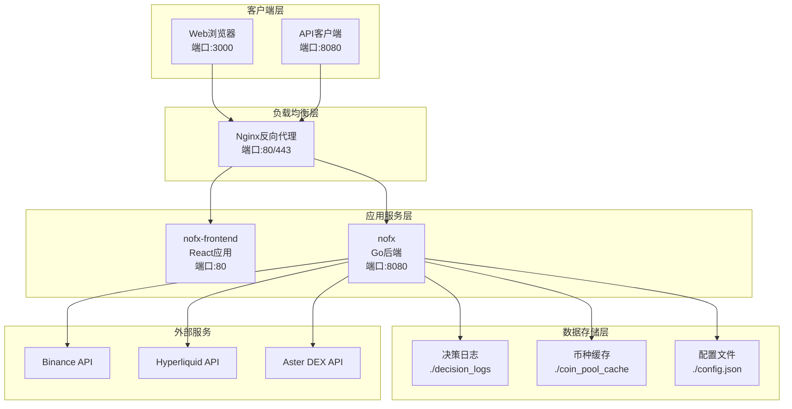
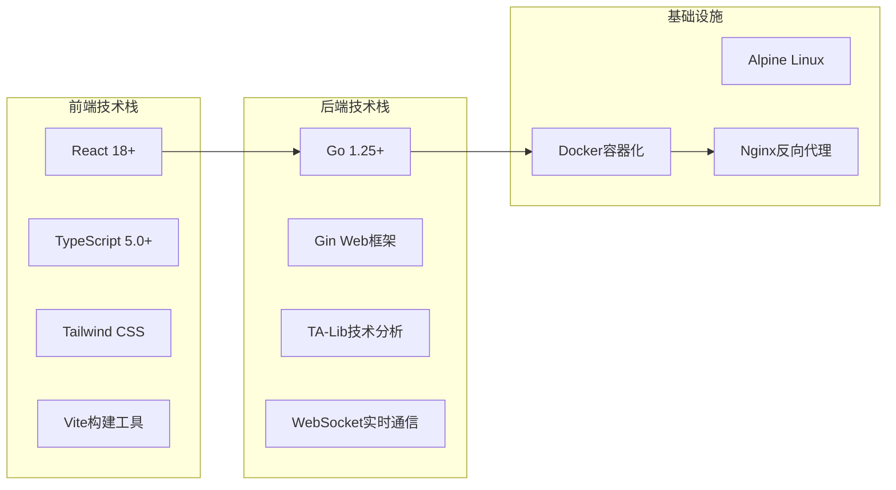
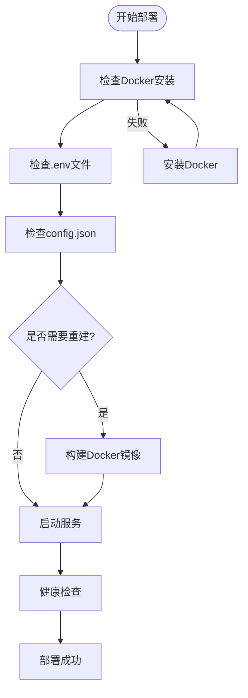

# Docker部署

<cite>
**本文档中引用的文件**
- [DOCKER_DEPLOY.md](file://DOCKER_DEPLOY.md)
- [docker-compose.yml](file://docker-compose.yml)
- [start.sh](file://start.sh)
- [nginx/nginx.conf](file://nginx/nginx.conf)
- [docker/Dockerfile.backend](file://docker/Dockerfile.backend)
- [docker/Dockerfile.frontend](file://docker/Dockerfile.frontend)
- [config/config.go](file://config/config.go)
- [logger/decision_logger.go](file://logger/decision_logger.go)
- [pool/coin_pool.go](file://pool/coin_pool.go)
</cite>

## 目录
1. [简介](#简介)
2. [前置环境要求](#前置环境要求)
3. [项目架构概览](#项目架构概览)
4. [配置文件准备](#配置文件准备)
5. [一键启动部署](#一键启动部署)
6. [服务管理操作](#服务管理操作)
7. [数据持久化机制](#数据持久化机制)
8. [高级配置选项](#高级配置选项)
9. [生产环境部署](#生产环境部署)
10. [故障排查指南](#故障排查指南)
11. [监控与维护](#监控与维护)
12. [总结](#总结)

## 简介

NOFX是一个基于Docker容器化的AI交易竞赛系统，采用前后端分离架构，支持多交易所交易和智能决策。本部署指南详细介绍了如何使用Docker Compose快速部署整个系统，并提供了完整的配置、管理和维护方案。

系统的核心特性包括：
- **多交易所支持**：支持币安、Hyperliquid、Aster DEX等主流交易平台
- **AI智能决策**：集成Qwen和DeepSeek模型进行自动化交易
- **实时监控**：提供专业的交易仪表板和性能分析
- **风险控制**：完善的风控体系和资金管理机制

## 前置环境要求

### Docker版本要求

系统需要以下最低版本的Docker组件：

| 组件 | 最低版本 | 推荐版本 | 说明 |
|------|----------|----------|------|
| Docker Engine | 20.10+ | 24.0+ | 核心容器运行时 |
| Docker Compose | 2.0+ | 2.20+ | 容器编排工具 |

### 安装Docker（推荐方式）

#### 方式一：Docker Desktop（推荐）
- **适用平台**：macOS、Windows、部分Linux发行版
- **优势**：自动包含最新Docker Compose，提供图形界面管理
- **下载地址**：[Docker Desktop](https://www.docker.com/products/docker-desktop/)

#### 方式二：Docker CE + Compose
适用于Linux用户：

```bash
# 安装Docker（包含Compose）
curl -fsSL https://get.docker.com -o get-docker.sh
sudo sh get-docker.sh

# 添加用户到docker组
sudo usermod -aG docker $USER
newgrp docker

# 验证安装
docker --version
docker compose --version
```

### 验证安装

```bash
# 检查Docker版本
docker --version

# 检查Docker Compose版本
docker compose --version

# 测试Docker功能
docker run hello-world
```

**节来源**
- [DOCKER_DEPLOY.md](file://DOCKER_DEPLOY.md#L1-L50)

## 项目架构概览

### 整体架构设计



**图表来源**
- [docker-compose.yml](file://docker-compose.yml#L1-L50)
- [nginx/nginx.conf](file://nginx/nginx.conf#L1-L53)

### 服务组件说明

| 服务名称 | 容器名称 | 端口映射 | 用途 | 健康检查 |
|----------|----------|----------|------|----------|
| 后端服务 | nofx-trading | 8080:8080 | Go语言后端API和核心逻辑 | curl http://localhost:8080/health |
| 前端服务 | nofx-frontend | 3000:80 | React静态文件服务 | wget http://localhost/health |
| 网络 | nofx-network | - | 服务间通信桥接 | - |

### 技术栈详情



**节来源**
- [docker/Dockerfile.backend](file://docker/Dockerfile.backend#L1-L69)
- [docker/Dockerfile.frontend](file://docker/Dockerfile.frontend#L1-L37)

## 配置文件准备

### 配置文件结构

系统使用`config.json`文件进行配置管理，该文件包含了所有交易参数和API密钥。

### 复制配置模板

```bash
# 复制配置文件模板
cp config.json.example config.json

# 编辑配置文件
nano config.json  # 或使用其他编辑器
```

### 核心配置字段详解

#### 基础配置结构

```json
{
  "traders": [
    {
      "id": "my_trader",
      "name": "My AI Trader",
      "enabled": true,
      "ai_model": "deepseek",
      "exchange": "binance",
      "binance_api_key": "YOUR_BINANCE_API_KEY",
      "binance_secret_key": "YOUR_BINANCE_SECRET_KEY",
      "deepseek_key": "YOUR_DEEPSEEK_API_KEY",
      "initial_balance": 1000.0,
      "scan_interval_minutes": 3
    }
  ],
  "use_default_coins": true,
  "api_server_port": 8080,
  "leverage": {
    "btc_eth_leverage": 5,
    "altcoin_leverage": 5
  }
}
```

#### 关键配置项说明

| 字段 | 类型 | 必需 | 默认值 | 说明 |
|------|------|------|--------|------|
| `id` | string | 是 | - | 交易者唯一标识符 |
| `name` | string | 是 | - | 交易者显示名称 |
| `ai_model` | string | 是 | - | AI模型类型：qwen/deepseek/custom |
| `exchange` | string | 是 | binance | 交易平台：binance/hyperliquid/aster |
| `initial_balance` | float | 是 | - | 初始资金余额（USDT） |
| `scan_interval_minutes` | int | 是 | 3 | 扫描间隔（分钟） |
| `leverage.btc_eth_leverage` | int | 否 | 5 | BTC/ETH杠杆倍数 |
| `leverage.altcoin_leverage` | int | 否 | 5 | 山寨币杠杆倍数 |

### API密钥配置

#### 币安交易所配置
```json
{
  "exchange": "binance",
  "binance_api_key": "你的币安API密钥",
  "binance_secret_key": "你的币安Secret密钥"
}
```

#### Hyperliquid交易所配置
```json
{
  "exchange": "hyperliquid",
  "hyperliquid_private_key": "你的私钥",
  "hyperliquid_testnet": false
}
```

#### Aster DEX配置
```json
{
  "exchange": "aster",
  "aster_user": "主钱包地址",
  "aster_signer": "API钱包地址",
  "aster_private_key": "API钱包私钥"
}
```

### 环境变量配置

创建`.env`文件管理环境变量：

```bash
# 时间区域设置
TZ=Asia/Shanghai

# 服务端口配置
NOFX_BACKEND_PORT=8080
NOFX_FRONTEND_PORT=3000

# 时区设置
NOFX_TIMEZONE=Asia/Shanghai
```

**节来源**
- [config/config.go](file://config/config.go#L1-L202)
- [DOCKER_DEPLOY.md](file://DOCKER_DEPLOY.md#L51-L100)

## 一键启动部署

### 启动脚本使用

系统提供了一个功能完整的`start.sh`启动脚本，简化了部署流程。

#### 脚本功能概览

```bash
# 启动脚本帮助信息
./start.sh help

# 主要命令
./start.sh start [--build]    # 启动服务（可选重新构建）
./start.sh stop               # 停止服务
./start.sh restart            # 重启服务
./start.sh logs [service]     # 查看日志
./start.sh status             # 查看状态
./start.sh update             # 更新代码
./start.sh clean              # 清理所有数据
```

#### 自动化部署流程



**图表来源**
- [start.sh](file://start.sh#L200-L282)

### 直接Docker Compose部署

如果不使用启动脚本，可以直接使用Docker Compose命令：

#### 首次部署
```bash
# 构建并启动所有服务
docker compose up -d --build

# 后续启动（不重新构建）
docker compose up -d
```

#### 命令参数说明

| 参数 | 作用 | 使用场景 |
|------|------|----------|
| `up -d` | 后台启动服务 | 生产环境部署 |
| `--build` | 强制重新构建镜像 | 代码更新后 |
| `--force-recreate` | 强制重新创建容器 | 配置变更后 |

### 部署验证

#### 检查服务状态
```bash
# 查看所有容器状态
docker compose ps

# 查看服务健康状态
docker compose ps --format json | jq '.[] | {name: .Name, state: .State, health: .Health}'
```

#### 访问系统
- **Web界面**：http://localhost:3000
- **API文档**：http://localhost:8080/health
- **后端API**：http://localhost:8080/api/

**节来源**
- [start.sh](file://start.sh#L1-L282)
- [docker-compose.yml](file://docker-compose.yml#L1-L50)

## 服务管理操作

### 基本管理命令

#### 启动和停止服务
```bash
# 启动所有服务
docker compose up -d

# 停止所有服务
docker compose stop

# 停止并删除容器（保留数据）
docker compose down

# 停止并删除容器和数据卷
docker compose down -v
```

#### 服务重启
```bash
# 重启所有服务
docker compose restart

# 只重启后端服务
docker compose restart nofx

# 只重启前端服务
docker compose restart nofx-frontend
```

### 日志管理

#### 实时日志查看
```bash
# 查看所有服务日志（实时跟踪）
docker compose logs -f

# 只查看后端日志
docker compose logs -f nofx

# 只查看前端日志
docker compose logs -f nofx-frontend

# 查看最近100行日志
docker compose logs --tail=100
```

#### 日志级别控制
```bash
# 查看特定时间段的日志
docker compose logs --since "2024-01-01T00:00:00" --until "2024-01-01T23:59:59"
```

### 服务状态监控

#### 实时状态查看
```bash
# 查看容器资源使用情况
docker compose top

# 查看容器详细信息
docker compose ps -a

# 查看网络连接状态
docker network ls
docker network inspect nofx-network
```

#### 健康检查
```bash
# 手动测试健康端点
curl http://localhost:8080/health
curl http://localhost:3000/health

# 查看健康检查状态
docker inspect nofx | jq '.[0].State.Health'
docker inspect nofx-frontend | jq '.[0].State.Health'
```

### 更新和回滚

#### 代码更新流程
```bash
# 拉取最新代码
git pull

# 重新构建并重启服务
docker compose up -d --build

# 验证更新
docker compose ps
```

#### 回滚操作
```bash
# 回滚到上一个版本
git reset --hard HEAD~1
docker compose up -d --build
```

**节来源**
- [DOCKER_DEPLOY.md](file://DOCKER_DEPLOY.md#L142-L232)

## 数据持久化机制

### 数据存储架构

系统实现了完整的数据持久化机制，确保重要数据不会因容器重启而丢失。

```mermaid
graph TB
subgraph "宿主机目录"
DecisionLogs[./decision_logs/<br/>AI决策日志]
CoinCache[./coin_pool_cache/<br/>币种池缓存]
ConfigFile[./config.json<br/>配置文件]
end
subgraph "容器内路径"
ContainerLogs[/app/decision_logs]
ContainerCache[/app/coin_pool_cache]
ContainerConfig[/app/config.json]
end
subgraph "数据类型"
DecisionFiles[决策记录文件<br/>decision_YYYYMMDD_HHMMSS_cycleN.json]
CacheFiles[缓存文件<br/>latest.json, oi_top_latest.json]
ConfigMount[配置挂载<br/>只读模式]
end
DecisionLogs --> ContainerLogs
CoinCache --> ContainerCache
ConfigFile --> ContainerConfig
ContainerLogs --> DecisionFiles
ContainerCache --> CacheFiles
ContainerConfig --> ConfigMount
```

**图表来源**
- [docker-compose.yml](file://docker-compose.yml#L15-L20)
- [logger/decision_logger.go](file://logger/decision_logger.go#L1-L100)
- [pool/coin_pool.go](file://pool/coin_pool.go#L1-L100)

### 决策日志存储

#### 日志文件结构
决策日志采用时间戳命名格式，便于追踪和分析：

```
./decision_logs/
├── decision_20241029_143022_cycle1.json
├── decision_20241029_143322_cycle2.json
├── decision_20241029_143622_cycle3.json
└── ...
```

#### 日志内容结构
每个决策日志文件包含完整的交易决策信息：

| 字段 | 类型 | 说明 |
|------|------|------|
| `timestamp` | datetime | 决策时间 |
| `cycle_number` | int | 周期编号 |
| `input_prompt` | string | AI输入提示 |
| `cot_trace` | string | 思维链输出 |
| `decision_json` | string | 决策JSON |
| `account_state` | object | 账户状态快照 |
| `positions` | array | 持仓快照 |
| `candidate_coins` | array | 候选币种列表 |
| `decisions` | array | 执行的决策 |
| `execution_log` | array | 执行日志 |
| `success` | boolean | 是否成功 |
| `error_message` | string | 错误信息 |

### 币种池缓存机制

#### 缓存文件类型
系统维护两种类型的币种池缓存：

1. **AI500币种池缓存**：`./coin_pool_cache/latest.json`
2. **OI Top持仓量缓存**：`./coin_pool_cache/oi_top_latest.json`

#### 缓存数据结构
```json
{
  "coins": [
    {
      "pair": "BTCUSDT",
      "score": 95.5,
      "start_time": 1698765432,
      "start_price": 25000.0,
      "last_score": 96.2,
      "max_score": 98.0,
      "increase_percent": 12.5
    }
  ],
  "fetched_at": "2024-10-29T14:30:00Z",
  "source_type": "api"
}
```

### 数据备份策略

#### 自动备份脚本
```bash
#!/bin/bash
# 备份数据脚本

DATE=$(date +%Y%m%d)
BACKUP_DIR="./backup_$DATE"

# 创建备份目录
mkdir -p $BACKUP_DIR

# 备份决策日志
tar -czf $BACKUP_DIR/decision_logs.tar.gz decision_logs/

# 备份币种池缓存
tar -czf $BACKUP_DIR/coin_pool_cache.tar.gz coin_pool_cache/

# 备份配置文件
cp config.json $BACKUP_DIR/

echo "备份完成: $BACKUP_DIR"
```

#### 恢复数据流程
```bash
# 停止服务
docker compose down

# 恢复数据
tar -xzf backup_20241029.tar.gz

# 重启服务
docker compose up -d
```

**节来源**
- [logger/decision_logger.go](file://logger/decision_logger.go#L100-L200)
- [pool/coin_pool.go](file://pool/coin_pool.go#L200-L300)

## 高级配置选项

### 端口配置

#### 修改服务端口

编辑`docker-compose.yml`文件，修改端口映射：

```yaml
services:
  nofx:
    ports:
      - "8080:8080"  # 后端服务端口
    environment:
      - TZ=Asia/Shanghai
      
  nofx-frontend:
    ports:
      - "3000:80"    # 前端服务端口
```

#### 环境变量端口配置

使用`.env`文件管理端口：

```bash
# .env文件
NOFX_BACKEND_PORT=8080
NOFX_FRONTEND_PORT=3000
```

然后在`docker-compose.yml`中引用：

```yaml
services:
  nofx:
    ports:
      - "${NOFX_BACKEND_PORT}:8080"
      
  nofx-frontend:
    ports:
      - "${NOFX_FRONTEND_PORT}:80"
```

### 资源限制配置

#### CPU和内存限制

```yaml
services:
  nofx:
    deploy:
      resources:
        limits:
          cpus: '2.0'
          memory: 2G
        reservations:
          cpus: '1.0'
          memory: 1G
          
  nofx-frontend:
    deploy:
      resources:
        limits:
          cpus: '1.0'
          memory: 1G
        reservations:
          cpus: '0.5'
          memory: 512M
```

#### 磁盘空间限制

```yaml
services:
  nofx:
    volumes:
      - ./decision_logs:/app/decision_logs:maxsize=1G
      - ./coin_pool_cache:/app/coin_pool_cache:maxsize=500M
```

### 网络配置

#### 自定义网络

```yaml
networks:
  nofx-network:
    driver: bridge
    ipam:
      config:
        - subnet: 172.20.0.0/16
          gateway: 172.20.0.1
```

#### 服务间通信

```yaml
services:
  nofx:
    networks:
      - nofx-network
    depends_on:
      - nofx-frontend
      
  nofx-frontend:
    networks:
      - nofx-network
```

### 环境变量管理

#### 安全环境变量

```yaml
services:
  nofx:
    environment:
      - BINANCE_API_KEY=${BINANCE_API_KEY}
      - BINANCE_SECRET_KEY=${BINANCE_SECRET_KEY}
      - DEEPSEEK_KEY=${DEEPSEEK_KEY}
      - TZ=${NOFX_TIMEZONE:-Asia/Shanghai}
```

#### 配置文件挂载

```yaml
services:
  nofx:
    volumes:
      - ./config.json:/app/config.json:ro
      - ./logs:/app/logs
```

### 日志配置

#### 日志驱动配置

```yaml
services:
  nofx:
    logging:
      driver: "json-file"
      options:
        max-size: "10m"
        max-file: "3"
        compress: "true"
        
  nofx-frontend:
    logging:
      driver: "json-file"
      options:
        max-size: "5m"
        max-file: "2"
```

**节来源**
- [docker-compose.yml](file://docker-compose.yml#L1-L50)
- [DOCKER_DEPLOY.md](file://DOCKER_DEPLOY.md#L233-L300)

## 生产环境部署

### Nginx反向代理配置

#### 基础反向代理设置

```nginx
# /etc/nginx/sites-available/nofx
server {
    listen 80;
    server_name your-domain.com;

    # SSL配置（推荐）
    listen 443 ssl http2;
    ssl_certificate /path/to/certificate.crt;
    ssl_certificate_key /path/to/private.key;
    ssl_protocols TLSv1.2 TLSv1.3;
    ssl_ciphers HIGH:!aNULL:!MD5;

    # 静态文件缓存
    location / {
        root /usr/share/nginx/html;
        index index.html;
        try_files $uri $uri/ /index.html;
        
        # 缓存静态资源
        location ~* \.(js|css|png|jpg|jpeg|gif|ico|svg|woff|woff2|ttf|eot)$ {
            expires 1y;
            add_header Cache-Control "public, immutable";
        }
    }

    # API代理
    location /api/ {
        proxy_pass http://localhost:8080/api/;
        proxy_http_version 1.1;
        proxy_set_header Upgrade $http_upgrade;
        proxy_set_header Connection 'upgrade';
        proxy_set_header Host $host;
        proxy_set_header X-Real-IP $remote_addr;
        proxy_set_header X-Forwarded-For $proxy_add_x_forwarded_for;
        proxy_set_header X-Forwarded-Proto $scheme;
        
        # 增加超时时间
        proxy_connect_timeout 300s;
        proxy_send_timeout 300s;
        proxy_read_timeout 300s;
    }

    # 健康检查
    location /health {
        return 200 "OK\n";
        add_header Content-Type text/plain;
        access_log off;
    }
}
```

#### SSL证书配置

```bash
# 使用Certbot获取免费SSL证书
sudo apt-get install certbot python3-certbot-nginx
sudo certbot --nginx -d your-domain.com

# 自动续期测试
sudo certbot renew --dry-run
```

### Docker Swarm集群部署

#### 初始化Swarm集群

```bash
# 在主节点初始化
docker swarm init

# 在工作节点加入（获取加入命令）
docker swarm join-token worker
```

#### 部署集群服务

```yaml
# docker-stack.yml
version: '3.8'

services:
  nofx-backend:
    image: your-registry/nofx-backend:latest
    deploy:
      replicas: 3
      resources:
        limits:
          cpus: '2'
          memory: 2G
        reservations:
          cpus: '1'
          memory: 1G
      restart_policy:
        condition: on-failure
        delay: 5s
        max_attempts: 3
        
  nofx-frontend:
    image: your-registry/nofx-frontend:latest
    deploy:
      replicas: 2
      resources:
        limits:
          cpus: '1'
          memory: 1G
        reservations:
          cpus: '0.5'
          memory: 512M
      restart_policy:
        condition: on-failure
        
  nofx-db:
    image: postgres:15
    deploy:
      resources:
        limits:
          cpus: '1'
          memory: 1G
        reservations:
          cpus: '0.5'
          memory: 512M
      placement:
        constraints:
          - node.role == manager
    volumes:
      - postgres_data:/var/lib/postgresql/data
    environment:
      - POSTGRES_DB=nofx
      - POSTGRES_USER=nofx
      - POSTGRES_PASSWORD=secure_password

volumes:
  postgres_data:

networks:
  default:
    driver: overlay
    attachable: true
```

#### 部署和管理

```bash
# 部署堆栈
docker stack deploy -c docker-stack.yml nofx

# 查看服务状态
docker stack services nofx

# 扩展服务
docker service scale nofx_backend=5

# 查看日志
docker service logs nofx_backend -f --tail=100

# 更新服务
docker service update --image your-registry/nofx-backend:new-version nofx_backend
```

### 监控和告警

#### Prometheus监控配置

```yaml
# docker-compose.monitoring.yml
version: '3.8'

services:
  prometheus:
    image: prom/prometheus:latest
    ports:
      - "9090:9090"
    volumes:
      - ./prometheus.yml:/etc/prometheus/prometheus.yml
      - prometheus_data:/prometheus
    command:
      - '--config.file=/etc/prometheus/prometheus.yml'
      - '--storage.tsdb.path=/prometheus'
      - '--web.console.libraries=/etc/prometheus/console_libraries'
      - '--web.console.templates=/etc/prometheus/consoles'
      - '--web.enable-lifecycle'

  grafana:
    image: grafana/grafana:latest
    ports:
      - "3001:3000"
    volumes:
      - grafana_data:/var/lib/grafana
    environment:
      - GF_SECURITY_ADMIN_PASSWORD=admin123

  node-exporter:
    image: prom/node-exporter:latest
    ports:
      - "9100:9100"
    volumes:
      - /proc:/host/proc:ro
      - /sys:/host/sys:ro
      - /:/rootfs:ro

volumes:
  prometheus_data:
  grafana_data:
```

#### 健康检查监控

```yaml
# prometheus.yml
global:
  scrape_interval: 15s

scrape_configs:
  - job_name: 'nofx-backend'
    static_configs:
      - targets: ['nofx:8080']
    metrics_path: '/metrics'
    scrape_interval: 30s

  - job_name: 'nofx-frontend'
    static_configs:
      - targets: ['nofx-frontend:80']
    metrics_path: '/metrics'
    scrape_interval: 30s
```

**节来源**
- [nginx/nginx.conf](file://nginx/nginx.conf#L1-L53)
- [DOCKER_DEPLOY.md](file://DOCKER_DEPLOY.md#L400-L473)

## 故障排查指南

### 常见问题诊断

#### 容器启动失败

```bash
# 查看详细错误信息
docker compose logs nofx
docker compose logs nofx-frontend

# 检查容器状态
docker compose ps -a

# 重新构建（清除缓存）
docker compose build --no-cache
```

#### 端口冲突问题

```bash
# 查找占用端口的进程
lsof -i :8080  # 后端端口
lsof -i :3000  # 前端端口

# 杀死占用端口的进程
kill -9 <PID>

# 或者修改端口配置
sed -i 's/8080:8080/8081:8080/g' docker-compose.yml
```

#### 配置文件问题

```bash
# 检查配置文件是否存在
ls -la config.json

# 验证JSON格式
cat config.json | jq .

# 检查必需字段
grep -E '"(binance_api_key|deepseek_key|initial_balance)"' config.json
```

### 健康检查失败

#### 后端健康检查

```bash
# 检查健康状态
docker inspect nofx | jq '.[0].State.Health'

# 手动测试健康端点
curl http://localhost:8080/health

# 查看后端日志
docker compose logs nofx | grep -i health
```

#### 前端健康检查

```bash
# 检查前端状态
docker inspect nofx-frontend | jq '.[0].State.Health'

# 测试前端连接
curl http://localhost:3000/health

# 检查网络连接
docker compose exec nofx-frontend ping nofx
```

### 网络连接问题

#### 服务间通信测试

```bash
# 检查网络连通性
docker compose exec nofx-frontend ping nofx

# 测试API连接
docker compose exec nofx-frontend wget -O- http://nofx:8080/health

# 检查DNS解析
docker compose exec nofx-frontend nslookup nofx
```

#### 网络配置修复

```bash
# 重建网络
docker compose down
docker network rm nofx-network
docker compose up -d

# 检查网络配置
docker network ls
docker network inspect nofx-network
```

### 数据持久化问题

#### 日志文件权限

```bash
# 检查日志目录权限
ls -la decision_logs/
ls -la coin_pool_cache/

# 修复权限问题
sudo chown -R $USER:$USER decision_logs/
sudo chown -R $USER:$USER coin_pool_cache/
```

#### 磁盘空间不足

```bash
# 检查磁盘使用情况
df -h

# 清理旧日志
find decision_logs/ -name "*.json" -mtime +30 -delete

# 清理Docker资源
docker system prune -f
docker volume prune -f
```

### 性能优化问题

#### 资源使用监控

```bash
# 查看容器资源使用
docker stats

# 检查系统资源
free -h
top -p $(pgrep docker)

# 分析日志中的性能问题
docker compose logs nofx | grep -i "slow\|timeout\|error"
```

#### 配置优化

```yaml
# 优化Docker配置
services:
  nofx:
    ulimits:
      nofile:
        soft: 65536
        hard: 65536
    sysctls:
      - net.core.somaxconn=1024
```

### 清理和恢复

#### 完整清理流程

```bash
# 停止并删除所有容器
docker compose down -v

# 清理Docker资源
docker system prune -f
docker volume prune -f

# 重新初始化
docker compose up -d --build
```

#### 数据恢复

```bash
# 备份当前数据
tar -czf backup_$(date +%Y%m%d).tar.gz decision_logs/ coin_pool_cache/ config.json

# 恢复数据
tar -xzf backup_20241029.tar.gz

# 重启服务
docker compose up -d
```

**节来源**
- [DOCKER_DEPLOY.md](file://DOCKER_DEPLOY.md#L301-L400)

## 监控与维护

### 日志管理

#### 日志轮转配置

系统自动配置了日志轮转机制：

```yaml
services:
  nofx:
    logging:
      driver: "json-file"
      options:
        max-size: "10m"
        max-file: "3"
        compress: "true"
```

#### 日志分析工具

```bash
# 查看日志统计
docker compose logs --timestamps | wc -l

# 分析错误日志
docker compose logs nofx | grep -i "error\|exception\|fail" | tail -50

# 实时监控
docker compose logs -f nofx | grep -i "error\|warn"
```

### 性能监控

#### 容器资源监控

```bash
# 实时资源使用
docker stats --no-stream

# 容器资源限制
docker inspect nofx | jq '.[0].HostConfig.Resources'
```

#### 系统性能监控

```bash
# 系统资源使用
top -p $(pgrep docker)

# 网络连接监控
ss -tuln | grep -E "(8080|3000)"

# 磁盘I/O监控
iotop -o
```

### 自动化维护

#### 定期维护脚本

```bash
#!/bin/bash
# 自动维护脚本

echo "=== NOFX 系统维护 ==="
echo "时间: $(date)"
echo

# 1. 检查磁盘空间
echo "1. 磁盘空间检查:"
df -h | grep -E "(Filesystem|/)"
echo

# 2. 清理旧日志
echo "2. 清理旧日志:"
find decision_logs/ -name "*.json" -mtime +30 -delete
echo "清理完成: $(find decision_logs/ -name "*.json" -mtime +30 | wc -l) 个文件"
echo

# 3. 检查容器状态
echo "3. 容器状态检查:"
docker compose ps
echo

# 4. 清理未使用的资源
echo "4. 清理Docker资源:"
docker system prune -f
echo "清理完成"
echo

echo "=== 维护完成 ==="
```

#### 定时任务配置

```bash
# 添加到crontab
echo "0 2 * * * /path/to/maintenance.sh" >> ~/.crontab
crontab ~/.crontab
```

### 备份策略

#### 自动备份配置

```bash
#!/bin/bash
# 自动备份脚本

BACKUP_DIR="/backup/nofx/$(date +%Y%m%d)"
mkdir -p $BACKUP_DIR

# 备份配置文件
cp config.json $BACKUP_DIR/

# 备份决策日志
tar -czf $BACKUP_DIR/decision_logs_$(date +%H%M%S).tar.gz decision_logs/

# 备份币种池缓存
tar -czf $BACKUP_DIR/coin_pool_cache_$(date +%H%M%S).tar.gz coin_pool_cache/

# 清理超过30天的备份
find /backup/nofx/ -name "*.tar.gz" -mtime +30 -delete

echo "备份完成: $BACKUP_DIR"
```

### 健康检查自动化

#### 自定义健康检查

```bash
#!/bin/bash
# 健康检查脚本

echo "=== NOFX 健康检查 ==="

# 检查容器状态
containers=$(docker compose ps --format json | jq -r '.[] | select(.State=="running") | .Name')
echo "运行中的容器: $containers"

# 检查关键端口
for port in 8080 3000; do
    if lsof -i :$port > /dev/null; then
        echo "端口 $port: ✅ 正常"
    else
        echo "端口 $port: ❌ 异常"
    fi
done

# 检查API响应
if curl -s http://localhost:8080/health > /dev/null; then
    echo "后端API: ✅ 正常"
else
    echo "后端API: ❌ 异常"
fi

if curl -s http://localhost:3000/health > /dev/null; then
    echo "前端API: ✅ 正常"
else
    echo "前端API: ❌ 异常"
fi

echo "=== 健康检查完成 ==="
```

**节来源**
- [DOCKER_DEPLOY.md](file://DOCKER_DEPLOY.md#L400-L473)

## 总结

本Docker部署指南涵盖了NOFX AI交易竞赛系统的完整部署流程，从基础环境搭建到生产环境部署，提供了全面的技术支持和运维指导。

### 关键要点回顾

1. **前置准备**：确保Docker版本符合要求，准备好配置文件
2. **部署方式**：支持一键启动脚本和直接Docker Compose命令
3. **数据持久化**：完整的决策日志和币种池缓存保护机制
4. **高级配置**：端口映射、资源限制、环境变量管理
5. **生产部署**：Nginx反向代理、SSL配置、Docker Swarm集群
6. **故障排查**：常见问题解决方案和监控维护策略

### 最佳实践建议

- **安全性**：使用环境变量存储敏感信息，定期更新API密钥
- **稳定性**：配置适当的资源限制和健康检查
- **可维护性**：建立完善的日志管理和备份策略
- **扩展性**：考虑使用Docker Swarm进行集群部署

### 后续发展

随着NOFX系统的不断演进，建议关注：
- 新增交易所支持的配置更新
- AI模型能力的增强和配置优化
- 监控告警系统的完善
- 容器编排和云原生技术的应用

通过遵循本指南的最佳实践，您可以成功部署和维护NOFX AI交易竞赛系统，在生产环境中稳定运行并获得最佳性能表现。