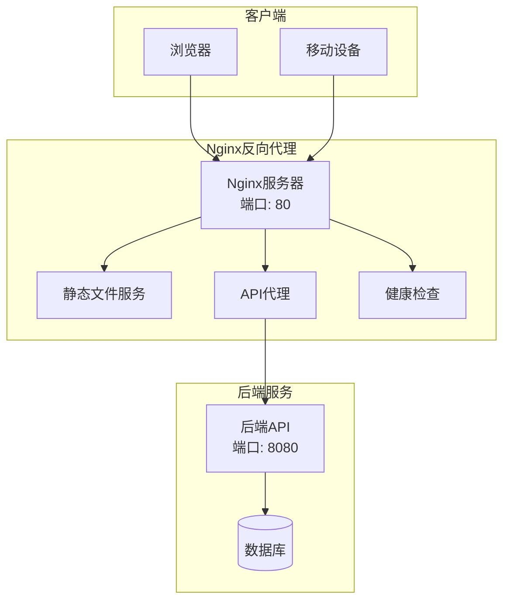
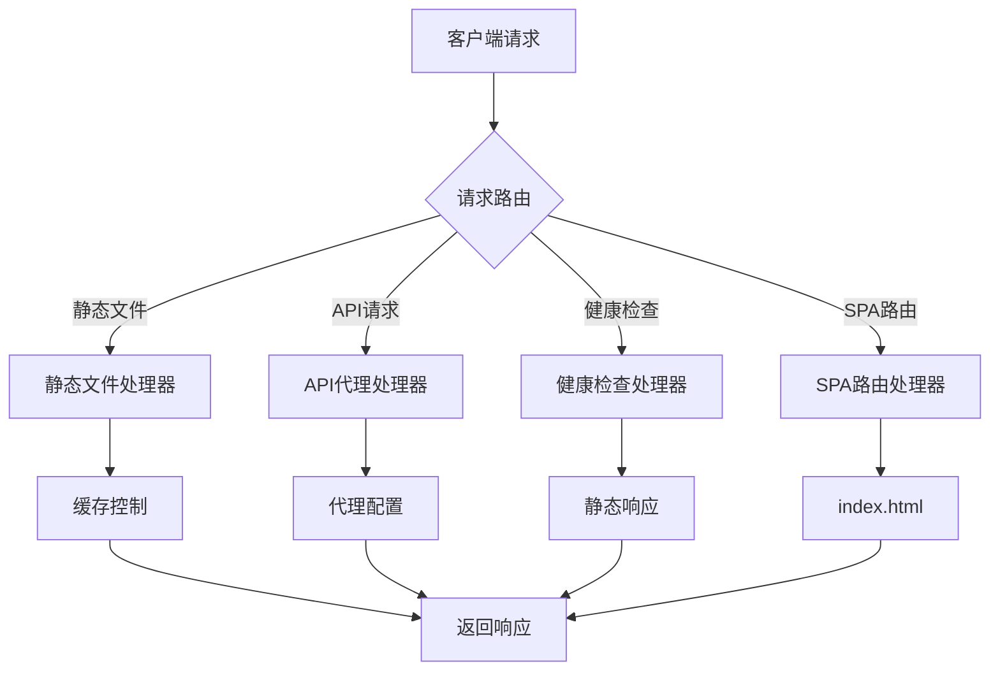
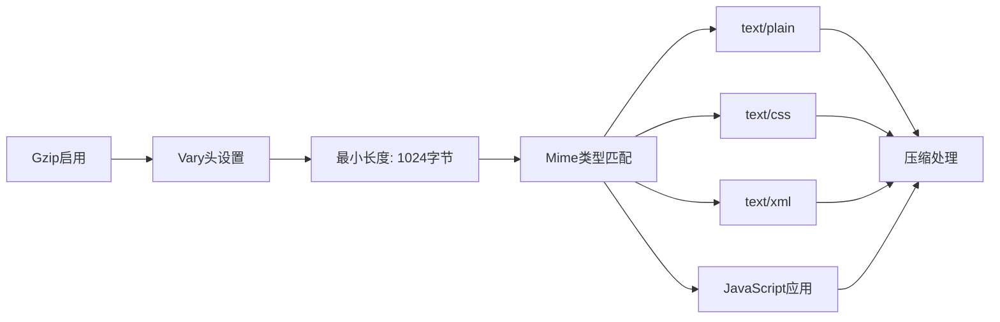
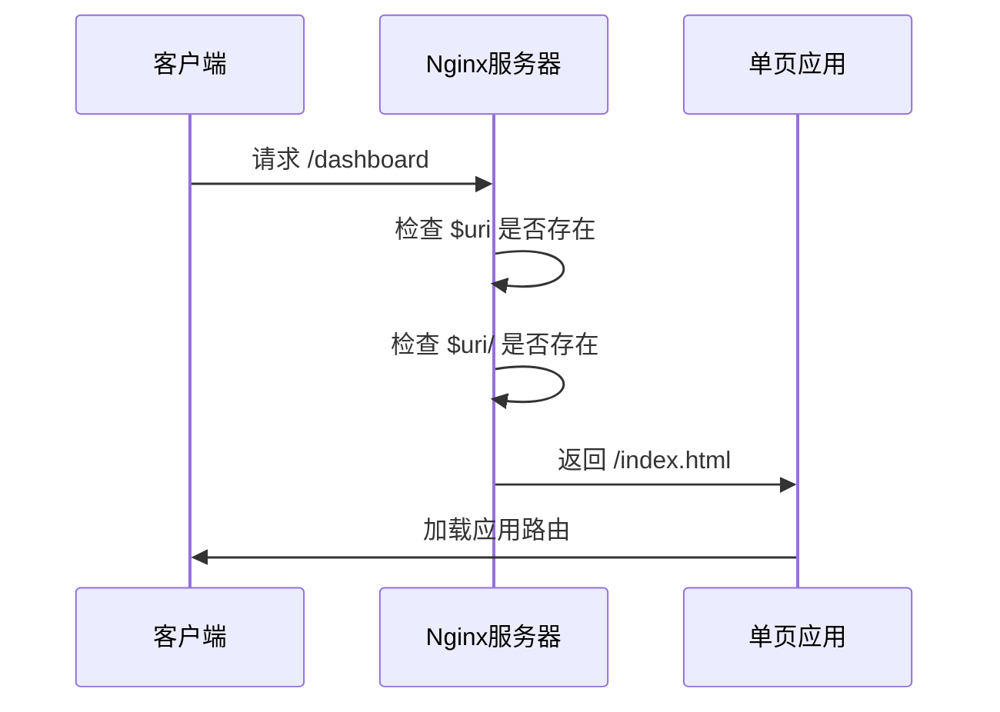
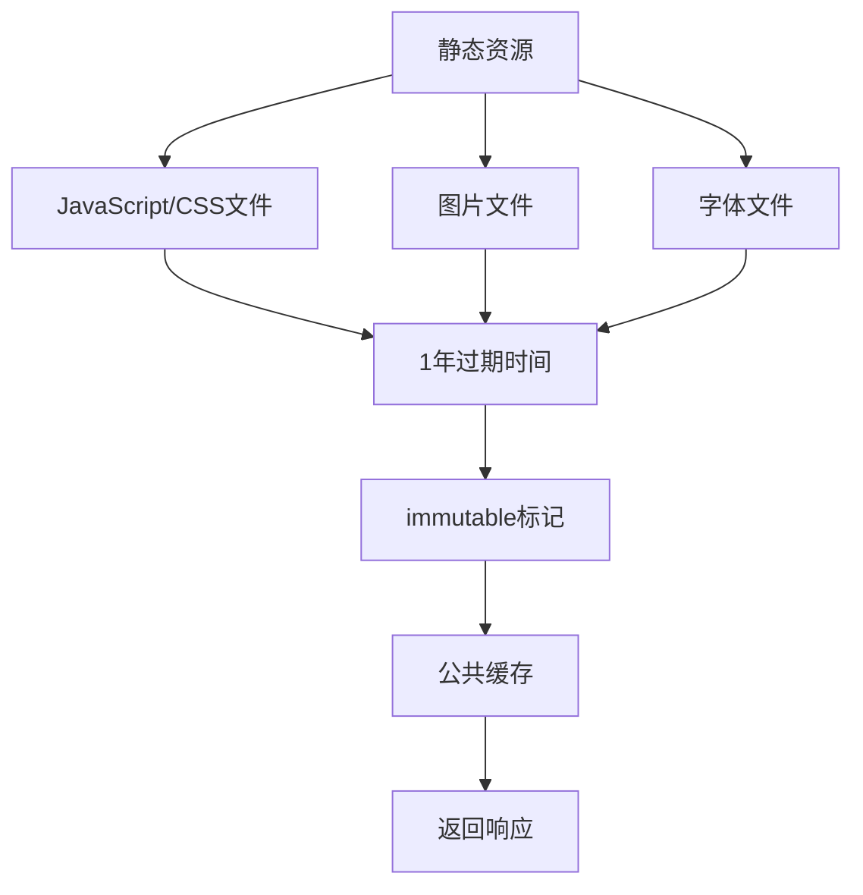
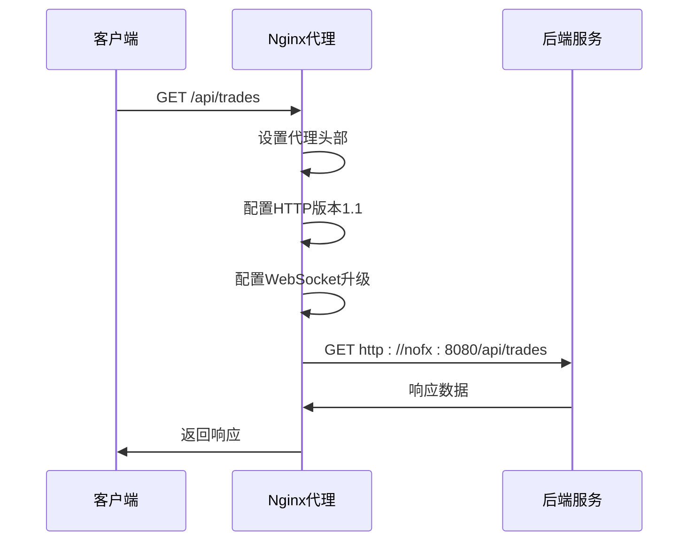
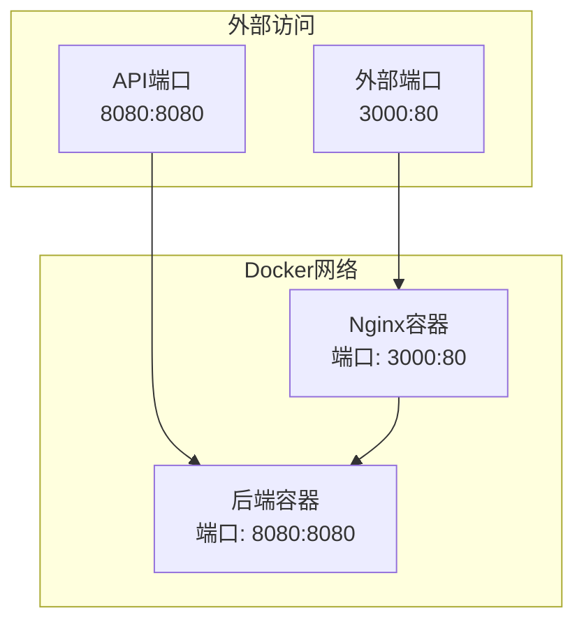
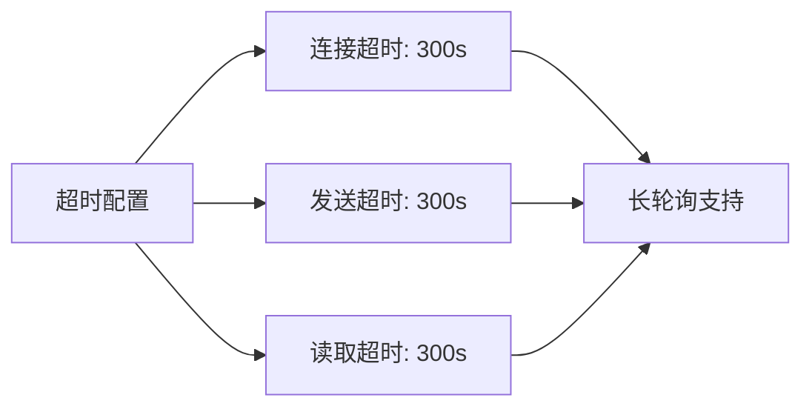

# Nginx反向代理配置文档

<cite>
**本文档中引用的文件**
- [nginx.conf](file://nginx/nginx.conf)
- [docker-compose.yml](file://docker-compose.yml)
- [DOCKER_DEPLOY.md](file://DOCKER_DEPLOY.md)
- [index.html](file://web/index.html)
- [package.json](file://web/package.json)
</cite>

## 目录
1. [简介](#简介)
2. [项目结构概览](#项目结构概览)
3. [核心配置组件](#核心配置组件)
4. [架构概述](#架构概述)
5. [详细配置分析](#详细配置分析)
6. [部署方式](#部署方式)
7. [性能优化](#性能优化)
8. [故障排除指南](#故障排除指南)
9. [总结](#总结)

## 简介

本文档详细介绍了NOFX项目的Nginx反向代理配置，该配置实现了前端静态文件服务、API代理转发以及健康检查功能。配置文件位于`nginx/nginx.conf`，采用现代化的Nginx配置模式，支持单页应用（SPA）路由、静态资源缓存、Gzip压缩和长轮询API支持。

## 项目结构概览

NOFX项目采用前后端分离架构，Nginx配置作为反向代理层，协调前端静态资源服务和后端API请求：



**图表来源**
- [nginx.conf](file://nginx/nginx.conf#L1-L53)
- [docker-compose.yml](file://docker-compose.yml#L1-L50)

**章节来源**
- [nginx.conf](file://nginx/nginx.conf#L1-L53)
- [docker-compose.yml](file://docker-compose.yml#L1-L50)

## 核心配置组件

### 服务器块配置

Nginx配置的核心是一个server块，监听80端口并处理来自localhost的请求：

| 配置项 | 值 | 说明 |
|--------|-----|------|
| listen | 80 | 监听标准HTTP端口 |
| server_name | localhost | 服务器名称标识符 |
| root | /usr/share/nginx/html | 前端文件根目录 |
| index | index.html | 默认索引文件 |

### 静态文件服务配置

前端静态文件通过root和index指令指向前端构建输出目录，支持单页应用路由：

| 配置项 | 值 | 功能 |
|--------|-----|------|
| root | /usr/share/nginx/html | 静态文件根目录 |
| index | index.html | 默认入口文件 |
| try_files | $uri $uri/ /index.html | SPA路由支持 |

**章节来源**
- [nginx.conf](file://nginx/nginx.conf#L3-L10)

## 架构概述

Nginx配置采用模块化设计，包含四个主要功能区域：



**图表来源**
- [nginx.conf](file://nginx/nginx.conf#L11-L53)

## 详细配置分析

### Gzip压缩配置

Nginx启用了增强型Gzip压缩，提升传输效率：



**图表来源**
- [nginx.conf](file://nginx/nginx.conf#L12-L15)

#### 支持的MIME类型

| 类别 | MIME类型 | 用途 |
|------|----------|------|
| 文本文件 | text/plain | 纯文本文件 |
| 样式表 | text/css | CSS样式文件 |
| XML文档 | text/xml | XML格式文档 |
| JavaScript | application/javascript | JavaScript文件 |
| JSON数据 | application/json | JSON格式数据 |

**章节来源**
- [nginx.conf](file://nginx/nginx.conf#L12-L15)

### 单页应用（SPA）路由支持

通过`try_files`指令实现SPA路由机制：



**图表来源**
- [nginx.conf](file://nginx/nginx.conf#L17-L19)

#### SPA路由流程

1. **文件检查阶段**：Nginx尝试查找请求的文件是否存在
2. **目录检查阶段**：如果文件不存在，检查对应的目录是否存在
3. **回退处理**：如果都不存在，返回index.html让前端路由接管
4. **前端路由**：前端应用根据URL路径渲染相应页面

**章节来源**
- [nginx.conf](file://nginx/nginx.conf#L17-L19)

### 静态资源缓存策略

针对不同类型的静态资源实施差异化缓存策略：



**图表来源**
- [nginx.conf](file://nginx/nginx.conf#L21-L24)

#### 缓存配置详情

| 资源类型 | 缓存时间 | 缓存策略 | 头部设置 |
|----------|----------|----------|----------|
| JavaScript文件 | 1年 | immutable | public, immutable |
| CSS文件 | 1年 | immutable | public, immutable |
| 图片文件 | 1年 | immutable | public, immutable |
| 字体文件 | 1年 | immutable | public, immutable |

**章节来源**
- [nginx.conf](file://nginx/nginx.conf#L21-L24)

### API代理配置

Nginx将/api/路径的请求代理到后端服务，保持路径完整性：



**图表来源**
- [nginx.conf](file://nginx/nginx.conf#L26-L47)

#### 代理配置参数

| 参数 | 值 | 作用 |
|------|-----|------|
| proxy_pass | http://nofx:8080/api/ | 后端服务地址 |
| proxy_http_version | 1.1 | HTTP协议版本 |
| proxy_connect_timeout | 300s | 连接超时时间 |
| proxy_send_timeout | 300s | 发送超时时间 |
| proxy_read_timeout | 300s | 读取超时时间 |

**章节来源**
- [nginx.conf](file://nginx/nginx.conf#L26-L47)

### 健康检查端点

提供独立于后端的健康检查功能：

```mermaid
flowchart TD
HealthRequest[健康检查请求] --> HealthEndpoint[/health端点]
HealthEndpoint --> StaticResponse[静态200响应]
StaticResponse --> OKText[OK文本]
OKText --> PlainText[纯文本格式]
PlainText --> DisableLogging[禁用访问日志]
```

**图表来源**
- [nginx.conf](file://nginx/nginx.conf#L49-L53)

#### 健康检查特性

| 特性 | 配置 | 说明 |
|------|------|------|
| 响应状态码 | 200 | 成功状态 |
| 响应内容 | "OK\n" | 纯文本响应 |
| 内容类型 | text/plain | 纯文本格式 |
| 访问日志 | 关闭 | 不记录访问日志 |

**章节来源**
- [nginx.conf](file://nginx/nginx.conf#L49-L53)

## 部署方式

### Docker容器化部署

项目采用Docker Compose进行容器化部署，包含前后端服务：



**图表来源**
- [docker-compose.yml](file://docker-compose.yml#L1-L50)

#### 容器配置要点

| 服务 | 端口映射 | 网络 | 健康检查 |
|------|----------|------|----------|
| nofx-frontend | 3000:80 | nofx-network | wget健康检查 |
| nofx | 8080:8080 | nofx-network | curl健康检查 |

**章节来源**
- [docker-compose.yml](file://docker-compose.yml#L1-L50)

### 生产环境部署

#### Nginx反向代理配置

在生产环境中，建议使用独立的Nginx服务器作为反向代理：

```nginx
# /etc/nginx/sites-available/nofx
server {
    listen 80;
    server_name your-domain.com;
    
    location / {
        proxy_pass http://localhost:3000;
        proxy_set_header Host $host;
        proxy_set_header X-Real-IP $remote_addr;
    }
    
    location /api/ {
        proxy_pass http://localhost:8080/api/;
        proxy_set_header Host $host;
        proxy_set_header X-Real-IP $remote_addr;
    }
}
```

#### HTTPS配置

使用Let's Encrypt获取SSL证书：

```bash
# 安装Certbot
sudo apt-get install certbot python3-certbot-nginx

# 获取SSL证书
sudo certbot --nginx -d your-domain.com

# 自动续期
sudo certbot renew --dry-run
```

**章节来源**
- [DOCKER_DEPLOY.md](file://DOCKER_DEPLOY.md#L400-L450)

## 性能优化

### 缓存策略优化

1. **长期缓存**：静态资源设置1年过期时间，减少重复下载
2. **不可变标记**：使用immutable标记确保浏览器不会重新验证
3. **压缩传输**：启用Gzip压缩减少传输数据量

### 超时配置优化



**图表来源**
- [nginx.conf](file://nginx/nginx.conf#L44-L47)

### WebSocket支持

配置支持WebSocket升级，确保实时通信功能：

| 头部名称 | 值 | 作用 |
|----------|-----|------|
| Upgrade | $http_upgrade | WebSocket协议升级 |
| Connection | 'upgrade' | 连接升级 |
| Host | $host | 保持原始主机头 |

**章节来源**
- [nginx.conf](file://nginx/nginx.conf#L29-L32)

## 故障排除指南

### 常见问题及解决方案

#### 1. 前端路由404问题

**症状**：刷新页面或直接访问路由时出现404错误

**原因**：Nginx未正确配置SPA路由支持

**解决方案**：确保`try_files $uri $uri/ /index.html;`配置正确

#### 2. API代理连接失败

**症状**：API请求返回502或连接超时

**原因**：后端服务未启动或网络配置错误

**解决方案**：
- 检查后端服务状态：`docker compose ps`
- 验证网络连接：`docker compose exec frontend ping nofx`
- 检查代理配置：确认`proxy_pass`目标地址正确

#### 3. 静态资源缓存问题

**症状**：更新后的静态资源未生效

**原因**：浏览器缓存导致

**解决方案**：
- 强制刷新页面（Ctrl+Shift+R）
- 检查缓存头部设置
- 使用版本号或哈希值区分资源

#### 4. 健康检查失败

**症状**：容器健康检查持续失败

**解决方案**：
```bash
# 检查容器状态
docker compose ps -a

# 查看详细日志
docker compose logs frontend
docker compose logs backend

# 手动测试健康端点
curl http://localhost:3000/health
curl http://localhost:8080/health
```

### 性能监控

#### 日志分析

```bash
# 查看访问日志
docker compose logs -f --tail=100 frontend

# 分析错误日志
docker compose logs --tail=1000 backend | grep ERROR

# 实时监控
docker compose logs -f | grep -E "(ERROR|WARNING)"
```

#### 性能指标

| 指标 | 监控方法 | 正常范围 |
|------|----------|----------|
| 响应时间 | 访问日志时间戳 | < 200ms |
| 错误率 | 5xx状态码比例 | < 1% |
| 并发连接 | netstat统计 | 根据硬件配置 |

**章节来源**
- [DOCKER_DEPLOY.md](file://DOCKER_DEPLOY.md#L300-L400)

## 总结

NOFX项目的Nginx反向代理配置体现了现代Web应用的最佳实践：

### 核心优势

1. **SPA友好**：通过`try_files`指令完美支持单页应用路由
2. **性能优化**：Gzip压缩和长期缓存显著提升用户体验
3. **可维护性**：模块化配置便于扩展和维护
4. **可靠性**：健康检查机制确保服务可用性
5. **安全性**：合理的超时配置防止资源耗尽

### 技术亮点

- **智能缓存策略**：针对不同类型资源采用差异化缓存策略
- **长轮询支持**：300秒超时配置满足实时API需求
- **独立健康检查**：前端健康检查与后端解耦
- **容器化部署**：Docker Compose简化部署流程

### 最佳实践

1. **配置分离**：清晰的模块化配置结构
2. **性能优先**：压缩和缓存策略最大化性能
3. **监控完善**：健康检查和日志记录
4. **安全考虑**：合理的超时和头部配置

该配置为NOFX项目提供了稳定、高效、可扩展的反向代理服务，支撑整个系统的正常运行。