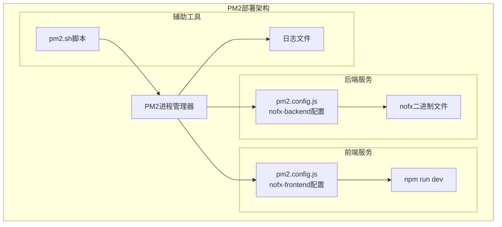
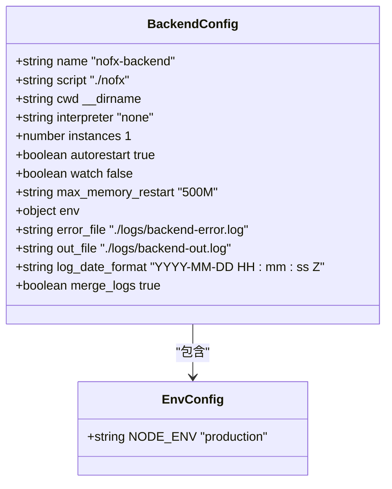
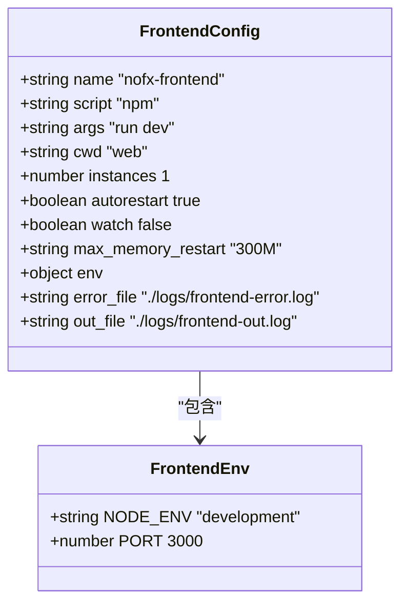
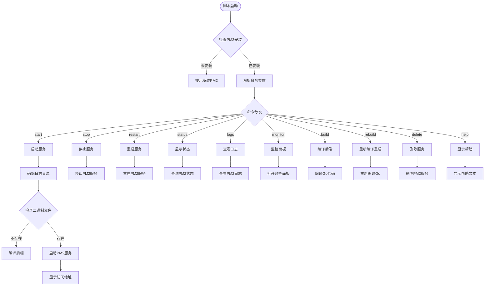
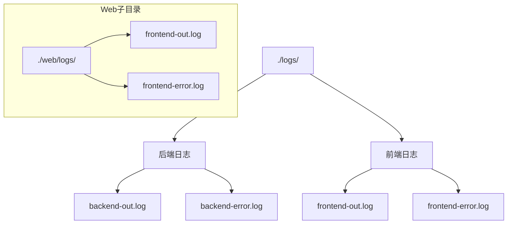
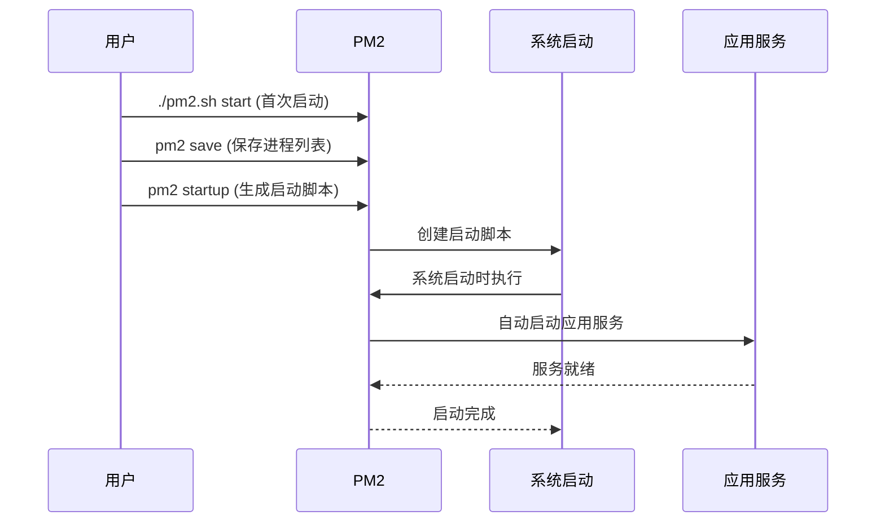
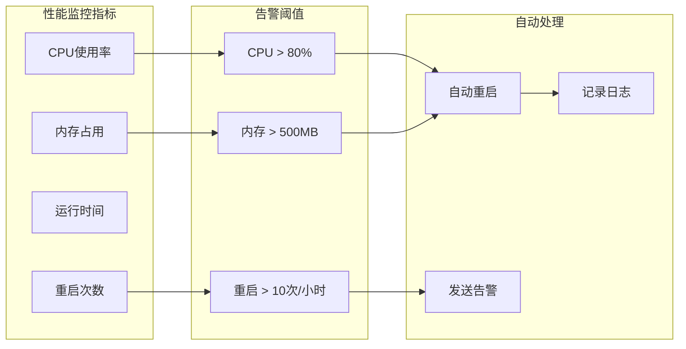
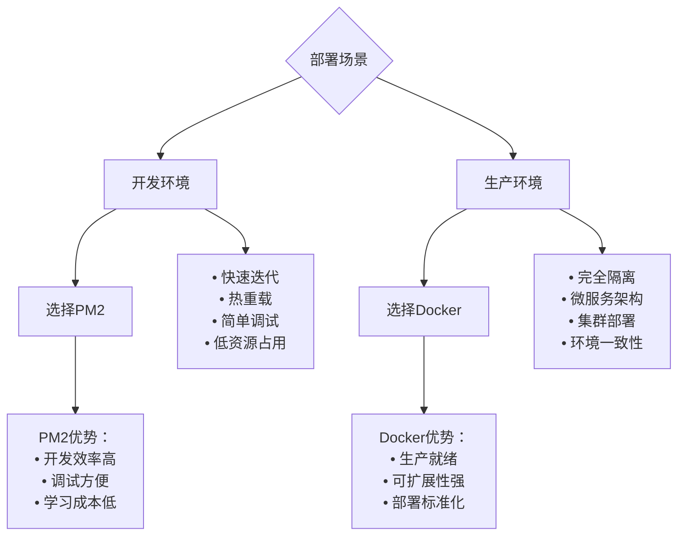
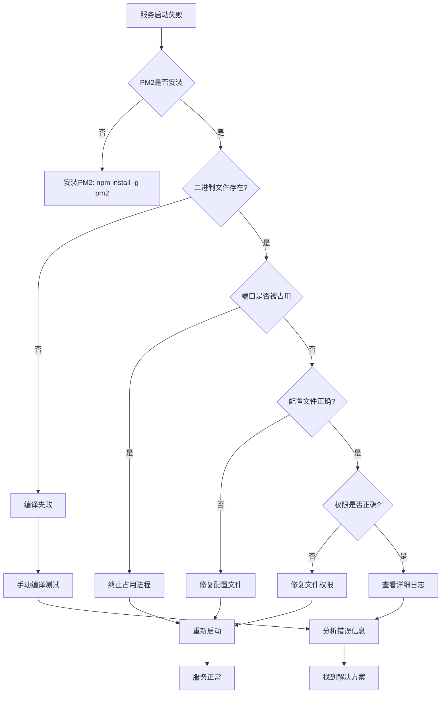

# PM2进程管理部署

<cite>
**本文档引用的文件**
- [PM2_DEPLOYMENT.md](file://PM2_DEPLOYMENT.md)
- [pm2.config.js](file://pm2.config.js)
- [pm2.sh](file://pm2.sh)
- [web/package.json](file://web/package.json)
- [main.go](file://main.go)
- [start.sh](file://start.sh)
- [nginx/nginx.conf](file://nginx/nginx.conf)
- [docker-compose.yml](file://docker-compose.yml)
</cite>

## 目录
1. [简介](#简介)
2. [项目结构概览](#项目结构概览)
3. [PM2配置详解](#pm2配置详解)
4. [PM2脚本功能分析](#pm2脚本功能分析)
5. [部署流程指南](#部署流程指南)
6. [服务管理命令](#服务管理命令)
7. [日志监控与故障排查](#日志监控与故障排查)
8. [开机自启动配置](#开机自启动配置)
9. [生产环境优化](#生产环境优化)
10. [PM2与Docker对比](#pm2与docker对比)
11. [故障排除指南](#故障排除指南)
12. [总结](#总结)

## 简介

PM2是一个强大的Node.js进程管理工具，专为NoFX交易机器人项目设计的本地开发和生产部署解决方案。该部署方案提供了完整的前后端服务管理，包括自动重启、内存监控、日志管理和开机自启动等功能。

PM2部署方案特别适合开发环境和单机生产环境，具有快速启动、低资源占用和简单配置的特点。通过pm2.sh脚本，用户可以轻松管理整个应用栈，从编译到启动再到监控的全流程自动化。

## 项目结构概览

NoFX项目采用前后端分离架构，PM2部署配置针对这种架构进行了专门优化：



**图表来源**
- [pm2.config.js](file://pm2.config.js#L1-L42)
- [pm2.sh](file://pm2.sh#L1-L259)

**章节来源**
- [PM2_DEPLOYMENT.md](file://PM2_DEPLOYMENT.md#L1-L301)
- [pm2.config.js](file://pm2.config.js#L1-L42)

## PM2配置详解

### 后端配置（nofx-backend）

PM2配置文件定义了两个主要应用：后端Go服务和前端React服务。后端配置针对Go二进制文件进行了特殊优化：



**图表来源**
- [pm2.config.js](file://pm2.config.js#L4-L22)

关键配置项说明：

| 配置项 | 值 | 说明 |
|--------|-----|------|
| name | nofx-backend | 应用名称，用于PM2识别 |
| script | ./nofx | Go编译后的二进制文件路径 |
| cwd | __dirname | 工作目录，使用当前目录 |
| interpreter | none | 不使用解释器，直接执行二进制文件 |
| instances | 1 | 单实例运行 |
| autorestart | true | 启用自动重启 |
| max_memory_restart | 500M | 内存超过500MB时自动重启 |
| env.NODE_ENV | production | 生产环境标识 |

### 前端配置（nofx-frontend）

前端配置使用npm作为入口，启动Vite开发服务器：



**图表来源**
- [pm2.config.js](file://pm2.config.js#L24-L42)

前端特有配置：

| 配置项 | 值 | 说明 |
|--------|-----|------|
| script | npm | 使用npm作为启动脚本 |
| args | run dev | 启动Vite开发服务器 |
| cwd | web | 工作目录为web子目录 |
| env.NODE_ENV | development | 开发环境标识 |
| env.PORT | 3000 | 前端服务监听端口 |

**章节来源**
- [pm2.config.js](file://pm2.config.js#L1-L42)

## PM2脚本功能分析

### 脚本架构设计

pm2.sh脚本提供了完整的PM2管理功能，采用模块化设计，每个功能对应独立函数：



**图表来源**
- [pm2.sh](file://pm2.sh#L1-L259)

### 核心功能模块

#### 1. 服务启动模块

服务启动过程包含智能检测和自动编译功能：

- **二进制文件检查**：自动检测后端二进制文件是否存在
- **自动编译**：如果二进制文件缺失，自动执行Go编译
- **日志目录创建**：确保日志文件夹存在
- **服务启动**：调用PM2启动配置文件

#### 2. 日志管理系统

提供多层次的日志查看功能：

- **实时日志**：`./pm2.sh logs` - 查看所有服务实时日志
- **分类日志**：`./pm2.sh logs backend` 和 `./pm2.sh logs frontend` - 分别查看后端和前端日志
- **历史日志**：PM2自动轮转和管理历史日志文件

#### 3. 监控与诊断

集成PM2内置监控功能：

- **资源监控**：实时CPU和内存使用情况
- **服务状态**：详细的服务运行状态信息
- **性能分析**：自动重启策略和性能指标

**章节来源**
- [pm2.sh](file://pm2.sh#L1-L259)

## 部署流程指南

### 环境准备

1. **安装Node.js和npm**
   ```bash
   # 检查Node.js版本
   node --version
   npm --version
   
   # 推荐版本：Node.js 16+ 或 18+
   ```

2. **安装Go语言环境**
   ```bash
   # 检查Go版本
   go version
   
   # 下载并安装Go（根据操作系统）
   # https://golang.org/dl/
   ```

3. **安装PM2**
   ```bash
   npm install -g pm2
   ```

### 快速部署

最简单的部署方式是使用一键启动脚本：

```bash
# 克隆项目（如果尚未克隆）
git clone <repository-url>
cd nofx

# 给予执行权限
chmod +x pm2.sh

# 一键启动
./pm2.sh start
```

### 手动部署步骤

如果需要更精细的控制，可以手动执行以下步骤：

1. **编译后端Go程序**
   ```bash
   # 在项目根目录执行
   go build -o nofx
   ```

2. **安装前端依赖**
   ```bash
   cd web
   npm install
   ```

3. **启动PM2服务**
   ```bash
   pm2 start pm2.config.js
   ```

4. **验证服务状态**
   ```bash
   pm2 status
   ```

**章节来源**
- [PM2_DEPLOYMENT.md](file://PM2_DEPLOYMENT.md#L1-L50)
- [pm2.sh](file://pm2.sh#L80-L120)

## 服务管理命令

### 基础服务管理

PM2提供了丰富的服务管理命令，通过pm2.sh脚本统一管理：

| 命令 | 功能 | 示例 |
|------|------|------|
| `./pm2.sh start` | 启动所有服务 | 后端Go程序 + 前端Vite服务器 |
| `./pm2.sh stop` | 停止所有服务 | 安全关闭所有进程 |
| `./pm2.sh restart` | 重启所有服务 | 平滑重启，保持配置不变 |
| `./pm2.sh status` | 查看服务状态 | 显示运行状态和详细信息 |
| `./pm2.sh delete` | 删除PM2服务 | 清除PM2注册的服务 |

### 日志管理命令

```bash
# 查看所有实时日志
./pm2.sh logs

# 查看后端服务日志
./pm2.sh logs backend

# 查看前端服务日志
./pm2.sh logs frontend

# 清空所有日志
pm2 flush
```

### 监控命令

```bash
# 打开PM2监控面板
./pm2.sh monitor

# 查看特定服务信息
pm2 info nofx-backend
pm2 info nofx-frontend
```

### 构建命令

```bash
# 编译后端Go程序
./pm2.sh build

# 重新编译并重启后端
./pm2.sh rebuild

# 前端开发服务器（自动热重载）
# 不需要重启，Vite会自动处理
```

**章节来源**
- [pm2.sh](file://pm2.sh#L180-L259)
- [PM2_DEPLOYMENT.md](file://PM2_DEPLOYMENT.md#L20-L80)

## 日志监控与故障排查

### 日志文件位置

PM2部署的日志文件组织结构清晰，便于管理和排查：



**图表来源**
- [pm2.config.js](file://pm2.config.js#L15-L16)
- [pm2.config.js](file://pm2.config.js#L33-L34)

### 日志查看技巧

1. **实时监控**
   ```bash
   # 实时查看所有日志
   ./pm2.sh logs
   
   # 实时查看特定服务日志
   ./pm2.sh logs backend
   ```

2. **历史日志分析**
   ```bash
   # 查看PM2管理的历史日志
   pm2 logs --lines 100
   
   # 查看特定日期范围的日志
   pm2 logs --from "2024-01-01"
   ```

3. **日志轮转**
   PM2自动进行日志轮转，避免日志文件过大影响性能。

### 常见故障排查

#### 1. 服务启动失败

```bash
# 1. 查看详细错误信息
./pm2.sh logs

# 2. 检查端口占用情况
lsof -i :8080  # 后端端口
lsof -i :3000  # 前端端口

# 3. 手动编译测试
go build -o nofx
./nofx

# 4. 检查配置文件
ls -l config.json
```

#### 2. 后端无法启动

```bash
# 检查二进制文件权限
chmod +x nofx

# 手动运行查看错误
./nofx

# 检查配置文件格式
cat config.json
```

#### 3. 前端无法访问

```bash
# 检查node_modules安装
cd web
npm install

# 手动启动前端
npm run dev

# 检查端口占用
lsof -i :3000
```

**章节来源**
- [PM2_DEPLOYMENT.md](file://PM2_DEPLOYMENT.md#L200-L280)

## 开机自启动配置

### PM2开机自启动设置

PM2提供了完整的开机自启动解决方案，确保系统重启后服务能够自动恢复：



**图表来源**
- [PM2_DEPLOYMENT.md](file://PM2_DEPLOYMENT.md#L120-L140)

### 配置步骤

1. **启动服务**
   ```bash
   ./pm2.sh start
   ```

2. **保存当前进程列表**
   ```bash
   pm2 save
   ```

3. **生成启动脚本**
   ```bash
   pm2 startup
   ```
   执行上述命令后，PM2会输出具体的启动脚本命令，通常需要使用sudo执行：
   ```bash
   sudo env PATH=$PATH:/usr/bin /usr/lib/node_modules/pm2/bin/pm2 startup systemd -u $USER --hp /home/$USER
   ```

4. **验证开机自启动**
   重启系统后，检查服务是否自动启动：
   ```bash
   pm2 status
   ```

### 取消开机自启动

如果需要取消开机自启动功能：

```bash
pm2 unstartup
```

### 开机自启动最佳实践

- **定期备份**：定期执行`pm2 save`确保进程列表是最新的
- **权限管理**：确保PM2启动脚本具有正确的执行权限
- **环境变量**：确保环境变量在系统启动时正确加载

**章节来源**
- [PM2_DEPLOYMENT.md](file://PM2_DEPLOYMENT.md#L120-L150)

## 生产环境优化

### 生产模式配置

为了在生产环境中获得最佳性能，需要对PM2配置进行优化：

#### 1. 前端生产模式

修改`pm2.config.js`中的前端配置：

```javascript
{
  name: 'nofx-frontend',
  script: 'npm',
  args: 'run preview',  // 使用生产预览模式
  env: {
    NODE_ENV: 'production'
  }
}
```

#### 2. 多实例负载均衡

对于高并发场景，可以配置多个后端实例：

```javascript
{
  name: 'nofx-backend',
  script: './nofx',
  instances: 2,  // 启动2个实例
  exec_mode: 'cluster',  // 集群模式
  autorestart: true,
  max_restarts: 10,
  min_uptime: '10s',
  max_memory_restart: '500M'
}
```

#### 3. 高级重启策略

配置更精细的自动重启策略：

```javascript
{
  autorestart: true,
  max_restarts: 10,
  min_uptime: '10s',
  max_memory_restart: '500M',
  restart_delay: 4000,
  exp_backoff_restart_delay: 100
}
```

### 性能监控配置



### 生产环境建议

1. **资源限制**
   - 后端最大内存：500MB
   - 前端最大内存：300MB
   - CPU使用率监控

2. **健康检查**
   - 定期检查服务健康状态
   - 配置外部监控工具

3. **日志管理**
   - 启用日志轮转
   - 设置日志保留期限
   - 集中化日志收集

**章节来源**
- [PM2_DEPLOYMENT.md](file://PM2_DEPLOYMENT.md#L250-L301)
- [pm2.config.js](file://pm2.config.js#L1-L42)

## PM2与Docker对比

### 技术特性对比

| 特性 | PM2部署 | Docker部署 |
|------|---------|------------|
| **启动速度** | ⚡ 快速启动（秒级） | 🐌 较慢（分钟级） |
| **资源占用** | 💚 低资源消耗 | 🟡 中等资源消耗 |
| **隔离性** | 🟡 进程级隔离 | 💚 完全容器隔离 |
| **配置复杂度** | 💚 简单配置 | 🟡 中等配置 |
| **适用场景** | 开发/单机部署 | 生产/集群部署 |
| **网络配置** | 🟡 基础网络 | 💚 完整网络栈 |
| **存储管理** | 🟡 简单文件系统 | 💚 完整存储抽象 |

### 使用场景推荐



**图表来源**
- [PM2_DEPLOYMENT.md](file://PM2_DEPLOYMENT.md#L280-L301)
- [start.sh](file://start.sh#L1-L50)

### 迁移建议

1. **开发阶段**：使用PM2进行快速开发和调试
2. **测试阶段**：在类似Docker的环境中测试
3. **生产部署**：切换到Docker部署方案

**章节来源**
- [PM2_DEPLOYMENT.md](file://PM2_DEPLOYMENT.md#L280-L301)

## 故障排除指南

### 常见问题诊断流程



**图表来源**
- [PM2_DEPLOYMENT.md](file://PM2_DEPLOYMENT.md#L200-L280)

### 详细排查步骤

#### 1. 服务启动失败排查

```bash
# 1. 检查PM2安装状态
pm2 --version

# 2. 查看详细错误日志
./pm2.sh logs

# 3. 检查端口占用情况
lsof -i :8080  # 后端API端口
lsof -i :3000  # 前端端口

# 4. 检查二进制文件
ls -la ./nofx
chmod +x ./nofx

# 5. 手动运行测试
./nofx
```

#### 2. 后端服务问题

```bash
# 检查配置文件
ls -l config.json
cat config.json | jq .

# 检查Go编译状态
go build -o nofx_test
./nofx_test

# 检查依赖安装
cd web
npm install
```

#### 3. 前端服务问题

```bash
# 检查Node.js版本
node --version

# 检查npm安装
npm --version

# 重新安装依赖
cd web
rm -rf node_modules package-lock.json
npm install

# 手动启动测试
npm run dev
```

#### 4. 内存和性能问题

```bash
# 监控资源使用
./pm2.sh monitor

# 查看详细性能指标
pm2 show nofx-backend
pm2 show nofx-frontend

# 检查内存泄漏
pm2 logs --lines 1000 | grep -i memory
```

### 紧急恢复措施

1. **强制重启**
   ```bash
   ./pm2.sh stop
   ./pm2.sh start
   ```

2. **清除缓存**
   ```bash
   pm2 delete all
   rm -rf ./logs/*
   ./pm2.sh start
   ```

3. **回滚配置**
   ```bash
   # 备份当前配置
   cp pm2.config.js pm2.config.js.bak
   
   # 使用默认配置
   ./pm2.sh start
   ```

**章节来源**
- [PM2_DEPLOYMENT.md](file://PM2_DEPLOYMENT.md#L200-L280)

## 总结

PM2部署方案为NoFX交易机器人项目提供了完整的本地开发和生产部署解决方案。通过精心设计的配置文件和自动化脚本，用户可以轻松管理复杂的前后端服务栈。

### 主要优势

1. **简单易用**：一键启动脚本简化了部署流程
2. **资源高效**：低资源占用适合开发环境
3. **功能完整**：涵盖启动、监控、日志、重启等全套功能
4. **开发友好**：支持热重载和实时调试

### 适用场景

- **开发环境**：快速迭代和调试
- **单机生产环境**：轻量级部署需求
- **学习测试**：降低部署门槛

### 最佳实践建议

1. **开发阶段**：使用PM2进行日常开发
2. **生产准备**：在类似环境中测试PM2部署
3. **长期规划**：考虑向Docker部署迁移
4. **监控维护**：定期检查服务状态和日志

PM2部署方案体现了NoFX项目对开发者体验的重视，通过自动化和简化的配置，让开发者能够专注于业务逻辑而非部署细节。随着项目的成熟，可以根据实际需求选择更适合的部署方案。