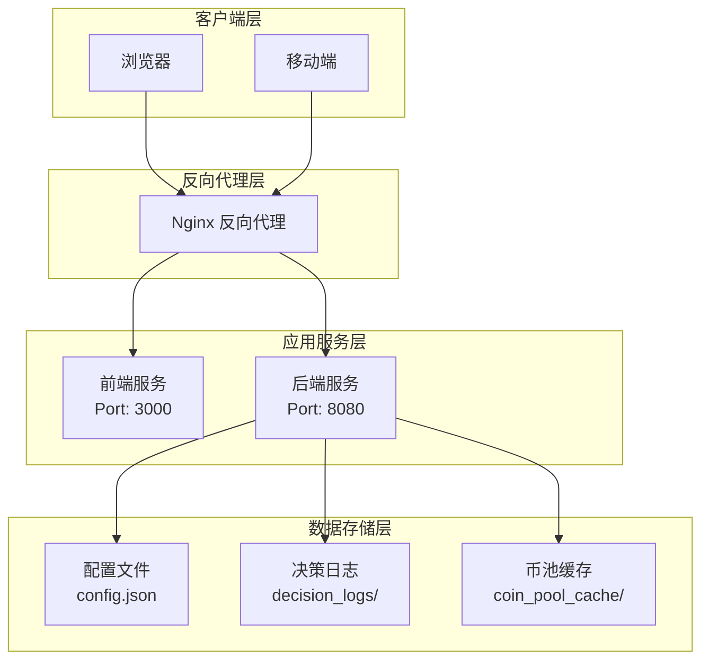
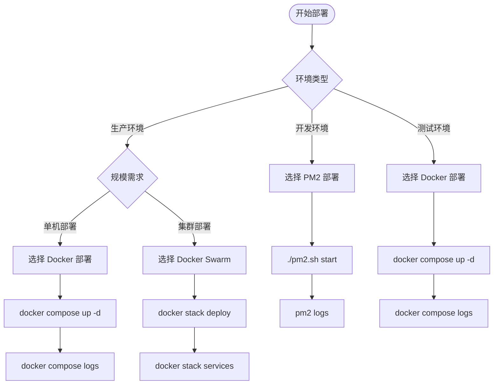
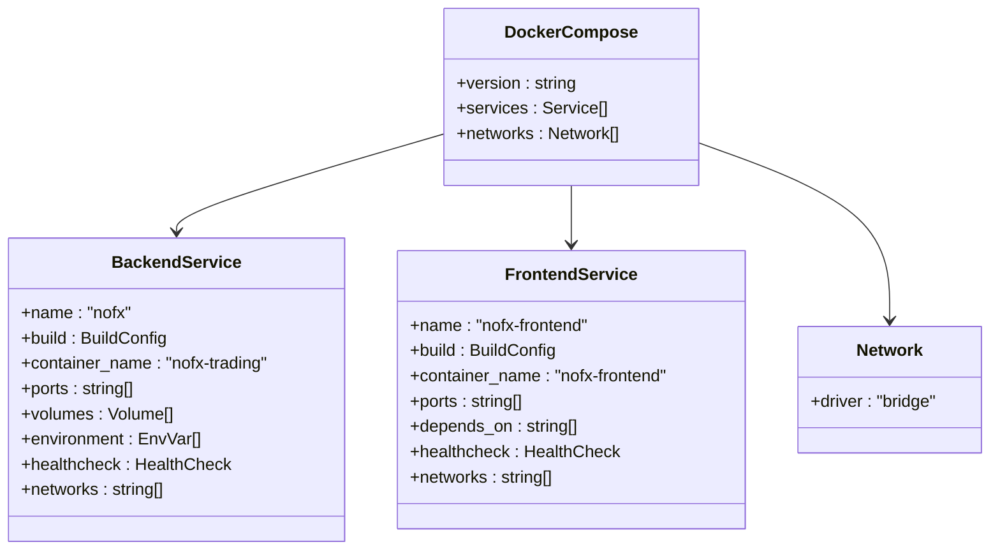
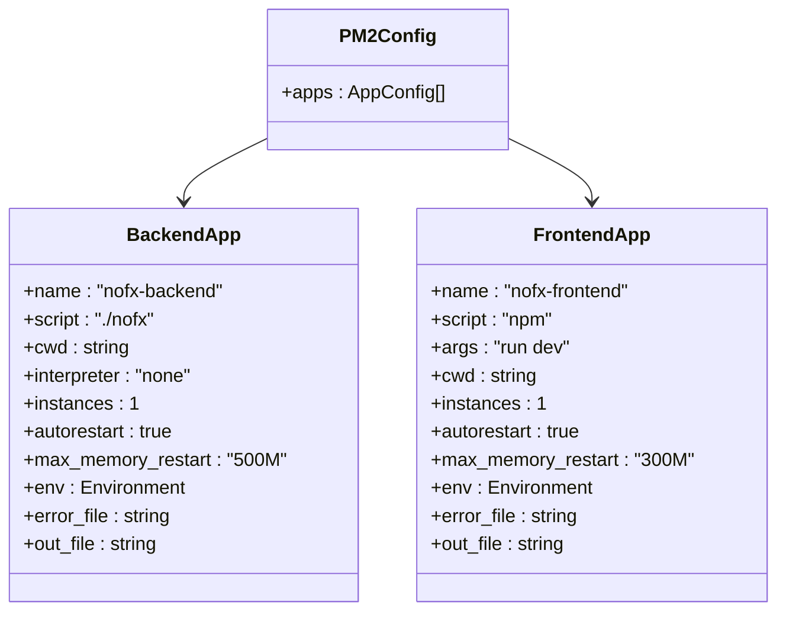
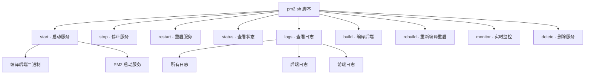
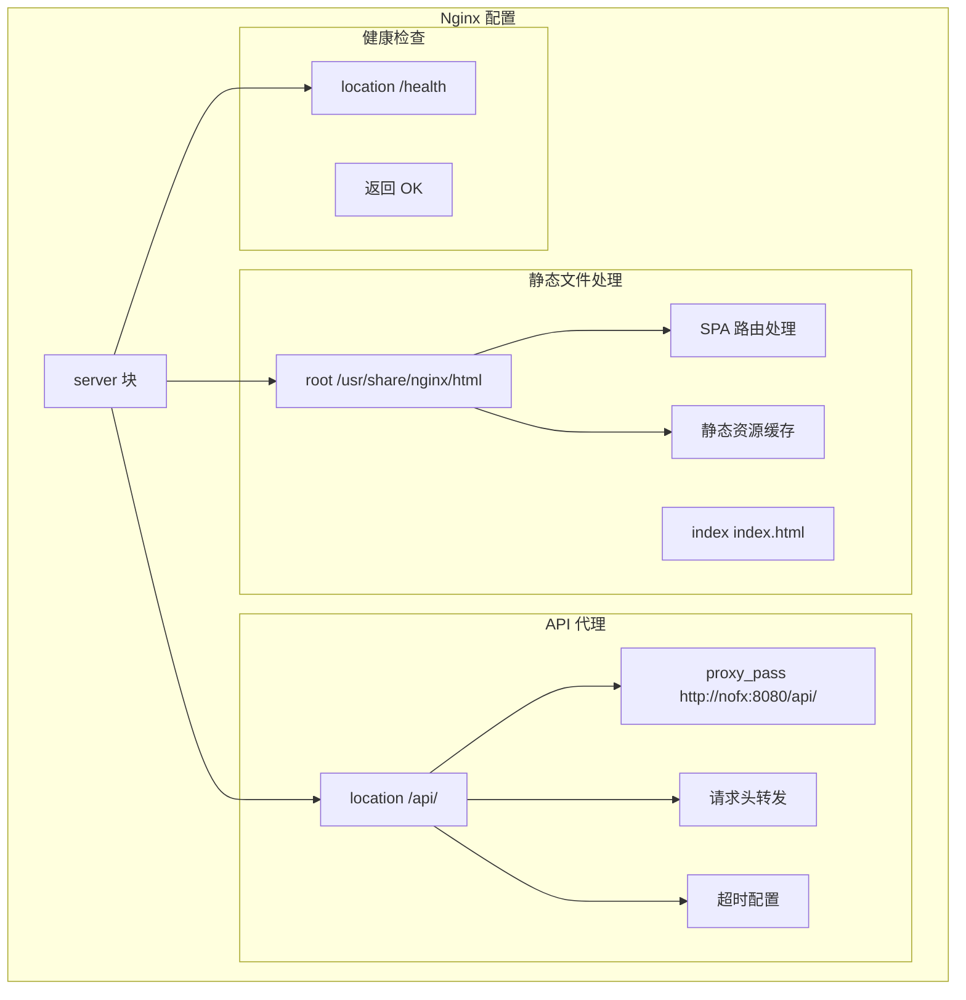
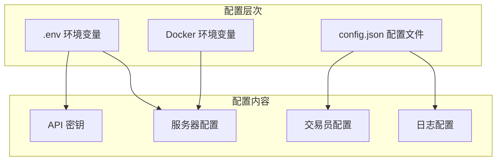
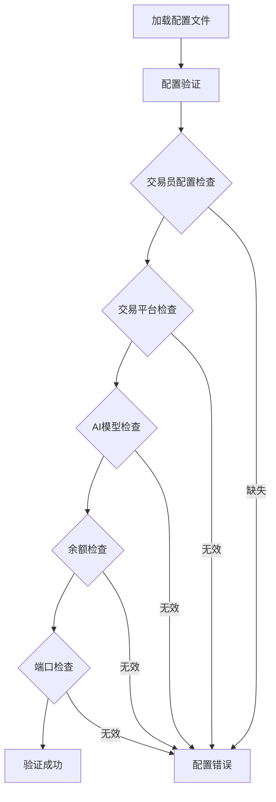

# 部署方案

<cite>
**本文档中引用的文件**
- [docker-compose.yml](file://docker-compose.yml)
- [pm2.config.js](file://pm2.config.js)
- [pm2.sh](file://pm2.sh)
- [nginx/nginx.conf](file://nginx/nginx.conf)
- [DOCKER_DEPLOY.md](file://DOCKER_DEPLOY.md)
- [DOCKER_DEPLOY.en.md](file://DOCKER_DEPLOY.en.md)
- [PM2_DEPLOYMENT.md](file://PM2_DEPLOYMENT.md)
- [start.sh](file://start.sh)
- [main.go](file://main.go)
- [config/config.go](file://config/config.go)
</cite>

## 目录
1. [概述](#概述)
2. [部署方案对比](#部署方案对比)
3. [Docker 部署方案](#docker-部署方案)
4. [PM2 进程管理部署](#pm2-进程管理部署)
5. [Nginx 反向代理配置](#nginx-反向代理配置)
6. [环境配置管理](#环境配置管理)
7. [生产环境最佳实践](#生产环境最佳实践)
8. [故障排查指南](#故障排查指南)
9. [性能优化建议](#性能优化建议)
10. [总结](#总结)

## 概述

NOFX AI 交易竞赛系统提供了多种部署方案，适应不同的使用场景和需求。本方案涵盖了从开发环境到生产环境的完整部署流程，包括 Docker 容器化部署、PM2 进程管理以及 Nginx 反向代理配置。

### 系统架构概览



**图表来源**
- [docker-compose.yml](file://docker-compose.yml#L1-L50)
- [nginx/nginx.conf](file://nginx/nginx.conf#L1-L53)

## 部署方案对比

### 方案选择矩阵

| 特性 | Docker 部署 | PM2 部署 | Nginx 反向代理 |
|------|-------------|----------|----------------|
| **启动速度** | 🐌 较慢（镜像构建） | ⚡ 快（直接启动） | 🟡 中等 |
| **资源占用** | 🟡 中等（容器开销） | 💚 低（原生进程） | 🟡 中等（代理开销） |
| **隔离性** | 💚 高（容器隔离） | 🟡 中等（系统隔离） | 🟡 中等（网络隔离） |
| **配置复杂度** | 🟡 中等 | 💚 简单 | 🟡 中等 |
| **适用场景** | 生产/集群 | 开发/单机 | 生产/负载均衡 |
| **维护成本** | 🟡 中等 | 💚 低 | 🟡 中等 |

### 方案推荐



**图表来源**
- [pm2.sh](file://pm2.sh#L1-L259)
- [start.sh](file://start.sh#L1-L282)

## Docker 部署方案

### Docker Compose 配置详解

Docker 部署方案通过 `docker-compose.yml` 实现完整的服务编排，包含前后端两个主要服务。

#### 服务配置结构



**图表来源**
- [docker-compose.yml](file://docker-compose.yml#L1-L50)

#### 关键配置项说明

**后端服务配置 (`nofx`)：**
- **镜像构建**：使用 `./docker/Dockerfile.backend` 构建
- **端口映射**：`${NOFX_BACKEND_PORT:-8080}:8080`
- **数据卷挂载**：
  - `./config.json:/app/config.json:ro` - 配置文件只读挂载
  - `./decision_logs:/app/decision_logs` - 决策日志持久化
  - `/etc/localtime:/etc/localtime:ro` - 时间同步
- **环境变量**：支持时区配置 `${NOFX_TIMEZONE:-Asia/Shanghai}`
- **健康检查**：每30秒检查一次 `/health` 端点

**前端服务配置 (`nofx-frontend`)：**
- **镜像构建**：使用 `./docker/Dockerfile.frontend` 构建
- **端口映射**：`${NOFX_FRONTEND_PORT:-3000}:80`
- **依赖关系**：依赖后端服务启动
- **健康检查**：检查 `/health` 端点可达性

**网络配置：**
- 使用桥接网络 `nofx-network` 实现服务间通信
- 支持服务发现和网络隔离

**节来源**
- [docker-compose.yml](file://docker-compose.yml#L1-L50)

### Docker 部署流程

#### 1. 环境准备

```bash
# 检查 Docker 版本
docker --version
docker compose --version

# 复制配置文件模板
cp config.json.example config.json
```

#### 2. 配置文件设置

编辑 `config.json` 文件，填入必要的 API 密钥：

```json
{
  "traders": [
    {
      "id": "my_trader",
      "name": "My AI Trader",
      "ai_model": "deepseek",
      "binance_api_key": "YOUR_BINANCE_API_KEY",
      "binance_secret_key": "YOUR_BINANCE_SECRET_KEY",
      "deepseek_key": "YOUR_DEEPSEEK_API_KEY",
      "initial_balance": 1000.0,
      "scan_interval_minutes": 3
    }
  ],
  "use_default_coins": true,
  "api_server_port": 8080
}
```

#### 3. 启动服务

```bash
# 首次启动（构建镜像）
docker compose up -d --build

# 后续启动（使用现有镜像）
docker compose up -d

# 查看服务状态
docker compose ps

# 查看日志
docker compose logs -f
```

#### 4. 服务管理

```bash
# 停止服务
docker compose stop

# 重启服务
docker compose restart

# 停止并删除容器
docker compose down

# 清理资源
docker compose down -v
```

**节来源**
- [DOCKER_DEPLOY.md](file://DOCKER_DEPLOY.md#L1-L473)
- [DOCKER_DEPLOY.en.md](file://DOCKER_DEPLOY.en.md#L1-L468)

### Docker 生产环境配置

#### 环境变量管理

创建 `.env` 文件管理环境变量：

```bash
# .env 文件内容
TZ=Asia/Shanghai
NOFX_BACKEND_PORT=8080
NOFX_FRONTEND_PORT=3000
NOFX_TIMEZONE=Asia/Shanghai
```

#### 资源限制配置

```yaml
services:
  nofx:
    deploy:
      resources:
        limits:
          cpus: '2'
          memory: 2G
        reservations:
          cpus: '1'
          memory: 1G
```

#### 健康检查配置

```yaml
healthcheck:
  test: ["CMD", "curl", "-f", "http://localhost:8080/health"]
  interval: 30s
  timeout: 10s
  retries: 3
  start_period: 60s
```

## PM2 进程管理部署

### PM2 配置详解

PM2 部署方案适用于开发环境和单机生产环境，通过 `pm2.config.js` 和 `pm2.sh` 脚本实现进程管理和自动化部署。

#### 配置文件结构



**图表来源**
- [pm2.config.js](file://pm2.config.js#L1-L42)

#### 关键配置项说明

**后端应用配置 (`nofx-backend`)：**
- **脚本路径**：直接执行 Go 二进制文件 `./nofx`
- **工作目录**：当前目录 `__dirname`
- **内存限制**：最大 500MB，超过自动重启
- **日志配置**：分离错误和输出日志文件
- **环境变量**：设置 `NODE_ENV=production`

**前端应用配置 (`nofx-frontend`)：**
- **脚本**：运行 `npm run dev` 启动 Vite 开发服务器
- **工作目录**：动态指向 `web` 目录
- **端口配置**：默认 3000 端口
- **开发环境**：设置 `NODE_ENV=development`

**节来源**
- [pm2.config.js](file://pm2.config.js#L1-L42)

### PM2 部署脚本功能

`pm2.sh` 脚本提供了完整的部署管理功能：

#### 主要命令功能



**图表来源**
- [pm2.sh](file://pm2.sh#L1-L259)

#### 使用示例

```bash
# 一键启动服务
./pm2.sh start

# 查看服务状态
./pm2.sh status

# 查看日志
./pm2.sh logs

# 重新编译后端并重启
./pm2.sh rebuild

# 打开实时监控
./pm2.sh monitor

# 停止并删除服务
./pm2.sh delete
```

**节来源**
- [PM2_DEPLOYMENT.md](file://PM2_DEPLOYMENT.md#L1-L301)

### 开机自启动配置

```bash
# 1. 启动服务
./pm2.sh start

# 2. 保存进程列表
pm2 save

# 3. 生成启动脚本
pm2 startup

# 4. 按照提示执行命令（需要 sudo）
sudo env PATH=$PATH:/usr/bin /home/youruser/.nvm/versions/node/v18.0.0/lib/node_modules/pm2/bin/pm2 startup systemd -u youruser --hp /home/youruser
```

## Nginx 反向代理配置

### Nginx 配置详解

Nginx 反向代理配置通过 `nginx.conf` 实现前端静态文件服务和后端 API 代理，支持 HTTPS 和负载均衡。

#### 配置结构分析



**图表来源**
- [nginx/nginx.conf](file://nginx/nginx.conf#L1-L53)

#### 关键配置说明

**静态文件服务配置：**
- **根目录**：`root /usr/share/nginx/html`
- **索引文件**：`index index.html`
- **SPA 路由**：`try_files $uri $uri/ /index.html`
- **静态资源缓存**：
  - JavaScript、CSS 文件：1年缓存
  - 图片、字体文件：1年缓存
  - 公共缓存控制

**API 代理配置：**
- **代理路径**：`location /api/`
- **目标地址**：`proxy_pass http://nofx:8080/api/`
- **HTTP 版本**：`proxy_http_version 1.1`
- **WebSocket 支持**：`proxy_set_header Upgrade $http_upgrade`
- **超时配置**：
  - 连接超时：300秒
  - 发送超时：300秒
  - 读取超时：300秒

**健康检查配置：**
- **端点**：`location /health`
- **响应**：`return 200 "OK\n"`
- **内容类型**：`Content-Type: text/plain`
- **禁用访问日志**：`access_log off`

**节来源**
- [nginx/nginx.conf](file://nginx/nginx.conf#L1-L53)

### HTTPS 配置

#### Let's Encrypt SSL 证书配置

```nginx
# HTTPS 配置示例
server {
    listen 443 ssl http2;
    server_name your-domain.com;
    
    # SSL 证书配置
    ssl_certificate /etc/letsencrypt/live/your-domain.com/fullchain.pem;
    ssl_certificate_key /etc/letsencrypt/live/your-domain.com/privkey.pem;
    
    # SSL 安全配置
    ssl_protocols TLSv1.2 TLSv1.3;
    ssl_ciphers ECDHE-RSA-AES256-GCM-SHA512:DHE-RSA-AES256-GCM-SHA512:ECDHE-RSA-AES256-GCM-SHA384:DHE-RSA-AES256-GCM-SHA384;
    ssl_prefer_server_ciphers off;
    
    # 强制 HTTPS
    if ($scheme = http) {
        return 301 https://$host$request_uri;
    }
    
    # 其他配置...
}
```

#### 自动续期配置

```bash
# 安装 Certbot
sudo apt-get install certbot python3-certbot-nginx

# 获取 SSL 证书
sudo certbot --nginx -d your-domain.com

# 测试自动续期
sudo certbot renew --dry-run
```

### 负载均衡配置

#### 多实例负载均衡

```nginx
upstream nofx_backend {
    least_conn;
    server nofx_backend_1:8080 weight=1 max_fails=3 fail_timeout=30s;
    server nofx_backend_2:8080 weight=1 max_fails=3 fail_timeout=30s;
    server nofx_backend_3:8080 weight=1 max_fails=3 fail_timeout=30s;
}

server {
    listen 80;
    server_name your-domain.com;
    
    location /api/ {
        proxy_pass http://nofx_backend/api/;
        proxy_set_header Host $host;
        proxy_set_header X-Real-IP $remote_addr;
        proxy_set_header X-Forwarded-For $proxy_add_x_forwarded_for;
        proxy_set_header X-Forwarded-Proto $scheme;
    }
}
```

## 环境配置管理

### 配置文件结构

系统采用分层配置管理，支持不同环境的配置隔离：



**图表来源**
- [config/config.go](file://config/config.go#L1-L202)

### 环境变量配置

#### Docker 环境变量

```bash
# .env 文件内容
TZ=Asia/Shanghai
NOFX_BACKEND_PORT=8080
NOFX_FRONTEND_PORT=3000
NOFX_TIMEZONE=Asia/Shanghai
```

#### PM2 环境变量

```javascript
// pm2.config.js 环境配置
env: {
  NODE_ENV: 'production',
  TZ: 'Asia/Shanghai'
}
```

### 配置文件验证

系统提供完整的配置验证机制：



**图表来源**
- [config/config.go](file://config/config.go#L140-L202)

**节来源**
- [config/config.go](file://config/config.go#L1-L202)

## 生产环境最佳实践

### 安全配置

#### 1. 敏感信息保护

```bash
# .gitignore 配置
echo "config.json" >> .gitignore
echo "*.env" >> .gitignore
echo "logs/" >> .gitignore
```

#### 2. 网络安全

```yaml
# docker-compose.yml 安全配置
services:
  nofx:
    ports:
      - "127.0.0.1:8080:8080"  # 仅本地访问
    environment:
      - BINANCE_API_KEY=${BINANCE_API_KEY}
      - BINANCE_SECRET_KEY=${BINANCE_SECRET_KEY}
```

#### 3. 权限控制

```bash
# 文件权限设置
chmod 600 config.json
chmod 750 logs/
chmod 644 .env
```

### 监控与日志

#### 日志管理配置

```yaml
# docker-compose.yml 日志配置
services:
  nofx:
    logging:
      driver: "json-file"
      options:
        max-size: "10m"
        max-file: "3"
        compress: "true"
```

#### 监控工具集成

```yaml
# 监控服务配置
services:
  prometheus:
    image: prom/prometheus
    ports:
      - "9090:9090"
    volumes:
      - ./prometheus.yml:/etc/prometheus/prometheus.yml
      
  grafana:
    image: grafana/grafana
    ports:
      - "3001:3000"
    volumes:
      - grafana-storage:/var/lib/grafana
```

### 性能优化

#### 资源限制

```yaml
# 资源限制配置
services:
  nofx:
    deploy:
      resources:
        limits:
          cpus: '2.0'
          memory: 2G
        reservations:
          cpus: '1.0'
          memory: 1G
```

#### 并发配置

```javascript
// pm2.config.js 并发配置
{
  name: 'nofx-backend',
  script: './nofx',
  instances: 'max',  // 使用所有 CPU 核心
  exec_mode: 'cluster',
  autorestart: true
}
```

### 备份与恢复

#### 数据备份策略

```bash
#!/bin/bash
# 备份脚本

BACKUP_DIR="/backup/nofx"
DATE=$(date +%Y%m%d_%H%M%S)

# 创建备份目录
mkdir -p $BACKUP_DIR

# 备份配置文件
cp config.json $BACKUP_DIR/config_$DATE.json

# 备份决策日志
tar -czf $BACKUP_DIR/logs_$DATE.tar.gz decision_logs/

# 备份币池缓存
tar -czf $BACKUP_DIR/cache_$DATE.tar.gz coin_pool_cache/

# 清理旧备份（保留30天）
find $BACKUP_DIR -name "*.tar.gz" -mtime +30 -delete
```

#### 自动化部署

```bash
#!/bin/bash
# 自动部署脚本

# 拉取最新代码
git pull origin main

# 重新构建（如果需要）
if [ "$1" == "--build" ]; then
    docker compose up -d --build
else
    docker compose up -d
fi

# 验证部署
sleep 10
if curl -f http://localhost:8080/health > /dev/null; then
    echo "部署成功"
else
    echo "部署失败"
    exit 1
fi
```

## 故障排查指南

### 常见问题诊断

#### 1. 容器启动失败

```bash
# 查看详细错误信息
docker compose logs backend
docker compose logs frontend

# 检查容器状态
docker compose ps -a

# 重新构建（清除缓存）
docker compose build --no-cache
```

#### 2. 端口冲突

```bash
# 查找占用端口的进程
lsof -i :8080  # 后端端口
lsof -i :3000  # 前端端口

# 杀死占用端口的进程
kill -9 <PID>
```

#### 3. 配置文件问题

```bash
# 检查配置文件是否存在
ls -la config.json

# 验证 JSON 格式
cat config.json | jq .

# 检查权限
chmod +x nofx
```

#### 4. 健康检查失败

```bash
# 检查健康状态
docker inspect nofx-backend | jq '.[0].State.Health'
docker inspect nofx-frontend | jq '.[0].State.Health'

# 手动测试健康端点
curl http://localhost:8080/health
curl http://localhost:3000/health
```

### 性能问题排查

#### 1. 内存泄漏检测

```bash
# 查看进程内存使用
ps aux | grep nofx
top -p $(pgrep nofx)

# PM2 内存监控
./pm2.sh monitor
```

#### 2. 网络连接问题

```bash
# 检查网络连接
docker compose exec frontend ping nofx
docker compose exec frontend wget -O- http://nofx:8080/health

# 检查 DNS 解析
docker compose exec frontend nslookup nofx
```

#### 3. 日志分析

```bash
# 查看错误日志
docker compose logs --tail=100 backend | grep ERROR
docker compose logs --tail=100 frontend | grep ERROR

# 分析日志模式
docker compose logs backend | grep -E "(ERROR|FATAL)" | sort | uniq -c
```

### 清理资源

```bash
# 清理未使用的镜像
docker image prune -a

# 清理未使用的卷
docker volume prune

# 清理所有未使用的资源（慎用）
docker system prune -a --volumes
```

## 性能优化建议

### Docker 优化

#### 1. 镜像优化

```dockerfile
# 多阶段构建优化
FROM golang:1.20-alpine AS builder
WORKDIR /app
COPY . .
RUN CGO_ENABLED=0 GOOS=linux go build -a -installsuffix cgo -o nofx .

FROM alpine:latest  
RUN apk --no-cache add ca-certificates
WORKDIR /root/
COPY --from=builder /app/nofx .
CMD ["./nofx"]
```

#### 2. 资源限制

```yaml
services:
  nofx:
    deploy:
      resources:
        limits:
          cpus: '1.0'
          memory: 1G
        reservations:
          cpus: '0.5'
          memory: 512M
```

### PM2 优化

#### 1. 实例数量配置

```javascript
// pm2.config.js 优化配置
{
  name: 'nofx-backend',
  script: './nofx',
  instances: 'max',  // 使用所有 CPU 核心
  exec_mode: 'cluster',
  autorestart: true,
  max_memory_restart: '1G',
  env: {
    NODE_ENV: 'production',
    NODE_OPTIONS: '--max-old-space-size=1024'
  }
}
```

#### 2. 内存监控

```bash
# 设置内存阈值
export NODE_OPTIONS="--max-old-space-size=1024"

# PM2 内存监控
pm2 monit
```

### Nginx 优化

#### 1. 缓存配置

```nginx
# 静态资源缓存优化
location ~* \.(js|css|png|jpg|jpeg|gif|ico|svg|woff|woff2|ttf|eot)$ {
    expires 1y;
    add_header Cache-Control "public, immutable";
    add_header Vary Accept-Encoding;
    gzip_static on;
}
```

#### 2. 连接优化

```nginx
# 连接池配置
upstream nofx_backend {
    server nofx_backend_1:8080 max_fails=3 fail_timeout=30s;
    server nofx_backend_2:8080 max_fails=3 fail_timeout=30s;
    keepalive 32;
}

server {
    # 连接超时优化
    proxy_connect_timeout 30s;
    proxy_send_timeout 30s;
    proxy_read_timeout 30s;
    proxy_buffering on;
    proxy_buffers 8 4k;
    proxy_busy_buffers_size 8k;
}
```

## 总结

NOFX AI 交易竞赛系统提供了灵活多样的部署方案，能够满足从开发到生产的各种需求：

### 方案选择建议

1. **开发环境**：推荐使用 PM2 部署方案，启动快速，便于调试
2. **测试环境**：推荐使用 Docker 部署方案，保证环境一致性
3. **生产环境**：建议结合 Docker 和 Nginx，实现高可用和负载均衡

### 最佳实践要点

1. **安全第一**：妥善保管 API 密钥，配置适当的访问控制
2. **监控到位**：建立完善的日志和监控体系
3. **备份策略**：制定定期备份计划，确保数据安全
4. **性能优化**：根据实际负载调整资源配置

### 未来发展方向

1. **容器编排**：考虑使用 Kubernetes 进行更复杂的集群管理
2. **CI/CD 集成**：建立自动化部署流水线
3. **微服务架构**：拆分服务，提高系统的可扩展性
4. **云原生支持**：适配更多的云平台和托管服务

通过合理选择和配置部署方案，可以确保 NOFX AI 交易竞赛系统稳定、高效地运行，为用户提供优质的交易体验。