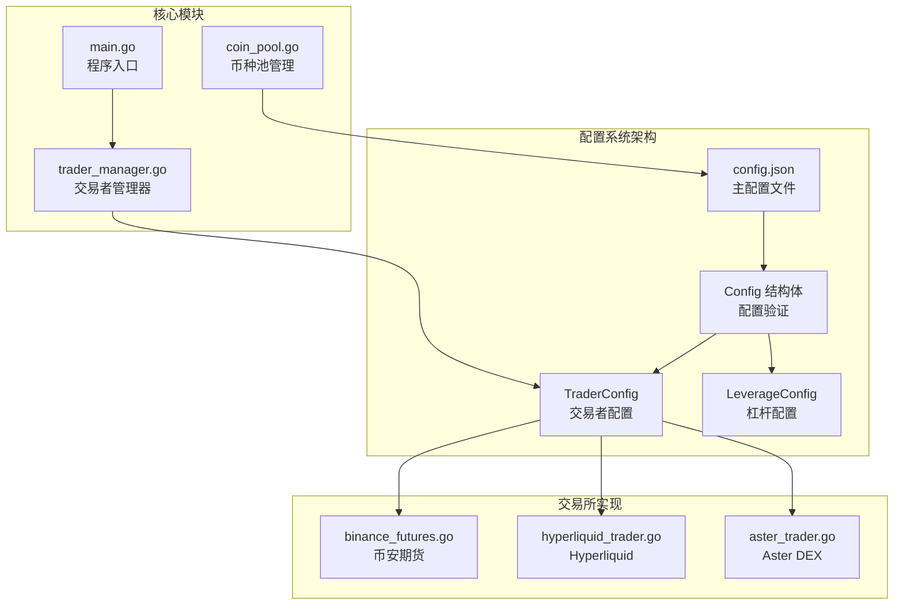
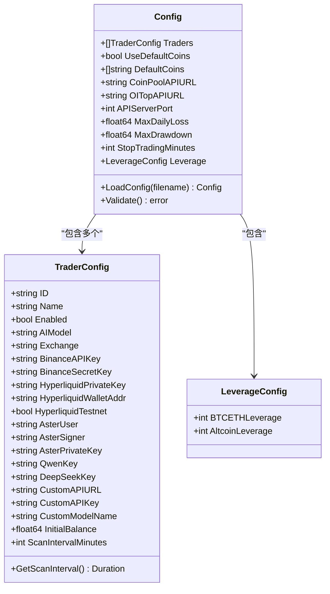
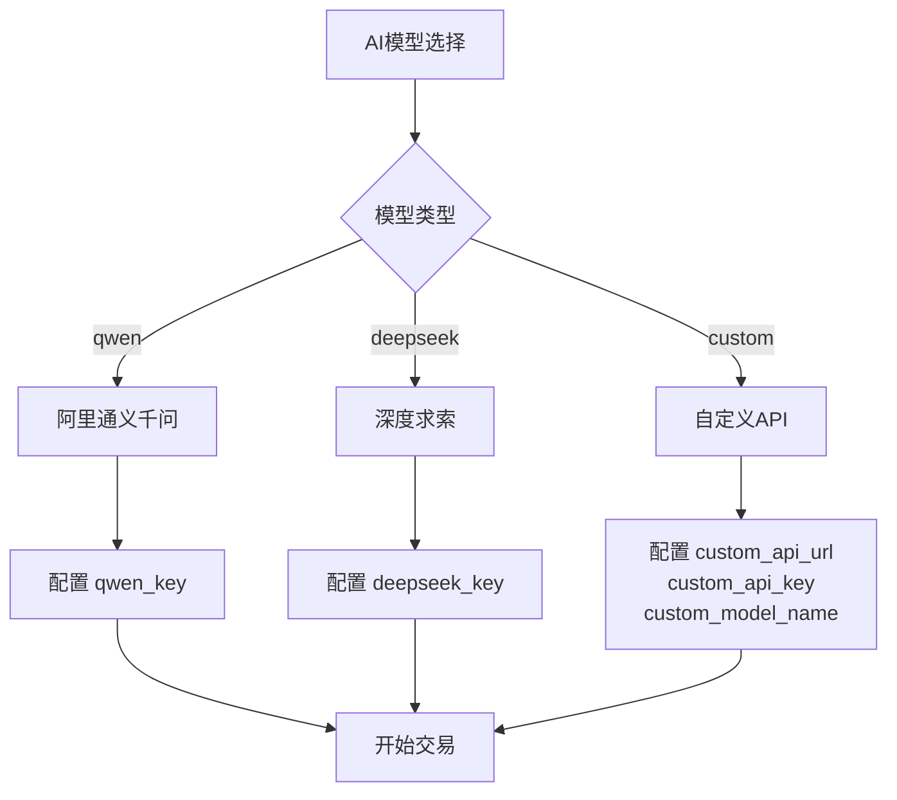
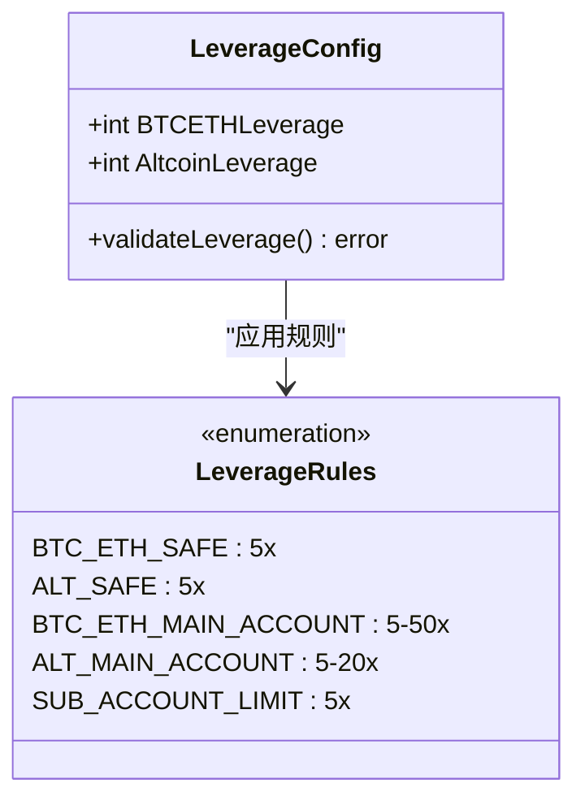
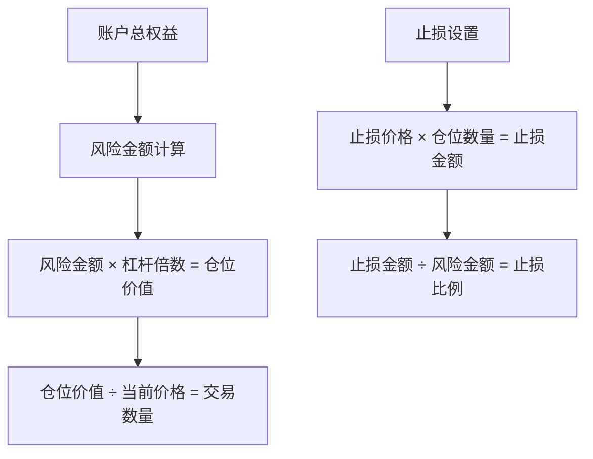
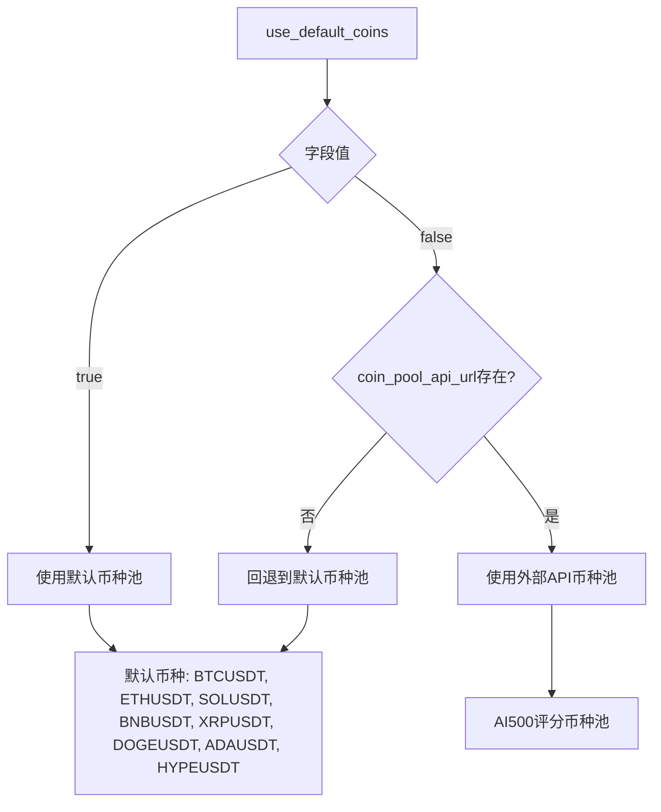
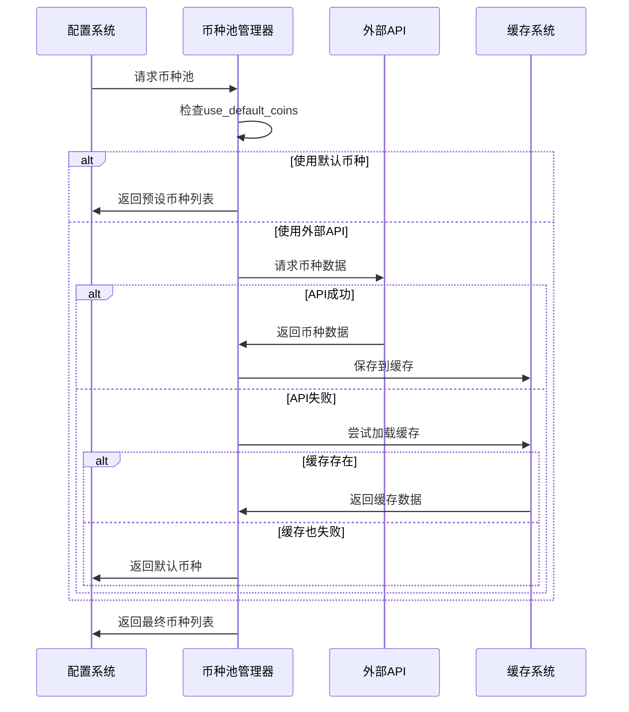
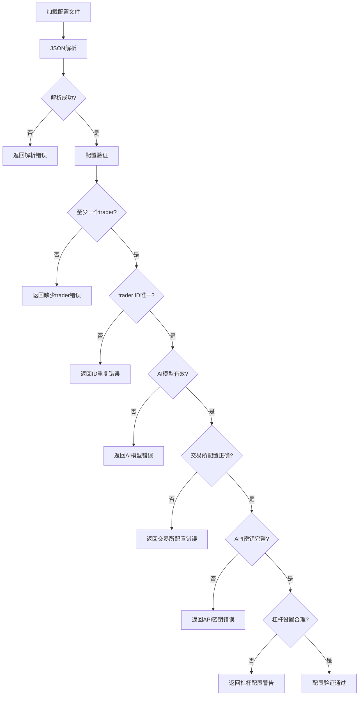

# 配置指南

<cite>
**本文档引用的文件**
- [config.go](file://config/config.go)
- [main.go](file://main.go)
- [binance_futures.go](file://trader/binance_futures.go)
- [hyperliquid_trader.go](file://trader/hyperliquid_trader.go)
- [aster_trader.go](file://trader/aster_trader.go)
- [coin_pool.go](file://pool/coin_pool.go)
- [README.md](file://README.md)
</cite>

## 目录
1. [简介](#简介)
2. [项目结构概览](#项目结构概览)
3. [核心配置文件](#核心配置文件)
4. [详细配置字段解析](#详细配置字段解析)
5. [交易所特定配置](#交易所特定配置)
6. [杠杆配置详解](#杠杆配置详解)
7. [币种池配置](#币种池配置)
8. [新手模式配置示例](#新手模式配置示例)
9. [专家模式配置示例](#专家模式配置示例)
10. [故障排除指南](#故障排除指南)
11. [最佳实践建议](#最佳实践建议)

## 简介

NOFX是一个通用的AI交易操作系统，支持多个加密货币交易所和AI模型。本配置指南将帮助您正确设置`config.json`文件，实现自动化交易系统的最佳性能。

### 核心特性
- **多交易所支持**：支持币安、Hyperliquid、Aster DEX
- **多AI模型**：支持Qwen、DeepSeek、自定义AI API
- **智能币种选择**：内置AI500币种池和OI Top数据
- **灵活的风险控制**：可配置的杠杆、止损、止盈参数

## 项目结构概览



**图表来源**
- [config.go](file://config/config.go#L10-L76)
- [main.go](file://main.go#L1-L140)

## 核心配置文件

### 配置文件位置
- **默认路径**：`config.json`
- **自定义路径**：通过命令行参数指定 `./nofx config/custom.json`

### 配置文件结构



**图表来源**
- [config.go](file://config/config.go#L10-L76)

**章节来源**
- [config.go](file://config/config.go#L78-L201)

## 详细配置字段解析

### 基础配置字段

| 字段名 | 类型 | 必需 | 默认值 | 描述 |
|--------|------|------|--------|------|
| `traders` | []TraderConfig | 是 | - | 交易者配置数组，每个元素代表一个独立的交易者 |
| `use_default_coins` | bool | 否 | true | 是否使用默认主流币种列表 |
| `default_coins` | []string | 否 | ["BTCUSDT","ETHUSDT",...] | 默认主流币种池（8个币种） |
| `coin_pool_api_url` | string | 否 | - | AI500币种池API URL |
| `oi_top_api_url` | string | 否 | - | OI Top持仓量增长API URL |
| `api_server_port` | int | 否 | 8080 | API服务器端口号 |
| `max_daily_loss` | float64 | 否 | - | 单日最大亏损限制（百分比） |
| `max_drawdown` | float64 | 否 | - | 最大回撤限制（百分比） |
| `stop_trading_minutes` | int | 否 | - | 停止交易的时间（分钟） |

### traders 数组详解

#### 核心字段说明

| 字段名 | 类型 | 必需 | 描述 |
|--------|------|------|------|
| `id` | string | 是 | 交易者的唯一标识符，不能重复 |
| `name` | string | 是 | 交易者的显示名称 |
| `enabled` | bool | 是 | 是否启用该交易者 |
| `ai_model` | string | 是 | AI模型类型："qwen"、"deepseek" 或 "custom" |
| `exchange` | string | 是 | 交易平台："binance"、"hyperliquid" 或 "aster" |
| `initial_balance` | float64 | 是 | 初始资金余额（USDT） |
| `scan_interval_minutes` | int | 否 | 扫描间隔（分钟，默认3分钟） |

#### AI模型配置



**图表来源**
- [config.go](file://config/config.go#L10-L42)

**章节来源**
- [config.go](file://config/config.go#L10-L76)

## 交易所特定配置

### 币安交易所配置

币安是默认支持的交易所，提供完整的期货交易功能。

#### 必需配置字段
- `binance_api_key`：币安API密钥
- `binance_secret_key`：币安API密钥密钥

#### 特性支持
- **全功能交易**：开多仓、开空仓、平仓
- **杠杆设置**：动态杠杆调整（1-125倍）
- **保证金模式**：逐仓模式支持
- **精度处理**：自动数量和价格精度处理

#### 杠杆限制说明
- **主账户**：支持最高125倍杠杆
- **子账户**：受制于币安子账户限制（通常≤5倍）
- **安全建议**：子账户建议使用≤5倍杠杆

**章节来源**
- [binance_futures.go](file://trader/binance_futures.go#L1-L615)

### Hyperliquid交易所配置

Hyperliquid是一个高性能的去中心化永续合约交易所。

#### 必需配置字段
- `hyperliquid_private_key`：以太坊私钥（十六进制格式）
- `hyperliquid_wallet_addr`：钱包地址（可选，自动从私钥生成）

#### 可选配置字段
- `hyperliquid_testnet`：是否使用测试网（默认false）

#### 特性优势
- **非托管交易**：用户完全控制资金
- **链上结算**：交易确认在区块链上
- **低费用**：相比中心化交易所更低的手续费
- **无需API密钥**：仅需以太坊私钥

#### 精度处理
Hyperliquid具有严格的精度要求：
- **价格精度**：5位有效数字
- **数量精度**：根据币种动态调整
- **自动处理**：系统自动进行精度转换

**章节来源**
- [hyperliquid_trader.go](file://trader/hyperliquid_trader.go#L1-L682)

### Aster DEX交易所配置

Aster DEX提供币安风格的API接口，支持去中心化交易。

#### 必需配置字段
- `aster_user`：主钱包地址（登录地址）
- `aster_signer`：API钱包地址（从Aster网站获取）
- `aster_private_key`：API钱包私钥

#### 安全特性
- **API钱包系统**：分离的交易钱包提高安全性
- **Web3认证**：基于以太坊钱包的认证
- **多链支持**：支持以太坊、BSC、Polygon等EVM链

#### 配置步骤
1. 通过推荐链接注册[Aster](https://www.asterdex.com/en/referral/fdfc0e)
2. 访问[Aster API钱包](https://www.asterdex.com/en/api-wallet)
3. 连接主钱包并创建API钱包
4. 复制API签名者地址和私钥

**章节来源**
- [aster_trader.go](file://trader/aster_trader.go#L1-L960)

## 杠杆配置详解

### v2.0.3+ 新增杠杆配置

从版本2.0.3开始，系统引入了更精细的杠杆控制：



**图表来源**
- [config.go](file://config/config.go#L44-L47)

### 杠杆配置字段

| 字段名 | 类型 | 默认值 | 推荐范围 | 说明 |
|--------|------|--------|----------|------|
| `btc_eth_leverage` | int | 5 | 1-50 | BTC和ETH的杠杆倍数 |
| `altcoin_leverage` | int | 5 | 1-20 | 山寨币的杠杆倍数 |

### 杠杆设置指南

#### 主账户建议
- **BTC/ETH**：5-50倍（根据风险承受能力调整）
- **山寨币**：5-20倍（谨慎使用）

#### 子账户限制
- **币安子账户**：所有资产均限制≤5倍杠杆
- **警告机制**：当设置超过5倍时会发出警告

#### 风险等级建议

| 风险偏好 | BTC/ETH杠杆 | 山寨币杠杆 | 适用人群 |
|----------|-------------|------------|----------|
| **保守型** | 2-3倍 | 2-3倍 | 投资新手、风险厌恶者 |
| **稳健型** | 3-5倍 | 3-5倍 | 有一定经验的投资者 |
| **积极型** | 5-10倍 | 5-10倍 | 经验丰富的交易者 |
| **激进型** | 10-50倍 | 5-20倍 | 专业交易员 |

### 杠杆计算公式



**章节来源**
- [config.go](file://config/config.go#L170-L190)

## 币种池配置

### use_default_coins 字段

`use_default_coins`字段控制币种池的选择策略：



**图表来源**
- [config.go](file://config/config.go#L78-L85)

### 默认币种池

系统预设的8个主流币种：
- **BTCUSDT**：比特币/美元稳定币
- **ETHUSDT**：以太坊/美元稳定币  
- **SOLUSDT**：Solana/美元稳定币
- **BNBUSDT**：币安币/美元稳定币
- **XRPUSDT**：瑞波币/美元稳定币
- **DOGEUSDT**：狗狗币/美元稳定币
- **ADAUSDT**：ADA/美元稳定币
- **HYPEUSDT**：Hyperliquid代币

### 外部API配置

#### AI500币种池
- **API URL**：配置币种池API地址
- **数据来源**：AI驱动的币种评分系统
- **更新频率**：实时更新，支持缓存机制

#### OI Top持仓量增长
- **API URL**：配置OI Top API地址
- **数据类型**：持仓量增长最快的20个币种
- **应用场景**：捕捉市场热点和趋势

### 智能币种选择流程



**图表来源**
- [coin_pool.go](file://pool/coin_pool.go#L95-L150)

**章节来源**
- [config.go](file://config/config.go#L78-L85)
- [coin_pool.go](file://pool/coin_pool.go#L80-L115)

## 新手模式配置示例

### 基础新手配置

适合初次使用AI交易的用户，采用保守的风险控制策略：

```json
{
  "traders": [
    {
      "id": "qwen_beginner",
      "name": "Qwen新手",
      "enabled": true,
      "ai_model": "qwen",
      "exchange": "binance",
      "binance_api_key": "你的币安API密钥",
      "binance_secret_key": "你的币安API密钥密钥",
      "qwen_key": "你的通义千问API密钥",
      "initial_balance": 1000,
      "scan_interval_minutes": 3
    }
  ],
  "use_default_coins": true,
  "leverage": {
    "btc_eth_leverage": 3,
    "altcoin_leverage": 3
  },
  "max_daily_loss": 5,
  "max_drawdown": 10,
  "stop_trading_minutes": 1440
}
```

### 配置说明

| 配置项 | 值 | 说明 |
|--------|-----|------|
| `initial_balance` | 1000 USDT | 初始资金1000 USDT |
| `btc_eth_leverage` | 3倍 | BTC/ETH使用3倍杠杆 |
| `altcoin_leverage` | 3倍 | 山寨币使用3倍杠杆 |
| `max_daily_loss` | 5% | 单日最大亏损5% |
| `max_drawdown` | 10% | 最大回撤10% |
| `scan_interval_minutes` | 3分钟 | 每3分钟扫描一次市场 |

### Hyperliquid新手配置

```json
{
  "traders": [
    {
      "id": "hyperliquid_beginner",
      "name": "Hyperliquid新手",
      "enabled": true,
      "ai_model": "qwen",
      "exchange": "hyperliquid",
      "hyperliquid_private_key": "你的以太坊私钥",
      "qwen_key": "你的通义千问API密钥",
      "initial_balance": 1000,
      "scan_interval_minutes": 5
    }
  ],
  "use_default_coins": true,
  "leverage": {
    "btc_eth_leverage": 2,
    "altcoin_leverage": 2
  }
}
```

### Aster新手配置

```json
{
  "traders": [
    {
      "id": "aster_beginner",
      "name": "Aster新手",
      "enabled": true,
      "ai_model": "qwen",
      "exchange": "aster",
      "aster_user": "你的主钱包地址",
      "aster_signer": "你的API钱包地址",
      "aster_private_key": "你的API钱包私钥",
      "qwen_key": "你的通义千问API密钥",
      "initial_balance": 1000,
      "scan_interval_minutes": 5
    }
  ],
  "use_default_coins": true,
  "leverage": {
    "btc_eth_leverage": 2,
    "altcoin_leverage": 2
  }
}
```

## 专家模式配置示例

### 多交易者竞赛配置

适合经验丰富的交易者，支持多个AI模型同时竞争：

```json
{
  "traders": [
    {
      "id": "qwen_expert",
      "name": "Qwen专家",
      "enabled": true,
      "ai_model": "qwen",
      "exchange": "binance",
      "binance_api_key": "你的币安API密钥",
      "binance_secret_key": "你的币安API密钥密钥",
      "qwen_key": "你的通义千问API密钥",
      "initial_balance": 5000,
      "scan_interval_minutes": 2
    },
    {
      "id": "deepseek_expert", 
      "name": "DeepSeek专家",
      "enabled": true,
      "ai_model": "deepseek",
      "exchange": "binance",
      "binance_api_key": "你的币安API密钥",
      "binance_secret_key": "你的币安API密钥密钥",
      "deepseek_key": "你的深度求索API密钥",
      "initial_balance": 5000,
      "scan_interval_minutes": 2
    }
  ],
  "use_default_coins": false,
  "coin_pool_api_url": "https://api.ai500.com/v1/coin-pool",
  "leverage": {
    "btc_eth_leverage": 10,
    "altcoin_leverage": 8
  },
  "max_daily_loss": 3,
  "max_drawdown": 8,
  "stop_trading_minutes": 720
}
```

### 高级配置选项

#### 自定义AI API配置

```json
{
  "traders": [
    {
      "id": "custom_ai",
      "name": "自定义AI",
      "enabled": true,
      "ai_model": "custom",
      "exchange": "binance",
      "binance_api_key": "你的币安API密钥",
      "binance_secret_key": "你的币安API密钥密钥",
      "custom_api_url": "https://api.your-custom-ai.com/v1/chat/completions",
      "custom_api_key": "你的自定义API密钥",
      "custom_model_name": "your-custom-model",
      "initial_balance": 10000,
      "scan_interval_minutes": 1
    }
  ]
}
```

#### Hyperliquid高级配置

```json
{
  "traders": [
    {
      "id": "hyperliquid_pro",
      "name": "Hyperliquid专业",
      "enabled": true,
      "ai_model": "deepseek",
      "exchange": "hyperliquid",
      "hyperliquid_private_key": "你的以太坊私钥",
      "hyperliquid_testnet": false,
      "deepseek_key": "你的深度求索API密钥",
      "initial_balance": 2000,
      "scan_interval_minutes": 3
    }
  ],
  "leverage": {
    "btc_eth_leverage": 20,
    "altcoin_leverage": 15
  }
}
```

### 风险控制配置

#### 严格风险控制

```json
{
  "max_daily_loss": 2,
  "max_drawdown": 5,
  "stop_trading_minutes": 360,
  "leverage": {
    "btc_eth_leverage": 5,
    "altcoin_leverage": 5
  }
}
```

#### 激进风险配置

```json
{
  "max_daily_loss": 10,
  "max_drawdown": 20,
  "stop_trading_minutes": 1440,
  "leverage": {
    "btc_eth_leverage": 30,
    "altcoin_leverage": 20
  }
}
```

## 故障排除指南

### 常见配置错误

#### 1. API密钥配置错误

**错误症状**：
```
❌ 初始化trader失败: 使用币安时必须配置binance_api_key和binance_secret_key
```

**解决方案**：
- 检查API密钥是否正确复制
- 确认API密钥具有交易权限
- 验证密钥格式（无多余空格）

#### 2. 杠杆设置过高

**错误症状**：
```
⚠️  警告: BTC/ETH杠杆设置为10x，如果使用子账户可能会失败（子账户限制≤5x）
```

**解决方案**：
- 子账户用户将杠杆设置降低到≤5倍
- 检查交易所的杠杆限制政策

#### 3. 币种池配置问题

**错误症状**：
```
⚠️  未配置币种池API URL，使用默认主流币种列表
```

**解决方案**：
- 设置有效的币种池API URL
- 检查网络连接和API可用性
- 验证API返回的数据格式

### 配置验证流程



**图表来源**
- [config.go](file://config/config.go#L100-L201)

### 调试技巧

#### 1. 启用详细日志
- 检查程序启动时的日志输出
- 关注配置加载和验证过程
- 注意任何警告信息

#### 2. 验证API连接
- 测试API密钥的有效性
- 检查网络连接状态
- 验证交易所API的可用性

#### 3. 分步测试
- 先使用默认币种池测试
- 逐步添加高级配置选项
- 监控每个配置变更的影响

**章节来源**
- [config.go](file://config/config.go#L100-L201)

## 最佳实践建议

### 安全配置原则

#### 1. 密钥管理
- **定期轮换**：定期更换API密钥
- **权限最小化**：只授予必要的交易权限
- **环境隔离**：生产环境和测试环境使用不同的密钥

#### 2. 杠杆使用策略
- **分层设置**：不同资产使用不同的杠杆
- **动态调整**：根据市场波动调整杠杆
- **风险监控**：实时监控杠杆使用情况

#### 3. 币种选择策略
- **多样化投资**：不要过度集中在少数币种
- **流动性考虑**：优先选择高流动性币种
- **定期更新**：使用动态币种池获取最新数据

### 性能优化建议

#### 1. 扫描间隔优化
- **高频交易**：扫描间隔1-2分钟
- **稳健交易**：扫描间隔3-5分钟
- **保守交易**：扫描间隔5-10分钟

#### 2. 网络配置
- **稳定的网络连接**：确保网络稳定性
- **CDN加速**：使用地理位置接近的API节点
- **重试机制**：配置合理的重试策略

#### 3. 监控和告警
- **实时监控**：设置关键指标监控
- **异常告警**：配置异常情况告警
- **定期审查**：定期审查交易表现

### 运维管理

#### 1. 配置备份
- **定期备份**：定期备份配置文件
- **版本控制**：使用版本控制系统管理配置
- **变更记录**：记录每次配置变更

#### 2. 文档维护
- **配置文档**：维护详细的配置文档
- **操作手册**：编写操作手册和故障排除指南
- **知识分享**：团队内部分享配置经验

#### 3. 测试验证
- **模拟测试**：在模拟环境中测试配置
- **渐进部署**：逐步部署新配置
- **效果评估**：评估配置变更的效果

通过遵循这些最佳实践，您可以构建一个安全、高效、可维护的AI交易系统配置。记住，配置优化是一个持续的过程，需要根据市场变化和交易表现不断调整。