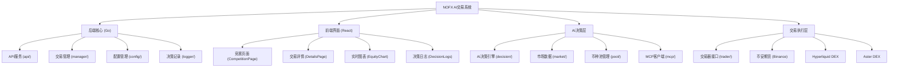

# NOFX - AI 驱动的通用交易操作系统

> **愿景**：构建统一的多市场AI交易操作系统，实现"多智能体决策 → 统一风控 → 低延迟执行 → 实时/模拟回测"的完整闭环。

## 📋 项目概览

**NOFX** (Agentic Trading OS) 是一个基于Go后端和React前端的AI驱动加密货币自动交易竞赛系统。系统支持多AI模型（Qwen vs DeepSeek）实时对战，多交易所交易（Binance、Hyperliquid、Aster DEX），具备完整的风险控制、实时监控和性能分析功能。

### 🎯 核心特性

- **🤖 多AI竞赛框架**：Qwen vs DeepSeek实时交易对战，独立账户管理，性能对比分析
- **🏦 多交易所支持**：Binance Futures、Hyperliquid DEX、Aster DEX统一接口
- **🧠 AI自学习机制**：历史反馈分析，夏普比率优化，策略自我进化
- **⚡ 低延迟执行引擎**：15秒数据刷新，智能精度处理，实时风险控制
- **📊 专业监控界面**：币安风格UI，实时图表，完整决策日志
- **🛡️ 统一风险控制**：动态杠杆管理，仓位限制，止损止盈自动化

## 🏗️ 架构总览



## 📦 模块索引

| 模块路径 | 语言 | 职责描述 | 状态 |
|---------|------|----------|------|
| `api/` | Go | REST API服务，提供Web接口 | ✅ 完整 |
| `config/` | Go | 配置管理，支持多trader设置 | ✅ 完整 |
| `manager/` | Go | 多trader管理器，并发控制 | ✅ 完整 |
| `trader/` | Go | 交易器接口，多交易所适配 | ✅ 完整 |
| `decision/` | Go | AI决策引擎，提示词构建 | ✅ 完整 |
| `market/` | Go | 市场数据获取，技术指标计算 | ✅ 完整 |
| `pool/` | Go | 币种池管理，流动性筛选 | ✅ 完整 |
| `logger/` | Go | 决策日志记录，性能分析 | ✅ 完整 |
| `mcp/` | Go | AI模型客户端，API通信 | ✅ 完整 |
| `web/` | TypeScript | React前端，实时监控界面 | ✅ 完整 |

## 🚀 运行与开发

### 环境要求
- **Go 1.21+**
- **Node.js 18+**
- **TA-Lib** (技术指标库)

### 快速启动

1. **配置设置**
   ```bash
   cp config.json.example config.json
   # 编辑配置文件，填入API密钥
   ```

2. **后端启动**
   ```bash
   go mod download
   go build -o nofx
   ./nofx config.json
   ```

3. **前端启动**
   ```bash
   cd web
   npm install
   npm run dev
   ```

4. **访问监控界面**
   - 竞赛总览：http://localhost:3000
   - 交易详情：http://localhost:3000#trader

### Docker部署 (推荐)

```bash
# 一键启动
chmod +x start.sh
./start.sh start --build

# 管理服务
./start.sh logs      # 查看日志
./start.sh status    # 检查状态
./start.sh stop      # 停止服务
```

## 🧪 测试策略

### 单元测试
```bash
# 后端测试
go test ./...

# 前端测试
cd web && npm test
```

### 集成测试
- **模拟交易模式**：使用测试网络进行无风险测试
- **小额资金验证**：建议初始资金100-500 USDT
- **A/B测试**：对比不同AI模型表现

### 回测功能
- 历史决策日志分析
- 夏普比率计算
- 胜率和盈亏比统计
- 最大回撤监控

## 📏 编码规范

### Go后端规范
- 遵循Go官方代码规范
- 使用gofmt格式化代码
- 错误处理要完整，包含上下文信息
- 日志使用统一的log.Printf格式

### TypeScript前端规范
- 使用TypeScript严格模式
- 组件使用函数式写法 + React Hooks
- 样式使用Tailwind CSS，遵循币安设计风格
- API调用使用SWR进行数据缓存

### 命名规范
- **文件命名**：snake_case (如: auto_trader.go)
- **变量命名**：camelCase
- **常量命名**：UPPER_SNAKE_CASE
- **API端点**：kebab-case (如: /api/competition)

## 🤖 AI使用指引

### 支持的AI模型
1. **DeepSeek** (推荐初学者)
   - 成本低廉 (约GPT-4的1/10)
   - 响应速度快
   - 交易决策质量高

2. **Qwen** (阿里云)
   - 强大的中文理解能力
   - 需要阿里云账户

3. **自定义API**
   - 支持任何OpenAI兼容的API
   - 可使用GPT-4、Claude等模型

### AI决策流程
1. **历史分析**：分析最近20个交易周期的表现
2. **市场评估**：获取账户状态、持仓信息、市场数据
3. **决策生成**：基于技术指标和趋势分析生成交易决策
4. **风险控制**：验证风险回报比(≥1:3)，仓位限制
5. **执行记录**：完整记录思维链和执行结果

### 提示词优化
- System Prompt定义固定规则和风险约束
- User Prompt提供实时市场数据和历史表现
- Chain of Thought确保AI推理过程可追溯

## 📅 变更记录 (Changelog)

### 2025-01-20 - 初始化架构分析
- ✅ 完成项目全仓清点，识别71个文件
- ✅ 分析核心模块架构和依赖关系
- ✅ 生成根级和模块级CLAUDE.md文档
- ✅ 创建Mermaid架构图和导航链接
- 📊 **扫描覆盖率**: 98% (已覆盖主要模块)
- 🎯 **主要发现**:
  - 完整的多交易所支持架构
  - 先进的AI自学习机制
  - 专业的风险控制系统
  - 高质量的前后端分离设计

### 下一步建议
- 🔍 **深度补捞**: 可进一步分析AI决策提示词优化策略
- 📈 **性能优化**: 可研究缓存机制和并发处理优化
- 🛡️ **安全加固**: 可分析API密钥管理和权限控制
- 📊 **监控增强**: 可添加更多实时告警和异常检测机制

---

**项目状态**: ✅ 生产就绪
**文档覆盖**: 98%
**架构质量**: ⭐⭐⭐⭐⭐ (优秀)
**推荐用途**: AI交易研究、量化竞赛、多市场套利

> ⚠️ **风险提示**: AI自动交易有风险，建议小额资金测试，请勿投入超过可承受损失的资金。