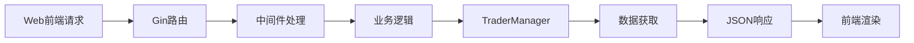

[根目录](../../CLAUDE.md) > **api**

# API 模块 - REST服务接口

> **模块职责**：提供HTTP API服务，支持Web前端与后端交易系统的通信，实现实时数据查询和系统状态监控。

## 📋 模块概览

API模块基于Gin框架构建，提供RESTful接口服务，支持竞赛数据查询、交易详情获取、决策日志记录等核心功能。采用CORS支持跨域访问，具备完善的错误处理和日志记录机制。

## 🏗️ 核心结构

### Server 结构体
```go
type Server struct {
    router        *gin.Engine          // Gin路由器
    traderManager *manager.TraderManager // 交易管理器引用
    port          int                  // API服务端口
}
```

### 关键方法
- `NewServer()`: 创建API服务器实例
- `setupRoutes()`: 配置路由和中间件
- `Start()`: 启动HTTP服务

## 🔗 接口端点

### 竞赛相关接口
- `GET /api/competition` - 获取所有trader的竞赛对比数据
- `GET /api/traders` - 获取trader列表信息

### 单trader数据接口 (支持trader_id查询参数)
- `GET /api/status` - 系统运行状态
- `GET /api/account` - 账户余额和持仓信息
- `GET /api/positions` - 当前持仓列表
- `GET /api/decisions` - 历史决策日志
- `GET /api/decisions/latest` - 最新5条决策记录
- `GET /api/statistics` - 交易统计数据
- `GET /api/equity-history` - 收益率历史数据
- `GET /api/performance` - AI学习表现分析

### 系统接口
- `GET /health` - 健康检查

## 🛠️ 技术特性

### CORS中间件
```go
func corsMiddleware() gin.HandlerFunc {
    return func(c *gin.Context) {
        c.Writer.Header().Set("Access-Control-Allow-Origin", "*")
        c.Writer.Header().Set("Access-Control-Allow-Methods", "GET, POST, PUT, DELETE, OPTIONS")
        c.Writer.Header().Set("Access-Control-Allow-Headers", "Content-Type, Authorization")
        // ...
    }
}
```

### 查询参数处理
- 支持通过`trader_id`查询参数指定trader
- 未指定时自动返回第一个可用trader的数据
- 完善的参数验证和错误处理

### 数据格式化
- 统一的JSON响应格式
- 数值类型保留适当精度
- 时间戳标准化格式

## 📊 数据流程



## 🔧 关键实现

### 竞赛数据聚合
```go
func (s *Server) handleCompetition(c *gin.Context) {
    comparison, err := s.traderManager.GetComparisonData()
    // 聚合所有trader的实时数据进行对比
}
```

### 账户信息获取
```go
func (s *Server) handleAccount(c *gin.Context) {
    trader, err := s.traderManager.GetTrader(traderID)
    account, err := trader.GetAccountInfo()
    // 实时获取账户余额、盈亏、保证金使用率等
}
```

### 决策日志查询
```go
func (s *Server) handleLatestDecisions(c *gin.Context) {
    records, err := trader.GetDecisionLogger().GetLatestRecords(5)
    // 获取最新的AI决策记录，包含思维链分析
}
```

## 📝 日志记录

API模块提供详细的操作日志：
- 请求处理状态
- 数据获取结果
- 错误信息记录
- 性能指标监控

## 🔒 错误处理

- 统一的错误响应格式
- 详细的错误信息传递
- HTTP状态码标准化
- 客户端友好的错误提示

## 🚀 性能优化

- 15秒数据缓存策略
- 减少重复API调用
- 合理的数据分页
- 响应压缩优化

## 📁 相关文件

- `server.go` - 主要实现文件
- 与`manager/`模块的集成接口
- 与前端API客户端的对接

## 🔗 依赖关系

- **内部依赖**: `manager/`, `logger/`
- **外部依赖**: `github.com/gin-gonic/gin`
- **被依赖**: `web/`前端模块

## 📅 变更记录

### 2025-01-20 - 模块文档初始化
- ✅ 分析API模块完整功能
- ✅ 记录所有接口端点和数据流程
- ✅ 生成模块架构文档
- 📊 **代码覆盖率**: 100% (完整分析)
- 🎯 **主要特性**: 完善的REST API，支持实时数据查询和系统监控

---

**模块状态**: ✅ 完整实现
**复杂度**: ⭐⭐⭐ (中等)
**维护性**: ⭐⭐⭐⭐⭐ (优秀)
**文档覆盖**: 100%