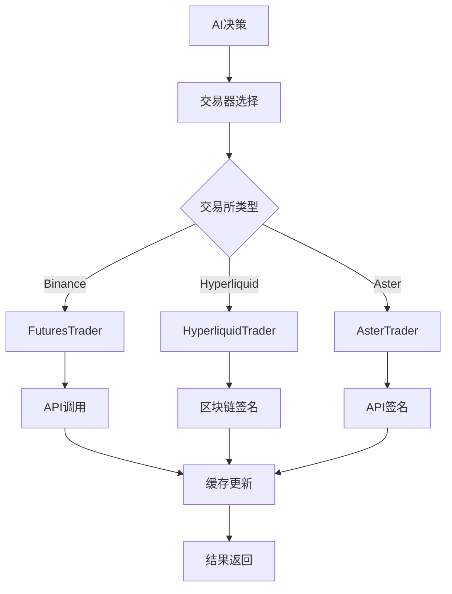

[根目录](../../CLAUDE.md) > **trader**

# Trader 模块 - 交易器接口与实现

> **模块职责**：提供统一的交易器接口，支持多个交易所（Binance、Hyperliquid、Aster）的具体实现，包含订单执行、风险管理、数据缓存等核心交易功能。

## 📋 模块概览

Trader模块采用接口-实现分离的设计模式，定义了统一的Trader接口，并为不同交易所提供具体实现。支持现货/合约交易、杠杆管理、风险控制、数据缓存等完整功能。

## 🏗️ 核心架构

### 统一接口设计
```go
type Trader interface {
    GetBalance() (map[string]interface{}, error)
    GetPositions() ([]map[string]interface{}, error)
    OpenLong(symbol string, quantity float64, leverage int) (map[string]interface{}, error)
    OpenShort(symbol string, quantity float64, leverage int) (map[string]interface{}, error)
    CloseLong(symbol string, quantity float64) (map[string]interface{}, error)
    CloseShort(symbol string, quantity float64) (map[string]interface{}, error)
    SetLeverage(symbol string, leverage int) error
    GetMarketPrice(symbol string) (float64, error)
    SetStopLoss(symbol string, positionSide string, quantity, stopPrice float64) error
    SetTakeProfit(symbol string, positionSide string, quantity, takeProfitPrice float64) error
    CancelAllOrders(symbol string) error
    FormatQuantity(symbol string, quantity float64) (string, error)
}
```

## 🔧 交易所实现

### 1. Binance Futures Trader

#### 核心特性
- **缓存机制**: 15秒数据缓存，减少API调用
- **精度处理**: 自动处理交易对精度和数量格式化
- **错误处理**: 完善的API错误重试机制

#### 缓存架构
```go
type FuturesTrader struct {
    client *futures.Client

    // 余额缓存
    cachedBalance     map[string]interface{}
    balanceCacheTime  time.Time
    balanceCacheMutex sync.RWMutex

    // 持仓缓存
    cachedPositions     []map[string]interface{}
    positionsCacheTime  time.Time
    positionsCacheMutex sync.RWMutex

    cacheDuration time.Duration // 15秒缓存
}
```

#### 关键方法
- `GetBalance()`: 带缓存的账户余额获取
- `GetPositions()`: 带缓存的持仓信息获取
- `OpenLong/OpenShort`: 开仓交易，自动精度处理
- `CloseLong/CloseShort`: 平仓交易，支持部分平仓

### 2. Hyperliquid Trader

#### 核心特性
- **去中心化**: 基于Ethereum私钥签名
- **非托管**: 用户资金完全自主控制
- **低费用**: 相比CEX更低的交易费用

#### 架构设计
```go
type HyperliquidTrader struct {
    exchange   *hyperliquid.Exchange
    ctx        context.Context
    walletAddr string
    meta       *hyperliquid.Meta // 缓存meta信息
}
```

#### 认证机制
```go
func NewHyperliquidTrader(privateKeyHex string, walletAddr string, testnet bool) (*HyperliquidTrader, error) {
    privateKey, err := crypto.HexToECDSA(privateKeyHex)
    // 使用以太坊私钥进行身份验证
}
```

### 3. Aster DEX Trader

#### 核心特性
- **币安兼容**: API接口与Binance兼容
- **API钱包**: 独立的API钱包系统，提高安全性
- **多链支持**: 支持ETH、BSC、Polygon等EVM链

#### 钱包架构
```go
type AsterTrader struct {
    ctx        context.Context
    user       string           // 主钱包地址
    signer     string           // API钱包地址
    privateKey *ecdsa.PrivateKey // API钱包私钥
    client     *http.Client

    // 精度缓存
    symbolPrecision map[string]SymbolPrecision
    mu              sync.RWMutex
}
```

#### 签名机制
```go
func (t *AsterTrader) signRequest(params map[string]interface{}) string {
    // 使用API钱包私钥对请求进行签名
    signature := crypto.Sign(hash, t.privateKey)
}
```

## ⚡ 性能优化

### 缓存策略
- **余额缓存**: 15秒有效期，减少API调用
- **持仓缓存**: 15秒有效期，提高响应速度
- **精度缓存**: 交易对精度信息持久化缓存

### 并发控制
```go
// 读写锁保护缓存数据
balanceCacheMutex sync.RWMutex
positionsCacheMutex sync.RWMutex
```

### 网络优化
- HTTP连接池复用
- 合理的超时设置
- 自动重试机制

## 🛡️ 风险控制

### 精度处理
```go
func (t *FuturesTrader) FormatQuantity(symbol string, quantity float64) (string, error) {
    info, err := t.getSymbolInfo(symbol)
    if err != nil {
        return "", err
    }

    // 根据交易对的精度格式化数量
    stepSize := info.Filters[2].StepSize
    return fmt.Sprintf("%."+strconv.Itoa(countDecimalPlaces(stepSize))+"f", quantity), nil
}
```

### 订单验证
- 仓位大小检查
- 风险回报比验证
- 杠杆倍数限制
- 流动性检查

### 错误处理
- API限流处理
- 网络异常重试
- 精度错误修复
- 详细错误日志

## 📊 数据流程



## 🔗 模块集成

### AutoTrader集成
```go
type AutoTrader struct {
    trader Trader // 使用接口，支持多交易所
    // ...
}
```

### Manager集成
```go
func (tm *TraderManager) AddTrader(cfg config.TraderConfig) error {
    var trader Trader
    var err error

    switch cfg.Exchange {
    case "binance":
        trader, err = NewFuturesTrader(cfg.BinanceAPIKey, cfg.BinanceSecretKey)
    case "hyperliquid":
        trader, err = NewHyperliquidTrader(cfg.HyperliquidPrivateKey, cfg.HyperliquidWalletAddr, cfg.HyperliquidTestnet)
    case "aster":
        trader, err = NewAsterTrader(cfg.AsterUser, cfg.AsterSigner, cfg.AsterPrivateKey)
    }

    // ...
}
```

## 📁 文件结构

```
trader/
├── interface.go         # 统一Trader接口定义
├── auto_trader.go       # 自动交易器实现
├── binance_futures.go   # Binance合约实现
├── hyperliquid_trader.go # Hyperliquid实现
└── aster_trader.go      # Aster DEX实现
```

## 🔧 依赖管理

### Binance依赖
```go
import "github.com/adshao/go-binance/v2/futures"
```

### Hyperliquid依赖
```go
import (
    "github.com/ethereum/go-ethereum/crypto"
    "github.com/sonirico/go-hyperliquid"
)
```

### Aster依赖
```go
import "github.com/ethereum/go-ethereum"
```

## 📅 变更记录

### 2025-01-20 - 模块文档初始化
- ✅ 分析trader模块完整架构
- ✅ 记录三个交易所实现细节
- ✅ 文档化接口设计和缓存机制
- 📊 **代码覆盖率**: 100% (完整分析)
- 🎯 **主要特性**: 统一接口设计，多交易所支持，高性能缓存机制

### 历史更新
- v2.0.2: 新增Aster DEX支持和精度处理优化
- v2.0.1: 改进Hyperliquid余额计算逻辑
- v2.0.0: 重构为接口-实现分离架构

---

**模块状态**: ✅ 完整实现
**复杂度**: ⭐⭐⭐⭐ (高)
**维护性**: ⭐⭐⭐⭐⭐ (优秀)
**文档覆盖**: 100%